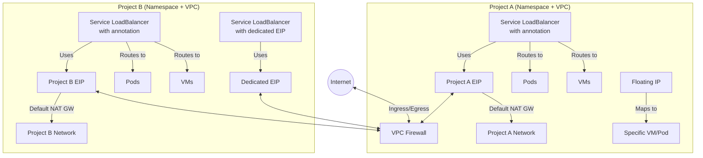

# Networking (Kube-OVN, VLANs)

Kube-DC provides advanced networking capabilities through Kube-OVN, enabling multi-tenant network isolation, external connectivity, and flexible service exposure. This document explains the key networking components and how they operate within the Kube-DC architecture.

## Network Architecture Overview

Kube-DC's networking architecture is built on Kube-OVN, which supports both overlay and underlay networks and provides Virtual Private Cloud (VPC) capabilities for tenant isolation.



In this architecture:
- Each project gets its own namespace and VPC
- Each project receives its own EIP that acts as a NAT gateway for outbound traffic
- Service LoadBalancers can route traffic to both Pods and VMs
- Service LoadBalancers can use either the project's default EIP (via annotation) or a dedicated EIP
- Floating IPs can map specific VMs or Pods to External IPs for direct access

## Network Elements

### User-Visible Network Resources

#### External IP (EIP)

External IPs provide connectivity from the public internet to resources within Kube-DC. Each EIP is allocated from the provider network.

**Example EIP YAML:**

```yaml
apiVersion: kube-dc.com/v1
kind: EIp
metadata:
  name: ssh-arti
  namespace: shalb-demo
spec: {}  
```

#### Floating IP (FIP)

Floating IPs map an internal IP address (of a VM or pod) to an External IP, enabling direct access to specific resources.

**Example FIP YAML:**

```yaml
apiVersion: kube-dc.com/v1
kind: FIp
metadata:
  name: fedora-arti
  namespace: shalb-demo
spec:
  ipAddress: 10.0.10.171
  eip: ssh-arti
```

#### Kubernetes Service

Standard Kubernetes Services for in-cluster service discovery and load balancing.

#### Service Type LoadBalancer

Creates and maps an EIP to a service that routes traffic to pods or VMs. Can use either a dedicated EIP or the project's default EIP.

**Example Service LoadBalancer YAML with default gateway EIP:**

```yaml
apiVersion: v1
kind: Service
metadata:
  name: nginx-service-lb
  namespace: shalb-demo
  annotations:
    service.nlb.kube-dc.com/bind-on-default-gw-eip: "true"
spec:
  type: LoadBalancer
  selector:
    app: nginx
  ports:
    - name: http
      protocol: TCP
      port: 80
      targetPort: 80
    - name: https
      protocol: TCP
      port: 443
      targetPort: 443
```

**Example Service LoadBalancer for VM SSH access:**

```yaml
apiVersion: v1
kind: Service
metadata:
  name: vm-ssh
  namespace: shalb-demo
  annotations:
    service.nlb.kube-dc.com/bind-on-default-gw-eip: "true"
spec:
  type: LoadBalancer
  selector:
    vm.kubevirt.io/name: debian
  ports:
    - name: ssh
      protocol: TCP
      port: 2222
      targetPort: 22
```

### Internal Network Resources

#### DNAT Rule

Destination Network Address Translation rules proxy requests from the internet through an EIP to resources within the VPC network. These are created automatically when an EIP is associated with a resource.

#### SNAT

Source Network Address Translation is used for outbound connections from VPC subnets through EIPs, allowing resources within the VPC to communicate with the internet.

## Project Network Provisioning

When a new project is created in Kube-DC:

1. The project is allocated a dedicated subnet from the VPC CIDR range
2. Each project connected to the internet receives an EIP
3. All project outbound traffic is routed through its assigned EIP
4. Project-specific network policies are applied for isolation

**Example project creation with CIDR allocation:**

```yaml
apiVersion: kube-dc.com/v1
kind: Project
metadata:
  name: demo
  namespace: shalb
spec:
  cidrBlock: "10.0.10.0/24"
```

## Load Balancer Implementation

Kube-DC uses a specialized implementation for Service LoadBalancers:

- When a Service with type `LoadBalancer` is created, an OVS-based LoadBalancer routes traffic to service endpoints
- Endpoints can be Kubernetes pods or KubeVirt VMs
- The LoadBalancer can use either:
  - The project's default gateway EIP (with annotation `service.nlb.kube-dc.com/bind-on-default-gw-eip: "true"`)
  - A dedicated EIP (with annotation `service.nlb.kube-dc.com/bind-on-eip: "eip-name"`)

## Kube-OVN for VPC Management

Kube-OVN is a key component of Kube-DC's networking architecture, providing the foundation for multi-tenant network isolation through VPC networks.

### VPC Isolation

Different VPC networks are independent of each other and can be separately configured with:
- Subnet CIDRs
- Routing policies
- Security policies
- Outbound gateways
- EIP allocations

## Overlay vs. Underlay Networks

Kube-DC supports both networking approaches:

### Overlay Networks

- Software-defined networks that encapsulate packets
- Provide maximum flexibility for network segmentation
- Independent of physical network topology
- Managed entirely by Kube-OVN
- Ideal for multi-tenant environments

### Underlay Networks

- Direct mapping to physical network infrastructure
- Better performance with reduced encapsulation overhead
- Requires coordination with physical network infrastructure
- Physical switches handle data-plane forwarding
- Cannot be isolated by VPCs as they are managed by physical switches

## Network Security

Kube-DC implements multiple layers of network security:

**Project Isolation**

   - Each project receives its own subnet
   - Traffic between projects is controlled by network policies

**VPC Segmentation**

   - Projects can be placed in different VPCs for stricter isolation
   - Each VPC has its own network stack and routing tables

**Kubernetes Network Policies**

   - Fine-grained control over ingress and egress traffic
   - Can be applied at the namespace, pod, or service level

**Subnet ACLs**

   - Control traffic at the subnet level
   - Provide an additional layer of security beyond network policies
