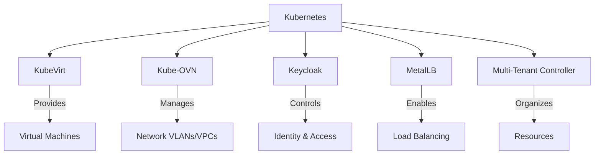

# Overall Architecture

Kube-DC provides a comprehensive multi-tenant cloud infrastructure platform built on Kubernetes and enhanced with enterprise-grade features like virtualization, networking, and identity management.

## Core Components

The Kube-DC architecture consists of several key components that work together to deliver a complete cloud platform:

## Architectural Layers

Kube-DC is organized into four main architectural layers:

1. **Infrastructure Layer**
   - Bare metal servers or cloud infrastructure
   - Kubernetes core services
   - Storage subsystems

2. **Virtualization Layer**
   - KubeVirt for VM provisioning and management
   - Container workloads
   - Hybrid application support

3. **Networking Layer**
   - Kube-OVN for software-defined networking
   - Multi-tenant network isolation
   - External IP addressing and service exposure

4. **Management Layer**
   - Multi-tenancy resource organization
   - Identity and access management via Keycloak
   - User interface and API access

## Multi-Tenant Organization

Kube-DC introduces a hierarchical resource organization model:

- **Organizations** - Top-level entities representing companies or teams
- **Projects** - Logical groupings of resources within an organization
- **Groups** - Collections of users with defined roles and permissions

This multi-tenant structure maps to Kubernetes and Keycloak components to provide isolation and access control. For detailed information on the multi-tenancy architecture, see the [Multi-Tenancy & RBAC](architecture-multi-tenancy.md) documentation.

## Network Architecture

Kube-DC leverages Kube-OVN to provide advanced networking capabilities:

- Virtual Private Clouds (VPCs) for network isolation
- External and Floating IPs for service exposure
- Load balancing and service routing

For detailed information on the networking architecture, see the [Networking (Kube-OVN, VLANs)](architecture-networking.md) documentation.

## Virtualization Architecture

Kube-DC integrates KubeVirt to enable VM workloads alongside containers:

- VM lifecycle management through Kubernetes APIs
- Hardware passthrough capabilities
- Mixed container and VM environments

For detailed information on the virtualization architecture, see the [Virtualization (KubeVirt)](architecture-virtualization.md) documentation.

## Key Benefits

- **Multi-tenant isolation**: Secure separation between organizations and projects
- **Unified management**: Single platform for VMs and containers
- **Network flexibility**: Advanced SDN capabilities with Kube-OVN
- **Enterprise security**: Integrated identity management with Keycloak
- **API-driven architecture**: Consistent interfaces for automation and integration
