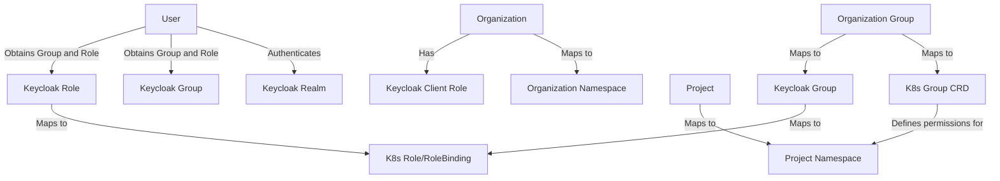

# Overall Architecture

Kube-DC implements a multi-tenant architecture that leverages Kubernetes namespaces and Keycloak for identity and access management. This document explains how organizations, projects, and groups in Kube-DC are mapped to Kubernetes and Keycloak objects.

## Core Components and Mapping Structure

Kube-DC organizes its resources in a hierarchical structure:

1. **Organizations** - Top-level entities that represent a company or team
2. **Projects** - Logical groupings of resources within an organization
3. **Groups** - Collections of users with defined roles and permissions

The following diagram illustrates the mapping between Kube-DC structures and the underlying Kubernetes and Keycloak components:



## Organization Structure

### Organization

An Organization is the top-level entity in Kube-DC that represents a company, department, or team.

**Example Organization YAML:**

```yaml
apiVersion: kube-dc.com/v1
kind: Organization
metadata:
  name: shalb
  namespace: shalb
spec: 
  description: "Shalb organization"
  email: "arti@shalb.com"
```

**Mapping:**
- Each Organization maps to a dedicated Kubernetes namespace with the same name
- A corresponding Keycloak Client is created for the organization
- The Organization serves as a logical grouping for Projects and OrganizationGroups

### Project

A Project represents a logical grouping of resources within an Organization. Projects help segregate workloads and manage access control.

**Example Project YAML:**

```yaml
apiVersion: kube-dc.com/v1
kind: Project
metadata:
  name: demo
  namespace: shalb
spec:
  cidrBlock: "10.0.10.0/24"
```

**Mapping:**
- Each Project maps to a dedicated Kubernetes namespace in the format: `{organization}-{project}`
- Projects receive their own network CIDR block for resource isolation
- Kubernetes namespaces provide the boundary for resource quotas and access control

### OrganizationGroup

An OrganizationGroup maps users to roles within specific projects, defining what actions they can perform.

**Example OrganizationGroup YAML:**

```yaml
apiVersion: kube-dc.com/v1
kind: OrganizationGroup
metadata:
  name: "app-manager"
  namespace: shalb
spec:
  permissions:
  - project: "demo"
    roles:
    - admin
  - project: "prod"
    roles:
    - resource-manager
```

**Mapping:**
- OrganizationGroups are implemented as Kubernetes Custom Resource Definitions (CRDs)
- Each OrganizationGroup maps to a Keycloak Group
- The permissions defined in OrganizationGroups determine the Kubernetes RoleBindings that grant access to resources
- Different roles can be assigned for different projects

## Authentication and Authorization Flow

1. **User Authentication:**
   - Users authenticate through Keycloak
   - Upon successful authentication, users receive JSON Web Tokens (JWTs)

2. **Group and Role Assignment:**
   - Users are assigned to Keycloak Groups based on their OrganizationGroup membership
   - Keycloak maps these groups to corresponding roles

3. **Kubernetes Authorization:**
   - The Kubernetes API server validates the user's JWT
   - RoleBindings determine what actions the user can perform within each namespace
   - Resource access is controlled at the Project (namespace) level

4. **Resource Access:**
   - Users can only access resources in projects where they have appropriate role assignments
   - Actions are restricted based on the permissions defined in their roles

## Role-Based Access Control

Kube-DC provides several built-in roles that can be assigned to users via OrganizationGroups:

- **Admin:** Full access to all resources within a project
- **Resource Manager:** Can create and manage resources, but cannot modify project settings
- **Viewer:** Read-only access to project resources

**Example Role YAML:**

```yaml
apiVersion: kube-dc.com/v1
kind: Role
metadata:
  name: resource-manager
  namespace: shalb
spec:
  rules:
  - apiGroups: ["*"]
    resources: ["pods", "services", "deployments", "statefulsets"]
    verbs: ["get", "list", "watch", "create", "update", "patch", "delete"]
  - apiGroups: ["kubevirt.io"]
    resources: ["virtualmachines", "virtualmachineinstances"]
    verbs: ["get", "list", "watch", "create", "update", "patch", "delete"]
```

## Implementation Details

### Kubernetes Components

- **Namespaces:** Used to isolate Organizations and Projects
- **RBAC:** Role-Based Access Control for managing permissions
- **CRDs:** Custom Resource Definitions for Kube-DC specific resources
- **NetworkPolicies:** Ensure network isolation between Projects

### Keycloak Integration

- **Realm:** Represents the authentication domain
- **Clients:** Each Organization has a dedicated client
- **Groups:** Map to OrganizationGroups in Kube-DC
- **Roles:** Define permissions that can be assigned to users
- **Role Mappings:** Connect Keycloak roles to Kubernetes RBAC

## Conclusion

Kube-DC's architecture provides a comprehensive multi-tenant environment by leveraging Kubernetes namespaces for resource isolation and Keycloak for identity management. This integration creates a secure, scalable platform where organizations can manage their resources with fine-grained access control.

The mapping between Kube-DC objects (Organizations, Projects, OrganizationGroups) and underlying platform components (Kubernetes namespaces, Keycloak groups and roles) creates a cohesive system that simplifies multi-tenant cloud infrastructure management.
