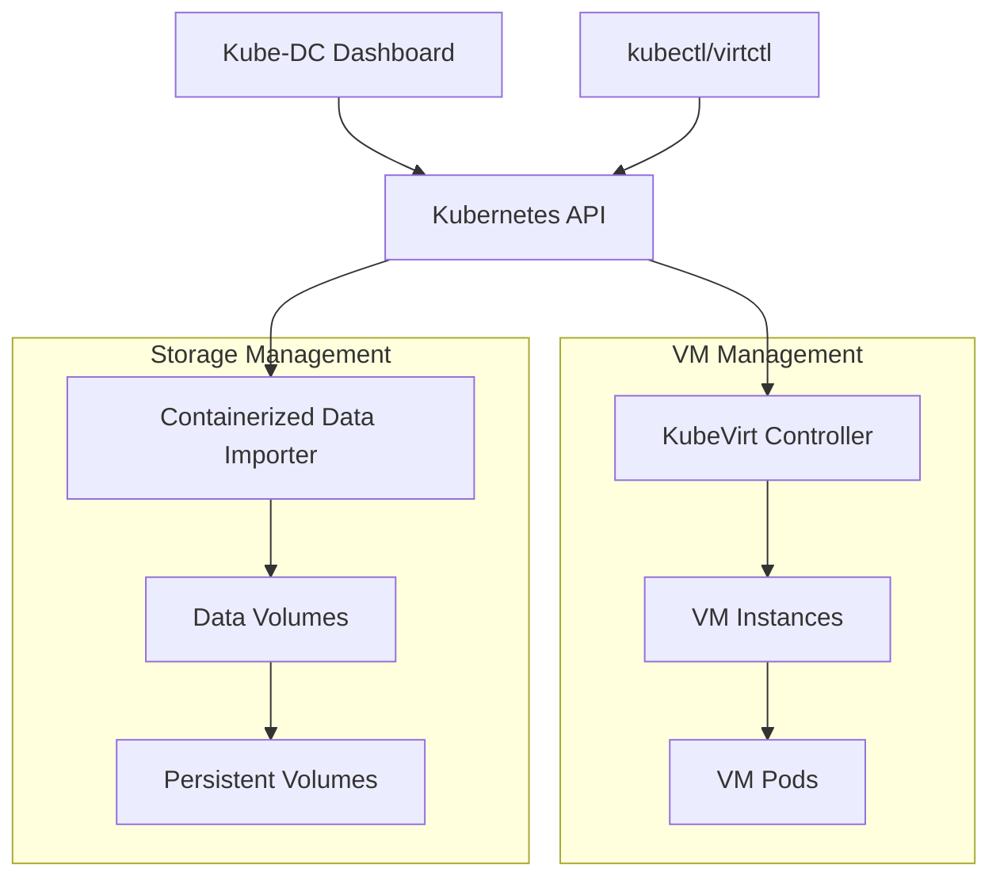

# Virtualization (KubeVirt)

Kube-DC leverages KubeVirt to provide powerful virtual machine capabilities alongside traditional container workloads. This document covers the virtualization architecture, features, and how VMs are managed within the platform.

## Virtualization Architecture

Kube-DC's virtualization layer is built on KubeVirt, which extends Kubernetes to support virtual machine workloads. This architecture enables consistent management of both containers and VMs through the same API and tooling.



## Core Components

### KubeVirt Controller

The KubeVirt controller manages the lifecycle of virtual machines by:

- Translating VM specifications into Kubernetes resources
- Scheduling VMs on appropriate nodes
- Managing VM state (start, stop, pause, resume)
- Providing VM migration capabilities
- Handling VM monitoring and health checks

### Containerized Data Importer (CDI)

CDI handles storage provisioning for VMs by:

- Creating and managing Data Volumes
- Importing disk images from HTTP/S3 sources
- Converting disk formats as needed
- Cloning existing volumes

### Data Volumes

Data Volumes serve as the storage backbone for VMs, providing:

- Storage allocation for VM disks
- Integration with Kubernetes storage classes
- Automated provisioning and cleanup

## VM Management in Kube-DC

### VM Creation and Configuration

Kube-DC allows users to create VMs through YAML definitions or the web UI. VM configurations include:

**Example VM Definition:**

```yaml
apiVersion: kubevirt.io/v1
kind: VirtualMachine
metadata:
  name: ubuntu-vm
  namespace: demo
spec:
  running: true
  template:
    spec:
      networks:
      - name: vpc_net_0
        multus:
          default: true
          networkName: default/ovn-demo
      domain:
        devices:
          interfaces:
            - name: vpc_net_0
              bridge: {}
          disks:
          - disk: 
              bus: virtio
            name: root-volume
        cpu:
          cores: 2
        memory:
          guest: 4G
      volumes:
      - dataVolume:
          name: ubuntu-base-img
        name: root-volume
```

### Supported Operating Systems

Kube-DC provides templates for a variety of operating systems:

- Ubuntu (20.04, 22.04, 24.04)
- Debian
- CentOS/RHEL
- Fedora
- Alpine Linux
- FreeBSD
- openSUSE
- Minimal images (cirros)

### Network Integration

VMs in Kube-DC are integrated with the same network architecture as containers:

- Each VM can connect to VPC networks via Multus CNI
- VMs receive IP addresses from the project's CIDR block
- Network policies apply to VMs just like containers
- VMs can use floating IPs and load balancer services

### Storage Management

Kube-DC provides flexible storage options for VMs:

- Support for multiple storage classes
- Persistent storage using Kubernetes PVCs
- Live volume resizing
- Volume snapshots and cloning

### VM Customization

VMs can be customized through cloud-init configurations:

```yaml
cloudInitNoCloud:
  userData: |-
    #cloud-config
    chpasswd: { expire: False }
    password: securepassword
    ssh_pwauth: True
    package_update: true
    package_upgrade: true
    packages:
    - qemu-guest-agent
    runcmd:
    - [ systemctl, start, qemu-guest-agent ]
```

This allows for:
- Setting initial passwords
- SSH key distribution
- Software installation
- Custom scripts execution
- Network configuration

### Health Monitoring

VMs in Kube-DC support health checks through:

```yaml
readinessProbe:
  guestAgentPing: {}
  failureThreshold: 10
  initialDelaySeconds: 20
  periodSeconds: 10
```

Health checks ensure:
- VM is properly booted
- Guest agent is responsive
- Cloud-init has completed
- Custom health check scripts pass

## Web UI Management

Kube-DC provides an intuitive web interface for VM management:


### VM Dashboard Features

The VM dashboard provides:

- **VM Status Monitoring**: Running status, uptime, and conditions
- **Performance Metrics**: Real-time CPU, memory, and storage usage
- **VM Details**: OS version, network configuration, and node placement
- **Console Access**: Direct web-based console access to VMs
- **SSH Terminal**: Direct SSH access from the browser
- **Network Information**: IP addresses and VPC subnet details

### VM Lifecycle Management

Through the UI, administrators and users can:

- Create VMs from templates or custom images
- Start, stop, pause, and restart VMs
- Adjust resource allocations (CPU, memory)
- Take snapshots for backup purposes
- Clone VMs to create new instances
- Migrate VMs between nodes

## Advanced Features

### GPU Passthrough

Kube-DC supports GPU passthrough for high-performance computing and AI workloads:

```yaml
domain:
  devices:
    gpus:
    - deviceName: nvidia.com/GP102GL_Tesla_P40
      name: gpu1
```

### Live Migration

VMs can be migrated between nodes without downtime:

```yaml
spec:
  strategy:
    type: LiveMigrate
```

### VM Snapshots

Kube-DC supports VM snapshots for point-in-time recovery:

```yaml
apiVersion: snapshot.kubevirt.io/v1alpha1
kind: VirtualMachineSnapshot
metadata:
  name: my-vm-snapshot
spec:
  source:
    apiGroup: kubevirt.io
    kind: VirtualMachine
    name: my-vm
```

### VM Templates

Organization administrators can create standardized VM templates for their users, ensuring consistent deployments and reducing configuration errors.

## Integration with Multi-Tenancy

VMs in Kube-DC operate within the same multi-tenant architecture as containers:

- VMs are created within specific projects
- Organization and project permissions control VM access
- Resource quotas apply to VM resources
- Network isolation is enforced between projects
- VM metrics are included in project billing and quotas

## Best Practices

### Resource Allocation

- Allocate sufficient memory for the guest OS (minimum 1GB for most Linux distributions)
- Consider CPU overcommit ratios when planning node capacity
- Use appropriate storage classes for VM performance requirements

### VM Optimization

- Install guest agents for improved integration
- Use cloud-init for automated VM configuration
- Configure readiness probes for proper health monitoring
- Use virtio drivers for improved performance

### Security Considerations

- Use SSH keys instead of passwords when possible
- Apply security updates automatically through cloud-init
- Use network policies to restrict VM communication
- Consider using encrypted storage for sensitive workloads

## Conclusion

Kube-DC's integration of KubeVirt provides a seamless experience for managing both VMs and containers in a single platform. This unified approach simplifies infrastructure management, improves resource utilization, and enables hybrid application architectures that combine the benefits of both virtualization and containerization.
