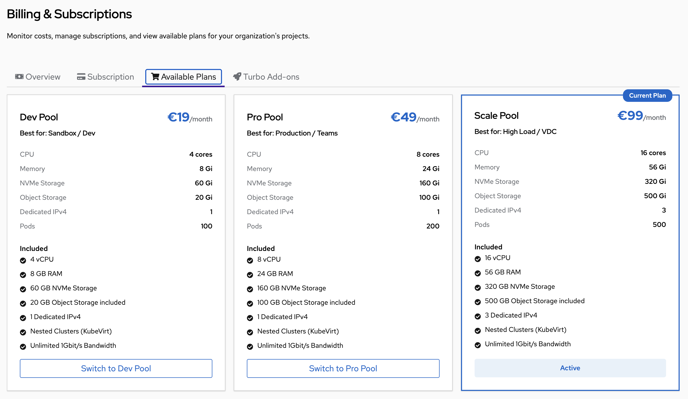

# Billing & Usage

The **Billing & Subscriptions** section lets you monitor resource consumption, manage your subscription plan, add extra capacity, and control payment for your entire organization — all from a single page under **Manage Organization → Billing**.

## Overview Dashboard


The **Overview** tab shows your current state at a glance:

- **Current Plan** — Active plan name and subscription start date
- **Monthly Cost** — Total cost broken down as base plan + active add-ons
- **Active Add-ons** — Turbo packages currently applied to the organization
- **Resource Usage** — Live progress bars for every quota dimension:
  - CPU (cores used / total available)
  - Memory (GiB used / total available)
  - NVMe Storage (GiB used / total available)
  - Pods (count used / plan limit)
  - Public IPv4 (addresses used / plan limit)
  - Object Storage (GB used / plan limit)

The progress bars change color as usage rises: green → yellow → red. A resource shown in red is at or near its limit and may block new deployments.

From the Overview you can also:
- **View Plans** — Browse and switch subscription plans
- **Manage Add-ons** — Add or remove Turbo capacity packages
- **Manage Payment** — Open the Stripe customer portal to update billing details

---

## Subscription Plans



Kube-DC offers three subscription plans. All resources are provisioned across your organization's projects on high-performance NVMe storage.

| | **Dev Pool** | **Pro Pool** | **Scale Pool** |
|---|---|---|---|
| **Monthly price** | €19/month | €49/month | €99/month |
| **Best for** | Sandbox / Dev | Production / Teams | High Load / VDC |
| **CPU** | 4 vCPU | 8 vCPU | 16 vCPU |
| **Memory** | 8 GB | 24 GB | 56 GB |
| **NVMe Storage** | 60 GB | 160 GB | 320 GB |
| **Object Storage** | 20 GB | 100 GB | 500 GB |
| **Dedicated IPv4** | 1 | 1 | 3 |
| **Max Pods** | 100 | 200 | 500 |
| **Nested Clusters** | ✅ | ✅ | ✅ |
| **Bandwidth** | Unlimited 1Gbit/s | Unlimited 1Gbit/s | Unlimited 1Gbit/s |

All plans include Nested Kubernetes clusters (KubeVirt), unlimited bandwidth, and full platform access with no feature restrictions.

---

## Understanding Resource Quotas

All resources in your plan are **shared across all projects** in your organization. The quota is applied at the organization level, and any combination of usage across your projects counts toward it.

**Example:** An organization on the Pro Pool (8 vCPU, 24 GB RAM) with three projects — `acme-dev`, `acme-staging`, and `acme-prod`:

```
Organization total quota: 8 vCPU  /  24 GB RAM

  acme-dev      uses: 2 vCPU  /  4 GB   →  remaining:
  acme-staging  uses: 2 vCPU  /  8 GB   →  remaining:
  acme-prod     uses: 3 vCPU  /  10 GB  →  remaining:
                       ─────       ────
  Total used:          7 vCPU  /  22 GB  →  1 vCPU / 2 GB still available
```

There is no per-project quota split by default — projects draw from the same shared pool. If one project is idle, another can use all available resources. Organization admins can optionally set per-project limits to prevent one project from consuming everything; see [Per-Project Resource Limits](#per-project-resource-limits).

### Burst Capacity

Each plan includes a **burst allowance** — the ability for your workloads to temporarily use more CPU and memory than the base plan quota, as long as capacity is available on the underlying infrastructure. Burst does not increase your quota; it allows short-term peaks above your reserved baseline.

| Plan | Burst Multiplier | Base CPU | Max CPU burst |
|------|-----------------|----------|---------------|
| Dev Pool | 3× | 4 vCPU | up to 12 vCPU |
| Pro Pool | 2× | 8 vCPU | up to 16 vCPU |
| Scale Pool | 1.5× | 16 vCPU | up to 24 vCPU |

Dev Pool has the highest burst ratio because development workloads tend to be bursty and intermittent. Scale Pool has a lower ratio to favor predictability for production loads.

:::info
Burst applies to CPU and memory. Storage, pods, and public IP quotas are fixed limits with no burst.
:::

---

## Resource Limits for Workloads

When Kubernetes enforces resource quotas across your organization, every running container must declare how much CPU and memory it needs. This is required for the platform to track usage accurately and schedule workloads fairly.

### Automatic Defaults

**You do not need to manually set resource values on every workload.** The platform automatically applies default CPU and memory values to any container that doesn't specify them. These defaults are sized based on your active plan:

| | **Dev Pool** | **Pro Pool** | **Scale Pool** |
|---|---|---|---|
| **Default CPU request** | 100m | 250m | 500m |
| **Default memory request** | 128 Mi | 256 Mi | 512 Mi |
| **Default CPU limit** | 500m | 500m | 1 core |
| **Default memory limit** | 512 Mi | 512 Mi | 1 Gi |
| **Max CPU per container** | 2 cores | 4 cores | 8 cores |
| **Max memory per container** | 4 Gi | 12 Gi | 32 Gi |
| **Max CPU per pod** | 4 cores | 8 cores | 16 cores |
| **Max memory per pod** | 8 Gi | 24 Gi | 56 Gi |
| **Max PVC storage** | 60 Gi | 160 Gi | 320 Gi |

**Requests** represent guaranteed resources reserved for your workload. **Limits** are the maximum a workload can use before it is throttled (CPU) or restarted (memory).

### What This Means in Practice

- A pod deployed without any resource declarations (e.g., a raw Kubernetes deployment with no `resources:` block) will automatically receive the plan's default request and limit values.
- KubeVirt virtual machines translate their vCPU and memory settings into pod-level resource values automatically — no manual configuration needed.
- The **max per container** cap prevents a single runaway container from consuming your entire organization's quota. If you need a container larger than the plan's max, contact support or upgrade to a higher plan.

### When Workloads Are Rejected

Once your organization's quota is fully consumed, new workloads will fail to start with an error such as:

```
0/3 nodes are available: exceeded quota: plan-quota, requested: requests.cpu=500m, used: requests.cpu=8, limited: requests.cpu=8
```

To resolve this:
- Delete unused pods or VMs to free quota
- Add a **Turbo Add-on** to expand capacity
- Upgrade to a higher plan

---

## Turbo Add-ons


Turbo Add-ons let you boost your organization's resources without switching plans. Add-ons are applied to your **entire organization** and stack — you can add the same package multiple times.

| | **Turbo x1** | **Turbo x2** |
|---|---|---|
| **Monthly price** | €9/month | €16/month |
| **Additional vCPU** | +2 cores | +4 cores |
| **Additional RAM** | +4 GB | +8 GB |
| **Additional Storage** | +20 GB | +40 GB |

**Example:** Scale Pool + 3× Turbo x1 + 2× Turbo x2 = €99 + €27 + €32 = **€158/month**, providing:
- CPU: 16 + 6 + 8 = **30 vCPU** (plus burst)
- RAM: 56 + 12 + 16 = **84 GB**
- Storage: 320 + 60 + 80 = **460 GB**

This matches the Overview screenshot above where Monthly Cost shows €158.

### Adding a Turbo Add-on

1. Navigate to **Manage Organization → Billing → Turbo Add-ons**
2. Click **Add Another** on the desired package
3. The add-on is billed immediately and quota is available within seconds

### Removing a Turbo Add-on

1. Navigate to **Manage Organization → Billing → Turbo Add-ons**
2. Click **Remove 1** on the package you want to reduce

:::warning Downgrade Check
Before removing an add-on, ensure your current resource usage fits within the reduced quota. If active workloads exceed the new limit, they will continue running but no new workloads will be schedulable until usage drops below the new quota.
:::

---

## Managing Your Subscription

### Subscribing to a Plan

1. Navigate to **Manage Organization → Billing → Available Plans**
2. Click **Subscribe** on your desired plan
3. You will be redirected to the Stripe checkout page to enter payment details
4. After payment, you are returned to the Billing overview. The subscription is active immediately.

### Changing Plans

You can upgrade or downgrade at any time from the **Available Plans** tab.

1. Click **Switch to [Plan Name]** on the target plan
2. Confirm the change in the dialog

**On upgrade:** The new quota is available immediately. Stripe prorates the billing amount for the current period.

**On downgrade:** The system checks whether your current resource usage fits within the new plan before allowing the change. If you are over the target plan's limits, you will need to scale down workloads first.

### Canceling Your Subscription

1. Navigate to **Manage Organization → Billing → Subscription**
2. Click **Cancel Subscription**
3. Confirm in the dialog

Cancellation takes effect at the **end of the current billing period**. Your subscription enters `canceling` status and your full resources remain available until the period ends.

---

## Subscription Status

| Status | Resources | New Deployments | Payment |
|--------|-----------|-----------------|---------|
| **Active** | Full plan quota | ✅ Allowed | Current |
| **Trialing** | Full plan quota | ✅ Allowed | Trial period |
| **Canceling** | Full plan quota | ✅ Allowed | Until period ends |
| **Suspended** | Minimal only | ❌ Blocked | Payment failed |
| **Canceled** | Minimal only, workloads paused | ❌ Blocked | Expired |

### What Happens When a Subscription Is Suspended

If a payment fails, the subscription moves to `suspended`:

1. **7-day grace period** — all existing workloads continue running, but new deployments are blocked
2. **After 7 days** — if payment is still not resolved:
   - All Deployments and StatefulSets are scaled to zero replicas
   - CronJobs are suspended
   - The organization quota drops to a minimal holding allocation

Original replica counts are saved and restored automatically when you re-subscribe.

### Re-subscribing

If your subscription is suspended or canceled, click **Subscribe** from the **Available Plans** tab to start a new subscription. All previously running workloads are automatically restored to their original state.

---

## Managing Payment

Click **Manage Payment** from the Billing Overview to open the **Stripe Customer Portal**. From there you can:

- **Update payment method** — Change credit card or SEPA details
- **Download invoices** — Access billing history and PDF receipts
- **View upcoming charges** — Preview the next billing cycle
- **Update billing address** — Change the address shown on invoices

The Stripe portal opens in the same tab. Click **Return** in the portal to come back to the Kube-DC console.

---

## Per-Project Resource Limits

By default, all projects share the organization quota with no individual caps. Organization administrators can optionally cap individual projects to prevent a single project from consuming the entire budget.

### Setting Limits in the UI

1. Navigate to **Manage Organization → Projects**
2. Click the project you want to limit
3. Open the **Resource Quotas** panel and click **Set Per-Project Quota**
4. Enter values for CPU, Memory, Storage, and/or Pods and click **Save Quota**

The panel shows the organization's total quota alongside the per-project fields so you can see what is available.

### Setting Limits with kubectl

Create (or update) a `ResourceQuota` named `project-quota` in the project namespace:

```bash
kubectl apply -f - <<EOF
apiVersion: v1
kind: ResourceQuota
metadata:
  name: project-quota
  namespace: myorg-dev          # Project namespace: {org}-{project}
  labels:
    billing.kube-dc.com/per-project: "true"
spec:
  hard:
    requests.cpu: "2"
    requests.memory: "4Gi"
    requests.storage: "20Gi"
    pods: "50"
EOF
```

The effective limit for any resource is the **lower** of the per-project cap and the organization's remaining quota. To remove a per-project limit and return the project to the shared pool:

```bash
kubectl delete resourcequota project-quota -n myorg-dev
```

---

## Tracking Usage with kubectl

The platform exposes resource usage directly on the `Organization` and `Project` custom resources so you can query quota state from the command line without logging into the UI. Values are refreshed every 5–7 minutes by the platform controller.

### Organization-level usage

```bash
# Full quota summary (human-readable)
kubectl get organization <org> -n <org> -o jsonpath='{.status.quotaUsage}' | jq .
```

Example output:

```json
{
  "cpu":           { "used": "18.975", "hard": "26" },
  "memory":        { "used": "63.6Gi", "hard": "70Gi" },
  "storage":       { "used": "443.2Gi", "hard": "460Gi" },
  "pods":          { "used": "33",     "hard": "500" },
  "publicIPv4":    { "used": "3",      "hard": "3" },
  "objectStorage": { "used": "",       "hard": "500Gi" },
  "lastUpdated":   "2026-04-07T20:55:42Z"
}
```

- **cpu** — cores used / available (decimal, e.g. `18.975` = 18,975 millicores)
- **memory / storage** — GiB consumed vs plan limit
- **publicIPv4** — count of public External IPs in use across all projects
- **objectStorage** — hard limit from plan; `used` is populated asynchronously from object storage stats
- **lastUpdated** — timestamp of last controller refresh

Check a single field:

```bash
kubectl get organization <org> -n <org> -o jsonpath='{.status.quotaUsage.cpu}' | jq .
# → { "hard": "26", "used": "18.975" }
```

### Project-level usage

Each project reports its own namespace usage:

```bash
kubectl get project <project> -n <org> -o jsonpath='{.status.quotaUsage}' | jq .
```

Example output:

```json
{
  "cpu":               { "used": "6.72",    "hard": "26" },
  "memory":            { "used": "16.824Gi","hard": "70Gi" },
  "storage":           { "used": "147.4Gi", "hard": "460Gi" },
  "pods":              { "used": "12",      "hard": "500" },
  "perProjectQuotaSet": false,
  "lastUpdated":       "2026-04-07T20:55:00Z"
}
```

- **hard** shows the organization limit when no per-project cap is set (`perProjectQuotaSet: false`), or the per-project cap when one is configured
- **perProjectQuotaSet** — `true` if an admin has applied an explicit per-project `ResourceQuota`

### All projects at a glance

```bash
# Print project name + CPU used/hard for all projects in an org
kubectl get projects -n <org> \
  -o custom-columns='PROJECT:.metadata.name,CPU_USED:.status.quotaUsage.cpu.used,CPU_HARD:.status.quotaUsage.cpu.hard,MEM_USED:.status.quotaUsage.memory.used'
```

### Raw ResourceQuota (live Kubernetes enforcement)

The `quotaUsage` status is a controller summary refreshed every few minutes. For real-time enforcement state, query the underlying `ResourceQuota` objects directly:

```bash
# All quotas in a project namespace
kubectl get resourcequota -n myorg-dev

# Detailed usage breakdown
kubectl describe resourcequota -n myorg-dev
```

The `hrq.hnc.x-k8s.io` quota is the organization-wide HNC propagated limit. The `project-quota` quota (if present) is the per-project cap set by an admin.

---

## Troubleshooting

**New pods or VMs fail to start with "exceeded quota"**
- Check the Overview dashboard for which resource is at its limit, or run:
  ```bash
  kubectl get organization <org> -n <org> -o jsonpath='{.status.quotaUsage}' | jq .
  ```
- Delete unused workloads to free capacity, or add a Turbo Add-on

**Pods fail to start with "must specify resource limits"**
- This can happen if resource defaults are not yet applied in a newly created project
- Wait 30–60 seconds for the defaults to propagate and retry
- If it persists, confirm your organization has an active subscription

**Turbo Add-on added but quota did not increase**
- The quota update is near-instant but may take up to 60 seconds to reflect in the Overview
- Refresh the page; if still not updated, check the subscription status is `active`

**Cannot switch to a lower plan ("usage exceeds target plan")**
- The Overview shows current usage for each resource
- Scale down or delete workloads until usage falls within the target plan's limits, then retry

**IPv4 at 100% — cannot create new LoadBalancer services**
- Dev Pool and Pro Pool include 1 dedicated IPv4 with no burst
- Scale Pool includes 3 IPv4 addresses
- Add-ons do not include additional IPv4 addresses; upgrade to Scale Pool for more

**Workloads were scaled to zero unexpectedly**
- Check the subscription status in the Overview
- The organization may have entered `canceled` state after the 7-day grace period
- Re-subscribe to restore all workloads automatically
