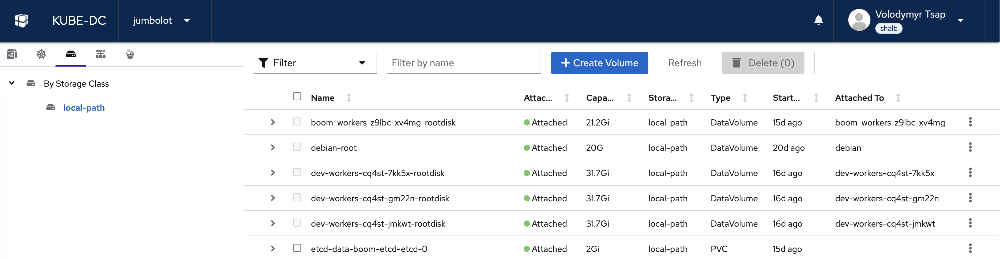
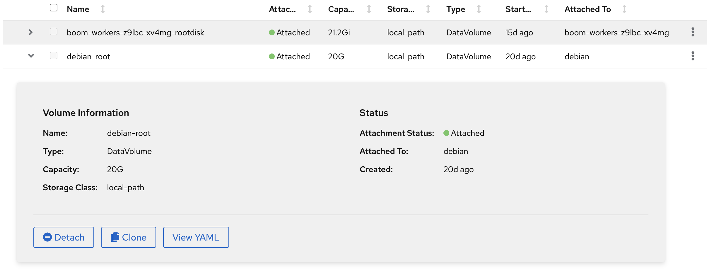

# Block Storage

Kube-DC provides persistent block storage through Kubernetes **PersistentVolumeClaims (PVCs)**. The Containerized Data Importer (CDI) adds **DataVolumes**, which create and populate PVCs from sources such as VM images. Both resource types are managed through the Volumes view in the dashboard or via kubectl.

## Volumes Dashboard

<div style={{width: '100%', maxWidth: 'none'}}>

</div>

The Volumes view shows all persistent storage in your project. Volumes are organized by **Storage Class** in the left sidebar. Each volume shows its name, attachment status, capacity, storage class, type (DataVolume or PVC), age, and which VM or pod it is attached to.

Click on any volume to expand its details:



The detail panel shows:
- **Volume Information** — Name, type, capacity, and storage class
- **Status** — Attachment status and which VM/pod the volume is attached to
- **Actions** — Detach from a VM, Clone, or View YAML, when the action is supported for that volume

## Understanding Volume Types

### DataVolumes (VM Disk Imports)

A **DataVolume** is a KubeVirt resource provided by the [Containerized Data Importer (CDI)](https://kubevirt.io/user-guide/storage/containerized_data_importer/). It automates creating a PVC and populating it with data from a source — typically an OS image for a VM root disk.

When the VM wizard imports an image, it creates a DataVolume for the root disk. For a prepared image with snapshot support, the wizard can instead restore a PVC directly from a `VolumeSnapshot`. In both cases, the VM ultimately uses a PVC-backed disk.

DataVolumes can populate storage from:

- **HTTP/HTTPS URL** — Download a cloud image (e.g., Debian, Ubuntu)
- **Container Registry** — Pull a disk image from a container registry
- **Blank** — Create an empty disk for additional storage

**Example: VM root disk DataVolume**

```yaml
apiVersion: cdi.kubevirt.io/v1beta1
kind: DataVolume
metadata:
  name: debian-root
  namespace: acme-production
spec:
  source:
    http:
      url: https://cloud.debian.org/images/cloud/bookworm/latest/debian-12-generic-amd64.qcow2
  pvc:
    accessModes:
      - ReadWriteOnce
    resources:
      requests:
        storage: 20G
    storageClassName: local-path
```

Once the import completes (Phase: `Succeeded`), the DataVolume is ready and can be attached to a VM.

**Example: Blank data disk**

```yaml
apiVersion: cdi.kubevirt.io/v1beta1
kind: DataVolume
metadata:
  name: data-disk
  namespace: acme-production
spec:
  source:
    blank: {}
  pvc:
    accessModes:
      - ReadWriteOnce
    resources:
      requests:
        storage: 50G
    storageClassName: local-path
```

### PersistentVolumeClaims (VMs and Containers)

A **PVC** is the standard Kubernetes resource for requesting persistent storage. VMs use PVC-backed disks, and containerized workloads such as Deployments, StatefulSets, and Pods mount PVCs when their data must persist across restarts.

**Example: PVC for a database**

```yaml
apiVersion: v1
kind: PersistentVolumeClaim
metadata:
  name: postgres-data
  namespace: acme-production
spec:
  accessModes:
    - ReadWriteOnce
  resources:
    requests:
      storage: 10Gi
  storageClassName: local-path
```

Mount it in a Pod:

```yaml
apiVersion: v1
kind: Pod
metadata:
  name: postgres
  namespace: acme-production
spec:
  containers:
    - name: postgres
      image: postgres:16
      env:
        - name: POSTGRES_PASSWORD
          value: change-this-example-password
      volumeMounts:
        - name: data
          mountPath: /var/lib/postgresql/data
  volumes:
    - name: data
      persistentVolumeClaim:
        claimName: postgres-data
```

### DataVolume vs PVC — When to Use Which

| Feature | DataVolume | PVC |
|---------|-----------|-----|
| **Primary use** | Create and populate VM disks | Backing storage for VMs and containers |
| **Data population** | CDI source such as HTTP, registry, blank, or another volume | Empty on creation, or clone/snapshot when the storage driver supports it |
| **Created by** | VM provisioning or manually | Directly by user |
| **Backed by** | Creates a PVC internally | Directly binds to a PersistentVolume |
| **Visible in UI** | Yes (Volumes tab, type: DataVolume) | Yes (Volumes tab, type: PVC) |

## Storage Classes

A **StorageClass** defines what type of storage backs your volumes. The available storage classes depend on the infrastructure provider.

### Kube-DC Cloud Default: `local-path`

```
$ kubectl get storageclass
NAME                   PROVISIONER             RECLAIMPOLICY   VOLUMEBINDINGMODE
local-path (default)   rancher.io/local-path   Delete          WaitForFirstConsumer
```

The `local-path` storage class provisions storage on the local disk of the node where the workload runs. Key characteristics:

- **Fast** — Direct local disk I/O, no network overhead
- **Node-bound** — Data is stored on a specific node; the workload must run on the same node
- **Delete reclaim policy** — When a PVC is deleted, the underlying data is removed

:::info Provider-Dependent Storage Classes
Storage classes vary by infrastructure provider. Some platforms may offer:

- **Network-attached storage** (e.g., Ceph RBD, Longhorn) — Data accessible from any node, supports live migration
- **SSD-backed classes** — Higher IOPS for database workloads
- **HDD-backed classes** — Cost-effective for large datasets

Check your available storage classes with `kubectl get storageclass`. Always specify the `storageClassName` in your PVC or DataVolume to ensure you get the expected storage type.
:::

## Creating Volumes

### Via Dashboard

1. Navigate to your project → **Volumes** tab
2. Click **+ Create Volume**
3. Choose the volume type, size, storage class, access mode, and volume mode
4. Click **Create**

### Via kubectl

**Create a DataVolume (for VMs):**

```bash
kubectl apply -f - <<EOF
apiVersion: cdi.kubevirt.io/v1beta1
kind: DataVolume
metadata:
  name: my-data-disk
  namespace: acme-production
spec:
  source:
    blank: {}
  pvc:
    accessModes:
      - ReadWriteOnce
    resources:
      requests:
        storage: 30G
    storageClassName: local-path
EOF
```

**Create a PVC (for containers):**

```bash
kubectl apply -f - <<EOF
apiVersion: v1
kind: PersistentVolumeClaim
metadata:
  name: my-pvc
  namespace: acme-production
spec:
  accessModes:
    - ReadWriteOnce
  resources:
    requests:
      storage: 10Gi
  storageClassName: local-path
EOF
```

## Managing Volumes

### Check Volume Status

```bash
# List all PVCs
kubectl get pvc -n acme-production

# List all DataVolumes
kubectl get datavolumes -n acme-production

# Get volume details
kubectl describe pvc debian-root -n acme-production
```

### Clone a Volume

From the Volumes dashboard, expand a volume and click **Clone** to request a separate copy. PVC cloning requires CSI clone support from the selected StorageClass; DataVolume cloning can use CDI's copy strategy. For example, `local-path` does not provide CSI cloning, so a direct PVC clone can remain pending.

Check the cloned DataVolume or PVC status and events before attaching it. A clone is not a replacement for a tested backup or snapshot policy.

### Detach a Volume

Click **Detach** to disconnect a volume from an attached VM without deleting the data. The volume can be reattached later. To detach a PVC from a Pod, Deployment, or StatefulSet, update that workload's manifest or controller instead.

### Delete a Volume

```bash
# Delete a DataVolume (also deletes the underlying PVC)
kubectl delete datavolume my-data-disk -n acme-production

# Delete a PVC directly
kubectl delete pvc my-pvc -n acme-production
```

:::warning
Deleting a claim removes the Kubernetes storage resource. What happens to the underlying data depends on the StorageClass reclaim policy. The hosted `local-path` class uses `Delete`, so deleting its PVC removes the backing data; do not rely on recovery after deletion.
:::

## Quick Reference

| Action | Command |
|--------|---------|
| List PVCs | `kubectl get pvc -n acme-production` |
| List DataVolumes | `kubectl get datavolumes -n acme-production` |
| List StorageClasses | `kubectl get storageclass` |
| Describe volume | `kubectl describe pvc <name> -n acme-production` |
| Delete DataVolume | `kubectl delete datavolume <name> -n acme-production` |
| Delete PVC | `kubectl delete pvc <name> -n acme-production` |

## Next Steps

- [Object Storage](object-storage.md) — S3-compatible storage for files and backups
- [Backups & Snapshots](backups-snapshots.md)
