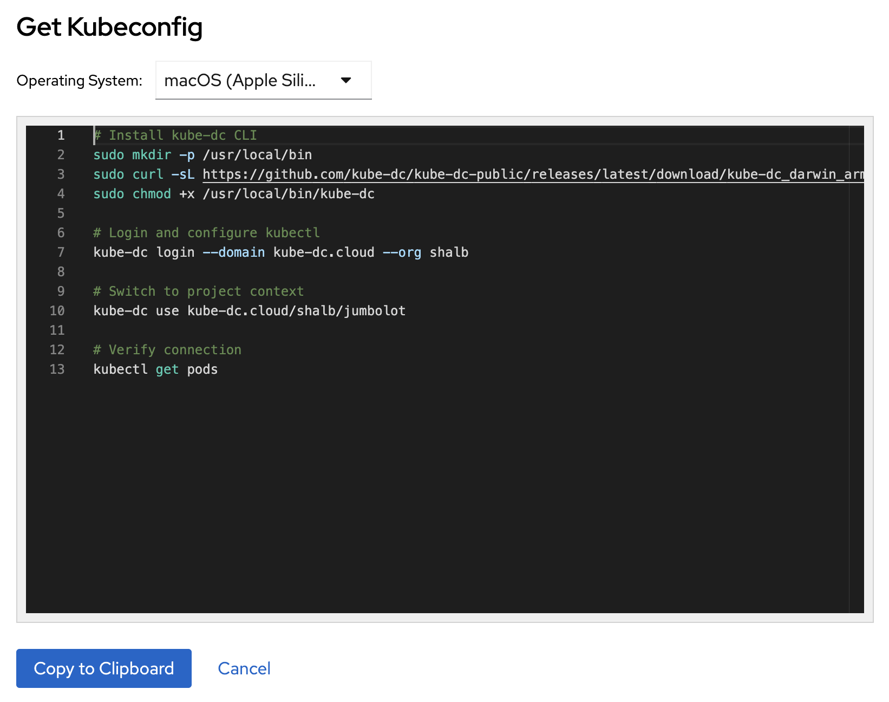

# CLI, Console, and IDE Access

This guide explains how to install and use the `kube-dc` CLI tool for command-line access, web console, and IDE integration with Projects and Managed Clusters.

## Overview

The `kube-dc` CLI provides secure, browser-based authentication for Kubernetes access. It handles:

- **Browser-based login** — no password is entered in the terminal
- **Automatic token refresh** — short-lived access tokens refresh while the
  cached session remains valid
- **Multi-cluster support** — manage more than one Kube-DC installation,
  Organization, and Project
- **Project context switching** — select a named context for an accessible
  Project while keeping its identity and backing namespace aligned

## Get CLI Access from Console UI

You can access the CLI tool directly from the Console UI right after creating a project:

1. Navigate to your project's **Workloads Dashboard**
2. Click the **Get CLI Access** card
3. Follow the displayed commands to install and authenticate



The Console UI provides platform-specific installation commands and your authentication details. The `kube-dc` CLI will:

- Authenticate you via browser
- Generate your kubeconfig automatically
- Save cached credentials with user-only file permissions under `~/.kube-dc/`
- Configure kubectl contexts for your projects

```bash
# Example workflow shown in Console UI
kube-dc login --domain kube-dc.cloud --org your-org
kube-dc use kube-dc.cloud/your-org/your-project
kubectl get pods
```

## Installation

### macOS and Linux

```bash
os="$(uname -s | tr '[:upper:]' '[:lower:]')"
case "$(uname -m)" in
  x86_64) arch="amd64" ;;
  arm64|aarch64) arch="arm64" ;;
  *) printf 'Unsupported architecture: %s\n' "$(uname -m)" >&2; exit 1 ;;
esac
tmp="$(mktemp)"
curl --fail --location \
  "https://github.com/kube-dc/kube-dc-public/releases/latest/download/kube-dc_${os}_${arch}" \
  --output "$tmp"
sudo install -m 0755 "$tmp" /usr/local/bin/kube-dc
rm -f "$tmp"
```

### Windows

```powershell
$installDir = "$env:USERPROFILE\bin"
New-Item -ItemType Directory -Force -Path $installDir | Out-Null
$url = "https://github.com/kube-dc/kube-dc-public/releases/latest/download/kube-dc_windows_amd64.exe"
Invoke-WebRequest -Uri $url -OutFile "$installDir\kube-dc.exe"
$env:Path = "$installDir;$env:Path"
$userPath = [Environment]::GetEnvironmentVariable("Path", "User")
if ($userPath -notlike "*$installDir*") { [Environment]::SetEnvironmentVariable("Path", "$installDir;$userPath", "User") }
```

## Quick Start

### 1. Login to your organization

```bash
kube-dc login --domain kube-dc.cloud --org acme
```

This opens your browser for secure authentication. After login:
- Your kubeconfig is automatically configured
- Contexts are created for each project you have access to
- Tokens are cached with user-only file permissions (`~/.kube-dc/credentials/`)

### 2. Switch Projects

```bash
# List available Project contexts
kube-dc use

# Switch to a Project
kube-dc use kube-dc.cloud/acme/production
```

### 3. Use kubectl normally

```bash
kubectl get pods
kubectl top pods
kubectl logs -f my-pod
```

## Commands Reference

### `kube-dc login`

Authenticate with a kube-dc platform.

```bash
kube-dc login --domain <domain> --org <organization>

# Examples
kube-dc login --domain kube-dc.cloud --org acme
kube-dc login --domain stage.kube-dc.com --org mycompany
```

**Options:**
- `--domain` - Platform domain (e.g., kube-dc.cloud)
- `--org` - Organization/realm name
- `--insecure` - Skip TLS verification (not recommended for production)

### `kube-dc ns`

Compatibility selector for Project backing namespaces. It rewrites the
namespace field on the current context without changing the context name, so
the two can become misleadingly different. Prefer `kube-dc use` for normal
Project switching.

```bash
# List accessible Project backing namespaces
kube-dc ns

# Select a backing namespace on the current context (legacy behavior)
kube-dc ns acme-production
```

### `kube-dc use`

Switch between Kube-DC contexts. This is the preferred Project switcher.

```bash
# List all kube-dc contexts
kube-dc use

# Switch to a specific context
kube-dc use kube-dc.cloud/acme/production
```

### `kube-dc logout`

Remove cached credentials.

```bash
# Logout from current server
kube-dc logout

# Logout from all servers
kube-dc logout --all
```

### `kube-dc config`

View configuration and token status.

```bash
# Show current configuration
kube-dc config show

# List all kube-dc contexts
kube-dc config get-contexts
```

## How It Works

### Authentication Flow

1. **Login**: Browser opens to Keycloak login page
2. **OAuth2 PKCE**: Secure token exchange without exposing credentials
3. **Token Storage**: Token files stored in `~/.kube-dc/credentials/` with owner-only filesystem permissions
4. **kubectl Integration**: Acts as credential plugin for kubectl

:::note Local credential storage
The credential cache is not encrypted at rest. It is protected with owner-only file permissions (`0600`); protect your local account and disk accordingly.
:::

### Kubeconfig Integration

After login, your kubeconfig contains entries like:

```yaml
contexts:
- name: kube-dc/kube-dc.cloud/acme/production
  context:
    cluster: kube-dc-kube-dc.cloud-acme
    user: kube-dc@kube-dc.cloud/acme
    namespace: acme-production

users:
- name: kube-dc@kube-dc.cloud/acme
  user:
    exec:
      apiVersion: client.authentication.k8s.io/v1
      command: kube-dc
      args:
        - credential
        - --server
        - https://kube-api.kube-dc.cloud:6443
        - --realm
        - acme
```

### Token Lifecycle

- **Access token** — short-lived (15 minutes by the platform default)
- **Refresh token** — requested with the `offline_access` scope
- **Local session window** — the CLI records a 30-day refresh window when the
  identity provider reports no finite refresh expiry; successful refreshes
  extend that local window
- **Automatic refresh** — the kubeconfig credential plugin refreshes the access
  token when `kubectl` runs

## Shell Completions

Enable tab completion for your shell:

```bash
# Bash
kube-dc completion bash > /etc/bash_completion.d/kube-dc

# Zsh
kube-dc completion zsh > "${fpath[1]}/_kube-dc"

# Fish
kube-dc completion fish > ~/.config/fish/completions/kube-dc.fish
```

## Troubleshooting

### Session Expired

If you see `session expired`, the cached refresh credential is missing,
expired, or no longer accepted by the identity provider. Sign in again:

```bash
kube-dc login --domain <domain> --org <org>
```

### Context Not Found

If a command reports that the current context is not a Kube-DC context:

```bash
# Check current context
kubectl config current-context

# Switch to a kube-dc context
kube-dc use kube-dc.cloud/acme/production
```

### Clear All Credentials

To start fresh:

```bash
kube-dc logout --all
rm -rf ~/.kube-dc/credentials/
```

### Diagnose Access

Confirm the selected context and test the permission needed for your next
command:

```bash
kubectl config current-context
kubectl auth can-i get pods
kube-dc login --help
```

## Security Best Practices

- **Never share** your `~/.kube-dc/credentials/` directory
- Use `--insecure` only for development/testing
- Logout when finished: `kube-dc logout`
- Credentials are stored with `0600` permissions

## Project Console (Web Terminal)

For quick access without CLI installation, use the **Project Console** from the UI:

1. Click your username in the top-right
2. Select "Project console"
3. A web terminal opens with kubectl pre-configured

The web console includes:
- `kubectl`, `helm`, `k9s`, `stern`, `virtctl`
- Shell completions for all tools
- Common aliases: `k`, `kgp`, `kgs`, `kl`, etc.

## Next Steps

- [Team Management](team-management.md): Learn about role-based access control
- [Creating a Virtual Machine](creating-vm.md): Deploy your first VM
