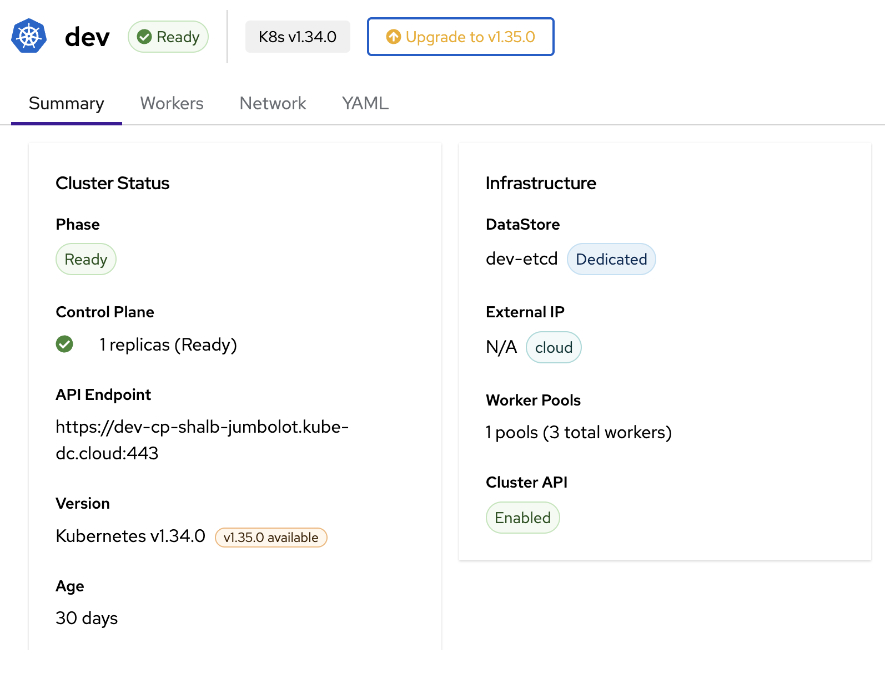

# Cluster Management

Once your managed Kubernetes cluster is running, you can deploy workloads, expose services with external IPs, use persistent storage, scale worker pools, and manage the cluster lifecycle.

## Exposing Services (LoadBalancer)

When you create a `Service` of type `LoadBalancer` inside your tenant cluster, the Cloud Controller Manager (CCM) provisions a real LoadBalancer service in the management cluster, giving your application an external IP.

### How It Works

```
┌──── Tenant Cluster ─────┐        ┌──── Management Cluster ────────────┐
│                         │        │  Project Namespace                 │
│  Service (LoadBalancer) │───────▶│  Service (LoadBalancer)            │
│  langfuse-web-lb:3000   │  CCM   │  → External IP: 100.65.0.169       │
│                         │        │                                    │
└─────────────────────────┘        └────────────────────────────────────┘
```

1. You create a `Service` of type `LoadBalancer` in the tenant cluster
2. The CCM running in your project namespace detects the service
3. A corresponding LoadBalancer service is created in the management cluster
4. An external IP is allocated and reported back to the tenant cluster service

### Example: Expose a Web Application

Inside your tenant cluster, create a LoadBalancer service:

```yaml
apiVersion: v1
kind: Service
metadata:
  name: my-app-lb
  namespace: default
  annotations:
    network.kube-dc.com/external-network-type: "public"
spec:
  type: LoadBalancer
  ports:
    - name: http
      port: 80
      targetPort: 8080
      protocol: TCP
  selector:
    app: my-app
```

```bash
kubectl --kubeconfig=/tmp/dev-kubeconfig apply -f service.yaml
```

### Service Annotations

| Annotation | Value | Description |
|------------|-------|-------------|
| `network.kube-dc.com/external-network-type` | `public` | Allocate a public IP for the service |
| `network.kube-dc.com/external-network-type` | `cloud` | Use a cloud-internal IP (default) |

### Verify the Service

```bash
# Check the service in the tenant cluster
kubectl --kubeconfig=/tmp/dev-kubeconfig get svc my-app-lb

# Example output:
# NAME        TYPE           CLUSTER-IP     EXTERNAL-IP    PORT(S)        AGE
# my-app-lb   LoadBalancer   10.96.201.161  100.65.0.169   80:30092/TCP   5m
```

The `EXTERNAL-IP` is a real IP routable from outside the cluster. For public IPs, the service is accessible from the internet.

### Working Example

A Langfuse deployment exposed via LoadBalancer in a real tenant cluster:

```bash
$ kubectl --kubeconfig=/tmp/dev-kubeconfig get svc langfuse-web-lb -n langfuse
NAME             TYPE           CLUSTER-IP      EXTERNAL-IP    PORT(S)          AGE
langfuse-web-lb  LoadBalancer   10.96.201.161   100.65.0.169   3000:30092/TCP   15d
```

The service is annotated with `network.kube-dc.com/external-network-type: public` and receives a public IP `100.65.0.169` accessible on port 3000.

## Persistent Storage (KubeVirt CSI)

When KubeVirt CSI is enabled during cluster creation, you can use PersistentVolumeClaims inside your tenant cluster. The CSI driver creates DataVolumes in your project namespace on the management cluster, providing real persistent storage.

### How It Works

```
┌──── Tenant Cluster ─────┐        ┌──── Management Cluster ────────────┐
│                         │        │  Project Namespace                 │
│  PVC: my-data (5Gi)     │───────▶│  DataVolume → PVC (5Gi)            │
│  StorageClass: kubevirt │  CSI   │  StorageClass: local-path          │
│                         │        │  (hotplugged to worker VM)         │
└─────────────────────────┘        └────────────────────────────────────┘
```

1. You create a PVC in the tenant cluster using the `kubevirt` StorageClass
2. The CSI controller (running in your project namespace) creates a DataVolume in the management cluster
3. The DataVolume is hotplugged to the worker VM where the pod is scheduled
4. The volume is mounted into the pod as a regular block device

### Example: Create a PersistentVolumeClaim

```yaml
apiVersion: v1
kind: PersistentVolumeClaim
metadata:
  name: postgres-data
  namespace: default
spec:
  accessModes:
    - ReadWriteOnce
  resources:
    requests:
      storage: 10Gi
  storageClassName: kubevirt
```

The `kubevirt` StorageClass is automatically created when KubeVirt CSI is enabled. It is set as the default StorageClass, so you can omit `storageClassName` if you prefer.

### Verify Storage

```bash
# Check PVCs in the tenant cluster
kubectl --kubeconfig=/tmp/dev-kubeconfig get pvc -n langfuse

# Example output:
# NAME                    STATUS   VOLUME       CAPACITY   ACCESS MODES   STORAGECLASS   AGE
# clickhouse-pvc          Bound    pvc-c09...   10Gi       RWO            kubevirt       15d
# langfuse-postgres-pvc   Bound    pvc-377...   5Gi        RWO            kubevirt       15d
```

Each PVC in the tenant cluster corresponds to a DataVolume and PVC in your project namespace on the management cluster:

```bash
# Corresponding PVCs on the management cluster (project namespace)
kubectl get pvc -n shalb-jumbolot | grep pvc-c09
pvc-c09c6404-63ac-4ebc-9aab-671b4583b599   Bound   pvc-2d6bb...   11362347344   RWO   local-path   15d
```

### StorageClass Parameters

The default `kubevirt` StorageClass uses the following configuration:

| Parameter | Value | Description |
|-----------|-------|-------------|
| `provisioner` | `csi.kubevirt.io` | KubeVirt CSI driver |
| `bus` | `scsi` | Disk bus type for hotplug |
| `infraStorageClassName` | `local-path` | Storage class used on the management cluster |

## Scaling Workers

### Scale via kubectl

```bash
# Scale a worker pool to 5 replicas
kubectl patch kdccluster dev -n my-project \
  --type merge -p '{"spec":{"workers":[{"name":"workers","replicas":5}]}}'
```

### Add a Worker Pool

```bash
kubectl patch kdccluster dev -n my-project --type merge -p '{
  "spec": {
    "workers": [
      {
        "name": "workers",
        "replicas": 3,
        "cpuCores": 2,
        "memory": "8Gi",
        "image": "docker.io/shalb/ubuntu-2404-container-disk:v1.35.2",
        "infrastructureProvider": "kubevirt",
        "storageType": "datavolume"
      },
      {
        "name": "highmem-pool",
        "replicas": 2,
        "cpuCores": 4,
        "memory": "16Gi",
        "image": "docker.io/shalb/ubuntu-2404-container-disk:v1.35.2",
        "infrastructureProvider": "kubevirt",
        "storageType": "datavolume"
      }
    ]
  }
}'
```

### Scale to Zero

Scale a worker pool to zero to temporarily stop worker VMs while keeping the control plane running:

```bash
kubectl patch kdccluster dev -n my-project \
  --type merge -p '{"spec":{"workers":[{"name":"workers","replicas":0}]}}'
```

The control plane continues running and the cluster remains accessible via `kubectl`. Scale back up when needed.

## Upgrading Kubernetes Version

You can upgrade your cluster's Kubernetes version with a single command. The upgrade is fully automated — control plane is updated first, then worker nodes are replaced one by one with zero downtime.

### Available Versions

| Version | Worker Image | Status |
|---------|-------------|--------|
| v1.35.0 | `docker.io/shalb/ubuntu-2404-container-disk:v1.35.2` | Latest |
| v1.34.0 | `quay.io/capk/ubuntu-2404-container-disk:v1.34.1` | Supported |

### Via Dashboard

When an upgrade is available, the cluster detail page shows an **Upgrade to vX.Y.Z** button in the header and a version badge in the Summary tab.



1. Open the cluster detail page in the dashboard
2. Click the **Upgrade to vX.Y.Z** button next to the version badge
3. Review the confirmation dialog — it shows the target version and worker image
4. Click **Upgrade** to start the rolling upgrade

The upgrade progress is visible in the cluster status. The phase will change during the upgrade and return to **Ready** once complete.

### Via kubectl

**Step 1: Check current version**

```bash
kubectl get kdccluster dev -n my-project
# NAME   VERSION   PHASE   ENDPOINT   DATASTORE   AGE
# dev    v1.34.0   Ready   ...        dev-etcd    29d
```

**Step 2: Upgrade version and worker image**

Patch both `spec.version` and the worker image in a single command:

```bash
kubectl patch kdccluster dev -n my-project --type=json -p '[
  {"op":"replace","path":"/spec/version","value":"v1.35.0"},
  {"op":"replace","path":"/spec/workers/0/image","value":"docker.io/shalb/ubuntu-2404-container-disk:v1.35.2"}
]'
```

For clusters with multiple worker pools, update each pool's image:

```bash
kubectl patch kdccluster dev -n my-project --type=json -p '[
  {"op":"replace","path":"/spec/version","value":"v1.35.0"},
  {"op":"replace","path":"/spec/workers/0/image","value":"docker.io/shalb/ubuntu-2404-container-disk:v1.35.2"},
  {"op":"replace","path":"/spec/workers/1/image","value":"docker.io/shalb/ubuntu-2404-container-disk:v1.35.2"}
]'
```

**Step 3: Monitor the upgrade**

The upgrade happens in two phases:

1. **Control plane** (~2-5 min) — API server, scheduler, and controller-manager are updated
2. **Worker rollout** (~3-10 min per node) — New workers are created before old ones are removed

```bash
# Watch cluster status
kubectl get kdccluster dev -n my-project -w

# Watch worker machine rollout
kubectl get machines -n my-project -l cluster.x-k8s.io/cluster-name=dev -w
```

During the worker rollout, you will see both old and new machines running simultaneously. The new worker joins the cluster and becomes Ready before the old worker is drained and removed. Your workloads continue running without interruption.

**Step 4: Verify the upgrade**

```bash
# Check cluster version
kubectl get kdccluster dev -n my-project
# NAME   VERSION   PHASE   ...
# dev    v1.35.0   Ready   ...

# Check node versions inside the tenant cluster
kubectl --kubeconfig=/tmp/dev-kubeconfig get nodes -o wide
# NAME                    STATUS   VERSION   CONTAINER-RUNTIME
# dev-workers-xxx-yyy     Ready    v1.35.2   containerd://2.2.2
```

### Important Notes

- **Sequential minor versions only** — You must upgrade one minor version at a time (e.g., v1.34 → v1.35). Skipping versions is not supported.
- **No downgrades** — Kubernetes version downgrades are not supported. The system will reject any attempt to lower the version.
- **Zero downtime** — Workers are replaced using a rolling update strategy (`maxSurge=1`). A new worker is created and becomes Ready before the old one is removed, so your workloads are never interrupted.
- **Image must match version** — Always update the worker image alongside the version. The image contains the matching kubelet and kubeadm binaries.

## Deleting a Cluster

### Via Dashboard

Navigate to the cluster detail page and use the delete action.

### Via kubectl

```bash
kubectl delete kdccluster dev -n my-project
```

Deletion is fully automated. The controller removes resources in the correct order:

1. Worker nodes (MachineDeployments, VMs)
2. Control plane (TenantControlPlane)
3. Cluster API resources
4. CCM deployment
5. Services and EIPs
6. Dedicated datastore (if applicable)

!!! warning
    Deleting a cluster is irreversible. All workloads, services, and data inside the cluster will be permanently removed. Back up any important data before deleting.

## Troubleshooting

### Cluster Stuck in Provisioning

```bash
# Check events in the project namespace
kubectl get events -n my-project --sort-by='.lastTimestamp' | tail -20

# Check KdcCluster status
kubectl describe kdccluster dev -n my-project

# Check control plane pods
kubectl get pods -n my-project -l kamaji.clastix.io/name=dev-cp
```

### Workers Not Joining

```bash
# Check MachineDeployment status
kubectl get machinedeployments -n my-project

# Check individual machines
kubectl get machines -n my-project

# Check worker VM status
kubectl get vmi -n my-project
```

### Service Not Getting External IP

```bash
# Verify CCM is running
kubectl get deploy -n my-project -l k8s-app=kccm-dev

# Check CCM logs
kubectl logs -n my-project -l k8s-app=kccm-dev

# Verify the service annotation in tenant cluster
kubectl --kubeconfig=/tmp/dev-kubeconfig get svc my-app-lb -o yaml | grep -A2 annotations
```

### PVC Stuck in Pending

```bash
# Check the CSI controller logs on the management cluster
kubectl logs -n my-project -l app=kubevirt-csi-driver --all-containers

# Check the CSI node daemonset in the tenant cluster
kubectl --kubeconfig=/tmp/dev-kubeconfig get pods -n kubevirt-csi-driver

# Verify StorageClass exists in tenant cluster
kubectl --kubeconfig=/tmp/dev-kubeconfig get storageclass
```

## Quick Reference

| Operation | Command |
|-----------|---------|
| List clusters | `kubectl get kdccluster -n my-project` |
| Get cluster details | `kubectl describe kdccluster dev -n my-project` |
| Get kubeconfig | `kubectl get secret dev-cp-admin-kubeconfig -n my-project -o jsonpath='{.data.super-admin\.svc}' \| base64 -d` |
| Check endpoint | `kubectl get kdccluster dev -n my-project -o jsonpath='{.status.endpoint}'` |
| Scale workers | `kubectl patch kdccluster dev -n my-project --type merge -p '{"spec":{"workers":[{"name":"workers","replicas":5}]}}'` |
| Delete cluster | `kubectl delete kdccluster dev -n my-project` |
| Check datastore | `kubectl get kdcclusterdatastores -n my-project` |

## Next Steps

- [Provisioning a Cluster](provisioning-cluster.md)
- [Service Exposure Guide](service-exposure.md) — More on networking and service exposure
- [Block Storage](block-storage.md) — Additional storage options
