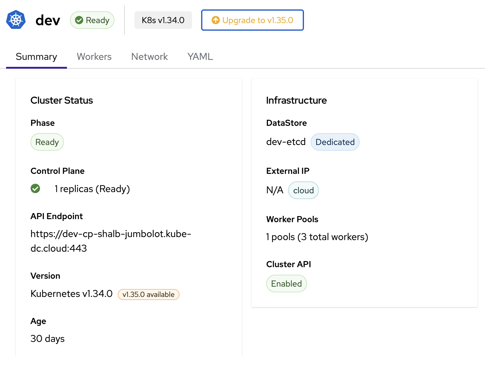

# Manage a Managed Cluster

Once your Managed Cluster is running, you can deploy workloads, expose Services, use persistent storage, scale worker pools, and manage its lifecycle.

## Getting the Kubeconfig

For workstation access, download the generated external kubeconfig. It already
contains the supported external API endpoint; do not rewrite the server field:

```bash
kubectl get secret dev-cp-admin-kubeconfig-external -n acme-production \
  -o jsonpath='{.data.admin\.conf}' | base64 -d > /tmp/dev-kubeconfig

kubectl --kubeconfig=/tmp/dev-kubeconfig get nodes
```

The cluster detail view's **Kubeconfig** action downloads the same data. If the
external Secret does not exist, the API endpoint is private. Enable external
API exposure or connect through an operator-approved private network path.

## Exposing Services (LoadBalancer)

When you create a `Service` of type `LoadBalancer` inside your Managed Cluster, the Cloud Controller Manager (CCM) provisions a real LoadBalancer service in the platform cluster, giving your application an external IP.

### How LoadBalancer Services Work

```
┌──── Managed Cluster ────┐        ┌──── Platform Cluster ─────────────┐
│  Cluster: dev           │        │  Project: production              │
│  Service (LoadBalancer) │───────▶│  Backing namespace:               │
│  my-app:3000            │  CCM   │  acme-production                  │
│                         │        │  Service + external IP            │
└─────────────────────────┘        └───────────────────────────────────┘
```

1. You create a `Service` of type `LoadBalancer` in the Managed Cluster
2. The per-cluster CCM in the Project's backing namespace watches the Managed Cluster Service
3. A corresponding LoadBalancer Service is created in the Project's backing namespace on the platform cluster
4. An external IP is allocated and reported back to the Managed Cluster service

All `service.nlb.kube-dc.com/*` and `network.kube-dc.com/*` annotations on the
Managed Cluster Service are copied to the platform-side Service, so every exposure
method from the [Service Exposure Guide](service-exposure.md) — Gateway routes
with automatic TLS, dedicated EIPs, public IPs — also works from inside a
Managed Cluster.

:::warning[Annotations are copied at creation time only]
The CCM copies annotations when it first creates the platform-side
Service. Adding or changing an annotation on an existing Managed Cluster Service has
no effect — delete and recreate the service with the annotations in place.
:::

### Example: Expose a Web Application

Inside your Managed Cluster, create a LoadBalancer service:

```yaml
apiVersion: v1
kind: Service
metadata:
  name: my-app-lb
  namespace: default
  annotations:
    network.kube-dc.com/external-network-type: "public"
spec:
  type: LoadBalancer
  ports:
    - name: http
      port: 80
      targetPort: 8080
      protocol: TCP
  selector:
    app: my-app
```

```bash
kubectl --kubeconfig=/tmp/dev-kubeconfig apply -f service.yaml
```

### Service Annotations

| Annotation | Value | Description |
|------------|-------|-------------|
| `network.kube-dc.com/external-network-type` | `public` | Allocate a public IP for the service |
| `network.kube-dc.com/external-network-type` | `cloud` | Use a cloud-internal IP (default) |

### Verify the Service

```bash
# Check the service in the Managed Cluster
kubectl --kubeconfig=/tmp/dev-kubeconfig get svc my-app-lb

# Example output:
# NAME        TYPE           CLUSTER-IP     EXTERNAL-IP    PORT(S)        AGE
# my-app-lb   LoadBalancer   10.96.201.161  100.65.0.169   80:30092/TCP   5m
```

The `EXTERNAL-IP` is reachable outside the Managed Cluster, but it is not
always internet-routable. A cloud address is reachable only from configured
platform networks; a public address is reachable from the internet.

### Working Example

A Langfuse deployment exposed via LoadBalancer in a real Managed Cluster:

```bash
$ kubectl --kubeconfig=/tmp/dev-kubeconfig get svc langfuse-web-lb -n langfuse
NAME             TYPE           CLUSTER-IP      EXTERNAL-IP    PORT(S)          AGE
langfuse-web-lb  LoadBalancer   10.96.201.161   100.65.0.169   3000:30092/TCP   15d
```

The sample `100.65.0.169` address is from the cloud network and is not
internet-routable. To request a public address, set
`network.kube-dc.com/external-network-type: public` when you first create the
Service. The resulting public address is shown in `EXTERNAL-IP`. Direct
cross-Project access to cloud addresses is blocked by default.

:::note[Public IPs count against your Organization quota]
Public EIPs are limited per Organization by your plan. If the quota is
exhausted, the Managed Cluster Service stays at `EXTERNAL-IP: <pending>` forever —
the quota error may not appear inside the Managed Cluster. Check the
dashboard's public IPv4 usage and the platform-side Service status before exposing
services with `external-network-type: public`. Cloud IPs (the default)
are not quota-limited.
:::

## Exposing Services (HTTPS Gateway Route)

For web applications, the simplest exposure method is a **Gateway route**: one
annotation gives you HTTPS with an automatically provisioned Let's Encrypt
certificate, served by the platform cluster's Envoy Gateway. This works from
inside Managed Clusters because the CCM propagates the annotations.

### Step 1: Create the ACME Issuer (once per Project)

The certificate Issuer lives in your **Project's backing namespace on the
platform cluster** (use your Kube-DC project kubeconfig, not the Managed Cluster one):

```yaml
apiVersion: cert-manager.io/v1
kind: Issuer
metadata:
  name: letsencrypt
  namespace: acme-production
spec:
  acme:
    server: https://acme-v02.api.letsencrypt.org/directory
    email: your-email@example.com  # Replace with a valid email
    privateKeySecretRef:
      name: letsencrypt-account-key
    solvers:
    - http01:
        gatewayHTTPRoute:
          parentRefs:
          - group: gateway.networking.k8s.io
            kind: Gateway
            name: eg
            namespace: envoy-gateway-system
```

Without the Issuer, HTTPS routes stay pending: the Certificate is created but
never issued.

### Step 2: Annotate a LoadBalancer service in the Managed Cluster

```yaml
apiVersion: v1
kind: Service
metadata:
  name: my-app
  namespace: default
  annotations:
    service.nlb.kube-dc.com/expose-route: "https"
    service.nlb.kube-dc.com/route-hostname: "my-app-acme-production.kube-dc.cloud"
spec:
  type: LoadBalancer
  selector:
    app: my-app
  ports:
  - port: 80
    targetPort: 80
```

:::tip[Always pin `route-hostname`]
Without `route-hostname`, the hostname is auto-generated from the
management-side service name (a UID-derived hash like
`af3d76ff…-acme-production.kube-dc.cloud`). It is hard to read **and it
changes** if the Managed Cluster Service is ever deleted and recreated. Set an
explicit hostname under the cluster's wildcard domain (or your own domain
with DNS pointed at the Gateway).
:::

### Step 3: Verify

```bash
# Certificate + route are created in the Project's backing namespace
kubectl get certificate,httproute -n acme-production

# After ~1-2 minutes:
curl https://my-app-acme-production.kube-dc.cloud
```

Issuance typically completes in one to two minutes. `http` and
`tls-passthrough` route types work the same way — see the
[Service Exposure Guide](service-exposure.md) for all annotations.

## Persistent Storage (KubeVirt CSI)

For a KubeVirt-backed Managed Cluster with KubeVirt CSI enabled, the node driver runs in the Managed Cluster and the infrastructure-side CSI controller creates DataVolumes in the Project's backing namespace. This gives Managed Cluster workloads persistent block storage backed by the platform cluster.

### How KubeVirt CSI Works

```
┌──── Managed Cluster ────┐        ┌──── Platform Cluster ─────────────┐
│                         │        │  Project: production              │
│  PVC: my-data (5Gi)     │───────▶│  DataVolume → PVC (5Gi)           │
│  StorageClass: kubevirt │  CSI   │  StorageClass: local-path         │
│                         │        │  (hotplugged to worker VM)        │
└─────────────────────────┘        └───────────────────────────────────┘
```

1. You create a PVC in the Managed Cluster using the `kubevirt` StorageClass
2. The infrastructure-side CSI controller in the Project's backing namespace creates a DataVolume on the platform cluster
3. The DataVolume is hotplugged to the worker VM where the pod is scheduled
4. The volume is mounted into the pod as a regular block device

### Example: Create a PersistentVolumeClaim

```yaml
apiVersion: v1
kind: PersistentVolumeClaim
metadata:
  name: postgres-data
  namespace: default
spec:
  accessModes:
    - ReadWriteOnce
  resources:
    requests:
      storage: 10Gi
  storageClassName: kubevirt
```

The `kubevirt` StorageClass is automatically created when KubeVirt CSI is enabled. It is set as the default StorageClass, so you can omit `storageClassName` if you prefer.

### Verify Storage

```bash
# Check PVCs in the Managed Cluster
kubectl --kubeconfig=/tmp/dev-kubeconfig get pvc -n langfuse

# Example output:
# NAME                    STATUS   VOLUME       CAPACITY   ACCESS MODES   STORAGECLASS   AGE
# clickhouse-pvc          Bound    pvc-c09...   10Gi       RWO            kubevirt       15d
# langfuse-postgres-pvc   Bound    pvc-377...   5Gi        RWO            kubevirt       15d
```

Each PVC in the Managed Cluster corresponds to a DataVolume and PVC in the Project's backing namespace on the platform cluster:

```bash
# Corresponding PVCs in the Project's backing namespace
kubectl get pvc -n acme-production | grep pvc-c09
pvc-c09c6404-63ac-4ebc-9aab-671b4583b599   Bound   pvc-2d6bb...   11362347344   RWO   local-path   15d
```

### StorageClass Parameters

The default `kubevirt` StorageClass uses the following configuration:

| Parameter | Value | Description |
|-----------|-------|-------------|
| `provisioner` | `csi.kubevirt.io` | KubeVirt CSI driver |
| `bus` | `scsi` | Disk bus type for hotplug |
| `infraStorageClassName` | `local-path` | Storage class used on the platform cluster |

### Access Modes

| Tenant PVC request | Supported | Notes |
|--------------------|-----------|-------|
| `ReadWriteOnce` (Filesystem) | ✅ Yes | The standard case. Volumes survive pod restarts and can be detached from one worker VM and hotplugged to another. With the default node-local infra storage, reattaching to a **different** worker only works when both worker VMs run on the same hypervisor host (see the [troubleshooting note](#pod-stuck-after-rescheduling-to-another-worker) below); a replicated infra class like Ceph RBD removes this restriction. |
| `ReadWriteOnce` (Block) | ✅ Yes | Raw block device inside the pod. |
| `ReadWriteMany` (Filesystem) | ❌ No | Rejected by the CSI driver (`non-block volume with RWX access mode is not supported`). Hotplugged disks cannot be safely filesystem-mounted on two VMs at once. For shared filesystems, run an in-cluster NFS/SeaweedFS on top of RWO volumes, or use S3 object storage. |
| `ReadWriteMany` (Block) | ⚠️ Advanced | Supported by the driver when the infra storage class supports RWX Block (Ceph RBD). Only for cluster-aware software that coordinates raw block access. Availability depends on the platform — ask your operator. |

### Additional Storage Classes

You can create additional Managed Cluster StorageClasses that map to any storage class
offered to your Project on the platform cluster (for example replicated
Ceph RBD instead of node-local storage):

```yaml
apiVersion: storage.k8s.io/v1
kind: StorageClass
metadata:
  name: kubevirt-rbd
provisioner: csi.kubevirt.io
parameters:
  bus: scsi
  infraStorageClassName: rbd-vm   # storage class on the platform cluster
reclaimPolicy: Delete
allowVolumeExpansion: true
```

Choose an infrastructure storage class offered in the cluster creation UI or
documented by your provider. StorageClasses are cluster-scoped and are not
listable with a Project kubeconfig.

## Scaling Workers

### Scale via kubectl

Use a **JSON patch targeting only the replica count**:

```bash
# Scale the first worker pool to 5 replicas
kubectl patch kdccluster dev -n acme-production --type=json \
  -p '[{"op":"replace","path":"/spec/workers/0/replicas","value":5}]'
```

:::danger[Never scale with a merge patch on `spec.workers`]
`spec.workers` is a **list**. A merge patch like
`--type merge -p '{"spec":{"workers":[{"name":"workers","replicas":5}]}}'`
**replaces the whole list**, silently wiping `cpuCores`, `memory`,
`diskSize` and `image` from your pool spec — new workers would then be
created with default sizing instead of yours. Always use a JSON patch
(`--type=json`) for single-field changes, or apply a full manifest that
includes every field of every pool.
:::

### Add a Worker Pool

Append a pool with JSON Patch so every existing pool, including optional
autoscaling, labels, taints, drain, and network settings, remains unchanged:

```bash
kubectl patch kdccluster dev -n acme-production --type=json -p '[
  {"op":"add","path":"/spec/workers/-","value":{
    "name":"highmem-pool",
    "replicas":2,
    "cpuCores":4,
    "memory":"16Gi",
    "diskSize":"30Gi",
    "image":"docker.io/shalb/ubuntu-2404-container-disk:v1.36.1",
    "architecture":"amd64",
    "infrastructureProvider":"kubevirt",
    "storageType":"datavolume"
  }}
]'
```

Provisioning time varies with image import, quota, and node readiness. Watch the
`KdcCluster` status instead of relying on a fixed duration.

### Scale to Zero

A worker pool can reach zero only while another pool has Ready workers. This
guard prevents the last available worker pool from being stopped:

```bash
kubectl patch kdccluster dev -n acme-production --type=json \
  -p '[{"op":"replace","path":"/spec/workers/0/replicas","value":0}]'
```

The control plane remains accessible. Scale the pool back up before removing or
stopping the other Ready pool.

### Autoscaling a Worker Pool

Instead of scaling by hand, a pool can add nodes on its own when workloads
do not fit. The model is the same as an EKS node group: `replicas` is still
the desired node count, and the platform moves it between `minReplicas` and
`maxReplicas`.

Enable it from the **Workers** tab of the cluster in the console (On/Off,
Min, Max), or with kubectl:

```bash
kubectl patch kdccluster dev -n acme-production --type=json -p '[
  {"op":"add","path":"/spec/workers/0/autoscaling",
   "value":{"enabled":true,"minReplicas":2,"maxReplicas":8}}
]'
```

:::note[`replicas` must be inside the bounds]
While autoscaling is enabled, `replicas` has to be within
`[minReplicas, maxReplicas]`. If the pool's current count is outside the
bounds you are setting, change both in the same patch — the console does
this for you automatically.
:::

**What causes a node to be added:** a pod is `Pending` because the scheduler
could not place it, and that pod's CPU/memory requests would fit on a new
node of this pool. Pods a new node cannot help are ignored — a pod waiting
on a PersistentVolumeClaim, a pod requesting more resources than one node of
this pool provides, or a pod pinned by node affinity elsewhere.

**In the default mode, nodes are only added, never removed.** To shrink a
pool, lower `replicas` (or `maxReplicas`) yourself — or switch the pool to
full autoscaling, below.

#### Removing idle nodes (full autoscaling)

Set `mode: ClusterAutoscaler` to hand the pool's node count entirely to the
platform. It still adds nodes for pending pods, and additionally **removes a
node** after it has been idle for the stabilization window — pods are drained
safely (respecting PodDisruptionBudgets) before the node is deleted. In the
console this is the **"Add & remove nodes"** choice on the pool card, with a
**"Remove idle nodes"** switch.

```bash
kubectl patch kdccluster dev -n acme-production --type=json -p '[
  {"op":"add","path":"/spec/workers/0/autoscaling",
   "value":{"enabled":true,"mode":"ClusterAutoscaler",
            "minReplicas":2,"maxReplicas":8,
            "behavior":{"scaleDown":{"enabled":true,
                                     "stabilizationWindowSeconds":600}}}}
]'
```

Things to know in this mode:

- **The node count is platform-managed.** Do not set `replicas` by hand — the
  platform owns it and will move it between the bounds. The console disables
  the manual scale control for such pools.
- **`minReplicas` must be at least 1.** Scale-to-zero is not available.
- **Scale-down is per pool, and OFF until you ask for it.** Selecting this mode
  does not by itself remove anything: `behavior.scaleDown.enabled` must be set
  to `true`. Left false (or with the block omitted) the pool is grow-only — it
  still ADDS nodes for pending pods, which is what distinguishes this from
  pinning `minReplicas = maxReplicas`, where nothing moves in either direction.
  One pool can shrink while a sibling never does.
- `behavior.scaleDown.stabilizationWindowSeconds` is how long a node must sit
  below the threshold before removal (default 10 minutes);
  `behavior.scaleDown.utilizationThreshold` is that threshold as a percentage
  (default 50); `cooldownSeconds` sets the quiet period after a scale-up before
  any removal is considered.
- **"Idle" means requests, not live load.** A node qualifies when the CPU and
  memory *reserved by its pods* fall below the threshold, so a node running at
  5% CPU whose pods reserve 80% of it is not removable.

**Scale-up tuning does not apply in this mode.** `metrics[]` and
`behavior.scaleUp` are read only by `mode: Builtin`. Under
`ClusterAutoscaler`, nodes are added when pods cannot be scheduled — upstream
has no utilisation trigger and no per-step cap, so the stabilization window,
`maxNodesPerStep` and the scale-up cooldown below are ignored here. Use
`mode: Builtin` if you want CPU/memory-driven scale-up.

Under `mode: Builtin`, scale-ups are deliberately unhurried: demand must
persist for about two minutes, at most two nodes are added per step, and there
is a cooldown of five minutes between steps. Tune per pool if needed:

```yaml
autoscaling:
  enabled: true
  minReplicas: 2
  maxReplicas: 8
  behavior:
    scaleUp:
      stabilizationWindowSeconds: 120
      maxNodesPerStep: 2
      cooldownSeconds: 300
```

#### Why didn't my pool grow?

The console shows the reason on the pool card. From kubectl:

```bash
kubectl get kdccluster dev -n acme-production \
  -o jsonpath='{.status.workerPools[0].autoscaling}'
```

```json
{
  "mode": "PendingPods",
  "minReplicas": 2,
  "maxReplicas": 8,
  "lastScaleTime": "2026-07-31T13:49:24Z",
  "lastScaleReason": "3 unschedulable pod(s) fit this pool; +1 node(s)",
  "limitedBy": ""
}
```

`limitedBy` is empty when nothing is holding the pool back. Otherwise:

| `limitedBy` | What it means |
|---|---|
| `Max` | The pool is at `maxReplicas`. Raise it to allow more nodes. |
| `Quota` | Your Organization or Project quota would be exceeded. |
| `Placement` | The infrastructure could not place another node right now. |
| `RollingUpdate` | An upgrade or rollout is in progress; scaling resumes afterwards. |

## Upgrading Kubernetes Version

A Managed Cluster upgrade updates the control plane first and then replaces
workers using a rolling strategy. Plan a maintenance window: application
availability depends on replicas, disruption budgets, spare capacity, and
storage topology.

### Choose a Supported Version

The table below is an example catalog and can age between documentation
releases. Use the dashboard's version selector as the source of truth, and
choose the exact worker image paired with the target control-plane version.

| Version | Worker Image | Status |
|---------|-------------|--------|
| v1.36.1 | `docker.io/shalb/ubuntu-2404-container-disk:v1.36.1` | Latest |
| v1.35.0 | `docker.io/shalb/ubuntu-2404-container-disk:v1.35.2` | Supported |
| v1.34.0 | `quay.io/capk/ubuntu-2404-container-disk:v1.34.1` | Supported |

### Upgrade via Dashboard

When an upgrade is available, the cluster detail page shows an **Upgrade to vX.Y.Z** button in the header and a version badge in the Summary tab.



1. Open the cluster detail page in the dashboard
2. Click the **Upgrade to vX.Y.Z** button next to the version badge
3. Review the confirmation dialog — it shows the target version and worker image
4. Click **Upgrade** to start the rolling upgrade

The upgrade progress is visible in the cluster status. The phase will change during the upgrade and return to **Ready** once complete.

### Upgrade via kubectl

**Step 1: Check current version**

```bash
kubectl get kdccluster dev -n acme-production
# NAME   VERSION   PHASE   ENDPOINT   DATASTORE   AGE
# dev    v1.34.0   Ready   ...        dev-etcd    29d
```

**Step 2: Upgrade version and worker image**

Patch both `spec.version` and the worker image in a single command:

```bash
kubectl patch kdccluster dev -n acme-production --type=json -p '[
  {"op":"replace","path":"/spec/version","value":"v1.35.0"},
  {"op":"replace","path":"/spec/workers/0/image","value":"docker.io/shalb/ubuntu-2404-container-disk:v1.35.2"}
]'
```

For clusters with multiple worker pools, update each pool's image:

```bash
kubectl patch kdccluster dev -n acme-production --type=json -p '[
  {"op":"replace","path":"/spec/version","value":"v1.35.0"},
  {"op":"replace","path":"/spec/workers/0/image","value":"docker.io/shalb/ubuntu-2404-container-disk:v1.35.2"},
  {"op":"replace","path":"/spec/workers/1/image","value":"docker.io/shalb/ubuntu-2404-container-disk:v1.35.2"}
]'
```

**Step 3: Monitor the upgrade**

The platform first reconciles the control plane, then replaces workers with the
catalog-paired image. Completion time depends on image pulls, node readiness,
workload disruption constraints, and available Project quota.

```bash
# Watch cluster status
kubectl get kdccluster dev -n acme-production -w

# Watch worker-pool rollout through the Project-visible resource
kubectl get machinedeployments -n acme-production -w
```

During the worker rollout, old and new Machines can coexist. Keep enough quota
for surge capacity and verify application replicas and disruption budgets;
single-replica or node-local workloads can be interrupted.

**Step 4: Verify the upgrade**

```bash
# Check cluster version
kubectl get kdccluster dev -n acme-production
# NAME   VERSION   PHASE   ...
# dev    v1.35.0   Ready   ...

# Check node versions inside the Managed Cluster
kubectl --kubeconfig=/tmp/dev-kubeconfig get nodes -o wide
# NAME                    STATUS   VERSION   CONTAINER-RUNTIME
# dev-workers-xxx-yyy     Ready    v1.35.2   containerd://2.2.2
```

### Important Notes

- **Sequential minor versions only** — You must upgrade one minor version at a time (e.g., v1.34 → v1.35). Skipping versions is not supported.
- **No downgrades** — Kubernetes version downgrades are not supported. The system will reject any attempt to lower the version.
- **Rolling replacement** — A new worker is created before an old worker is removed. Keep multiple application replicas, suitable disruption budgets, and enough spare quota; the platform does not guarantee uninterrupted workloads.
- **Image must match version** — Always update the worker image alongside the version. The image contains the matching kubelet and kubeadm binaries.

## Deleting a Cluster

### Delete via Dashboard

Navigate to the cluster detail page and use the delete action.

### Delete via kubectl

```bash
kubectl delete kdccluster dev -n acme-production
```

Deletion is fully automated. The controller removes resources in the correct order:

1. Worker nodes (MachineDeployments, VMs)
2. Control plane (TenantControlPlane)
3. Cluster API resources
4. CCM deployment
5. Services and EIPs
6. Dedicated datastore (if applicable)

:::warning
Deleting a cluster is irreversible. All workloads, services, and data inside the cluster will be permanently removed. Back up any important data before deleting.
:::

## Troubleshooting


### Cluster Stuck in Provisioning

```bash
# Check events in the Project backing namespace
kubectl get events -n acme-production --sort-by='.lastTimestamp' | tail -20

# Check KdcCluster status
kubectl describe kdccluster dev -n acme-production

# Check control plane pods
kubectl get pods -n acme-production -l kamaji.clastix.io/name=dev-cp
```

### Workers Not Joining

```bash
# Check MachineDeployment status
kubectl get machinedeployments -n acme-production


# Check worker VM status
kubectl get vmi -n acme-production
```

### Service Not Getting External IP

```bash
# Verify CCM is running
kubectl get deploy -n acme-production -l k8s-app=kccm-dev

# Check CCM logs
kubectl logs -n acme-production -l k8s-app=kccm-dev

# Verify the service annotation in Managed Cluster
kubectl --kubeconfig=/tmp/dev-kubeconfig get svc my-app-lb -o yaml | grep -A2 annotations
```

### PVC Stuck in Pending

```bash
# Check the CSI controller logs on the platform cluster
kubectl logs -n acme-production -l app=kubevirt-csi-driver --all-containers

# Check the DataVolume import on the platform cluster
kubectl get dv -n acme-production

# Check the CSI node daemonset in the Managed Cluster
kubectl --kubeconfig=/tmp/dev-kubeconfig get pods -n kubevirt-csi-driver

# Verify StorageClass exists in Managed Cluster
kubectl --kubeconfig=/tmp/dev-kubeconfig get storageclass
```

A PVC requesting `ReadWriteMany` with Filesystem mode stays `Pending` with the
event `non-block volume with RWX access mode is not supported` — this is by
design, see [Access Modes](#access-modes).

### Pod Stuck in ContainerCreating (`couldn't find device by serial id`)

Volume hotplug into a worker VM is **batched per VM**: while any pending
volume on the same worker cannot finish provisioning (for example a stuck
DataVolume import), KubeVirt waits before attaching the other volumes to that
VM too. Already-bound volumes then fail to mount with `couldn't find device by
serial id` until the broken sibling is resolved.

Fix the failing PVC first (check `kubectl get dv -n acme-production` on the
platform cluster for `ImportInProgress` with restarts) or delete it — the
healthy volumes can attach when the controller retries.

### Pod Stuck After Rescheduling to Another Worker

With the default `kubevirt` StorageClass, the backing disk lives on
**node-local storage of the hypervisor host** where it was first provisioned.
If your pod is later rescheduled to a worker VM running on a *different*
hypervisor host, the volume cannot follow: on the platform cluster the
hotplug helper pod reports
`didn't match PersistentVolume's node affinity`, and inside the Managed
Cluster the pod hangs in `ContainerCreating` with
`couldn't find device by serial id`.

Identify the worker on the disk's original hypervisor host. Leave that
known-good worker schedulable, cordon every other candidate, and wait for the
replacement Pod to become Ready there before restoring normal scheduling:

```bash
# Do not include <known-good-worker> in this list.
kubectl --kubeconfig=/tmp/dev-kubeconfig cordon <other-worker-1> <other-worker-2>
kubectl --kubeconfig=/tmp/dev-kubeconfig delete pod <stuck-pod>
kubectl --kubeconfig=/tmp/dev-kubeconfig get pods -l app=<label> -w -o wide

# After the replacement is Ready on <known-good-worker>:
kubectl --kubeconfig=/tmp/dev-kubeconfig uncordon <other-worker-1> <other-worker-2>
```

For workloads that must survive rescheduling to any worker, use a Managed Cluster
StorageClass backed by replicated storage (see
[Additional Storage Classes](#additional-storage-classes)) if your platform
offers one.

## End-to-End Example: WordPress

A complete stateful application — MariaDB and WordPress on persistent volumes,
exposed over HTTPS through the platform cluster's Gateway. Apply inside the
Managed Cluster (the ACME Issuer from
[Exposing Services (HTTPS Gateway Route)](#exposing-services-https-gateway-route)
must exist in your Project). Create the namespace and generate unique database
credentials before applying the workload manifest:

```bash
kubectl --kubeconfig=/tmp/dev-kubeconfig create namespace wordpress
kubectl --kubeconfig=/tmp/dev-kubeconfig -n wordpress create secret generic mariadb-auth \
  --from-literal=root-password="$(openssl rand -base64 24)" \
  --from-literal=password="$(openssl rand -base64 24)"
```

Save the remaining resources as `wordpress.yaml`:

```yaml
apiVersion: v1
kind: PersistentVolumeClaim
metadata:
  name: mariadb-data
  namespace: wordpress
spec:
  accessModes: ["ReadWriteOnce"]
  resources:
    requests:
      storage: 5Gi
---
apiVersion: v1
kind: PersistentVolumeClaim
metadata:
  name: wordpress-data
  namespace: wordpress
spec:
  accessModes: ["ReadWriteOnce"]
  resources:
    requests:
      storage: 5Gi
---
apiVersion: apps/v1
kind: Deployment
metadata:
  name: mariadb
  namespace: wordpress
spec:
  replicas: 1
  strategy:
    type: Recreate
  selector:
    matchLabels:
      app: mariadb
  template:
    metadata:
      labels:
        app: mariadb
    spec:
      containers:
      - name: mariadb
        image: mariadb:11.4
        env:
        - name: MARIADB_ROOT_PASSWORD
          valueFrom: {secretKeyRef: {name: mariadb-auth, key: root-password}}
        - name: MARIADB_DATABASE
          value: wordpress
        - name: MARIADB_USER
          value: wordpress
        - name: MARIADB_PASSWORD
          valueFrom: {secretKeyRef: {name: mariadb-auth, key: password}}
        ports:
        - containerPort: 3306
        volumeMounts:
        - name: data
          mountPath: /var/lib/mysql
      volumes:
      - name: data
        persistentVolumeClaim:
          claimName: mariadb-data
---
apiVersion: v1
kind: Service
metadata:
  name: mariadb
  namespace: wordpress
spec:
  selector:
    app: mariadb
  ports:
  - port: 3306
---
apiVersion: apps/v1
kind: Deployment
metadata:
  name: wordpress
  namespace: wordpress
spec:
  replicas: 1
  strategy:
    type: Recreate
  selector:
    matchLabels:
      app: wordpress
  template:
    metadata:
      labels:
        app: wordpress
    spec:
      containers:
      - name: wordpress
        image: wordpress:6-apache
        env:
        - name: WORDPRESS_DB_HOST
          value: mariadb.wordpress.svc.cluster.local
        - name: WORDPRESS_DB_NAME
          value: wordpress
        - name: WORDPRESS_DB_USER
          value: wordpress
        - name: WORDPRESS_DB_PASSWORD
          valueFrom: {secretKeyRef: {name: mariadb-auth, key: password}}
        ports:
        - containerPort: 80
        volumeMounts:
        - name: data
          mountPath: /var/www/html
      volumes:
      - name: data
        persistentVolumeClaim:
          claimName: wordpress-data
---
apiVersion: v1
kind: Service
metadata:
  name: wordpress
  namespace: wordpress
  annotations:
    service.nlb.kube-dc.com/expose-route: "https"
    service.nlb.kube-dc.com/route-hostname: "wordpress-acme-production.kube-dc.cloud"
spec:
  type: LoadBalancer
  selector:
    app: wordpress
  ports:
  - port: 80
    targetPort: 80
```

```bash
kubectl --kubeconfig=/tmp/dev-kubeconfig apply -f wordpress.yaml
```

Wait for the PVCs, worker-disk attachments, certificate, and HTTPRoute to
report Ready before opening the configured hostname. Data survives Pod
restarts; for rescheduling across workers, read the
[placement caveat](#pod-stuck-after-rescheduling-to-another-worker) of the
default storage class.

## Quick Reference

| Operation | Command |
|-----------|---------|
| List clusters | `kubectl get kdccluster -n acme-production` |
| Get cluster details | `kubectl describe kdccluster dev -n acme-production` |
| Get kubeconfig | `kubectl get secret dev-cp-admin-kubeconfig-external -n acme-production -o jsonpath='{.data.admin\.conf}' \| base64 -d` (see [Getting the Kubeconfig](#getting-the-kubeconfig)) |
| Check endpoint | `kubectl get kdccluster dev -n acme-production -o jsonpath='{.status.endpoint}'` |
| Scale workers | `kubectl patch kdccluster dev -n acme-production --type=json -p '[{"op":"replace","path":"/spec/workers/0/replicas","value":5}]'` |
| Enable autoscaling | `kubectl patch kdccluster dev -n acme-production --type=json -p '[{"op":"add","path":"/spec/workers/0/autoscaling","value":{"enabled":true,"minReplicas":2,"maxReplicas":8}}]'` |
| Enable autoscaling with node removal | `kubectl patch kdccluster dev -n acme-production --type=json -p '[{"op":"add","path":"/spec/workers/0/autoscaling","value":{"enabled":true,"mode":"ClusterAutoscaler","minReplicas":2,"maxReplicas":8,"behavior":{"scaleDown":{"enabled":true}}}}]'` |
| Check autoscaling state | `kubectl get kdccluster dev -n acme-production -o jsonpath='{.status.workerPools[0].autoscaling}'` |
| Delete cluster | `kubectl delete kdccluster dev -n acme-production` |
| Check datastore | `kubectl get kdcclusterdatastores -n acme-production` |

## Next Steps

- [Provisioning a Cluster](provisioning-cluster.md)
- [Service Exposure Guide](service-exposure.md) — More on networking and service exposure
- [Block Storage](block-storage.md) — Additional storage options
