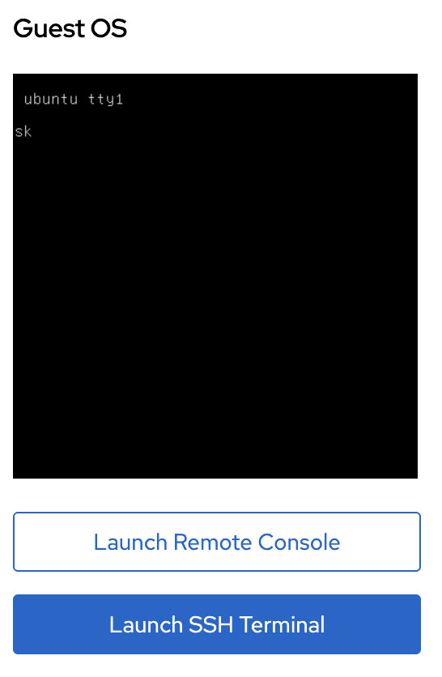

# Connecting to Your VM

This guide covers supported ways to access a virtual machine in Kube-DC: browser consoles, direct SSH, and serial or VNC sessions.

## Prerequisites

- A running [Virtual Machine](creating-vm.md)
- [CLI access](cli-kubeconfig.md) configured for kubectl/virtctl methods

---

## Console Access via UI

The Console UI provides instant browser-based access to your VMs — no SSH keys or network configuration required.

### Launch Browser Console

1. Navigate to **Virtual Machines** in your project
2. Click on your VM name to open the details page
3. Click **Launch Remote Console** for graphical VNC access, or **Launch SSH Terminal** for a browser-based SSH session



**Remote Console** opens a VNC session in your browser — useful for VMs with desktop environments or when you need to access the boot process or BIOS.

**SSH Terminal** opens a web-based terminal connected via SSH — works if the VM has the QEMU guest agent running and SSH keys configured.

:::tip VNC User Access
For VNC access with password authentication:
1. Access the VM via SSH or serial console
2. Create a user with `useradd -m <username>`
3. Set a password with `passwd <username>`
4. The user can now log in via the VNC console using these credentials
:::

---

## SSH Access via Floating IP

For direct SSH access from your local machine, assign a [Floating IP](public-floating-ips.md) to your VM:

```yaml
apiVersion: kube-dc.com/v1
kind: FIp
metadata:
  name: my-vm-fip
spec:
  externalNetworkType: public
  vmTarget:
    vmName: ubuntu
    interfaceName: vpc_net_0
```

```bash
kubectl apply -f fip.yaml
kubectl get fip my-vm-fip
```

Once the FIP is Ready, SSH directly to the external IP:

```bash
ssh ubuntu@91.224.11.16
```

See [Deploying VMs](creating-vm.md#exposing-vms-with-floating-ips) for complete FIP configuration.

---

## SSH Access via LoadBalancer

To expose SSH without using a Floating IP, create a LoadBalancer service.

### Using Default Gateway EIP

For projects with `egressNetworkType: public`, the default gateway EIP is public:

```yaml
apiVersion: v1
kind: Service
metadata:
  name: vm-ssh
  annotations:
    service.nlb.kube-dc.com/bind-on-default-gw-eip: "true"
spec:
  type: LoadBalancer
  selector:
    vm.kubevirt.io/name: ubuntu
  ports:
  - name: ssh
    port: 2222
    targetPort: 22
```

### Using Dedicated Public EIP

For projects with `egressNetworkType: cloud`, create a dedicated public EIP:

```yaml
apiVersion: kube-dc.com/v1
kind: EIp
metadata:
  name: vm-ssh-eip
spec:
  externalNetworkType: public
---
apiVersion: v1
kind: Service
metadata:
  name: vm-ssh
  annotations:
    service.nlb.kube-dc.com/bind-on-eip: "vm-ssh-eip"
spec:
  type: LoadBalancer
  selector:
    vm.kubevirt.io/name: ubuntu
  ports:
  - name: ssh
    port: 2222
    targetPort: 22
```

```bash
kubectl apply -f vm-ssh-service.yaml
kubectl get svc vm-ssh
```

Connect using the LoadBalancer IP and custom port:

```bash
ssh -p 2222 ubuntu@<loadbalancer-ip>
```

For more options, see the [Service Exposure Guide](service-exposure.md).

---

## VirtCtl Console Access

The `virtctl` CLI provides direct serial console access without network connectivity — useful for troubleshooting network issues or accessing VMs during boot.

### Install virtctl

Install a `virtctl` release compatible with the platform KubeVirt version. Follow the [official KubeVirt installation guide](https://kubevirt.io/user-guide/user_workloads/virtctl_client_tool/), which covers release binaries and the Krew plugin.

### Serial Console

```bash
# Open interactive console (press Ctrl+] to exit)
virtctl console ubuntu

```

### VNC Session

```bash
# Open the session in the configured VNC viewer
virtctl vnc ubuntu
```

To connect a viewer yourself, keep a proxy open on a known local port:

```bash
virtctl vnc ubuntu --proxy-only --port 5900
```

Then connect the viewer to `localhost:5900`.

### Kubernetes API tunneling

Standard Project roles do not include
`virtualmachineinstances/portforward`. Consequently, `virtctl ssh` and
`virtctl port-forward` are not tenant access methods on Kube-DC. Use the
browser SSH terminal, a Floating IP, or a LoadBalancer Service instead.
Platform operators can use API tunneling only when they hold a separate
diagnostic role that grants the subresource explicitly.

---

## Connection Method Comparison

| Method | Use Case | Requires Network | Requires Public IP |
|--------|----------|------------------|-------------------|
| **Console UI (VNC)** | GUI access, troubleshooting boot | No | No |
| **Console UI (SSH)** | Quick terminal access | No | No |
| **Floating IP** | Direct SSH from anywhere | Yes | Yes |
| **LoadBalancer** | Shared IP, custom port | Yes | Optional |
| **virtctl console** | Serial console, boot access | No | No |
| **virtctl vnc** | VNC via API tunnel | No | No |

---

## Troubleshooting

### SSH Connection Refused

- Verify guest agent is running: `kubectl get vmi ubuntu -o jsonpath='{.status.conditions[?(@.type=="AgentConnected")].status}'`
- Check if SSH keys are injected: `virtctl console ubuntu` and verify `~/.ssh/authorized_keys`
- Confirm SSH daemon is running inside the VM: `systemctl status sshd`

### VNC Console Black Screen

- VM may still be booting — wait for ReadinessProbe to show True: `kubectl get vm ubuntu -o jsonpath='{.status.ready}'`
- Check if the VM has a graphical environment installed
- Try accessing via serial console: `virtctl console ubuntu`

### Cannot Access via Floating IP

- Verify FIP status: `kubectl get fip -o wide`
- Check if `externalIP` is assigned and `ready: true`
- Test connectivity from the VM to external network: `virtctl console ubuntu` then `ping 8.8.8.8`

---

## Next Steps

- [Managing VM Lifecycle](vm-lifecycle.md) — Start, stop, restart VMs
- [Public & Floating IPs](public-floating-ips.md) — Manage IP addresses
- [Service Exposure](service-exposure.md) — Expose VM services with HTTPS
