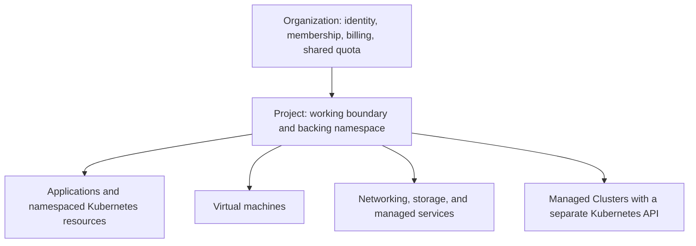

import {CloudResourceModelDiagram} from '@site/src/components/Diagram/ResourceModelDiagrams';

# Core concepts

Kube-DC uses **Organizations** and **Projects** to connect identity,
authorization, networking, resource governance, and billing to the workloads
you deploy. This page explains that model. It also explains the choice you make
before each deployment: run the workload *in your Project*, or *in a Managed
Cluster*. Those two ideas cover most of what you need to use the platform.

## The resource model

Diagram source for GitHub

<CloudResourceModelDiagram />

### Organization: identity and billing scope

An **Organization** represents a customer account, a company, or a team. It
owns:

- An organization-scoped identity realm. Single sign-on runs on Keycloak and
  accepts optional external identity providers.
- Membership and role assignments. Invite a user once, then grant per-Project
  roles.
- Projects.
- Billing and aggregated resource usage.

The Organization is the *account* boundary, not the workload boundary. Workload
access, networking, and resource limits apply at Project scope.

### Project: the working boundary

A **Project** is a governed Kubernetes application environment on the shared
platform cluster. Teams commonly create one Project per environment, such as
`production`, `staging`, and `dev`. One Project per application or per customer
also works.

Each Project provides:

- A dedicated backing namespace named `{organization}-{project}`
- Project-scoped RBAC with the Admin, Developer, Project Manager, and User
  roles, plus any custom roles you define
- A private network (VPC) with platform-managed traffic controls
- An optional quota for CPU, memory, storage, and other resources
- A kubeconfig for direct Kubernetes API access

A Project is **not** a tenant Kubernetes cluster. Its users share the platform
API server and the platform-operated controllers. They work inside the backing
namespace, the RBAC, the network, and the security boundaries assigned to the
Project. In exchange, the Project is ready the moment it exists. There is no
cluster to provision or operate. See [Projects](kubernetes-projects.md).

### Resources that belong to a Project

- Deployments, StatefulSets, DaemonSets, Pods, and Jobs
- Services, Ingresses, and Gateway API routes
- Persistent volume claims and S3-compatible object buckets
- Linux and Windows virtual machines
- External IPs, floating IPs, and load balancers
- Managed services from the provider catalog
- Certificates, secrets, KMS keys, and database credential policies
- Managed Clusters and platform-managed protection services

## Choose a deployment mode

Kube-DC gives you two ways to run Kubernetes workloads. Choose one for each
workload before you deploy it. The following table compares them:

| Property | Project (default) | Managed Cluster |
|---|---|---|
| Control boundary | One governed backing namespace on the shared platform cluster | A tenant-controlled Kubernetes control plane |
| Best for | Applications, services, storage, jobs, and VMs that use supported namespaced APIs | Operators, platform stacks, multiple namespaces, cluster-level customization |
| Access | Project kubeconfig, available as soon as the Project exists | Cluster kubeconfig, available after the control plane and workers are ready |
| Extensibility | Platform-installed APIs and supported namespaced resources | Full Kubernetes: CRDs, webhooks, operators, cluster RBAC |
| You operate | Nothing below your workloads | Worker pool sizing and upgrade timing |

:::tip Selection rule
Choose a **Project** for application deployments and VMs whose manifests use
supported namespaced APIs and unprivileged pods.

Choose a **Managed Cluster** when the software installs operators or CRDs,
creates cluster-scoped resources, spans multiple namespaces, or needs
privileged or host-level access.
:::

The two modes are separate deployment targets. To move a workload from a
Project to a Managed Cluster, you redeploy it against a new API endpoint. Helm
release state, persistent data, IP addresses, and DNS endpoints each need an
explicit migration plan. Make the choice before you deploy.

## How isolation works

Isolation in Kube-DC is layered, and each layer has a precise scope. The
following table lists the layers:

| Layer | Scope | Mechanism |
|---|---|---|
| Identity | Organization | Organization-scoped SSO realm; Projects grant roles within it |
| Authorization | Project | Dedicated backing namespace with per-role RBAC |
| Network | Project | A VPC per Project on the platform SDN |
| Capacity | Project and Organization | Optional per-Project quotas within your plan |
| Billing | Organization | One plan and one invoice across all Projects |

### Project networks

- Platform-managed VPC controls block cross-Project routing by default. A VM or
  pod in `production` cannot reach one in `staging` until you expose it,
  even inside the same Organization.
- Separate Projects can reuse the same internal CIDR ranges without conflict,
  in the same way as VPCs at a public cloud.
- External reachability is explicit. Attach external IPs, floating IPs, or
  LoadBalancer Services to bring traffic in. Egress leaves through your
  Project's gateway.

The platform operates the traffic controls on the shared cluster. Tenants do
not author `NetworkPolicy` resources in Projects.

## Kubernetes-native APIs

Kube-DC represents its cloud services as platform-installed Kubernetes APIs.
You create *instances* of those resources in your Project, such as a database,
a certificate, or a public IP. You do not create the CRD definitions
themselves.

You can manage a Project with:

- `kubectl` and the Kubernetes API
- Compatible Helm charts
- Terraform, through the Kubernetes provider
- The web console and the `kube-dc` CLI
- An externally operated Argo CD or Flux, pointed at the Project kubeconfig
- AI coding assistants, through [agent skills](ai-ide-integration.md)

A Helm chart is **compatible** when all four of these are true:

1. It uses Kubernetes APIs that the Project supports.
2. It stays inside the Project's backing namespace.
3. It needs only verbs granted to the installing user.
4. It complies with the Project pod-security policy.

Projects do not support charts that create CRDs, cluster-scoped RBAC, admission
webhooks, StorageClasses, NetworkPolicies, CronJobs, or workloads that need
privileged or host access. Use a Managed Cluster for those. For the full
boundary, and for how to check a chart before you install it, see
[Projects](kubernetes-projects.md).

Project backing namespaces block `kubectl exec` and `kubectl attach` by design.
Use `kubectl logs`, and run administrative tasks as Jobs. Project
administrators can define custom namespaced Roles within their own authority. A
namespaced Role can never grant cluster-scoped resources, and admission policy
enforces the exec restriction even for custom roles.

## Next steps

- [Projects](kubernetes-projects.md) describes the default way to deploy.
- [Create your first Project](first-project.md) walks through the first Project.
- [Provision a Managed Cluster](provisioning-cluster.md) covers the
  cluster-scoped path.
