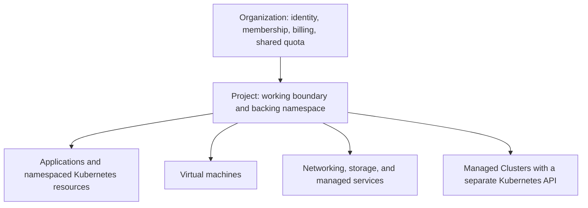

# Core Concepts

Kube-DC uses **Organizations** and **Projects** to connect identity, authorization, networking, resource governance and billing to the workloads you deploy. Understanding this model — and the upfront choice between running a workload *in your Project* or *in a Managed Cluster* — is most of what you need to use the platform well.

## The resource model

### Organization — identity and billing scope

An **Organization** represents a customer account, company or team. It owns:

- An organization-scoped identity realm (SSO via Keycloak, with optional external identity providers)
- Membership and role assignments — invite users once, then grant per-Project roles
- Projects
- Billing and aggregated resource usage

The Organization is the *account* boundary, not the workload boundary: workload access, networking and resource limits are applied at Project scope.

### Project — the working boundary

A **Project** is a governed Kubernetes application environment on the shared platform cluster. Teams commonly create one Project per environment — `production`, `staging`, `dev` — or per application or customer.

Each Project provides:

- A dedicated backing namespace named `{organization}-{project}`
- Project-scoped RBAC (Admin, Developer, Project Manager, User — plus custom roles)
- A private network (VPC) with platform-managed traffic controls
- An optional quota for CPU, memory, storage and other resources
- A kubeconfig for direct Kubernetes API access

A Project is **not** a tenant Kubernetes cluster: its users share the platform API server and platform-operated controllers, working within the backing namespace, RBAC, network and security boundaries assigned to the Project. What makes it valuable is the flip side of that fact — it is ready the moment it exists, with no cluster to provision or operate. See [Projects](kubernetes-projects.md).

### Resources — what belongs to a Project

- Deployments, StatefulSets, DaemonSets, Pods and Jobs
- Services, Ingresses and Gateway API routes
- Persistent volume claims and S3-compatible object buckets
- Linux and Windows virtual machines
- External IPs, floating IPs and load balancers
- Managed PostgreSQL and MariaDB databases
- Certificates, secrets, KMS keys and database credential policies
- Managed Clusters and platform-managed protection services

## Choose a deployment mode

Kube-DC gives you two ways to run Kubernetes workloads. Choose per workload, before deploying:

| | **Project** (default) | **Managed Cluster** |
|---|---|---|
| Control boundary | One governed backing namespace on the shared platform cluster | A tenant-controlled Kubernetes control plane |
| Best for | Applications, services, storage, jobs and VMs using supported namespaced APIs | Operators, platform stacks, multiple namespaces, cluster-level customization |
| Access | Project kubeconfig — available as soon as the Project exists | Cluster kubeconfig — after the control plane and workers are ready |
| Extensibility | Platform-installed APIs and supported namespaced resources | Full Kubernetes: CRDs, webhooks, operators, cluster RBAC |
| You operate | Nothing below your workloads | Worker pool sizing and upgrade timing |

:::tip Selection rule
**Choose a Project** for application deployments and VMs whose manifests use supported namespaced APIs and unprivileged pods.
**Choose a Managed Cluster** when the software installs operators or CRDs, creates cluster-scoped resources, spans multiple namespaces, or requires privileged or host-level access.
:::

The modes are separate deployment targets. Switching from a Project to a Managed Cluster means redeploying against a new API endpoint — Helm release state, persistent data, IP addresses and DNS endpoints need an explicit migration plan. That is why the choice is made upfront, per workload.

## How isolation works

Isolation in Kube-DC is layered, and each layer has a precise scope:

| Layer | Scope | Mechanism |
|---|---|---|
| Identity | Organization | Organization-scoped SSO realm; Projects grant roles within it |
| Authorization | Project | Dedicated backing namespace with per-role RBAC |
| Network | Project | A VPC per Project on the platform SDN |
| Capacity | Project / Organization | Optional per-Project quotas within your plan |
| Billing | Organization | One plan and invoice across all Projects |

### Project networks

- Platform-managed VPC controls prevent cross-Project routing by default — a VM or pod in `production` cannot reach one in `staging` unless you explicitly expose it, even within the same Organization.
- Separate Projects can reuse the same internal CIDR ranges without conflict, like VPCs at a public cloud.
- External reachability is explicit: attach external IPs, floating IPs or LoadBalancer services to bring traffic in; egress leaves through your Project's gateway.

Traffic controls on the shared platform are operated by the platform — tenants do not author `NetworkPolicy` resources in Projects.

## Kubernetes-native APIs

Kube-DC represents its cloud services as platform-installed Kubernetes APIs. You create *instances* of those resources in your Project — a database, a certificate, a public IP — without creating the CRD definitions themselves.

A Project can be managed with:

- `kubectl` and the Kubernetes API
- **Compatible Helm charts**
- Terraform, through the Kubernetes provider
- The web console and the `kube-dc` CLI
- An externally operated Argo CD or Flux targeting the Project kubeconfig
- AI coding assistants, via [agent skills](ai-ide-integration.md)

A **compatible** Helm chart renders resources that (1) use Kubernetes APIs supported in the Project, (2) stay within the Project's backing namespace, (3) require only verbs granted to the installing user, and (4) comply with Project pod-security policy. Charts that create CRDs, cluster-scoped RBAC, admission webhooks, StorageClasses, NetworkPolicies, CronJobs, or privileged/host-access workloads are not supported in Projects — use a Managed Cluster for those. See [Projects](kubernetes-projects.md) for the full boundary and how to check a chart before installing.

`kubectl exec` and `kubectl attach` are blocked in Project backing namespaces by design — use `kubectl logs` and run administrative tasks as Jobs. Project administrators can define custom namespaced Roles within their authority — but a namespaced Role can never grant cluster-scoped resources, and the exec restriction is enforced by admission policy even for custom roles.

## Next steps

- [Projects](kubernetes-projects.md) — the default way to deploy
- [Creating Your First Project](first-project.md)
- [Provision a Managed Cluster](provisioning-cluster.md)
