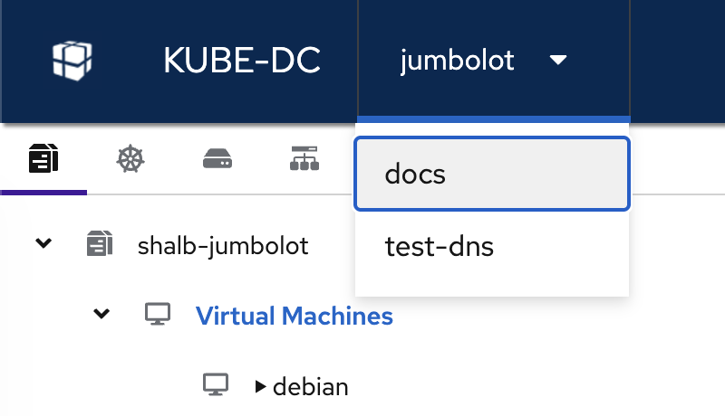
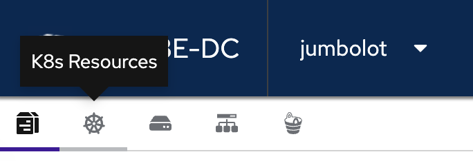

# Navigating the Kube-DC Dashboard

The Kube-DC dashboard is your central interface for managing projects, workloads, virtual machines, Kubernetes clusters, and account settings. This guide walks you through the key areas of the UI.

## Projects View

After logging in, you land on the **Projects** page. It lists all projects in your organization along with their status, network CIDR, running pods, resource quotas, and creation date.

From here you can:

- **Go to Project** — open the workloads dashboard for a specific project
- **Details** — view project configuration and resource limits
- **Delete** — remove a project (requires appropriate permissions)

### User Menu

Click your name in the top-right corner to open the user menu with the following options:

| Menu Item | Description |
|---|---|
| **Manage Workloads** | Open the workloads dashboard for the selected project |
| **Project console** | Launch a web-based terminal with `kubectl` access scoped to your projects |
| **Manage user** | Open account settings (password, 2FA) |
| **Logout** | Sign out of the dashboard |

---

## Workloads Dashboard

Selecting **Manage Workloads** or clicking **Go to Project** takes you to the main workloads dashboard.

The workloads dashboard provides:

### Quick Actions

Three action cards at the top let you jump straight into common tasks:

- **Get CLI Access** — download your kubeconfig for programmatic access via `kubectl`
- **Deploy Virtual Server** — create a new Linux or Windows virtual machine
- **Create K8s Cluster** — provision a managed Kubernetes cluster with automated scaling

### Sidebar Navigation

The left sidebar shows a tree view of all resources in the current project:

- **Virtual Machines** — grouped by OS (e.g., `debian`, `ubuntu`, `win`)
- **Kubernetes Clusters** — nested clusters with their worker nodes

### Project Overview

The center panel displays a summary of your project resources:

- **Pods** — running and total pod count
- **Virtual Machines** — running and total VM count
- **Storage** — number of volumes and total size
- **Network** — load balancers and public IPs in use

### Resource Quotas

Progress bars show your current usage against the project limits for:

- **CPU** — cores used vs. allocated
- **Memory** — memory used vs. allocated
- **Storage** — disk space used vs. allocated
- **Object Storage** — S3-compatible storage used vs. allocated

Click **View Organization Billing** to see usage and cost details for the entire organization.

---

## Switching Projects

Use the **project switcher** dropdown at the top of the dashboard (next to the Kube-DC logo) to switch between projects without returning to the projects list.

Simply click the current project name and select another project from the dropdown.

---

## Resource Tabs

Below the top navigation bar, a row of icon tabs lets you switch between different resource categories within the current project.

The tabs from left to right are:

| Icon | Resource Category | What You'll Find |
|---|---|---|
| 📋 | **Compute** | Pods, Deployments, StatefulSets, DaemonSets, Jobs |
| ⚙️ | **K8s Resources** | ConfigMaps, Secrets, ServiceAccounts, CRDs |
| ☸ | **Volumes** | PersistentVolumeClaims, storage usage |
| 🖥️ | **Network** | Services, Ingresses, Load Balancers, IPs |
| 🔗 | **Object Storage** | S3-compatible buckets and access credentials |

---

## Organization Management

From the Projects page, click the **Kube-DC** logo in the top-left corner to access the organization management view.

The left sidebar provides access to:

- **Projects** — create, view, and manage projects
- **Users** — invite and manage organization members
- **Organization Groups** — manage user groups and role assignments
- **Project Roles** — define custom roles for project-level access control
- **Billing** — view usage, costs, and billing plan details
- **Audit Logs** — review actions performed across the organization
- **Settings** — configure organization-level settings

---

## Project Web Console

Select **Project console** from the user menu to launch a browser-based terminal. The console provides a pre-authenticated `kubectl` session scoped to the projects in your organization.

From the console you can:

- List available namespaces with `kube-dc ns`
- Run `kubectl` commands (aliased as `kgp`, `kgs`, etc.)
- Manage resources directly without installing any CLI tools locally

---

## Account Settings

Select **Manage user** from the user menu to open your account settings.

### Change Password

Under **Basic authentication**, click **Update** next to your password entry to set a new password. The page shows when your current password was created.

### Two-Factor Authentication (2FA)

Under **Two-factor authentication**, click **Set up Authenticator application** to enable 2FA using an app like Google Authenticator or Authy. Once configured, you will be prompted for a verification code on every login.

:::tip
Enabling 2FA is strongly recommended to protect your account, especially for organization administrators.
:::

---

## Next Steps

- [Core Concepts](core-concepts.md) — understand organizations, projects, and resource isolation
- [Creating Your First Project](first-project.md) — set up your first project
- [CLI & Kubeconfig Access](cli-kubeconfig.md) — manage resources from the command line
- [Team Management](team-management.md) — invite users and assign roles
