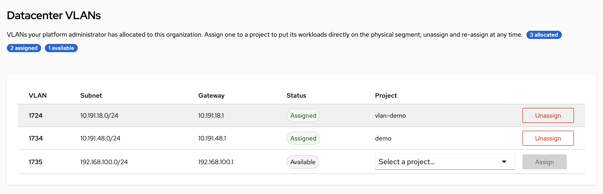
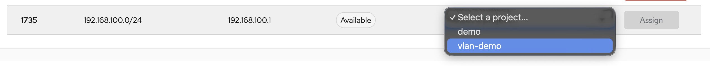
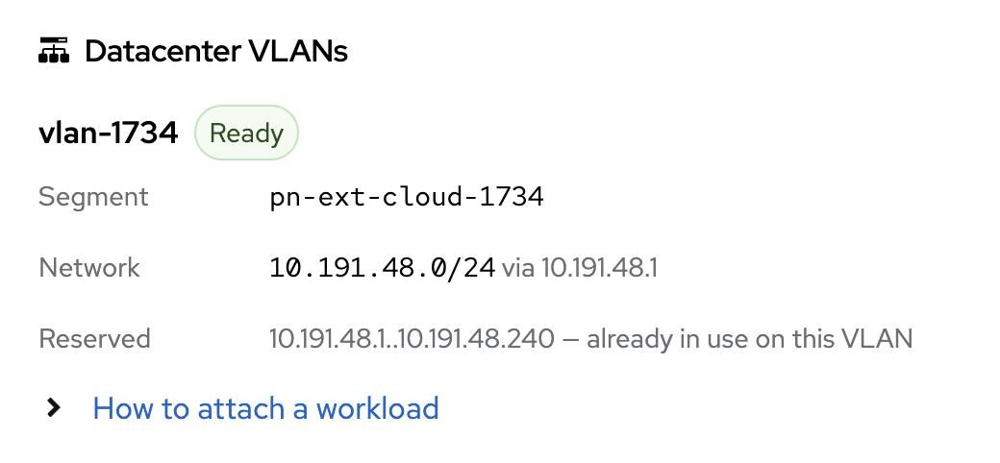
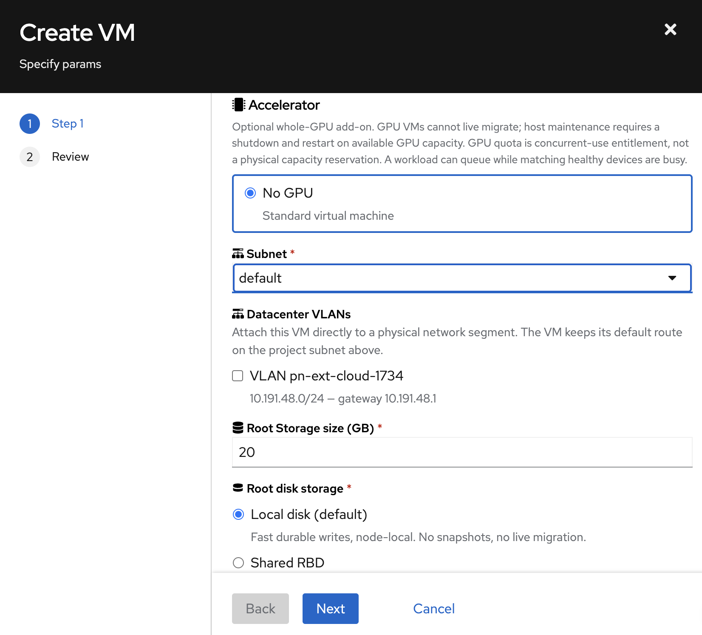

# Datacenter VLANs

A datacenter VLAN puts your workloads **directly on a physical network segment**
in the datacenter — the same broadcast domain as your own hardware. Use it when a
pod or VM has to reach equipment that cannot be routed to: a storage array, a
license dongle, a PLC, a legacy appliance that only speaks to its own subnet.

This is different from everything else in [VPC & Private Networking](private-networking.md).
Your Project VPC is an overlay that Kube-DC creates for you. A datacenter VLAN is
a real wire that already exists, that your organization already owns, and that
your platform administrator hands to you.

---

## How it works

Your platform administrator allocates a VLAN to your **organization**. From then
on you decide, without raising a ticket, which of your **Projects** uses it — and
you can change your mind later.

```
    Platform administrator                You (organization admin)
    ─────────────────────                 ────────────────────────
    allocates VLAN 4014      ──────►      assign to Project "production"
    to organization "acme"                        │
                                                  │  later, freely
                                                  ▼
                                          unassign → assign to "staging"
```

A workload in that Project then gets a **second network interface**:

```
┌──────────────────────────────────────────────────────────┐
│  Pod or VM in Project "production"                       │
│  Backing namespace: acme-production                      │
│                                                          │
│    eth0            10.0.0.15/24    ← Project VPC         │
│                                      DEFAULT ROUTE       │
│                                                          │
│    net1            192.0.2.30/24   ← datacenter VLAN     │
│                                      no default route    │
└───────────────────────┬──────────────────────────────────┘
                        │  802.1Q tagged
                        ▼
        ┌───────────────────────────────────┐
        │  Physical VLAN 4014               │
        │  192.0.2.0/24                     │
        │                                   │
        │  Your storage array  192.0.2.10   │
        │  Your appliance      192.0.2.11   │
        └───────────────────────────────────┘
```

**Your default route does not move.** Internet access, DNS and everything else
keep working exactly as before, over the VPC interface. The VLAN interface
carries only traffic to that segment.

---

## Rules worth knowing up front

| | |
|---|---|
| **One Project per VLAN** | A physical segment is a shared broadcast domain. Only one Project may hold it at a time; this prevents users in another Project from seeing your layer 2 traffic. |
| **Several VLANs per Project** | A Project can hold more than one VLAN, and one workload can attach to several, provided at least one node carries *all* of them (see below). |
| **The addressing is fixed** | Subnet, gateway and reserved addresses are set by your platform administrator from what your network team told them. You cannot change them, and you should not want to — they describe real equipment. |
| **Reversible, not instant** | Unassigning drains the workloads that are still attached before the VLAN can go to another Project. |
| **Layer 2 only** | The VLAN is not routed into your VPC. Only workloads that explicitly attach can reach it. |

---

## Assign a VLAN to a Project

Go to **Organization Management → Datacenter VLANs**. Every VLAN allocated to
your organization is listed with its subnet, gateway and current state.



Pick a Project from the dropdown on an **Available** row and press **Assign**.



The row moves to **Assigned** once the network is published into the Project,
usually within a few seconds.

| State | Meaning |
|---|---|
| **Available** | Allocated to your organization, not in use. Assign it to a Project. |
| **Provisioning** / **Pending** | The network is being created. Wait. |
| **Assigned** | Ready. Workloads in that Project can attach. |
| **Releasing** | Being unassigned. Attached workloads are draining; the count is shown. Not yet re-assignable. |
| **Error** | The binding could not be realised. The most common cause is that the VLAN is already held by another Project. Contact your platform administrator. |
| **segment not ready** | Your platform administrator has not finished delivering this VLAN to the cluster's nodes. Nothing you can do — ask them. |

### Unassign and re-assign

Press **Unassign** to return the VLAN to your organization's pool. It stays
yours; only the Project binding goes away, so you can give it to a different
Project afterwards.

The row shows **Releasing** with the number of workloads still attached until
teardown finishes. That wait is deliberate: the VLAN is not handed to another
Project while anything is still on the wire.

:::warning
**Unassigning does not move your workloads for you.** Attached workloads keep
running, but teardown *waits* for them: while the VLAN is releasing, any pod or
VM that still asks for it is **refused**, so a Deployment that recreates a pod
will not come back.

Remove the attachment first — delete the `k8s.v1.cni.cncf.io/networks` annotation
from the Deployment/StatefulSet/Job template (or the network from a stopped VM's
template), then replace the running instances. Only then unassign.
:::

The count shown on a **Releasing** row is attachment *evidence*, not a headcount:
a pod and its address record can both be counted. It falls to zero when the wire
is genuinely clear.

---

## Attach a workload

Assigning the VLAN makes it *available* to the Project. Each pod or VM still has
to ask for it.

Open **Organization Management → Projects** and click the Project. Its details
panel has a **Datacenter VLANs** card listing every VLAN the Project holds, with
the segment, the network name, and the exact string to attach with.



Copy the value shown under **Attach with** — that is the annotation value below,
already in the right form.

### Attach a pod

Add one annotation. The value is `<backing-namespace>/<network-name>`, and the
console shows you the exact string — copy it from there rather than assembling it
by hand. When a VLAN is assigned from the console the network is named
`<segment>-<project>`, so the examples below use `pn-ext-4014-production`.

```yaml
apiVersion: v1
kind: Pod
metadata:
  name: storage-client
  namespace: acme-production
  annotations:
    k8s.v1.cni.cncf.io/networks: acme-production/pn-ext-4014-production
spec:
  containers:
    - name: app
      image: busybox:1.36
      command: ["sh", "-c", "sleep infinity"]
```

To attach several VLANs, comma-separate them. Note that a workload is pinned to
nodes carrying **every** VLAN it names — if two VLANs are delivered to different
sets of nodes, the pod stays `Pending` with no node available:

```yaml
    k8s.v1.cni.cncf.io/networks: acme-production/pn-ext-4014-production,acme-production/pn-ext-4015-production
```

Kube-DC fills in the address, MAC, port security and node placement for you. The
pod is scheduled only onto nodes where the VLAN is actually delivered, so it
cannot land somewhere the wire does not reach.

### Attach a virtual machine

**From the console.** When you create a VM, Step 1 shows a **Datacenter VLANs**
section listing every VLAN this Project holds. Tick the ones you want and the
generated manifest gets the network and its matching interface, correctly paired —
review it on the next step before creating.



The section only appears when this Project actually holds a VLAN, and only lists
VLANs that are ready to attach. Ticking more than one warns you that the VM will
be pinned to nodes carrying **all** of them.

**By hand.** A VM needs the network **and** a matching interface. This is what the
console does for you, and it trips people up when done manually:

:::warning
KubeVirt requires a one-to-one match between `networks` and
`devices.interfaces`. Get the `name:` fields out of step and the VM does not come
up on the VLAN — with no obvious error pointing at the cause.
:::

The snippet below is a **networking fragment, not a complete VM** — it has no
disks or volumes. Merge it into a VM template you already know boots, with the VM
stopped.

```yaml
apiVersion: kubevirt.io/v1
kind: VirtualMachine
metadata:
  name: app-vm
  namespace: acme-production
spec:
  template:
    spec:
      networks:
        - name: vpc                                  # keep the VPC as default
          multus:
            default: true
            networkName: acme-production/default
        - name: customer                             # the datacenter VLAN
          multus:
            networkName: acme-production/pn-ext-4014-production
      domain:
        devices:
          interfaces:
            - name: vpc                              # must match networks[0].name
              bridge: {}
            - name: customer                         # must match networks[1].name
              bridge: {}
```

Keep `default: true` on the VPC network. That is what leaves the VM's default
route — and therefore its internet access — on the VPC.

:::note
A running VM cannot have a VLAN added to it. Stop the VM, edit the template,
start it again. The same applies to pods: recreate them rather than editing.
:::

---

## Verify it works

The most reliable way to see what a pod actually got is the status Multus writes
back, which names each network explicitly:

```bash
kubectl get pod storage-client -n acme-production \
  -o jsonpath='{.metadata.annotations.k8s\.v1\.cni\.cncf\.io/network-status}'
```

```json
[
  { "name": "kube-ovn",                                   "interface": "eth0", "ips": ["10.0.0.15"] },
  { "name": "acme-production/pn-ext-4014-production",     "interface": "net1", "ips": ["192.0.2.30"] }
]
```

:::warning
**Do not assume the VLAN is on `net1`.** Interface numbering depends on how many
networks the workload has and on how your cluster is configured — the VLAN can
land on `net1`, `net2` or later, and inside a VM the guest names it however its OS
chooses. Always match by the network name or the address, as above.
:::

`kubectl exec` is blocked in Project backing namespaces. Run the checks as a
short-lived diagnostic Job and read its logs instead. This Job discovers the
VLAN interface from the route to your target, so it does not assume `net1`.
Replace the network annotation and target address with your values:

```bash
NS=acme-production
kubectl delete job -n "$NS" vlan-check --ignore-not-found

kubectl apply -f - <<'EOF'
apiVersion: batch/v1
kind: Job
metadata:
  name: vlan-check
  namespace: acme-production
spec:
  backoffLimit: 0
  template:
    metadata:
      annotations:
        k8s.v1.cni.cncf.io/networks: acme-production/pn-ext-4014-production
    spec:
      restartPolicy: Never
      containers:
        - name: check
          image: nicolaka/netshoot
          env:
            - name: TARGET
              value: 192.0.2.10
          command: ["/bin/sh", "-ec"]
          args:
            - |
              IFACE="$(ip route get "$TARGET" | awk '{for (i=1; i<=NF; i++) if ($i == "dev") {print $(i+1); exit}}')"
              test -n "$IFACE"
              echo "VLAN interface: $IFACE"
              ip -4 -br addr show dev "$IFACE"
              ping -c3 -I "$IFACE" "$TARGET"
              ip route get 1.1.1.1
              ping -c1 -M do -s 1372 -I "$IFACE" "$TARGET"
              if ping -c1 -M do -s 1500 -I "$IFACE" "$TARGET"; then
                echo "unexpected success above the configured MTU" >&2
                exit 1
              fi
              echo "oversized DF packet failed as expected"
EOF

kubectl wait -n "$NS" --for=condition=Complete job/vlan-check --timeout=120s
kubectl logs -n "$NS" job/vlan-check
kubectl get pod -n "$NS" -l job-name=vlan-check \
  -o jsonpath='{.items[0].metadata.annotations.k8s\.v1\.cni\.cncf\.io/network-status}'
echo
kubectl delete job -n "$NS" vlan-check
```

The example checks a 1400-byte MTU: a 1372-byte ICMP payload plus headers should
pass, while a 1500-byte payload with don't-fragment set should fail. Adjust both
sizes if your platform administrator configured a different MTU.

---

## What you cannot do

These are refused at admission, with a message explaining why:

- **Choose your own addressing.** IP, MAC, routes and default-route settings are
  assigned by Kube-DC. Multus runtime options (`ips`, `mac`, `default-route`,
  `cni-args`) are rejected, as are provider-scoped annotations that would override
  IPAM — `ip_address`, `ip_pool`, `mac_address`, `routes`, `gateway`, `cidr` and
  `default_route` on the VLAN's provider key. (Port security and security groups
  are set for you and validated.)
- **Attach a VLAN your Project does not hold**, including one held by another
  Project in your own Organization.
- **Change the subnet or gateway** on a VLAN assigned to you.
- **Edit a VLAN assignment in place.** To move a VLAN between Projects, unassign
  and assign again.

### Working from the command line

Organization admins can drive assignment with `kubectl`. The addressing must
match what your platform administrator recorded for the wire **exactly** —
admission rejects anything else — so copy the subnet, gateway and reserved ranges
from the Datacenter VLANs table:

```yaml
# projectnetwork.yaml
apiVersion: kube-dc.com/v1
kind: ProjectNetwork
metadata:
  name: pn-ext-4014-production        # your choice; this becomes the network name
spec:
  org: acme
  project: production
  segmentRef: pn-ext-4014             # the segment shown in the console
  mode: l2
  cidrBlock: 192.0.2.0/24             # ─┐
  gateway: 192.0.2.1                  #  ├─ must match the console exactly
  gatewayCheck: false                 #  │
  excludeIps:                         #  │
    - 192.0.2.1..192.0.2.99           # ─┘
```

```bash
kubectl create -f projectnetwork.yaml          # assign
kubectl delete projectnetwork pn-ext-4014-production   # unassign
```

`kubectl get` and `kubectl apply` on `projectnetwork` are **not** granted to
tenants: the objects are cluster-scoped, so read access could not be limited to
your own organization. Use the console to see state; use `create`/`delete` to
change it.

---

## Troubleshooting

**"network … is not a datacenter VLAN assigned to this project"**
The name is wrong, or the VLAN is assigned to a different Project. The message
lists the VLANs this Project actually holds — compare against it.

**"network … is in another project's namespace"**
You referenced a VLAN belonging to a different Project. Each Project can only
attach the VLANs assigned to it.

**Pod stuck in `Pending` / `ContainerCreating`**
Usually the segment is not ready on any node, or the pod's own scheduling
constraints conflict with the nodes carrying the VLAN. Check the VLAN's status in
Organization Management; if it shows *segment not ready*, contact your platform
administrator.

**VM boots with no VLAN interface**
Almost always a missing or misnamed entry under `devices.interfaces`. See the
warning above.

**Unassign appears stuck**
Look at the attached-workload count on the **Releasing** row. Teardown waits for
those workloads to detach. Delete them, or wait for the controller to finish.

---

## Related

- [VPC & Private Networking](private-networking.md) — your Project's own network
- [Networking Overview](networking-overview.md) — how the pieces fit together
- [Public & Floating IPs](public-floating-ips.md) — reaching workloads from the internet
