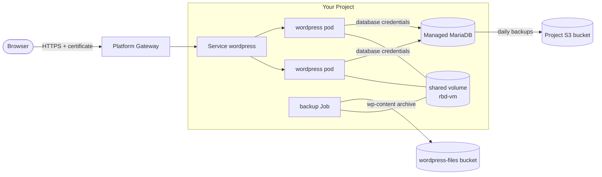

import WordPressStackDiagram from '@site/src/components/Diagram/WordPressStackDiagram';

# Deploy a Full WordPress Stack

This guide deploys a complete WordPress stack directly in a Kube-DC Project, using platform-managed data, storage, security, and exposure services:

- **Managed MariaDB** provisioned by the platform with **daily backups**
- **Database credentials** generated and stored in a Project Secret
- A **shared Ceph-backed volume** that two WordPress replicas and admin Jobs read and write together
- **S3 object storage** for content archives, with per-bucket access keys
- **HTTPS exposure with a certificate issued through the Project's ACME Issuer**
- **Autoscaling** with a HorizontalPodAutoscaler
- Headless WordPress installation with **WP-CLI running as a Job**

<details data-github-only>
<summary>Diagram source for GitHub</summary>



</details>

<WordPressStackDiagram />

## Prerequisites

- A Kube-DC [Project](first-project.md) with enough CPU, memory, storage, and object-storage quota
- [CLI access](cli-kubeconfig.md) with `kubectl` connected to the Project
- The Project `admin` role, because the example creates workload Secrets and managed-service resources
- A namespaced cert-manager `Issuer` named `letsencrypt`; create it once using
  [Service Exposure: Create the Issuer](service-exposure.md#step-1-create-the-issuer-once-per-project)
  and replace the example email address before applying it
- Examples use `acme-production`, the backing namespace for Organization `acme` and Project `production`

## Step 1 — Platform services

One manifest creates the data layer: an S3 bucket and a managed database with daily backups.

```yaml title="01-platform-services.yaml"
# S3 bucket for content archives. The platform creates the bucket plus a
# Secret and ConfigMap of the same name holding access keys and endpoint.
apiVersion: objectbucket.io/v1alpha1
kind: ObjectBucketClaim
metadata:
  name: wordpress-files
  namespace: acme-production
spec:
  generateBucketName: wordpress-files
  storageClassName: ceph-bucket
---
# Managed MariaDB. The platform provisions, operates, and backs it up daily.
# Backups land in the Project database-backup bucket.
apiVersion: db.kube-dc.com/v1alpha1
kind: KdcDatabase
metadata:
  name: wordpress-db          # NOT "wordpress" — see the note below
  namespace: acme-production
spec:
  engine: mariadb
  version: "11.4"
  replicas: 1
  cpu: "1"
  memory: 1Gi
  storage: 10Gi
  databaseName: wordpress
  username: app
  expose:
    type: internal
  backup:
    enabled: true
    schedule: "0 2 * * *"
    retentionDays: 7
```

:::caution Name the database differently from your app Service
The platform creates a Service named after the `KdcDatabase` (here `wordpress-db.acme-production.svc:3306`). If you name the database `wordpress` and later create an app Service called `wordpress`, they collide. Keep them distinct.
:::

```bash
kubectl apply -f 01-platform-services.yaml

# Wait for the database and its generated engine Secret:
kubectl get kdcdatabase wordpress-db     # PHASE: Ready
kubectl get secret wordpress-db-password
```

## Step 2 — WordPress

The application layer adds a Ceph-backed content volume, two co-located replicas that share it, HTTPS through the Project Issuer and a Service annotation, and an autoscaler.

```yaml title="02-wordpress.yaml"
# Content volume on Ceph (rbd-vm). ReadWriteOnce attaches to one node;
# the Deployment co-locates all replicas on that node with podAffinity,
# so every pod reads and writes the same /var/www/html.
apiVersion: v1
kind: PersistentVolumeClaim
metadata:
  name: wordpress-content
  namespace: acme-production
spec:
  accessModes: ["ReadWriteOnce"]
  storageClassName: rbd-vm
  resources:
    requests:
      storage: 10Gi
---
apiVersion: apps/v1
kind: Deployment
metadata:
  name: wordpress
  namespace: acme-production
  labels:
    app: wordpress
spec:
  replicas: 2
  selector:
    matchLabels:
      app: wordpress
  strategy:
    type: RollingUpdate
    rollingUpdate:
      maxSurge: 1
      maxUnavailable: 0
  template:
    metadata:
      labels:
        app: wordpress
    spec:
      affinity:
        podAffinity:
          requiredDuringSchedulingIgnoredDuringExecution:
          - labelSelector:
              matchLabels:
                app: wordpress
            topologyKey: kubernetes.io/hostname
      containers:
      - name: wordpress
        image: wordpress:6.8-apache
        ports:
        - containerPort: 80
          name: http
        env:
        - name: WORDPRESS_DB_HOST
          value: wordpress-db:3306
        - name: WORDPRESS_DB_USER
          value: app
        - name: WORDPRESS_DB_PASSWORD
          valueFrom:
            secretKeyRef: {name: wordpress-db-password, key: password}
        - name: WORDPRESS_DB_NAME
          value: wordpress
        - name: WORDPRESS_CONFIG_EXTRA
          value: |
            /* Behind the platform HTTPS gateway */
            if (isset($_SERVER['HTTP_X_FORWARDED_PROTO']) && $_SERVER['HTTP_X_FORWARDED_PROTO'] === 'https') {
              $_SERVER['HTTPS'] = 'on';
            }
        volumeMounts:
        - name: content
          mountPath: /var/www/html
        resources:
          requests: {cpu: 250m, memory: 384Mi}
          limits: {cpu: "1", memory: 768Mi}
        readinessProbe:
          httpGet: {path: /wp-includes/images/blank.gif, port: 80}
          initialDelaySeconds: 15
          periodSeconds: 10
        livenessProbe:
          tcpSocket: {port: 80}
          initialDelaySeconds: 30
          periodSeconds: 20
      volumes:
      - name: content
        persistentVolumeClaim:
          claimName: wordpress-content
---
# With the Project Issuer in place, this annotation asks the platform to create
# the HTTPS listener, certificate, and route.
apiVersion: v1
kind: Service
metadata:
  name: wordpress
  namespace: acme-production
  annotations:
    service.nlb.kube-dc.com/expose-route: https
spec:
  type: LoadBalancer        # expose-route is processed on LoadBalancer Services
  selector:
    app: wordpress
  ports:
  - port: 80
    targetPort: 80
    name: http
---
apiVersion: autoscaling/v2
kind: HorizontalPodAutoscaler
metadata:
  name: wordpress
  namespace: acme-production
spec:
  scaleTargetRef:
    apiVersion: apps/v1
    kind: Deployment
    name: wordpress
  minReplicas: 2
  maxReplicas: 4
  metrics:
  - type: Resource
    resource:
      name: cpu
      target:
        type: Utilization
        averageUtilization: 70
```

```bash
kubectl apply -f 02-wordpress.yaml

# Watch the assigned hostname and certificate readiness:
kubectl get svc wordpress -o jsonpath='{.metadata.annotations.service\.nlb\.kube-dc\.com/route-hostname-status}'
kubectl get certificate            # wordpress-tls  READY: True
kubectl get httproute              # wordpress-route
```

:::tip About the shared volume
`ReadWriteOnce` on Ceph RBD attaches the volume to one node; every pod on that node can mount it simultaneously. The `podAffinity` rule keeps all replicas (and the Jobs below) on that node, so they genuinely share `/var/www/html` — writes from one pod are immediately visible to the others. The trade-off is that all replicas live on one node at a time; the volume and database remain safe across node failure, and the pods reschedule together.
:::

## Step 3 — Install WordPress headlessly

Instead of the browser wizard, run WP-CLI as a Job. Administrative tasks in Projects run as Jobs; direct `kubectl exec` into Pods is restricted in Project backing namespaces.

```bash
# Admin password, kept in a Secret (you can also store it in the
# Secrets Manager in the console):
kubectl create secret generic wordpress-admin \
  --from-literal=password="$(openssl rand -base64 18)"
```

```yaml title="03-install-job.yaml"
apiVersion: batch/v1
kind: Job
metadata:
  name: wordpress-install
  namespace: acme-production
spec:
  backoffLimit: 3
  ttlSecondsAfterFinished: 3600
  template:
    spec:
      restartPolicy: Never
      # run on the node that holds the content volume
      affinity:
        podAffinity:
          requiredDuringSchedulingIgnoredDuringExecution:
          - labelSelector:
              matchLabels:
                app: wordpress
            topologyKey: kubernetes.io/hostname
      containers:
      - name: wp-cli
        image: wordpress:cli
        command: ["sh", "-c"]
        args:
        - |
          set -e
          until wp core is-installed --path=/var/www/html 2>/dev/null; do
            if wp core install --path=/var/www/html \
                 --url="https://REPLACE-WITH-YOUR-HOSTNAME" \
                 --title="My Site" \
                 --admin_user=admin \
                 --admin_password="$ADMIN_PASSWORD" \
                 --admin_email=admin@example.com \
                 --skip-email; then break; fi
            echo "waiting for wp-config/database..."; sleep 10
          done
          echo "WordPress installed."
        env:
        - name: WORDPRESS_DB_HOST
          value: wordpress-db:3306
        - name: WORDPRESS_DB_USER
          value: app
        - name: WORDPRESS_DB_PASSWORD
          valueFrom: {secretKeyRef: {name: wordpress-db-password, key: password}}
        - name: WORDPRESS_DB_NAME
          value: wordpress
        - name: ADMIN_PASSWORD
          valueFrom: {secretKeyRef: {name: wordpress-admin, key: password}}
        volumeMounts:
        - name: content
          mountPath: /var/www/html
      volumes:
      - name: content
        persistentVolumeClaim:
          claimName: wordpress-content
```

Set `--url` to the hostname from Step 2, then:

```bash
kubectl apply -f 03-install-job.yaml
kubectl wait --for=condition=complete job/wordpress-install --timeout=240s
kubectl logs job/wordpress-install
# WordPress installed.

curl -s -o /dev/null -w "%{http_code}\n" https://<your-hostname>/   # 200
```

Log in at `https://<your-hostname>/wp-admin/` with `admin` and the password from the `wordpress-admin` Secret:

```bash
kubectl get secret wordpress-admin -o jsonpath='{.data.password}' | base64 -d
```

## Step 4 — Back up wp-content to your S3 bucket

The database is already backed up daily by the platform; verify the `BackupReady` condition with `kubectl get kdcdatabase wordpress-db -o yaml`. Files are yours to archive — a Job with your bucket's access keys does it:

```yaml title="04-content-backup.yaml"
apiVersion: batch/v1
kind: Job
metadata:
  name: wp-content-backup
  namespace: acme-production
spec:
  ttlSecondsAfterFinished: 1800
  backoffLimit: 2
  template:
    spec:
      restartPolicy: Never
      affinity:
        podAffinity:
          requiredDuringSchedulingIgnoredDuringExecution:
          - labelSelector:
              matchLabels:
                app: wordpress
            topologyKey: kubernetes.io/hostname
      initContainers:
      - name: archive
        image: busybox:1.36
        command: ["sh","-c","tar czf /out/wp-content.tgz -C /data wp-content"]
        volumeMounts:
        - {name: content, mountPath: /data, readOnly: true}
        - {name: out, mountPath: /out}
      containers:
      - name: upload
        image: amazon/aws-cli:2.17.16
        command: ["sh","-c"]
        args:
        - |
          set -e
          STAMP=$(date -u +%Y%m%d-%H%M%S)
          aws s3 cp /out/wp-content.tgz \
            "s3://$BUCKET_NAME/backups/wp-content-$STAMP.tgz" \
            --endpoint-url "https://s3.kube-dc.cloud"
          aws s3 ls "s3://$BUCKET_NAME/backups/" --endpoint-url "https://s3.kube-dc.cloud"
        envFrom:
        - configMapRef: {name: wordpress-files}   # BUCKET_NAME, BUCKET_HOST
        - secretRef: {name: wordpress-files}      # AWS_ACCESS_KEY_ID / SECRET
        volumeMounts:
        - {name: out, mountPath: /out}
      volumes:
      - {name: content, persistentVolumeClaim: {claimName: wordpress-content}}
      - {name: out, emptyDir: {}}
```

```bash
kubectl apply -f 04-content-backup.yaml
kubectl wait --for=condition=complete job/wp-content-backup --timeout=240s
kubectl logs job/wp-content-backup -c upload | tail -2
# upload: ../out/wp-content.tgz to s3://wordpress-files-.../backups/wp-content-....tgz
```

:::info Use the public S3 endpoint from workloads
Use your cluster's public S3 endpoint (`https://s3.kube-dc.cloud` on Kube-DC Cloud) from pods. The in-cluster RGW service address in the ConfigMap is not reachable from project networks. Note `amazon/aws-cli` has no `tar` — hence the busybox init container.
:::

## What you built

| Concern | Handled by |
|---|---|
| Database provisioning and lifecycle | `KdcDatabase` (platform-operated MariaDB) |
| Database credentials | MariaDB engine Secret |
| Database backups | `spec.backup` — daily, 7-day retention |
| Content storage | Ceph-backed PVC shared by all replicas |
| File backups + access keys | `ObjectBucketClaim` bucket + Job |
| HTTPS, certificate, DNS name | Project Issuer + Service annotation |
| Scaling | HorizontalPodAutoscaler 2→4 |
| Admin operations | WP-CLI Jobs on the shared volume |

## Cleanup

```bash
kubectl delete hpa/wordpress svc/wordpress deploy/wordpress \
  job/wordpress-install job/wp-content-backup \
  pvc/wordpress-content secret/wordpress-admin
kubectl delete kdcdatabase/wordpress-db
kubectl delete obc/wordpress-files
```

## Troubleshooting

| Symptom | Cause |
|---|---|
| No hostname/certificate appears | The Service must be `type: LoadBalancer` for `expose-route` to be processed |
| Second replica `Pending` | podAffinity needs capacity on the volume's node — free capacity or lower requests |
| `wordpress-db-password` missing | The database has not finished provisioning — inspect `kubectl get kdcdatabase wordpress-db -o yaml` |
| S3 upload times out | Use the public S3 endpoint, not the in-cluster `BUCKET_HOST` |
| DB Service name collides | Name the `KdcDatabase` differently from your app Service |
