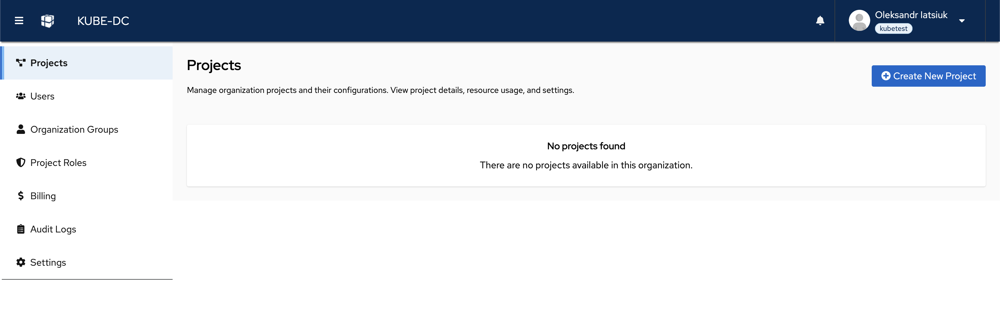
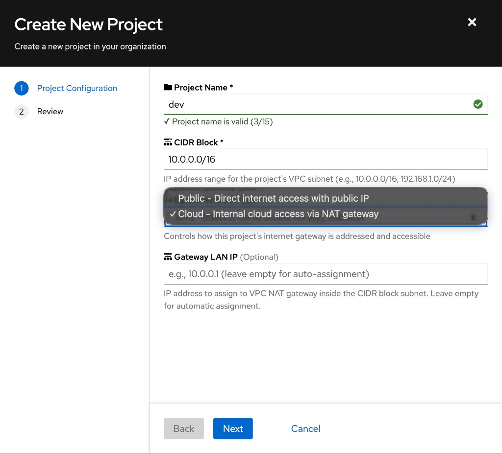
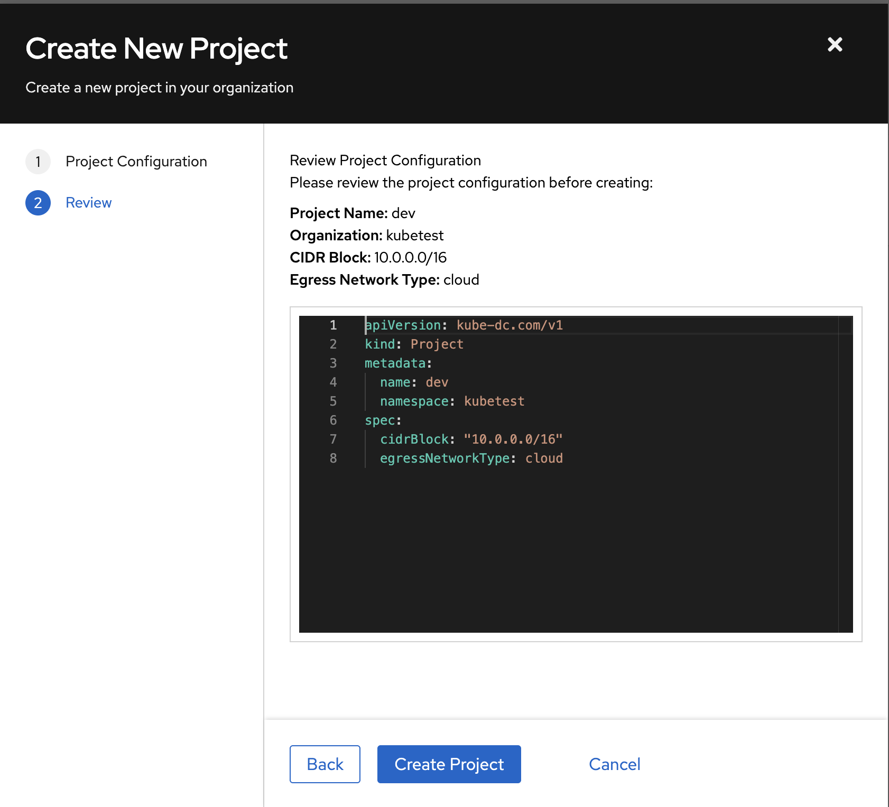
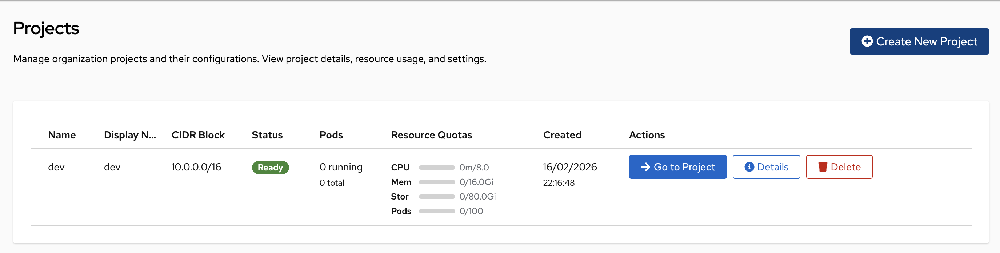
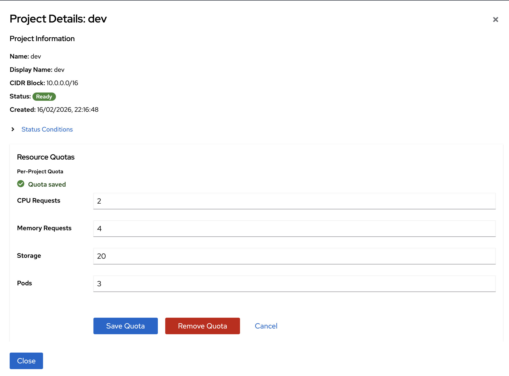

# Creating Your First Project

A **Project** is the fundamental workspace in Kube-DC. It acts as a container for your applications, Virtual Machines, and Clusters, providing them with a dedicated, isolated network.

## Prerequisites

- A Kube-DC Cloud account ([Sign Up](sign-up-login.md))
- Basic understanding of [Core Concepts](core-concepts.md)

## Create a New Project

To start, navigate to the **Projects** tab in the main sidebar.

Click the **Create New Project** button in the top right corner. The creation wizard will appear.

## Configure Project Settings

In the Project Configuration step, define the basic properties of your workspace:

- **Project Name** — Enter a unique name (e.g., `dev`, `staging`, `production`)
- **CIDR Block** — Define the internal IP range for this project's private network (e.g., `10.0.0.0/16`)
- **Egress Network Type** — Choose how workloads in this project access the internet

### Which network type should I choose?

| Type | Gateway | Use Case |
|------|---------|----------|
| ☁️ **Cloud (NAT Gateway)** | Private gateway IP (shared, more secure) | Web servers, databases, backend microservices, general cloud infrastructure |
| 🌐 **Public (Direct Access)** | Dedicated external IP (billable) | Direct port forwarding, dedicated load balancing, apps requiring a fixed public gateway |

**Key difference:** Both project types can expose workloads to the internet. The main difference is the gateway:

- **Cloud** — Your project gets a private gateway IP. Workloads access the internet through a secure, shared NAT. More cost-effective and secure for most use cases.
- **Public** — Your project gets a dedicated external IP as its gateway. This IP can be used for direct port forwarding or load balancing. The dedicated gateway IP is billable.

:::tip Recommended
For most applications, choose **Cloud (NAT Gateway)**. It provides better security, is more cost-effective, and is the standard approach for cloud infrastructure.
:::

## Review & Create

1. Click **Next** to proceed to the Review step
2. Kube-DC shows you the underlying Kubernetes Manifest (YAML) that will be applied — this transparency allows advanced users to understand exactly what is being created
3. Review the configuration
4. Click **Create Project**

Once created, your new project will appear in the list with a status of **Ready**.

## Setting Resource Quotas (Optional)

By default, a Project shares the full resource pool of your Organization. To prevent one project from consuming all resources, you can set specific limits.

1. In the Projects list, click the **Details** button next to your project
2. In the "Resource Quotas" section, click **Set Quota**
3. Define the limits for this project:
   - **CPU** — Max CPU cores
   - **Memory** — Max RAM (in GiB)
   - **Storage** — Max disk space (in GiB)
   - **Pods** — Max number of containers
4. Click **Save Quota**

## Next Steps

Once your project is created:

- [Deploy Your First Application](deploy-first-app.md)
- [Create a Virtual Machine](creating-vm.md)
