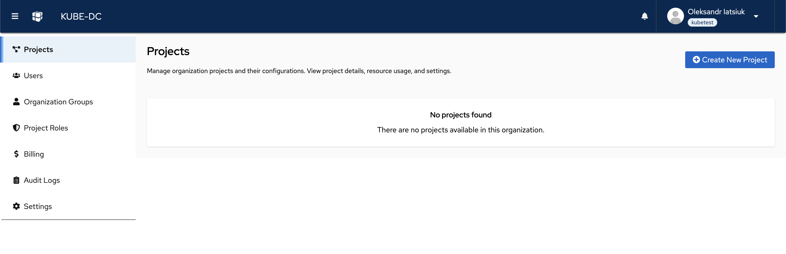
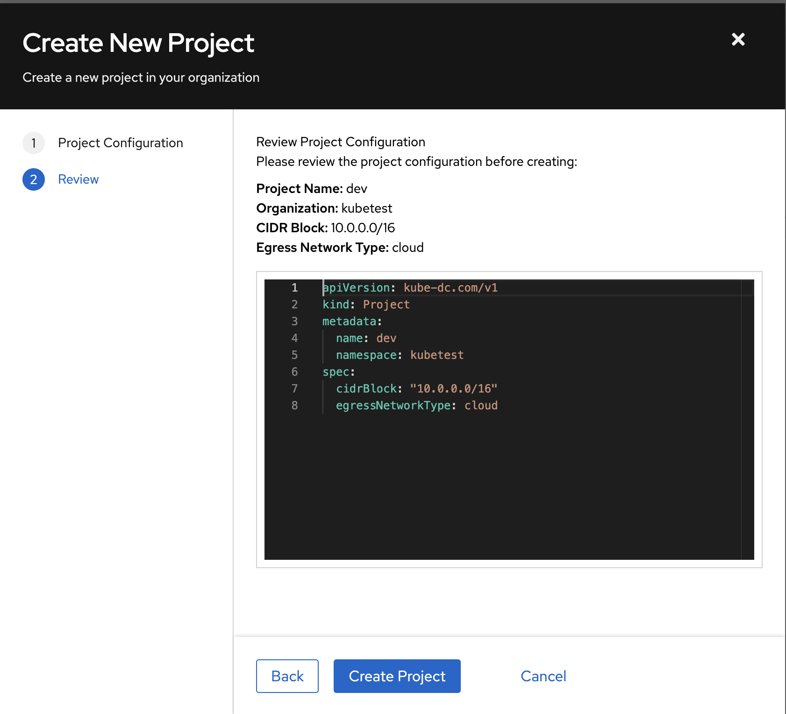
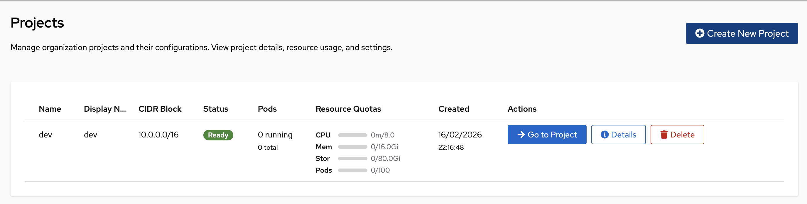
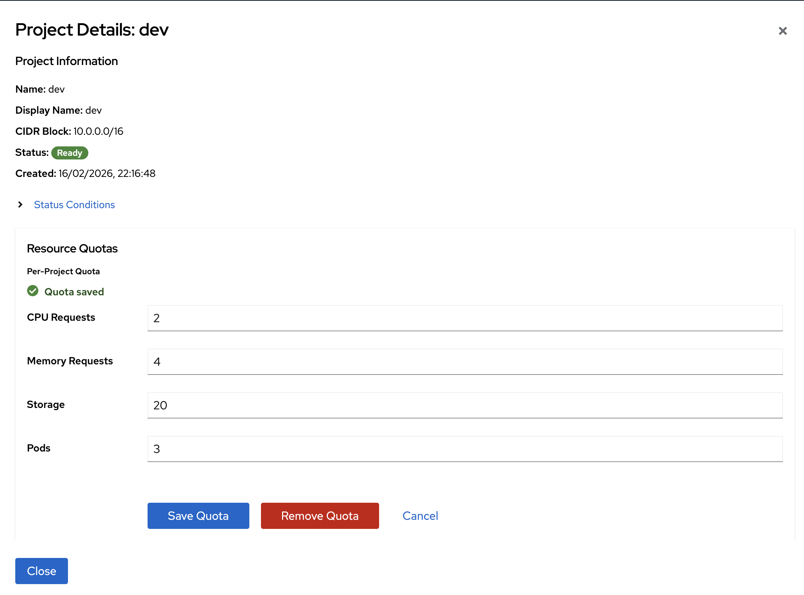

# Creating Your First Project

A **Project** is the working boundary for applications, virtual machines, databases, and Managed Clusters. Kube-DC backs it with a namespace named `{organization}-{project}`, Project RBAC, a private network, optional quota, and a Project kubeconfig. The namespace is an implementation detail, so the console and this guide call the environment by its Project name.

## Prerequisites

- A Kube-DC Cloud account ([Sign Up](sign-up-login.md))
- Organization Admin access
- Basic understanding of [Core Concepts](core-concepts.md)

## Create a New Project

To start, navigate to the **Projects** tab in the main sidebar.

Click the **Create New Project** button in the top right corner. The creation wizard will appear.

## Configure Project Settings

In the Project Configuration step, define the Project's basic properties:

- **Project Name** — Enter a unique name (e.g., `dev`, `staging`, `production`)
- **CIDR Block** — Define the internal IP range for this project's private network (e.g., `10.0.0.0/16`)
- **Egress Network Type** — Choose how workloads in this project access the internet

### Which network type should I choose?

The network type selects the address pool for the Project default gateway. Both types keep workloads on private addresses and use source NAT (SNAT) for outbound traffic. This choice is immutable after creation.

Every provider offers **Cloud**. **Public** appears only when the provider has enabled Public Project creation.

| Type | Default gateway | Choose it when |
|------|-----------------|----------------|
| **Cloud** | Cloud-internal address | The normal choice for applications exposed through Gateway Routes or separately allocated EIPs |
| **Public** | Internet-routable address | The Project needs a public source address at its default gateway |

Neither option exposes a workload by itself. Create a Gateway Route, LoadBalancer Service, or FIP for inbound access. Address availability and cost depend on your provider and quota. See [How Networking Works](networking-overview.md).

## Review & Create

1. Click **Next** to proceed to the Review step
2. Kube-DC shows you the underlying Kubernetes Manifest (YAML) that will be applied — this transparency allows advanced users to understand exactly what is being created
3. Review the configuration
4. Click **Create Project**

Once created, your new project will appear in the list with a status of **Ready**.

## Setting Resource Quotas (Optional)

By default, a Project shares the full resource pool of your Organization. To prevent one project from consuming all resources, you can set specific limits.

1. In the Projects list, click the **Details** button next to your project
2. In the "Resource Quotas" section, click **Set Quota**
3. Define the limits for this project:
   - **CPU** — Max CPU cores
   - **Memory** — Max RAM (in GiB)
   - **Storage** — Max disk space (in GiB)
   - **Pods** — Maximum number of Pods
4. Click **Save Quota**

## Next Steps

Once your project is created:

- [Deploy Your First Application](deploy-first-app.md)
- [Create a Virtual Machine](creating-vm.md)
