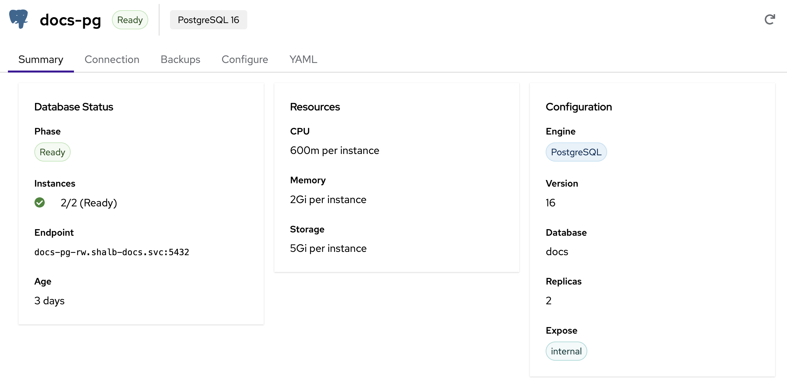
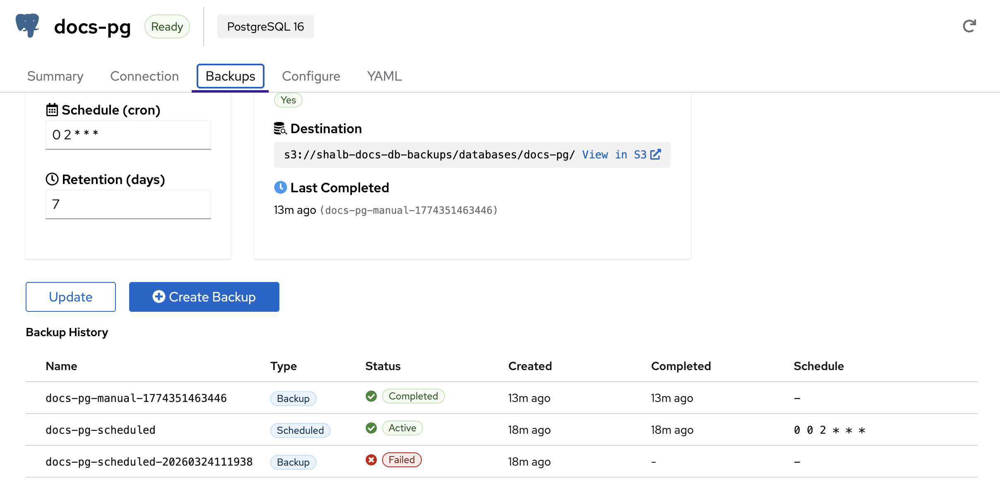
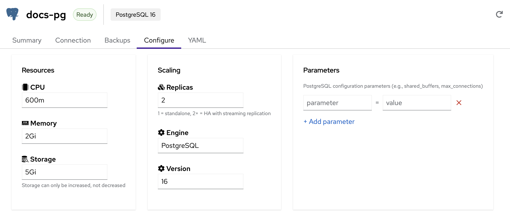
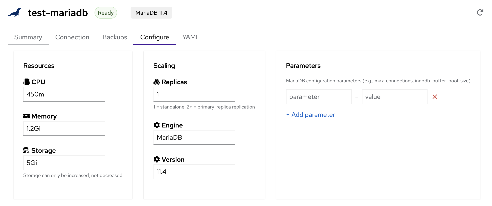

# Managed Databases

Kube-DC provides managed **PostgreSQL** and **MariaDB** databases through the dashboard and Kubernetes API. A one-replica database is standalone; configure two or more replicas when the engine and workload require failover.

## Databases Overview

The Databases view shows all databases in your Project. The left sidebar organizes databases by engine type (**PostgreSQL** and **MariaDB**). Each database shows its name, engine, version, status, replica count, and age.

Click on any database to expand its details:

- **General Information** — Name, engine, version, backing namespace, CPU/memory, storage, status, and creation date
- **Connection** — Internal endpoint, port, database name, replica count, and a quick-connect command
- **Credentials** — Username with copy button and password with reveal/rotate options
- **Actions** — View Details or Delete the database

## Supported Engines

| Engine | Supported Versions | Default Port | Replication Model |
|--------|-------------------|-------------|-------------------|
| **PostgreSQL** | 14, 15, 16, 17 | 5432 | Streaming replication (HA) |
| **MariaDB** | 10.11, 11.4 | 3306 | Primary-replica replication |

## Create a Database

### Create via Dashboard

1. Navigate to your Project → **Databases** → **Overview**
2. Click **+ Create Database**
3. Fill in the creation wizard:
   - **Name** — A unique name for your database (lowercase, alphanumeric, hyphens)
   - **Engine** — PostgreSQL or MariaDB
   - **Version** — Select the engine version
   - **Database Name** — Name of the default database to create
   - **Username** — Database user (defaults to `app`)
   - **CPU / Memory** — Resource allocation per instance
   - **Storage** — Persistent storage size per instance
   - **Replicas** — Number of instances (1 = standalone, 2+ = high availability)
4. Review the summary and click **Create**

The database will transition through `Pending` → `Provisioning` → `Ready` status. Completion time depends on engine startup, storage provisioning, image availability, and replica count.

### Create via kubectl

Create a `KdcDatabase` resource in the Project's backing namespace:

```yaml
apiVersion: db.kube-dc.com/v1alpha1
kind: KdcDatabase
metadata:
  name: my-postgres
  namespace: acme-production
spec:
  engine: postgresql
  version: "16"
  databaseName: myapp
  username: app
  cpu: "1"
  memory: 2Gi
  storage: 20Gi
  replicas: 2
```

```bash
kubectl apply -f my-postgres.yaml
kubectl get kdcdatabases -n acme-production
```

## Database Detail View

Click **View Details** on any database to access the full management interface with five tabs: **Summary**, **Connection**, **Backups**, **Configure**, and **YAML**.

### Summary



The Summary tab provides a quick overview of your database:

- **Database Status** — Current phase (Ready, Provisioning, Failed), instance count, internal endpoint, and age
- **Resources** — CPU, memory, and storage allocated per instance
- **Configuration** — Engine type, version, database name, replica count, and exposure mode

### Connection

The Connection tab shows everything you need to connect to your database:

- **Endpoint** — Internal Project endpoint (`ClusterIP`). Use it from a workload that can reach the Project Service, or configure LoadBalancer exposure for a workstation
- **External access** — Enable or disable a dedicated public LoadBalancer endpoint and follow its provisioning/removal status
- **Database credentials** — Application username, password (click to reveal or rotate), database name, and port
- **Credential Policies footer** — Shows the count of credential policies managing this database and links to the Credentials tab for policy-driven rotation (see [Credential Policies](#credential-policies) below)

:::note
When a credential policy manages the **application user** (typically
`app`), the Connection tab disables the Reveal/Rotate buttons and points you at
the Credentials tab. If Secret sync is enabled for that policy, its projected
Kubernetes Secret is the source of truth for the current password. If sync is
disabled, an authorized `project-manager` or `admin` retrieves the current value
through `kube-dc db credentials get --show-password`. The engine Secret
(`<db>-app` for PostgreSQL or `<db>-password` for MariaDB) stays at its
provisioning-time value after the first policy rotation and should not be used
directly.
:::

**Connecting from an application workload in the same Project:**

```bash
# PostgreSQL
psql -h my-postgres-rw.acme-production.svc -p 5432 -U app -d myapp

# MariaDB, standalone (replicas: 1)
mysql -h my-mariadb.acme-production.svc -P 3306 -u app -p myapp

# MariaDB, high availability (replicas: 2+)
mysql -h my-mariadb-primary.acme-production.svc -P 3306 -u app -p myapp
```

:::tip
The password is auto-generated and stored in a Kubernetes Secret. You can view it on the **Connection** tab or retrieve it via kubectl:

```bash
# PostgreSQL
kubectl get secret my-postgres-app -n acme-production -o jsonpath='{.data.password}' | base64 -d

# MariaDB
kubectl get secret my-mariadb-password -n acme-production -o jsonpath='{.data.password}' | base64 -d
```

**Important**: read these engine Secrets only when **no credential policy manages the user**. If a `DatabaseCredentialPolicy` exists for this database's user (typically `app`), the engine Secret stays at the provisioning-time password and falls out of sync after the first rotation. In that case, read the DBCP-projected Secret named on the **Credentials** tab instead.
:::

### Connecting from Application Workloads

The most common pattern is mounting the database password from the auto-created Kubernetes Secret and setting connection details as environment variables in your Deployment:

**PostgreSQL:**

```yaml
env:
  - name: DB_PASSWORD
    valueFrom:
      secretKeyRef:
        name: my-postgres-app      # Secret: {db-name}-app
        key: password
  - name: DB_HOST
    value: "my-postgres-rw.acme-production.svc"
  - name: DB_PORT
    value: "5432"
  - name: DB_USER
    value: "app"
  - name: DB_NAME
    value: "myapp"
  - name: DATABASE_URL             # Connection string (many frameworks use this)
    value: "postgresql://$(DB_USER):$(DB_PASSWORD)@$(DB_HOST):$(DB_PORT)/$(DB_NAME)"
```

**MariaDB:**

```yaml
env:
  - name: DB_PASSWORD
    valueFrom:
      secretKeyRef:
        name: my-mariadb-password   # Secret: {db-name}-password
        key: password
  - name: DB_HOST
    # Use my-mariadb.acme-production.svc for a one-replica database.
    value: "my-mariadb-primary.acme-production.svc"
  - name: DB_PORT
    value: "3306"
  - name: DB_USER
    value: "app"
  - name: DB_NAME
    value: "myapp"
```

:::info Secret Naming Convention
- **PostgreSQL**: `{db-name}-app` (key: `password`)
- **MariaDB**: `{db-name}-password` (key: `password`)

These engine Secrets are created at provisioning time. **They are NOT updated when a credential policy rotates the password**: once a `DatabaseCredentialPolicy` manages the user, the projected Secret named on the **Credentials** tab is the source of truth for the current password. Use the engine Secret only when no policy manages the user, or for break-glass scenarios — contact your cluster operator if you need help recovering from a state where neither the policy Secret nor the engine Secret has a working password.
:::

### External Access

By default, the database Service is a `ClusterIP` on the Project network. It is
intended for workloads that can reach the Project's internal Service address; it
is not a workstation or internet endpoint.

The dashboard creation wizard and the post-create **Connection** tab offer
**Internal** and **LoadBalancer** exposure. Use LoadBalancer for the supported
console-to-workstation path. It consumes one Organization public-IPv4 quota
slot; the UI shows the latest quota usage as an advisory, while the EIP
controller remains the authoritative allocator. Gateway exposure is an
advanced, manifest-only compatibility option for a narrow PostgreSQL 17 client
mode.

#### LoadBalancer + EIP (supported external path)

Set **Exposure** to **LoadBalancer** in the creation wizard, or declare
`spec.expose.type: loadbalancer`:

```yaml
spec:
  expose:
    type: loadbalancer
```

The platform creates `{database-name}-external`, provisions a dedicated public
EIP, and programs its TCP LoadBalancer. Read the endpoint from the database
status after the `ExposureReady` condition becomes true:

```bash
kubectl get kdcdatabase my-postgres -n acme-production \
  -o jsonpath='{.status.externalEndpoint}'
# Example: 203.0.113.42:5432
```

Use that IP and the engine port from a workstation database client. If an
address cannot be allocated (for example, public IPv4 quota is full), the
`ExposureReady=False` reason and message explain why.

Every endpoint created by the managed lifecycle uses the `public` external
network. Disabling and re-enabling deletes and recreates the Service, assigns a
new address, and migrates any legacy endpoint that implicitly used the
Project's `cloud` network to a public endpoint. Update client allowlists and DNS
after re-enabling.

Turn **External access** off in the Connection tab when it is no longer needed,
or apply:

```yaml
spec:
  expose:
    type: internal
```

db-manager deletes the external Service; the Service finalizer removes the OVN
load balancer, routes and SNAT state before the dedicated EIP is released and
`status.externalEndpoint` is cleared. The internal ClusterIP endpoint remains
online throughout.

#### Gateway (advanced PostgreSQL 17 compatibility)

A Gateway database endpoint is an SNI-based `TLSRoute`, not a general-purpose
TCP proxy. It can select a backend only when the connection starts with a
standard TLS handshake containing SNI. Current compatibility is narrow:

- PostgreSQL 17 works when both the server and client support direct TLS and
  the client sets `sslnegotiation=direct`.
- PostgreSQL 14-16 clients use PostgreSQL's protocol-specific SSL negotiation,
  which the `TLSRoute` cannot inspect.
- MariaDB sends its server handshake before TLS starts, so it is not compatible
  with this Gateway path.

Use a LoadBalancer for PostgreSQL 14-16, MariaDB, or any client that cannot
start with a TLS ClientHello. To use the compatible PostgreSQL 17 path, create
the database by manifest with `spec.expose.type: gateway`:

```yaml
apiVersion: db.kube-dc.com/v1alpha1
kind: KdcDatabase
metadata:
  name: my-postgres
  namespace: acme-production
spec:
  engine: postgresql
  version: "17"
  databaseName: myapp
  username: app
  cpu: "1"
  memory: 2Gi
  storage: 20Gi
  replicas: 2
  expose:
    type: gateway
```

The public listener is port `443`:

```text
my-postgres-db-acme-production.kube-dc.cloud:443
```

Use a PostgreSQL 17 or newer client and request direct TLS negotiation:

```bash
psql "host=my-postgres-db-acme-production.kube-dc.cloud port=443 dbname=myapp user=app sslmode=require sslnegotiation=direct"
```

:::warning Endpoint and certificate limitations
The current controller reports the engine port (`5432`) in
`status.externalEndpoint`, and the **Connection** tab displays that value. Keep
the hostname but use public port `443` for Gateway exposure.

This path passes through the database engine's certificate; it does not issue a
certificate for the public hostname. `sslmode=require` encrypts the connection
but does not verify that hostname. Use a LoadBalancer on a trusted network, or
an operator-configured database certificate that covers the public hostname,
when server identity must be verified.
:::

| Method | Use Case | Requires |
|--------|----------|----------|
| **Internal** | Application workloads on the Project network | No external exposure |
| **LoadBalancer** | Workstation, database GUI, or direct client access | `spec.expose.type: loadbalancer` |
| **Gateway** | Advanced PostgreSQL 17 direct-TLS compatibility | Manifest, PG 17+, `sslnegotiation=direct` |

Standard Project roles do not include Kubernetes pod port-forward. Platform
operators may grant separate diagnostic RBAC, but port-forward is not a tenant
database connection method.

### Credential Policies

The Credentials tab manages **DatabaseCredentialPolicy** (DBCP) resources for automatic password rotation. When Secret sync is enabled, the platform projects the current credential into a stable Kubernetes Secret in the Project. When sync is disabled, authorized users retrieve it through the CLI or API. Applications still need to reload mounted files or restart Pods that consume credentials through environment variables after rotation, and an authorized user can trigger an on-demand rotation when needed.

The default is **no policy**: at provisioning time the engine's primary user (`app`) receives a fixed password. It changes only after an authorized user explicitly rotates it. Enabling a policy switches that user to managed rotation.

#### When to enable

- Workloads run for months and you want passwords to roll on a schedule (compliance, defence-in-depth).
- Many workloads share a database user and pinning a fixed password in image config would be disruptive on every rotation &mdash; the projected Secret name stays stable across rotations. Pods pick up the new value on restart (env-vars sourced via `valueFrom.secretKeyRef` are resolved at pod start and don't live-update); workloads that mount the Secret as files can re-read on rotation via their connection-pool's reload path.
- You want a separate, fully managed Kubernetes Secret for application
  workloads, distinct from the engine Secret (`<db>-app` for PostgreSQL or
  `<db>-password` for MariaDB).

#### Create via the Dashboard

The optional final wizard step on **Create Database** offers `Enable automatic credential rotation`. When toggled on:

- The password itself is server-generated by OpenBao — no input field (matches the AWS RDS / GCP Cloud SQL "managed credentials" pattern).
- Rotation interval defaults to `30d`. Format: `30d`, `12h`, `1h30m`. Minimum supported interval is `1m` &mdash; values below `1m` (or unparseable) are not honoured and the controller falls back to the `30d` default. Use `1m` or longer.
- Target Secret name defaults to `<dbname>-app-credentials`. Workloads reference its `password` / `username` / `dsn` keys.

The wizard creates the policy as a follow-on call after the database is provisioned. If the database create succeeds but the policy create fails (rare — usually OpenBao is not yet ready), a warning notification points you at the Credentials tab to retry; the database itself is fine.

Once a database exists, open its detail view → **Credentials** tab → **Create policy** to add a policy to an existing database. From here you can also rotate / reveal / delete existing policies and see the last-rotated timestamp + status.

#### Create a credential policy via kubectl

```yaml
apiVersion: security.kube-dc.com/v1alpha1
kind: DatabaseCredentialPolicy
metadata:
  name: my-postgres-app-rotated
  namespace: acme-production
spec:
  databaseRef:
    name: my-postgres
  mode: static-rotated
  username: app
  rotation:
    interval: 30d
  sync:
    enabled: true
    targetSecretName: my-postgres-app-credentials
```

```bash
kubectl apply -f dbcp.yaml

# Wait for Ready
kubectl -n acme-production get dbcp my-postgres-app-rotated \
  -o jsonpath='{.status.conditions[?(@.type=="Ready")].reason}{"\n"}'
# expect: StaticRotated

# Inspect the projected Secret (keys: database, dsn, engine, host, port, username, password)
kubectl -n acme-production get secret my-postgres-app-credentials -o yaml
```

#### Use the projected Secret from workloads

```yaml
apiVersion: apps/v1
kind: Deployment
metadata:
  name: orders-api
spec:
  selector:
    matchLabels:
      app: orders-api
  template:
    metadata:
      labels:
        app: orders-api
    spec:
      containers:
        - name: api
          image: ghcr.io/example/orders-api:1.0
          env:
            - name: DATABASE_URL
              valueFrom:
                secretKeyRef:
                  name: my-postgres-app-credentials   # DBCP-projected
                  key: dsn
            # Or break the connection string into pieces:
            - name: DB_HOST
              valueFrom: { secretKeyRef: { name: my-postgres-app-credentials, key: host } }
            - name: DB_PORT
              valueFrom: { secretKeyRef: { name: my-postgres-app-credentials, key: port } }
            - name: DB_USER
              valueFrom: { secretKeyRef: { name: my-postgres-app-credentials, key: username } }
            - name: DB_PASSWORD
              valueFrom: { secretKeyRef: { name: my-postgres-app-credentials, key: password } }
            - name: DB_NAME
              valueFrom: { secretKeyRef: { name: my-postgres-app-credentials, key: database } }
```

Workloads pick up rotated passwords on the next pod restart (or via your app's `pg_reconnect` / connection-pool refresh logic). The projected Secret name stays stable across rotations; only its `password` field changes.

#### Force a rotation now

```bash
# From any workstation with your Project kubeconfig; pod exec is blocked in Projects:
kube-dc db credentials rotate my-postgres-app-rotated
```

The **Rotate** button in the Credentials tab performs the same audited action. The backend normally nudges reconciliation within seconds; the periodic fallback can take up to five minutes before a synced Secret is refreshed.

#### Delete a policy

Deleting a DBCP removes its projected Secret when the controller owns it. For
PostgreSQL's default `app` user, the finalizer first attempts to copy OpenBao's
current password back to `<db>-app`. MariaDB's engine Secret is named
`<db>-password`, which the current finalizer does not re-sync. Before deleting a
MariaDB policy, ask your cluster operator to copy the current password into a
replacement Secret or reset the database user to a known password, then migrate
the workloads. Deleting the policy first can leave no usable credential Secret.

```bash
kubectl delete dbcp my-postgres-app-rotated -n acme-production
# OR via CLI:
kube-dc db credentials delete my-postgres-app-rotated --yes
```

#### Mode reference

| Mode | What it does | Phase 1 status |
|---|---|---|
| `static-rotated` | OpenBao rotates the password of an EXISTING user on a fixed schedule | Default, fully supported (UI + CLI + kubectl) |
| `dynamic` | Reserved for short-lived credentials | Not supported; the controller reports `Ready=False/DynamicModeDeferred` and the issue API returns `501` |

Operator-level concerns (break-glass superuser, OpenBao policy refresh, troubleshooting `28P01` authentication errors) are handled by your cluster operator. If your project hits one of these states — typically symptoms like every pod failing to connect with `password authentication failed for user "app"` after a rotation — open a support ticket with the cluster operator rather than trying to recover by hand from the engine Secret.

### Backups



The Backups tab manages both scheduled and on-demand backups:

- **Schedule (cron)** — Set a cron expression for automatic backups (e.g., `0 2 * * *` for daily at 2 AM)
- **Retention (days)** — How many days to keep backups before automatic cleanup
- **Destination** — S3 bucket path where backups are stored, with a direct link to browse in S3
- **Last Completed** — Timestamp and name of the most recent successful backup

**Backup History** shows each backup's name, engine-specific type, status,
creation time, completion time, and schedule. PostgreSQL uses `Backup` and
`Scheduled`; MariaDB uses `Physical` and `Job`.

#### On-Demand Backups

Click **Create Backup** to trigger an immediate backup. It appears as `Backup`
for PostgreSQL or `Physical` for MariaDB and updates as it progresses.

#### Scheduled Backups

Configure automatic backups by setting a cron schedule and retention period, then click **Update**. Common schedules:

| Schedule | Description |
|----------|-------------|
| `0 2 * * *` | Daily at 2:00 AM |
| `0 0 * * 0` | Weekly on Sunday at midnight |
| `0 */6 * * *` | Every 6 hours |

All backups are stored in S3-compatible object storage and can be browsed from the **View in S3** link.

### Configure

The Configure tab lets you adjust database resources, scaling, and engine parameters. Some changes restart instances or trigger failover; applications should reconnect and retry.

**PostgreSQL Configuration:**



**MariaDB Configuration:**



#### Resources

- **CPU** — CPU allocation per instance (e.g., `600m`, `1`, `2`)
- **Memory** — Memory allocation per instance (e.g., `1Gi`, `2Gi`, `4Gi`)
- **Storage** — Persistent storage per instance. Storage can only be **increased**, not decreased

#### Scaling

- **Replicas** — Number of database instances
  - **1** = Standalone (single instance, no replication)
  - **2+** = High Availability with automatic failover
  - PostgreSQL uses streaming replication; MariaDB uses primary-replica replication

#### Engine & Version

- **Engine** — Read-only. The engine type (PostgreSQL or MariaDB) cannot be changed after creation
- **Version** — Select a newer supported version. Treat every version change as
  a maintenance operation and verify a current backup first.

:::warning
Kube-DC exposes PostgreSQL versions by major number (`14` through `17`). A
PostgreSQL version change is therefore a **major upgrade**: CloudNativePG shuts
down the entire cluster and runs an offline in-place `pg_upgrade`. All replicas
are unavailable until it completes. Test application and extension
compatibility, take a full backup before the change, and take a new base backup
afterward; point-in-time recovery cannot cross a major-version boundary.

MariaDB version changes also restart database instances. Plan a maintenance
window even with replicas because availability depends on replication health
and operator progress.
:::

#### Parameters

Add engine-specific configuration parameters as key-value pairs:

- **PostgreSQL** — `shared_buffers`, `max_connections`, `work_mem`, `effective_cache_size`, etc.
- **MariaDB** — `max_connections`, `innodb_buffer_pool_size`, `query_cache_size`, etc.

Click **+ Add parameter** to add entries, then **Update** to apply changes.

### YAML

The YAML tab shows the raw `KdcDatabase` resource definition. You can use this to inspect the full configuration or as a template for creating similar databases via kubectl.

## Backup and Restore via kubectl

The dashboard wraps the same primitives that you can drive directly with `kubectl`. Both engines store backups in the Project's S3 bucket (`<backing-namespace>-db-backups`, created on first use). Recovery uses the engines' native bootstrap-time mechanisms — CNPG's `bootstrap.recovery` and mariadb-operator's `bootstrapFrom` — wired through Kube-DC's `KdcDatabase` so you don't manage them by hand.

### Configure scheduled backups

Backup schedule and retention live on `spec.backup` of the `KdcDatabase`. The `s3Endpoint` and credentials are derived from your project's bucket if you don't override them.

```yaml
apiVersion: db.kube-dc.com/v1alpha1
kind: KdcDatabase
metadata:
  name: my-postgres
  namespace: acme-production
spec:
  engine: postgresql
  version: "16"
  databaseName: myapp
  username: app
  cpu: "1"
  memory: 2Gi
  storage: 20Gi
  replicas: 2
  backup:
    enabled: true
    schedule: "0 2 * * *"   # daily at 02:00
    retentionDays: 7
```

Apply, then verify the backup pipeline is healthy:

```bash
kubectl apply -f my-postgres.yaml

# PostgreSQL: scheduled CNPG ScheduledBackup + the recoverability window
kubectl get scheduledbackup -n acme-production
kubectl get cluster.postgresql.cnpg.io my-postgres -n acme-production \
  -o jsonpath='{.status.firstRecoverabilityPoint}{"\n"}'

# MariaDB: scheduled PhysicalBackup
kubectl get physicalbackup -n acme-production
```

### Take an on-demand backup

A scheduled backup runs on its cron, but you can take a snapshot any time by creating a one-off CR alongside the `KdcDatabase`. These are the same CRs the **Take snapshot now** button creates.

Names must be unique within the Project's backing namespace; the recipes below pipe the timestamp through `envsubst` so each invocation gets a fresh name.

**PostgreSQL** — create a `cnpg.io/Backup`:

```bash
TS=$(date +%s) envsubst <<'YAML' | kubectl apply -f -
apiVersion: postgresql.cnpg.io/v1
kind: Backup
metadata:
  name: my-postgres-snap-${TS}
  namespace: acme-production
  labels:
    kube-dc.com/database: my-postgres
    kube-dc.com/backup-type: manual
spec:
  cluster:
    name: my-postgres
  method: barmanObjectStore
YAML
```

**MariaDB** — create a `k8s.mariadb.com/PhysicalBackup`:

```bash
TS=$(date +%s) envsubst <<'YAML' | kubectl apply -f -
apiVersion: k8s.mariadb.com/v1alpha1
kind: PhysicalBackup
metadata:
  name: my-mariadb-snap-${TS}
  namespace: acme-production
  labels:
    kube-dc.com/database: my-mariadb
    kube-dc.com/backup-type: manual
spec:
  mariaDbRef:
    name: my-mariadb
  target: PreferReplica   # falls back to primary when no replica is promoted
  backoffLimit: 3
  storage:
    s3:
      bucket: acme-production-db-backups
      prefix: databases/my-mariadb
      endpoint: s3.kube-dc.cloud
      tls:
        enabled: true
      accessKeyIdSecretKeyRef:
        name: db-backups
        key: AWS_ACCESS_KEY_ID
      secretAccessKeySecretKeyRef:
        name: db-backups
        key: AWS_SECRET_ACCESS_KEY
YAML
```

:::tip
Always set `target: PreferReplica` on a MariaDB `PhysicalBackup`. The mariadb-operator's default is strict `Replica`, which loops forever waiting for a replica-labeled pod when replication has not converged.
:::

### List backups available for restore

```bash
# PostgreSQL — completed barman backups (the names you reference for recovery)
kubectl get backup.postgresql.cnpg.io -n acme-production \
  -l '!cnpg.io/scheduled-backup' \
  -o 'custom-columns=NAME:.metadata.name,PHASE:.status.phase,BEGIN:.status.beginWal,END:.status.endWal,STOPPED:.status.stoppedAt'

# MariaDB — physical backups
kubectl get physicalbackup -n acme-production \
  -o 'custom-columns=NAME:.metadata.name,COMPLETE:.status.conditions[?(@.type=="Complete")].status,LAST_RUN:.status.lastScheduleTime'
```

### Choose a restore path

| Path | When | Engine handle |
|------|------|---------------|
| **New-name (recommended)** | Verify the recovery first, swap apps over once you're sure | `KdcDatabase.spec.restoreFrom` on a fresh resource |
| **In-place (destructive)** | You're sure; want to keep the same name and connection details | `kube-dc.com/restore-from` annotation on the existing `KdcDatabase` |

Both paths target the same engine primitives — only the wrapper-level decision differs.

### New-name restore (safe path)

Create a sibling `KdcDatabase` whose engine cluster bootstraps from a chosen backup. The original keeps running until you cut over.

```yaml
apiVersion: db.kube-dc.com/v1alpha1
kind: KdcDatabase
metadata:
  name: my-postgres-restored
  namespace: acme-production
spec:
  engine: postgresql
  version: "16"
  databaseName: myapp
  username: app
  cpu: "1"
  memory: 2Gi
  storage: 20Gi
  replicas: 2
  restoreFrom:
    backupName: my-postgres-snap-1778356023118   # cnpg.io/Backup CR name
    sourceDatabaseName: my-postgres              # audit/UI display
    # Optional PostgreSQL PITR — replay WAL up to this RFC 3339 instant.
    # MariaDB targetTime requires continuous binlog archival, which the
    # platform does not currently provide.
    # targetTime: "2026-05-09T19:30:00Z"
```

```bash
kubectl apply -f my-postgres-restored.yaml
kubectl get kdcdatabase my-postgres-restored -n acme-production -w
```

The new database goes through `Pending` → `Provisioning` → `Ready`. Once Ready, point your app at `my-postgres-restored-rw.acme-production.svc` and delete the original whenever you're satisfied.

For MariaDB the shape is the same:

```yaml
spec:
  engine: mariadb
  # … sizing identical to the source …
  restoreFrom:
    backupName: my-mariadb-snap-1778356023118   # k8s.mariadb.com/PhysicalBackup name
    sourceDatabaseName: my-mariadb
```

### In-place restore (destructive)

Set the trigger annotation on the existing `KdcDatabase`. db-manager will delete the underlying engine cluster + PVCs and re-bootstrap from the chosen backup. Live data is gone for the duration — the database is unavailable until restore completes (typically a few minutes).

```bash
# PostgreSQL: restore my-postgres in place from a known-good backup
kubectl annotate kdcdatabase my-postgres -n acme-production \
  kube-dc.com/restore-from=my-postgres-snap-1778356023118 --overwrite

# Optional PostgreSQL PITR — same annotation set, plus a target time
kubectl annotate kdcdatabase my-postgres -n acme-production \
  kube-dc.com/restore-from=my-postgres-snap-1778356023118 \
  kube-dc.com/restore-target-time=2026-05-09T19:30:00Z --overwrite
```

The controller clears both annotations once `status.restore.phase` reaches `Succeeded`.

### Monitor a restore

```bash
# Phase + last message — set by db-manager
kubectl get kdcdatabase my-postgres -n acme-production \
  -o jsonpath='{.status.restore.phase} — {.status.restore.message}{"\n"}'

# RestoreReady condition — True when finished, False with a reason while running
kubectl get kdcdatabase my-postgres -n acme-production \
  -o jsonpath='{.status.conditions[?(@.type=="RestoreReady")].status}{"  "}{.status.conditions[?(@.type=="RestoreReady")].message}{"\n"}'

# Engine-side progress — CNPG/MariaDB conditions
kubectl get cluster.postgresql.cnpg.io my-postgres -n acme-production \
  -o jsonpath='{range .status.conditions[*]}{.type}={.status} ({.message}){"\n"}{end}'
```

Phases you'll see while the in-place flow runs: an empty `restore` becomes `InProgress` (engine teardown → engine recreation → recovery), then transitions to `Succeeded` (annotation cleared, condition `True`) or `Failed` (annotation kept so you can retry).

### PostgreSQL point-in-time recovery

CNPG ships continuous WAL archives alongside base backups. Read the recoverable window straight off the `Cluster`:

```bash
kubectl get cluster.postgresql.cnpg.io my-postgres -n acme-production \
  -o jsonpath='floor: {.status.firstRecoverabilityPoint}{"\n"}last: {.status.lastSuccessfulBackup}{"\n"}'
# floor: 2026-05-02T02:00:08Z
# last: 2026-05-09T02:00:10Z
```

Any RFC 3339 timestamp between the floor and **now** is a valid `targetTime` while the `ContinuousArchiving` condition is `True` *and* enough WAL has actually been archived. If continuous archiving is unhealthy, the safe ceiling drops back to `lastSuccessfulBackup`.

:::tip Idle clusters and PITR granularity
Kube-DC sets `archive_timeout=5min` on every PostgreSQL cluster by default, which forces WAL switch + S3 upload every 5 minutes regardless of activity. On a database with no traffic, that's the limit of how fine-grained PITR can be — recovery to a target time inside a 5-minute window where no WAL boundary fell will fail with *"recovery ended before configured recovery target was reached"*. Override `archive_timeout` in `spec.parameters` if you need finer recovery on quiet clusters. Active databases generate WAL constantly and get sub-second PITR granularity for free.
:::

```bash
# Verify continuous archiving is healthy before you rely on PITR
kubectl get cluster.postgresql.cnpg.io my-postgres -n acme-production \
  -o jsonpath='{.status.conditions[?(@.type=="ContinuousArchiving")].status}{"\n"}'
# True
```

## High Availability

When running with **2 or more replicas**, your database operates in high-availability mode:

- **PostgreSQL** — One primary + one or more streaming replicas. If the primary fails, a replica is automatically promoted. The read-write endpoint (`-rw` suffix) always points to the current primary
- **MariaDB** — One primary + one or more replicas with automatic failover. The primary service endpoint always routes to the active primary

**Recommended configuration for production:**

| Setting | Value | Reason |
|---------|-------|--------|
| Replicas | 2+ | Enables automatic failover |
| CPU | 500m+ | Avoids throttling under load |
| Memory | 1Gi+ | Prevents OOM kills |
| Storage | 10Gi+ | Room for data growth |

## Deleting a Database

### Delete via Dashboard

1. Navigate to your database in the sidebar
2. Click the database row to expand details
3. Click **Delete**
4. Confirm the deletion

### Delete via kubectl

```bash
kubectl delete kdcdatabase my-postgres -n acme-production
```

:::danger
Deleting a database permanently removes all data, replicas, and associated resources. This action cannot be undone. Make sure you have a recent backup before deleting.
:::

## Troubleshooting

### Database stuck in Provisioning

The database may be waiting for storage provisioning or resource allocation. Check events:

```bash
kubectl describe kdcdatabase my-postgres -n acme-production
kubectl get events -n acme-production --field-selector involvedObject.name=my-postgres
```

### Cannot connect to database

1. Verify the database status is **Ready** with all replicas running
2. From the same Project, use the internal Service; from outside it, use a configured Gateway or LoadBalancer endpoint
3. Check that the endpoint, port, username, and password are correct (use the **Connection** tab)
4. A full Service DNS name only identifies the Service; it does not create cross-Project reachability. Cross-Project access requires explicit exposure or operator-approved private routing

### Backup failed

Check the backup history for error details. Common causes:
- S3 storage credentials are misconfigured
- Insufficient S3 storage quota
- Database is not in Ready state
