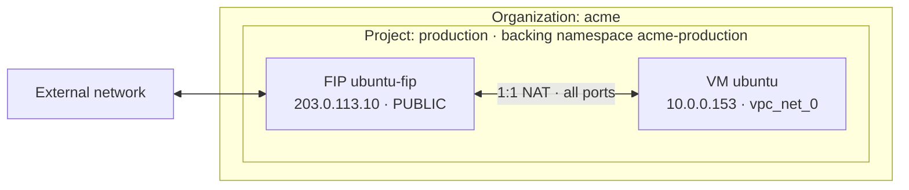
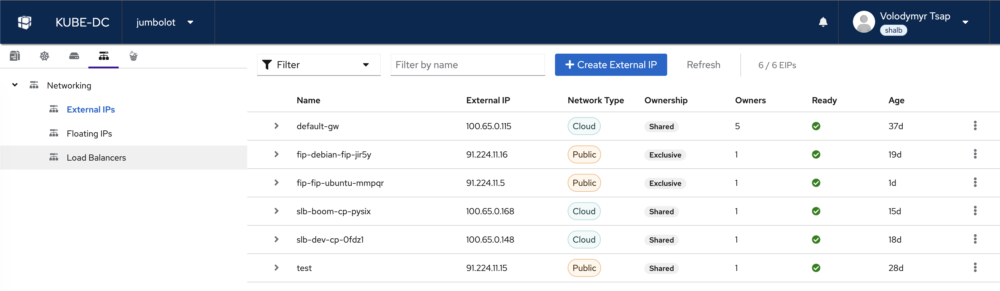

import FloatingIpToVmDiagram from '@site/src/components/Diagram/FloatingIpToVmDiagram';
import {
  GatewayIngressDiagram,
  LoadBalancerIngressDiagram,
  OutboundTrafficDiagram,
} from '@site/src/components/Diagram/CloudFlowDiagrams';
import {ExposureDecisionDiagram} from '@site/src/components/Diagram/CloudTopologyDiagrams';

# How Networking Works

This page explains Kube-DC networking concepts — how your project connects to the internet, how traffic flows, and which tools are available to expose your services.

## Key Concepts

| Resource | What It Does |
|----------|-------------|
| **VPC** | Isolated virtual network for your project — all VMs and pods get private IPs here |
| **Subnet** | Private IP range chosen for the Project when it is created |
| **EIP** (External IP) | Cloud-internal or public address used by a Project gateway or LoadBalancer Service |
| **FIP** (Floating IP) | One-to-one NAT mapping from an external address to a VM or another selected internal IP |
| **LoadBalancer** | Kubernetes Service that routes external traffic to pods or VMs via an EIP |
| **Gateway Route** | HTTP or HTTPS route through the shared Envoy Gateway; HTTPS uses a configured Project Issuer |
| **Routed Network** | Organization-authorized L3 routes from the whole Project VPC to approved external destinations; Internet remains unchanged |

---

## Project Network Types

A Project selects the address pool for its default gateway when it is created. Both network types keep workloads on private Project addresses and use source NAT (SNAT) for outbound traffic. The choice does not, by itself, expose a workload.

### Cloud Network (`egressNetworkType: cloud`)

- The default gateway receives an internal cloud address.
- Internet-bound traffic continues through platform upstream networking.
- The gateway address is not directly reachable from the public internet.
- Use a Gateway Route, or allocate a public EIP or FIP when your provider and quota allow it.

### Public Network (`egressNetworkType: public`)

- The default gateway receives an internet-routable address.
- Outbound traffic is SNATed to that address.
- Inbound traffic still requires an explicit Gateway Route, LoadBalancer Service, or FIP and remains subject to platform and workload policy.

### Comparison

| Feature | Cloud | Public |
|---------|-------|--------|
| **Default gateway address** | Cloud-internal | Internet-routable |
| **Outbound internet through SNAT** | Yes | Yes |
| **Gateway Routes** | Supported | Supported |
| **LoadBalancer Services and FIPs** | Subject to provider configuration and quota | Subject to provider configuration and quota |

---

## How Traffic Flows

### Outbound (VM/Pod → Internet)

<details data-github-only>
<summary>Diagram source for GitHub</summary>

```
VM/Pod (10.0.0.x)  →  Project Router  →  SNAT via EIP  →  Internet
```

</details>

<OutboundTrafficDiagram />

Every Project has a default EIP for outbound SNAT. Internet access remains subject to platform egress policy and upstream availability.

### Inbound via Gateway Route (HTTPS)

<details data-github-only>
<summary>Diagram source for GitHub</summary>

```
Client  →  DNS (*.<configured-base-domain>)  →  Envoy Gateway (shared IP, port 443)
        →  TLS termination (certificate from the Project's `letsencrypt` Issuer)
        →  HTTPRoute matches hostname
        →  Backend Service  →  Pod
```

</details>

<GatewayIngressDiagram />

One shared Envoy Gateway handles HTTPS traffic. By default, each Service receives a hostname in the form `<service>-<workload-namespace>.<base-domain>`. Before creating an HTTPS route, create the namespaced `letsencrypt`
Issuer described in [Service Exposure](service-exposure.md#step-1-create-the-issuer-once-per-project).

### Inbound via EIP + LoadBalancer

<details data-github-only>
<summary>Diagram source for GitHub</summary>

```
Client  →  EIP (dedicated IP, any port)  →  OVN LoadBalancer  →  Pod/VM
```

</details>

<LoadBalancerIngressDiagram />

The EIP is bound to a LoadBalancer Service and supports any declared TCP or UDP service port.

### Inbound via Floating IP

<details data-github-only>
<summary>Diagram source for GitHub</summary>

```
Client  →  External IP  →  1:1 NAT  →  VM internal IP (all ports)
```

</details>

A FIP maps an external address to a VM or selected internal IP. Reachability remains subject to platform controls and the guest or workload firewall.

The Floating IP belongs to Project `production` in Organization `acme`. Its
resource is stored in the Project's `acme-production` backing namespace, while
the public address remains mapped at the platform edge rather than configured
inside the guest.

<details data-github-only>
<summary>Diagram source for GitHub</summary>



</details>

<FloatingIpToVmDiagram />

---

## Network MTU (1400)

Kube-DC Cloud Project networks use an encapsulated overlay, so the usable MTU inside a project is **1400 bytes**, not the 1500 you may be used to. Your VMs and pods are configured with this automatically — a VM's interface picks up 1400 over DHCP, and pods get it from the network plugin. You normally never need to think about it.

Self-managed installations may use a different overlay MTU. Check the workload interface with `ip link show` and use your installation's actual value before hard-coding runtime settings.

**The exception is software that assumes 1500 and doesn't inherit the MTU from its host — most commonly Docker.** If you install Docker inside a VM, its default bridge is created with an MTU of 1500. Containers on that bridge then send packets too large for the 1400 network, and those packets are silently dropped.

This produces a distinctive failure: **small requests succeed, large transfers hang and then fail.**

```
# Succeeds — a small response fits
RUN curl -v https://github.com/example/repo

# Fails — bulk data does not
RUN git clone --depth 1 https://github.com/example/repo /src
  error: RPC failed; curl 56 Recv failure: Connection reset by peer
  fatal: expected flush after ref listing
```

It looks like a broken network, but connectivity is fine — only the oversized packets are lost. `docker pull`, `apt-get`, `npm install` and similar can fail the same way.

### Which side is at fault?

Run the failing command **directly on the VM**, outside Docker:

| Result | Cause | Fix |
|--------|-------|-----|
| Works on the VM, fails in Docker | Docker's container MTU | Set Docker's MTU (below) |
| Fails on the VM too | The VM's own interface | Check `ip link show` — it should report `mtu 1400` |

### Fix: set Docker's MTU

Create or edit `/etc/docker/daemon.json` inside the VM:

```json
{
  "mtu": 1400
}
```

Then restart Docker:

```bash
sudo systemctl restart docker
```

Verify a container now gets the right MTU:

```bash
# Should print 1400. Before the fix it prints 1500.
docker run --rm alpine ip link show eth0

# The VM itself should already show 1400
ip link show
```

If you build with BuildKit or `docker buildx`, recreate the builder after changing the daemon config so it picks up the new MTU — or build with `--network=host` so build steps use the VM's interface directly.

Other container runtimes take the same setting: Podman uses `mtu` in its network config, and standalone containerd/CNI sets it in the bridge plugin config.

## Managing Networking via UI

The Console UI provides a **Networking** section with three tabs for managing network resources:



- **External IPs** — view and create EIPs, see network type (Cloud/Public), ownership, and status
- **Floating IPs** — manage FIP-to-VM mappings
- **Load Balancers** — view LoadBalancer services and their endpoints

Use the **+ Create External IP** button to allocate a new EIP for your project.

---

## Which Method Should I Use?

<details data-github-only>
<summary>Diagram source for GitHub</summary>

```
What are you exposing?
│
├── Web app or API?
│   └── Use Gateway Route (expose-route: https)
│       → Automatic hostname and TLS after the one-time Issuer setup
│
├── VM with direct SSH/RDP access?
│   └── Use Floating IP (FIP)
│       → Dedicated IP, all ports, 1:1 NAT
│
├── Custom TCP/UDP service, including gRPC?
│   └── Use EIP + LoadBalancer
│       → Dedicated IP, any protocol, specific ports
│
└── Multiple services on one IP?
    └── Use default gateway EIP + LoadBalancer
        → Shared IP, different ports per service
```

</details>

<ExposureDecisionDiagram />

| Method | Protocols | TLS | IP Type | Best For |
|--------|-----------|-----|---------|----------|
| **Gateway Route** | HTTP, HTTPS, TLS passthrough | Automatic for HTTPS through the configured Issuer | Shared | Web apps, APIs |
| **Floating IP** | All TCP/UDP (all ports) | None | Dedicated | VM direct access |
| **EIP + LoadBalancer** | Any TCP/UDP | Application handles | Dedicated or shared | Custom services |

---

## Next Steps

- [Routed Networks](routed-networks.md) — Connect a whole Project VPC to approved corporate or datacenter destinations
- [External & Floating IPs](public-floating-ips.md) — Create and manage EIPs and FIPs
- [VPC & Private Networking](private-networking.md) — Understand project isolation and subnets
- [Datacenter VLANs](datacenter-vlans.md) — Put workloads on a physical network segment to reach your own hardware
- [Service Exposure Guide](service-exposure.md) — Complete reference for all exposure methods with examples
