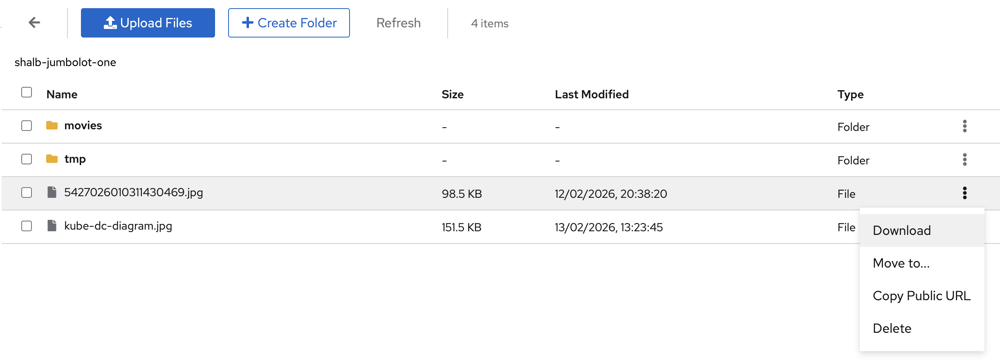

# Object Storage (S3)

Kube-DC provides S3-compatible object storage for storing files, images, backups, and any unstructured data. You can manage buckets and files through the dashboard or use standard S3 tools like AWS CLI, s3cmd, and boto3.

## Buckets

A **bucket** is a container for your objects (files). Each bucket has a unique name, its own access credentials, and can be set to **Private** or **Public Read** access.

The Object Storage view shows all your buckets with their S3 bucket name, status, access level, credentials availability, and age. The sidebar tree provides quick navigation between **Overview**, **Buckets**, and **Access Keys**.

Click on a bucket to expand its details:

- **General Information** — Name, S3 bucket name, backing namespace, storage class, status, and creation date
- **S3 Connection** — Endpoint URL, region, access toggle (Public/Private), and public URL
- **Bucket Credentials** — Per-bucket Access Key ID and Secret Access Key
- **Actions** — Browse Files or Delete the bucket

### Create a Bucket

#### Via Dashboard

1. Navigate to your project → **Object Storage** → **Buckets**
2. Click **+ Create Bucket**
3. Enter a bucket name (lowercase, alphanumeric, hyphens allowed)
4. Click **Create**

New buckets start private. After the bucket reaches `Bound`, expand its details and use the access toggle if you need **Public Read**.

The bucket name in S3 is prefixed with the Project's backing namespace for uniqueness (for example, bucket `one` becomes `acme-production-one`).

#### Via kubectl

Create an `ObjectBucketClaim` in the Project's backing namespace:

```yaml
apiVersion: objectbucket.io/v1alpha1
kind: ObjectBucketClaim
metadata:
  name: my-bucket
  namespace: acme-production
  labels:
    kube-dc.com/organization: acme
spec:
  bucketName: acme-production-my-bucket
  storageClassName: ceph-bucket
```

The `kube-dc.com/organization` label must identify the owning Organization. The dashboard uses it to attribute manually created claims in Organization usage and bucket totals.

When the claim is bound, Rook automatically creates a **Secret** and **ConfigMap** in the same namespace with the bucket's S3 credentials:

```bash
# Check bucket status
kubectl get objectbucketclaim -n acme-production

# Get per-bucket S3 credentials
kubectl get secret my-bucket -n acme-production -o yaml

# Get bucket connection info
kubectl get configmap my-bucket -n acme-production -o yaml
```

The ConfigMap contains:
- `BUCKET_HOST` — Internal S3 endpoint
- `BUCKET_NAME` — Full bucket name in S3
- `BUCKET_PORT` — Service port
- `BUCKET_REGION` — Region identifier

### Bucket Access: Private vs Public

- **Private** (default) — Only accessible with valid S3 credentials
- **Public Read** — Anyone with the URL can read objects; writing still requires credentials

Toggle access from the bucket detail view in the dashboard. The **S3 Connection** panel shows the endpoint configured for your installation. Public object URLs follow this pattern:

```
<S3_ENDPOINT>/<bucket-name>/<object-key>
```

### Delete a Bucket

```bash
kubectl delete objectbucketclaim my-bucket -n acme-production
```

:::warning
Deleting a bucket removes all objects inside it permanently.
:::

## File Browser

The built-in file browser lets you manage objects directly from the dashboard without any external tools.



From the bucket detail view, click **Browse Files** to open the file browser. You can:

- **Upload Files** — Click **Upload Files** and select one or more files
- **Create Folders** — Click **+ Create Folder** to organize objects into prefixes
- **Download** — Right-click or use the action menu to download files
- **Move** — Move objects to a different folder within the bucket
- **Copy Public URL** — Get a direct link for public buckets
- **Delete** — Remove individual files or folders

The file browser shows each object's name, size, last modified date, and type (File or Folder).

## Access Keys

Kube-DC exposes two credential scopes:

### Organization Account Keys

The **Access Keys** section manages credentials for the Organization's RGW account. These keys can operate buckets owned by that account and are also used by the platform for account administration and usage reporting.

Buckets created through the dashboard or as standard ObjectBucketClaims are owned by separate, per-bucket users. Organization account keys do **not** grant data access to every ObjectBucketClaim in the Organization.

The Access Keys view shows:

- **Credentials** — Your primary Access Key ID, Secret Access Key (click to reveal), S3 endpoint, and region
- **Key Management** — Generate additional keys or revoke existing ones

Use Organization account keys only with buckets owned by that account. For dashboard-created buckets and ObjectBucketClaims, use the per-bucket credentials below. The **Access Keys** view shows the configured S3 endpoint and region.

### Per-Bucket Keys

Each dashboard-created bucket or ObjectBucketClaim has its own credentials, available in the bucket detail view or as a Kubernetes Secret in its backing namespace:

```bash
# Get per-bucket credentials
kubectl get secret my-bucket -n acme-production -o jsonpath='{.data.AWS_ACCESS_KEY_ID}' | base64 -d
kubectl get secret my-bucket -n acme-production -o jsonpath='{.data.AWS_SECRET_ACCESS_KEY}' | base64 -d
```

Per-bucket keys are scoped to that specific bucket only.

## Using S3 Tools

The examples below use a bucket's per-bucket credentials. Set `S3_ENDPOINT` to the endpoint shown in the bucket detail or Access Keys view.

### AWS CLI

```bash
export S3_ENDPOINT='https://s3.your-provider.example'

# Configure credentials
aws configure set aws_access_key_id YOUR_ACCESS_KEY
aws configure set aws_secret_access_key YOUR_SECRET_KEY

# Upload a file
aws --endpoint-url "$S3_ENDPOINT" s3 cp myfile.txt s3://acme-production-my-bucket/

# Download a file
aws --endpoint-url "$S3_ENDPOINT" s3 cp s3://acme-production-my-bucket/myfile.txt ./

# List objects in a bucket
aws --endpoint-url "$S3_ENDPOINT" s3 ls s3://acme-production-my-bucket/

# Sync a directory
aws --endpoint-url "$S3_ENDPOINT" s3 sync ./backups s3://acme-production-my-bucket/backups/
```

### Python (boto3)

```python
import os
import boto3

s3 = boto3.client(
    's3',
    endpoint_url=os.environ['S3_ENDPOINT'],
    aws_access_key_id='YOUR_ACCESS_KEY',
    aws_secret_access_key='YOUR_SECRET_KEY',
)

# List objects in the bucket available to these credentials
response = s3.list_objects_v2(Bucket='acme-production-my-bucket')
for item in response.get('Contents', []):
    print(item['Key'])

# Upload a file
s3.upload_file('myfile.txt', 'acme-production-my-bucket', 'myfile.txt')

# Download a file
s3.download_file('acme-production-my-bucket', 'myfile.txt', 'downloaded.txt')
```

### s3cmd

```bash
export S3_HOST='s3.your-provider.example'

# Configure
s3cmd --configure \
  --host="$S3_HOST" \
  --host-bucket="$S3_HOST" \
  --access_key=YOUR_ACCESS_KEY \
  --secret_key=YOUR_SECRET_KEY

# List objects
s3cmd ls s3://acme-production-my-bucket/

# Upload
s3cmd put myfile.txt s3://acme-production-my-bucket/
```

### Using Credentials from Kubernetes Secrets

For workloads running inside your project, you can mount the per-bucket credentials directly:

```yaml
apiVersion: v1
kind: Pod
metadata:
  name: s3-worker
  namespace: acme-production
spec:
  restartPolicy: Never
  containers:
    - name: worker
      image: amazon/aws-cli
      command: ["/bin/sh", "-c"]
      args:
        - >-
          aws --endpoint-url "http://${BUCKET_HOST}:${BUCKET_PORT}"
          s3 ls "s3://${BUCKET_NAME}/"
      env:
        - name: AWS_ACCESS_KEY_ID
          valueFrom:
            secretKeyRef:
              name: my-bucket
              key: AWS_ACCESS_KEY_ID
        - name: AWS_SECRET_ACCESS_KEY
          valueFrom:
            secretKeyRef:
              name: my-bucket
              key: AWS_SECRET_ACCESS_KEY
        - name: BUCKET_HOST
          valueFrom:
            configMapKeyRef:
              name: my-bucket
              key: BUCKET_HOST
        - name: BUCKET_PORT
          valueFrom:
            configMapKeyRef:
              name: my-bucket
              key: BUCKET_PORT
        - name: AWS_DEFAULT_REGION
          valueFrom:
            configMapKeyRef:
              name: my-bucket
              key: BUCKET_REGION
        - name: BUCKET_NAME
          valueFrom:
            configMapKeyRef:
              name: my-bucket
              key: BUCKET_NAME
```

## Quotas

Object storage limits depend on your provider, Organization allocation, and current plan. Use the **Billing** page as the source of truth for the limits presented by your installation; do not rely on fixed plan values in automation.

The **Object Storage Overview** aggregates usage for ObjectBucketClaims carrying the correct `kube-dc.com/organization` label.

The standard Rook ObjectBucketClaim provisioner creates a separate S3 user for each bucket. The Organization account quota displayed by Kube-DC is therefore not, by itself, an aggregate admission boundary for those per-bucket users. Do not assume that crossing the displayed limit will automatically reject a new claim or upload; your provider may apply additional enforcement.

## Quick Reference

| Action | Command |
|--------|---------|
| List buckets | `kubectl get objectbucketclaims -n acme-production` |
| Create bucket | `kubectl apply -f bucket.yaml` |
| Delete bucket | `kubectl delete objectbucketclaim <name> -n acme-production` |
| Get bucket credentials | `kubectl get secret <bucket-name> -n acme-production` |
| Get bucket config | `kubectl get configmap <bucket-name> -n acme-production` |
| S3 list objects (AWS CLI) | `aws --endpoint-url "$S3_ENDPOINT" s3 ls s3://bucket/` |
| S3 upload | `aws --endpoint-url "$S3_ENDPOINT" s3 cp file s3://bucket/` |

## Next Steps

- [Block Storage](block-storage.md) — Persistent volumes for VMs and containers
- [Backups & Snapshots](backups-snapshots.md)
