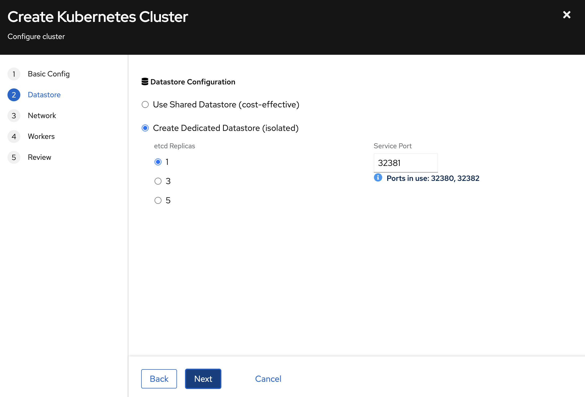
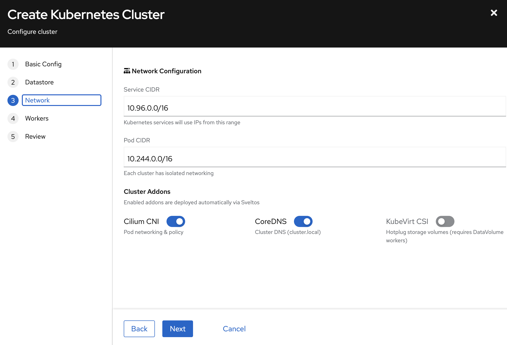
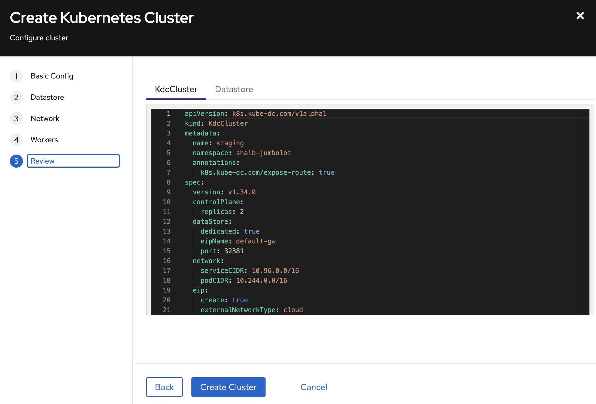
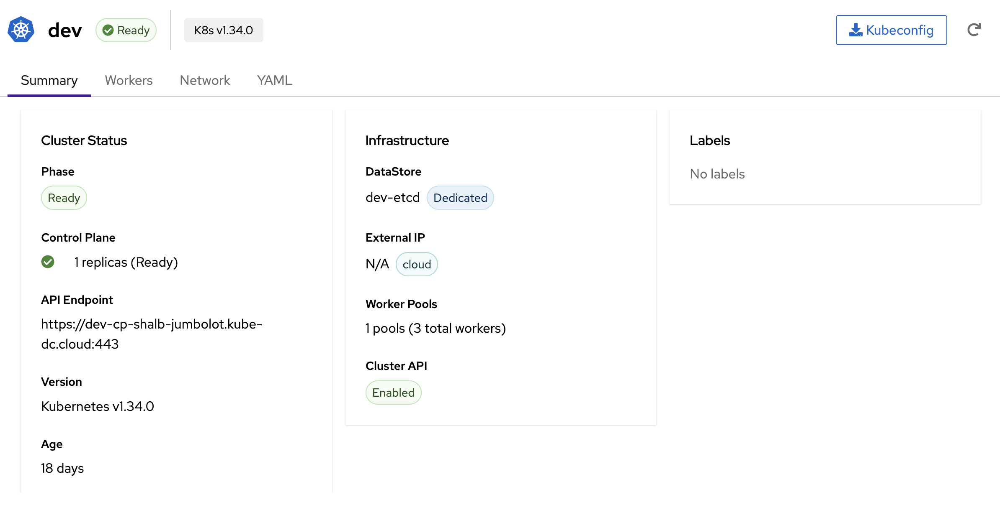

# Provision a Managed Cluster

A **Managed Cluster** is a Kubernetes cluster with its own API, control plane, worker nodes, and networking. Kube-DC keeps its infrastructure resources in the owning Project's backing namespace (`{organization}-{project}`), while you administer cluster workloads through a separate Managed Cluster kubeconfig.

## How It Works

When you create a Managed Cluster, Kube-DC orchestrates several components:

- **Control Plane** — Managed by [Kamaji](https://kamaji.clastix.io/). The API server, scheduler, and controller manager run as pods in your Project's backing namespace — no VMs needed for the control plane.
- **Worker Nodes** — Provisioned through [Cluster API](https://cluster-api.sigs.k8s.io/). KubeVirt-backed workers run as VMs on the management cluster; provider catalogs can also offer CloudSigma-backed workers.
- **etcd DataStore** — A dedicated or shared etcd cluster stores your Kubernetes state, managed automatically with TLS certificates and persistent storage.
- **Cloud Controller Manager (CCM)** — Bridges your Managed Cluster with the infrastructure, enabling LoadBalancer services and node lifecycle management.
- **Cluster add-ons** — Cilium CNI, CoreDNS, and a provider-compatible CSI driver are deployed automatically via [Sveltos](https://projectsveltos.github.io/sveltos/).

The diagram below shows a KubeVirt-backed example for Project `production`, whose backing namespace is `acme-production`.

```
┌───────────────────── Management cluster ───────────────────────────┐
│                                                                    │
│  ┌────────────── Project infrastructure: acme-production ────────┐ │
│  │                                                               │ │
│  │  KdcCluster "dev"                                             │ │
│  │    ├── Service: dev-cp (LoadBalancer → API server)            │ │
│  │    ├── TenantControlPlane: dev-cp (Kamaji)                    │ │
│  │    │     └── Pods: api-server, scheduler, controller-manager  │ │
│  │    ├── KdcClusterDatastore: dev-etcd                          │ │
│  │    │     └── StatefulSet: dev-etcd-etcd (etcd cluster)        │ │
│  │    ├── MachineDeployment: dev-workers                         │ │
│  │    │     └── VMs: dev-workers-xxxxx (KubeVirt)                │ │
│  │    └── CCM Deployment: kccm-dev                               │ │
│  │                                                               │ │
│  └───────────────────────────────────────────────────────────────┘ │
└────────────────────────────────────────────────────────────────────┘
                              │
                              ▼
┌────────────────── Managed Cluster "dev" ──────────────────────────┐
│  Nodes: worker-1, worker-2, worker-3                              │
│  Your workloads: Deployments, Services, PVCs                      │
└───────────────────────────────────────────────────────────────────┘
```

## Prerequisites

- A Kube-DC Cloud [Project](first-project.md) with sufficient resource quota
- For kubectl access: [kubeconfig configured](cli-kubeconfig.md) for the platform Project

## Managed Clusters View

Navigate to **Kubernetes** in your Project to view its Managed Clusters:

The view shows each Managed Cluster's version, phase, API endpoint, datastore backend, and age. Use **Create Managed Cluster** to open the wizard. From a Managed Cluster row or detail view, you can inspect status, use the **Kubeconfig** action, or open **Delete Managed Cluster**.

## Create a Managed Cluster in the Console

The console provides a guided 5-step wizard.

### Step 1: Basic Configuration

- **Managed Cluster Name** — Unique within your Project (2–12 characters; lowercase letters, numbers, and hyphens).
- **Kubernetes Version** — Select the desired version (e.g., `v1.35.0`).
- **Control Plane Replicas**:
  - `1` — Development
  - `2` — High Availability
  - `3` — Production
- **Expose API endpoint externally (via TLSRoute)** — Check this to make the API reachable from outside the cluster network (e.g., `https://dev-cp-acme-production.kube-dc.cloud:443`).
- **Enable etcd encryption at rest** — Encrypt supported API resources with a Project KMS key.

### Step 2: Datastore Configuration



Choose how the Managed Cluster's etcd state is stored:

| Mode | Description | Best For |
|------|-------------|----------|
| **Shared Datastore** (cost-effective) | Multiple Managed Clusters use an existing shared etcd datastore | Development, staging |
| **Dedicated Datastore** (isolated) | The Managed Cluster gets its own etcd datastore | Production workloads |

For dedicated datastores:

- **etcd Replicas** — `1` for development, `3` for production high availability, or `5` for maximum redundancy.

The console allocates the dedicated datastore service port automatically from the free range `32380`–`32499`; it is not a user setting. The Managed Cluster reaches etcd members over DNS on port `2379`.

### Step 3: Network & Add-ons



- **Service CIDR** — IP range for Kubernetes Services (default: `10.96.0.0/16`). Each cluster has isolated networking.
- **Pod CIDR** — IP range for Pods (default: `10.244.0.0/16`).

**Cluster add-ons** deployed automatically:

| Add-on | Description | Recommended |
|-------|-------------|-------------|
| **Cilium CNI** | Pod networking and network policy | Yes (required) |
| **CoreDNS** | Cluster DNS (`cluster.local`) | Yes (required) |
| **Provider CSI** | Persistent storage; KubeVirt uses hotplug DataVolumes | Enable for stateful workloads |

### Step 4: Worker Pools


Define one or more worker pools — each a group of identically configured VMs:

- **Pool Name** — Identifier (e.g., `workers`).
- **Replicas** — Number of worker VMs.
- **CPU Cores** / **Memory (GB)** — Resources per worker.
- **Worker Type** — `DataVolume (Persistent)` provides root disks that survive VM restarts.
- **Container Image** — OS image for worker VMs (e.g., `Ubuntu 24.04 + K8s v1.35.2`).

Click **Add Pool** to add pools with different configurations (e.g., a general pool and a high-memory pool).

### Step 5: Review and Create



The Review step shows the exact YAML manifests that will be applied. Inspect both the **KdcCluster** and **Datastore** tabs to verify the configuration.

Click **Create Cluster** to start provisioning the Managed Cluster.

## Create a Managed Cluster with kubectl

Apply a `KdcCluster` resource to your Project's backing namespace:

```yaml
apiVersion: k8s.kube-dc.com/v1alpha1
kind: KdcCluster
metadata:
  name: dev
  namespace: acme-production
  annotations:
    k8s.kube-dc.com/expose-route: "true"
spec:
  version: v1.35.0
  controlPlane:
    replicas: 1
  dataStore:
    dedicated: true
    eipName: default-gw
    port: 32381
  network:
    serviceCIDR: 10.96.0.0/16
    podCIDR: 10.244.0.0/16
  eip:
    create: true
    externalNetworkType: cloud
  enableClusterAPI: true
  workers:
    - name: workers
      replicas: 3
      cpuCores: 2
      memory: 8Gi
      diskSize: 30Gi
      image: docker.io/shalb/ubuntu-2404-container-disk:v1.35.2
      architecture: amd64
      infrastructureProvider: kubevirt
      storageType: datavolume
```

```bash
kubectl apply -f cluster.yaml
```

### Spec Reference

| Field | Description | Default |
|-------|-------------|---------|
| `spec.version` | Kubernetes version | Required |
| `spec.controlPlane.replicas` | API server replicas (1–5) | `2` |
| `spec.dataStore.dedicated` | Create dedicated etcd | `false` |
| `spec.dataStore.eipName` | EIP for datastore LoadBalancer | `default-gw` |
| `spec.dataStore.port` | Optional dedicated datastore service port; it must be unique on the selected EIP. The console allocates `32380`–`32499`; the API defaults to `2379` when omitted. | `2379` |
| `spec.network.serviceCIDR` | Kubernetes service CIDR | `10.96.0.0/12` |
| `spec.network.podCIDR` | Pod network CIDR | `10.244.0.0/16` |
| `spec.eip.create` | Auto-create EIP for API server | `true` |
| `spec.eip.externalNetworkType` | `cloud` or `public` | `public` |
| `spec.enableClusterAPI` | Enable Cluster API worker management | `false` |
| `spec.workers[].name` | Worker pool name (unique) | Required |
| `spec.workers[].replicas` | Number of workers in pool | `2` |
| `spec.workers[].cpuCores` | CPU cores per worker | `1` |
| `spec.workers[].memory` | Memory per worker | `2Gi` |
| `spec.workers[].image` | KubeVirt worker image; choose one compatible with `spec.version` | Platform default |
| `spec.workers[].storageType` | `datavolume` (persistent) or `containerdisk` (ephemeral) | `datavolume` |
| `spec.workers[].infrastructureProvider` | `kubevirt` or `cloudsigma` | `kubevirt` |
| `spec.encryption.etcd.enabled` | Encrypt selected API data at rest in the cluster's etcd (Secrets by default) (KMS v2 envelope via OpenBao Transit) — see [Encryption at Rest](#encryption-at-rest) | `false` |
| `spec.encryption.etcd.kekRotation.enabled` | Auto-rotate the Key Encryption Key on a schedule | `false` |
| `spec.encryption.etcd.kekRotation.interval` | Duration between rotations (units: `d`, `h`, `m`, `s` — `w` is not accepted). Must be ≥ 7d and ≥ `spec.backup.retentionDays`. | — |

### Annotations

| Annotation | Description |
|------------|-------------|
| `k8s.kube-dc.com/expose-route: "true"` | Expose API endpoint externally via TLSRoute (recommended for cloud network type) |
| `kube-dc.com/restore-from` | Selects a snapshot for a disruptive restore of an existing Managed Cluster. Adding it starts the restore workflow; it is not a first-boot option. Plaintext `.db` keys and envelope directories are detected automatically. Use the cluster detail view's danger zone and read [Backups and Recovery](backups-snapshots.md) before restoring. |

## Encryption at Rest

Your cluster's `etcd` stores everything `kubectl` returns — Secrets,
ConfigMaps, CRDs, ServiceAccount tokens. By default these are written
to disk in plaintext. Flipping a single field encrypts them with
**KMS v2 envelope encryption**: each row gets a fresh AES-256-GCM data
key (DEK), and the DEK is wrapped by a per-cluster Key Encryption Key
(KEK) that lives in Kube-DC's OpenBao Transit engine and never leaves
in plaintext.

```yaml
spec:
  encryption:
    etcd:
      enabled: true
```

That setting enables the default encryption flow: a
per-cluster `KMSKey` is auto-created, the apiserver starts with a KMS
plugin sidecar, and every new Secret you create from that point on is
stored encrypted. **Existing Secrets are re-encrypted on their next update.** Do not use a delete-and-recreate sweep: it can rotate generated metadata, interrupt controllers, and remove resources between operations. Plan a controlled maintenance workflow with your platform operator when existing data must be rewritten immediately.

To check it took effect:

```bash
kubectl get kdccluster <name> -o jsonpath='{.status.encryption}'
```

You should see a `resolvedKeyRef` (the name of the auto-created KMSKey)
and `kekRotation.currentVersion: 1`.

### Rotating the KEK

Encryption-at-rest by itself doesn't rotate the wrapping key —
schedule that explicitly:

```yaml
spec:
  encryption:
    etcd:
      enabled: true
      kekRotation:
        enabled: true
        interval: 90d
```

Rules:

- Units are `d`, `h`, `m`, `s` (no `w`).
- Minimum 7 days, maximum 730 days.
- Interval must be ≥ `spec.backup.retentionDays * 24h`. The rationale:
  rotating faster than backups age out leaves historic backups bound
  to key versions you'd have to manage by hand.

Rotation creates a new Transit key version. Old key versions stay
alive — historic Secrets and backups remain decryptable indefinitely.
Bulk re-wrap of existing rows is not done automatically (each row
re-wraps on next Update); a CLI-driven sweep is planned for a future
release.

Status:

```bash
kubectl get kdccluster <name> -o jsonpath='{.status.encryption.kekRotation}'
# {"currentVersion":2,"enabled":true,"lastRotatedTime":"...","minDecryptionVersion":1,"nextRotationTime":"..."}
```

### Backups stay encrypted too

When `encryption.etcd.enabled: true`, `spec.backup.enabled: true`, and the
platform's managed backup bucket is available, the per-cluster snapshot CronJob
writes envelope-encrypted snapshots to S3 as three sibling objects. Enabling the
field alone does not provision object storage; confirm the Managed Cluster's
backup status on each installation.

See [Backups & Snapshots](backups-snapshots.md). Restoring an encrypted snapshot
also requires OpenBao access, so possession of the S3 objects is not sufficient
to decrypt them.

### Limits

- **What's encrypted:** `Secret` values by default. Opt into
  `ConfigMap` too via `spec.encryption.etcd.resources: ["secrets",
  "configmaps"]`. Other resources (`leases`, `events`, `endpoints`,
  `pods`) stay plaintext for the high-write-rate / low-sensitivity
  reasons — see the design doc on the public site.
- **What's NOT encrypted:** application data on PVCs. Use a workload-
  side mechanism (LUKS-backed StorageClass, application encryption,
  Velero with restic) for that.
- **Disabling:** flipping `enabled: false` on a cluster that was
  previously encrypted is intentionally blocked — the apiserver would
  fail to read existing rows. Contact your cluster admin for the
  documented two-step migration.

## Monitor Managed Cluster Creation

```bash
# Watch cluster status
kubectl get kdccluster -n acme-production -w

# Example output:
# NAME   VERSION   PHASE   ENDPOINT                                        DATASTORE   AGE
# dev    v1.35.0   Ready   https://dev-cp-acme-production.kube-dc.cloud:443     dev-etcd    5m

# Check datastore status
kubectl get kdcclusterdatastores -n acme-production

# Example output:
# NAME       READY   DEDICATED   DATASTORE   AGE
# dev-etcd   Ready   true        dev-etcd    5m
```

Provisioning time depends on worker capacity, image availability, and networking. The cluster moves through these phases: `Pending` → `WaitingForService` → `Provisioning` → `Ready`.

## Access the Managed Cluster

### In the Console

Once the Managed Cluster is `Ready`, use **Kubeconfig** on its detail page to download the kubeconfig file.



The cluster detail page shows:

- **Phase** — Current state (Ready)
- **Control Plane** — Replicas and health status
- **API Endpoint** — The external URL (e.g., `https://dev-cp-acme-production.kube-dc.cloud:443`)
- **DataStore** — etcd name and type (Shared/Dedicated)
- **Worker Pools** — Number of pools and total workers
- Tabs for **Summary**, **Workers**, **Network**, and **YAML** views

### With kubectl

Use the **Kubeconfig** action in the cluster detail view. For a cluster with an external API endpoint, the equivalent Project-level command reads the generated external kubeconfig:

```bash
kubectl get secret dev-cp-admin-kubeconfig-external -n acme-production \
  -o jsonpath='{.data.admin\.conf}' | base64 -d > /tmp/dev-kubeconfig

kubectl --kubeconfig=/tmp/dev-kubeconfig get nodes
```

If the external Secret does not exist, the cluster API is private. Its internal kubeconfig is intended for clients with connectivity to the platform network; enable the external API endpoint or use an approved private access path before downloading it to a workstation.

## Managed Cluster Infrastructure

When you create a Managed Cluster, its `KdcCluster` and related infrastructure resources are provisioned automatically in the Project's backing namespace:

| Resource | Name Pattern | Purpose |
|----------|-------------|---------|
| `Service` (LoadBalancer) | `{cluster}-cp` | API server endpoint |
| `Service` (ClusterIP) | `{cluster}-cp-ext` | External DNS endpoint |
| `TenantControlPlane` | `{cluster}-cp` | Kamaji control plane pods |
| `KdcClusterDatastore` | `{cluster}-etcd` | etcd (if dedicated) |
| `StatefulSet` | `{cluster}-etcd-etcd` | etcd pods |
| `Service` (LoadBalancer) | `{cluster}-etcd-etcd-lb` | etcd external access |
| `Cluster` (CAPI) | `{cluster}` | Cluster API cluster object |
| `MachineDeployment` | `{cluster}-{pool}` | Worker pool VMs |
| `Deployment` | `kccm-{cluster}` or `csccm-{cluster}` | Provider Cloud Controller Manager |

**Example** — Services created for cluster `dev` in the `acme-production` backing namespace:

```
$ kubectl get svc -n acme-production | grep dev
dev-cp                  LoadBalancer   10.101.79.219    100.65.0.148   6443/TCP    18d
dev-cp-ext              ClusterIP      None             <none>         6443/TCP    18d
dev-etcd-etcd           ClusterIP      None             <none>         2379/TCP    18d
dev-etcd-etcd-lb        LoadBalancer   10.101.20.207    100.65.0.115   32382/TCP   18d
dev-etcd-etcd-lb-ext    ClusterIP      None             <none>         32382/TCP   18d
```

## Next Steps

- [Cluster Management](cluster-management.md) — Exposing services, persistent storage, scaling, and operations
- [CLI & Kubeconfig Access](cli-kubeconfig.md)
