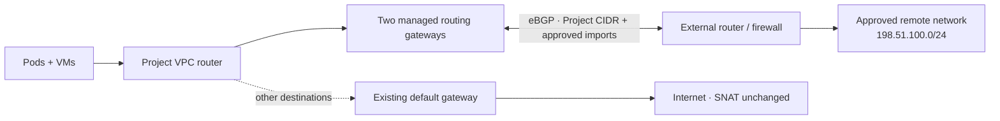

import RoutedNetworkDiagram from '@site/src/components/Diagram/RoutedNetworkDiagram';

# Routed Networks

A Routed Network connects your entire Project VPC to specific destinations on
an external corporate or datacenter network. Your platform administrator
manages the physical connection and BGP; an Organization administrator decides
which Projects may use an allocated network.

This is not a second workload interface:

| Need | Use |
|---|---|
| Every workload in a Project should route to approved external prefixes | Routed Network |
| Selected pods or VMs need a NIC directly on a physical segment | [Datacenter VLAN](datacenter-vlans.md) |
| Publish a Service or VM to the Internet | [Service exposure](service-exposure.md) or [Floating IP](public-floating-ips.md) |

<details data-github-only>
<summary>Diagram source for GitHub</summary>



</details>

<RoutedNetworkDiagram />

Three guarantees are always visible in the console:

- **Internet gateway: unchanged.** Only the approved destinations use the
  Routed Network; your existing default route remains in place.
- **BGP is managed by your Organization.** You do not provide peers, ASNs,
  passwords, route maps, or advertisements.
- **These routes are available to this Project only.** Attaching another
  Project does not connect the two Projects.

## Who can do what

- A platform administrator creates the physical routing fabric, approves
  destination prefixes, and allocates the Routed Network to an Organization.
- An Organization administrator attaches or detaches the allocation from a
  Project in that Organization.
- Project administrators and users can view Project status but cannot attach,
  change routing policy, or edit generated gateways.

Routed Networks may not appear in your console until the platform enables this
feature and assigns an allocation to your Organization.

## Attach a Project

Open **Organization → Networks → Routed Networks**. The page lists allocations
for your Organization, their approved destinations, aggregate BGP health, and
the Projects currently attached.

Choose a Project and select **Attach**. Kube-DC then creates two managed routing
gateways, establishes BGP, and adds only the approved destination routes to the
Project VPC. No pod or VM restart is required because the relationship belongs
to the VPC, not to an individual interface.

The equivalent request is:

```yaml
apiVersion: kube-dc.com/v1
kind: ProjectRouteAttachment
metadata:
  name: corporate
  namespace: acme-production
spec:
  allocationRef: corporate-services
  direction: routed-egress
```

Organization administrator RBAC permits `create` and `delete`, but deliberately
does not permit `get`, `list`, `update`, or `patch` across cluster resources.
Use the Organization console for filtered discovery and status. If you create a
known attachment manifest with an Organization token, admission still verifies
the allocation and Project ownership.

## View Project status

Open **Project → Network → Routed Networks**. The Project view shows:

- connection state and redundancy;
- the destinations available to this Project;
- accepted, rejected, and advertised route counts;
- confirmation that the Internet gateway is unchanged; and
- confirmation that BGP policy is managed outside the Project.

| State | Meaning |
|---|---|
| `Programming` | Gateways or BGP are not ready yet. Approved destinations are not steered. |
| `Ready` | Both managed gateways and their peers are available. |
| `Degraded` | At least one healthy path remains, but redundancy is reduced. |
| `Failed` | Ownership, collision, policy, or programming validation failed. Ask the platform administrator for the condition message. |
| `Terminating` | Steering is withdrawn and the managed gateways are draining. |

If every gateway or BGP peer fails, approved external destinations fail closed.
They do not fall through the Project's Internet route. Ordinary Internet traffic
continues through the same gateway and source address it used before.

## Traffic behavior

v1 supports `routed-egress`:

- a pod or VM may initiate traffic to an approved destination;
- established reply traffic may return;
- a new connection initiated from the external network is denied; and
- the Project cannot relay traffic between external networks or to another
  Project.

Only the prefixes shown in the allocation are eligible. A peer-advertised
default route or an address overlapping any tenant/platform network is rejected.
The platform derives the Project prefix it advertises; there is no tenant field
for arbitrary exports.

Projects sharing one external routing domain must have non-overlapping VPC
CIDRs. If attachment reports a CIDR overlap, create the Project with a distinct
CIDR or ask the platform team for a separately isolated external VRF. Attaching
the same Routed Network to two Projects still does not permit Project-to-Project
traffic.

## Detach

From **Organization → Networks → Routed Networks**, choose the attached Project
and select **Detach**. Kube-DC first withdraws steering, then drains and removes
the gateways. The approved destinations remain fail closed until teardown is
complete.

Detaching does not remove the allocation from your Organization. You can attach
it to another eligible Project afterwards, subject to its sharing policy.

Do not try to delete the controller-owned `ProjectRoutingGateway`, Deployment,
Subnet, NAD, ConfigMap, Secret, or VPC routes. Admission blocks those mutations
because they could expose another tenant or bypass fail-closed teardown.

## Troubleshooting

| What you see | What to do |
|---|---|
| No Routed Networks page or no allocations | Ask whether the feature is enabled and an allocation is assigned to your Organization. |
| Attach is denied | Confirm you are an Organization administrator and selected a Project in the same Organization. |
| CIDR overlap error | Use a non-overlapping Project CIDR or request an externally isolated VRF. |
| `Programming` for several minutes | Contact the platform administrator; they can inspect the provider VLAN and BGP peers. |
| `Degraded` | Traffic should still work through one path. Avoid detaching during an unrelated network incident. |
| External destination unreachable but Internet works | The route is intentionally fail closed. Report the network name, Project, destination, and time. |
| Internet source address changed | Report this immediately; Routed Networks are not allowed to replace the Project default route. |

Do not include peer addresses or credentials in a support ticket. Organization
and Project name, Routed Network handle, destination prefix, status, and
timestamp are sufficient for the platform team to correlate alerts and audit
events.
