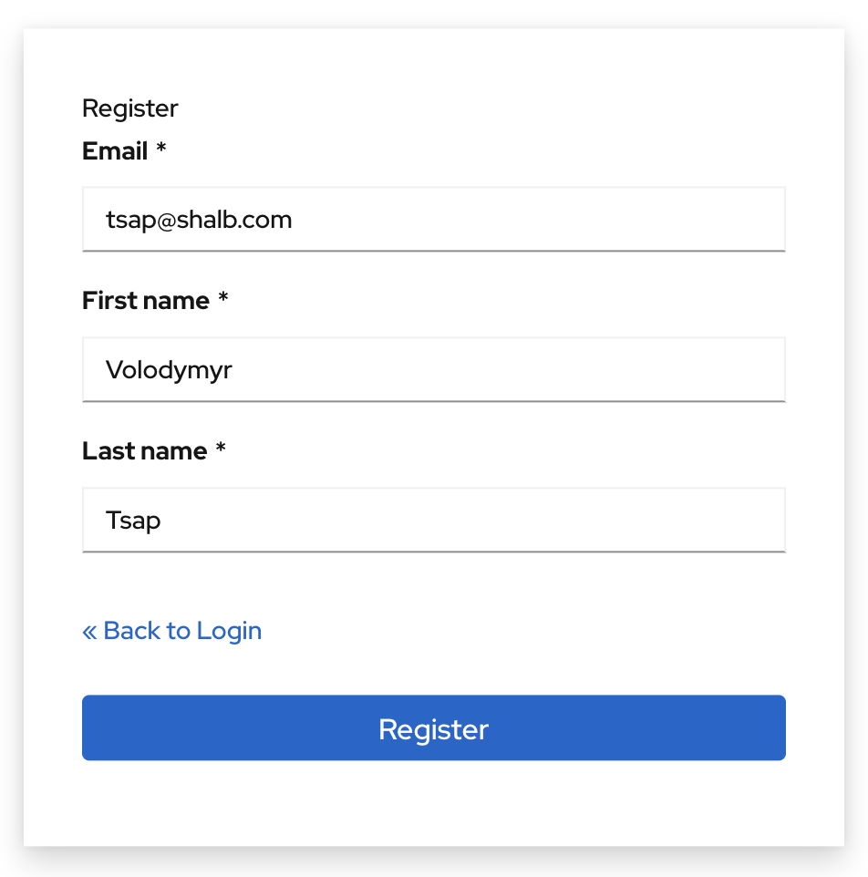
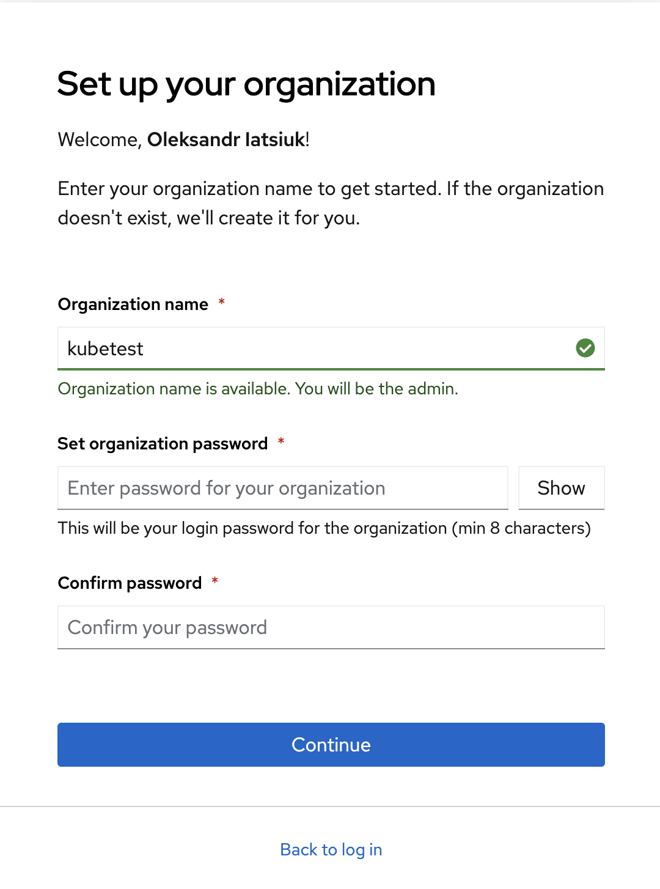
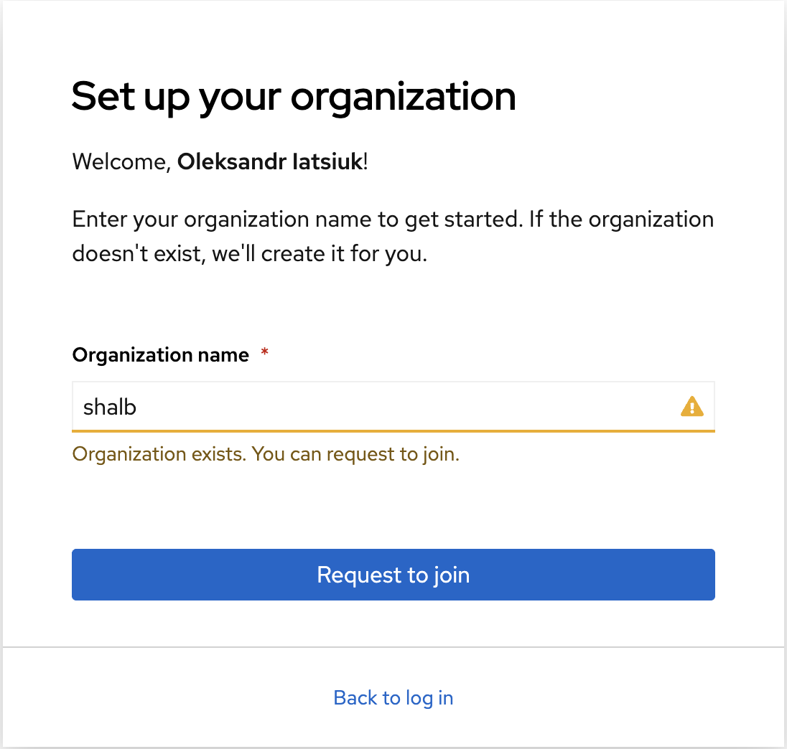
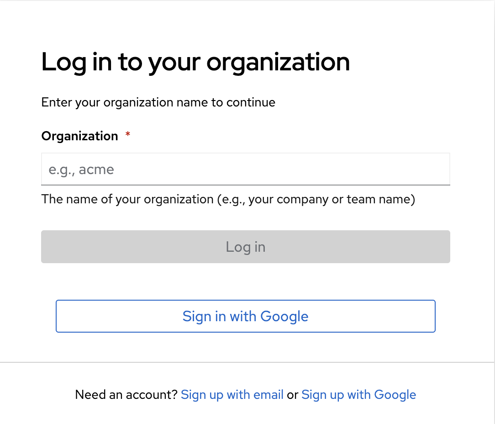
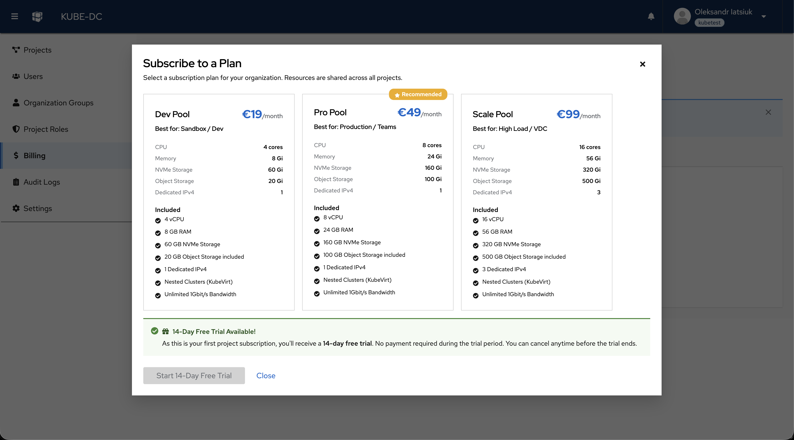

# Sign Up & Login

To use Kube-DC, you must have a verified user account and belong to an Organization. This guide walks you through the account creation process, organization setup, and login options.

## Prerequisites

- A valid email address
- A modern web browser (Chrome, Firefox, Safari, or Edge)

## Create Your Account

To get started with Kube-DC Cloud, you need to register a new account.

1. Navigate to [console.kube-dc.cloud](https://console.kube-dc.cloud)
2. Click **Sign up with email** or **Sign up with Google**
3. Fill in the registration form with your details:
   - **Email** — Your email address (used for login and notifications)
   - **First name** — Your first name
   - **Last name** — Your last name

4. Click **Register** to create your account
5. Check your email for a verification link and confirm your account

:::tip Using Google SSO
If you sign up with Google, your account is automatically verified and you can proceed directly to organization setup.
:::

## Set Up Your Organization

After registration, you'll be prompted to set up or join an Organization. Organizations are the top-level container for all your projects, users, and resources.

### Create a New Organization

If you're starting fresh or want to create a new workspace:

1. Enter a unique **Organization name** (e.g., your company or team name)
2. The system validates availability — a green checkmark indicates the name is available
3. Set an **Organization password** (minimum 8 characters)
4. Confirm your password
5. Click **Continue**

:::note Organization Admin
When you create an organization, you automatically become the Organization Admin with full access to manage users, projects, and settings. **Save your organization password** — you'll need it to log in as the org admin.
:::

### Join an Existing Organization

If your team already has an organization:

1. Enter the existing **Organization name**
2. The system detects the organization exists and shows "Organization exists. You can request to join."
3. Click **Request to join**
4. Wait for an Organization Admin to approve your request

:::info Approval Required
Join requests must be approved by an Organization Admin. You'll receive an email notification once your request is processed.
:::

## Login

Once your account is set up, you can log in to access your dashboard.

1. Navigate to [console.kube-dc.cloud](https://console.kube-dc.cloud)
2. Enter your **Organization** name
3. Choose your login method:
   - **Log in** — Enter your organization password
   - **Sign in with Google** — Use Google SSO (if configured)

:::tip Remember Your Organization
Bookmark your organization's direct login URL for faster access: `https://console.kube-dc.cloud/?realm=your-org-name`
:::

## Subscribe to a Plan

New organizations receive a **14-day free trial** with no payment required. After creating your first project, you'll be prompted to select a subscription plan.

### Available Plans

| Plan | Best For | CPU | Memory | NVMe Storage | Object Storage |
|------|----------|-----|--------|--------------|----------------|
| **Dev Pool** | Sandbox / Dev | 4 cores | 8 GB | 60 GB | 20 GB |
| **Pro Pool** | Production / Teams | 8 cores | 24 GB | 160 GB | 100 GB |
| **Scale Pool** | High Load / VDC | 16 cores | 56 GB | 320 GB | 500 GB |

All plans include:

- Dedicated IPv4 addresses
- Nested clusters (KubeVirt)
- Unlimited 1Gbit/s bandwidth

Click **Start 14-Day Free Trial** to begin using Kube-DC immediately.

## Next Steps

After signing up and setting up your organization:

- [Explore the Dashboard](dashboard-overview.md) — learn how to navigate the Kube-DC UI
- [Create your first project](first-project.md)
- [Set up user groups and permissions](team-management.md)
- [Configure Google SSO for your organization](/platform/sso-google-auth)
