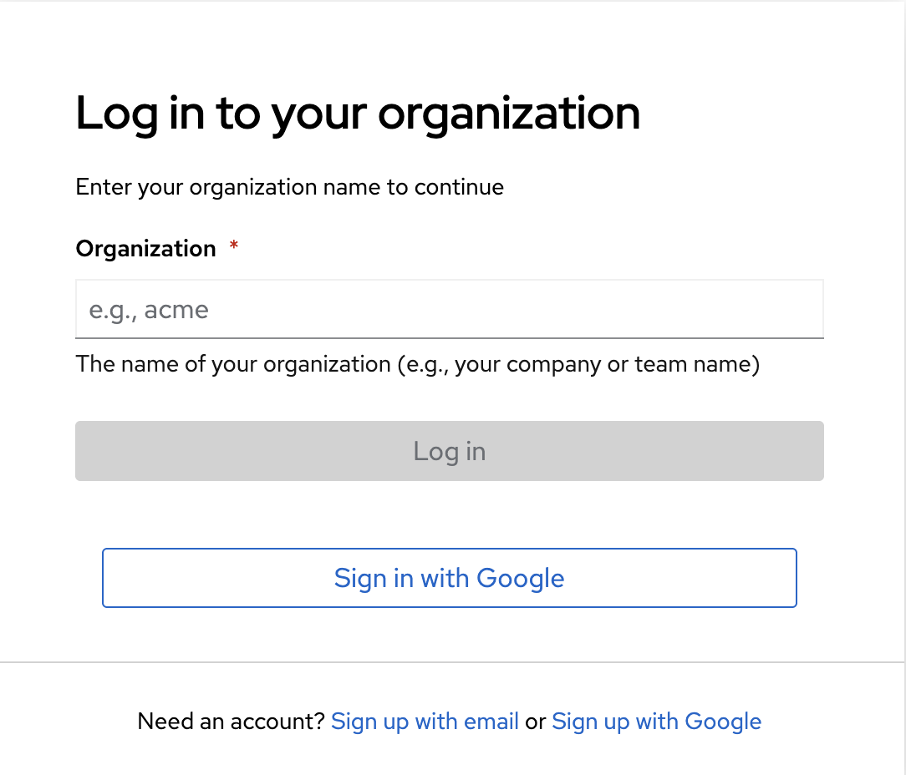

# Sign Up & Login

To use Kube-DC, you must have a verified user account and belong to an Organization. This guide walks you through the account creation process, organization setup, and login options.

## Prerequisites

- A valid email address
- A modern web browser (Chrome, Firefox, Safari, or Edge)

## Create Your Account

To get started with Kube-DC Cloud, you need to register a new account.

1. Navigate to [console.kube-dc.cloud](https://console.kube-dc.cloud)
2. Click **Sign up with email** or **Sign up with Google**
3. Fill in the registration form with your details:
   - **Email** — Your email address (used for login and notifications)
   - **First name** — Your first name
   - **Last name** — Your last name

4. Click **Register** to create your account
5. Check your email for a verification link and confirm your account

:::tip Using Google SSO
If you sign up with Google, your account is automatically verified and you can proceed directly to organization setup.
:::

## Set Up Your Organization

After registration, you'll be prompted to set up or join an Organization. An Organization is the identity, membership, billing, and shared-quota boundary for its Projects.

### Create a New Organization

If you are starting fresh or need a separate Organization:

1. Enter a unique **Organization name** (e.g., your company or team name)
2. The system validates availability — a green checkmark indicates the name is available
3. Set your **Organization login password** (minimum 8 characters)
4. Confirm your password
5. Click **Continue**

:::note Organization Admin
When you create an organization, you automatically become the Organization Admin with full access to manage users, projects, and settings. Keep your Organization login password secure. It belongs to your user account and is not a password shared by Organization members.
:::

### Join an Existing Organization

If your team already has an organization:

1. Enter the existing **Organization name**
2. The system detects the organization exists and shows "Organization exists. You can request to join."
3. Click **Request to join**
4. Wait for an Organization Admin to approve your request

:::info Approval Required
Join requests must be approved by an Organization Admin. You'll receive an email notification once your request is processed.
:::

## Login

Once your account is set up, you can log in to access your dashboard.

1. Navigate to [console.kube-dc.cloud](https://console.kube-dc.cloud)
2. Enter your **Organization** name
3. Choose your login method:
   - **Log in** — Enter your Organization login password
   - **Sign in with Google** — Use Google SSO (if configured)

:::tip Remember Your Organization
Bookmark your organization's direct login URL for faster access: `https://console.kube-dc.cloud/?realm=your-org-name`
:::

## Choose a Plan or Trial

Subscription and trial options depend on the Kube-DC deployment and its billing provider. Some providers offer a first-subscription trial; a valid promo code or an administrator can also enable trial access. The Billing screen shows your exact eligibility and duration before checkout.

After the Organization is created, open **Billing** to:

- choose from the plans currently offered by your provider;
- redeem a promo code, when you have one;
- review the exact CPU, memory, storage, IP, and accelerator quota before checkout;
- see the subscription state and remaining trial time, when applicable.

The Billing screen is the source of truth for current plan capacity and commercial terms. See [Billing and Usage](billing-usage.md) for quota and subscription details.

## Next Steps

After signing up and setting up your organization:

- [Explore the Dashboard](dashboard-overview.md) — learn how to navigate the Kube-DC UI
- [Create your first project](first-project.md)
- [Set up user groups and permissions](team-management.md)
- [Configure Google SSO for your organization](/platform/sso-google-auth)
