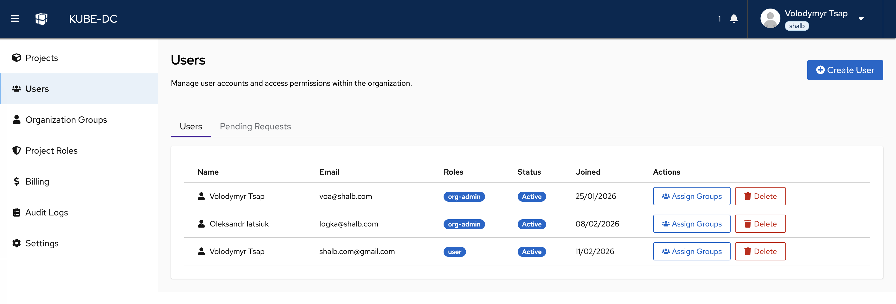
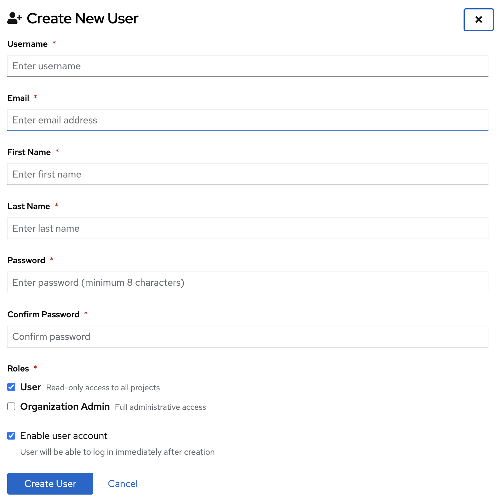
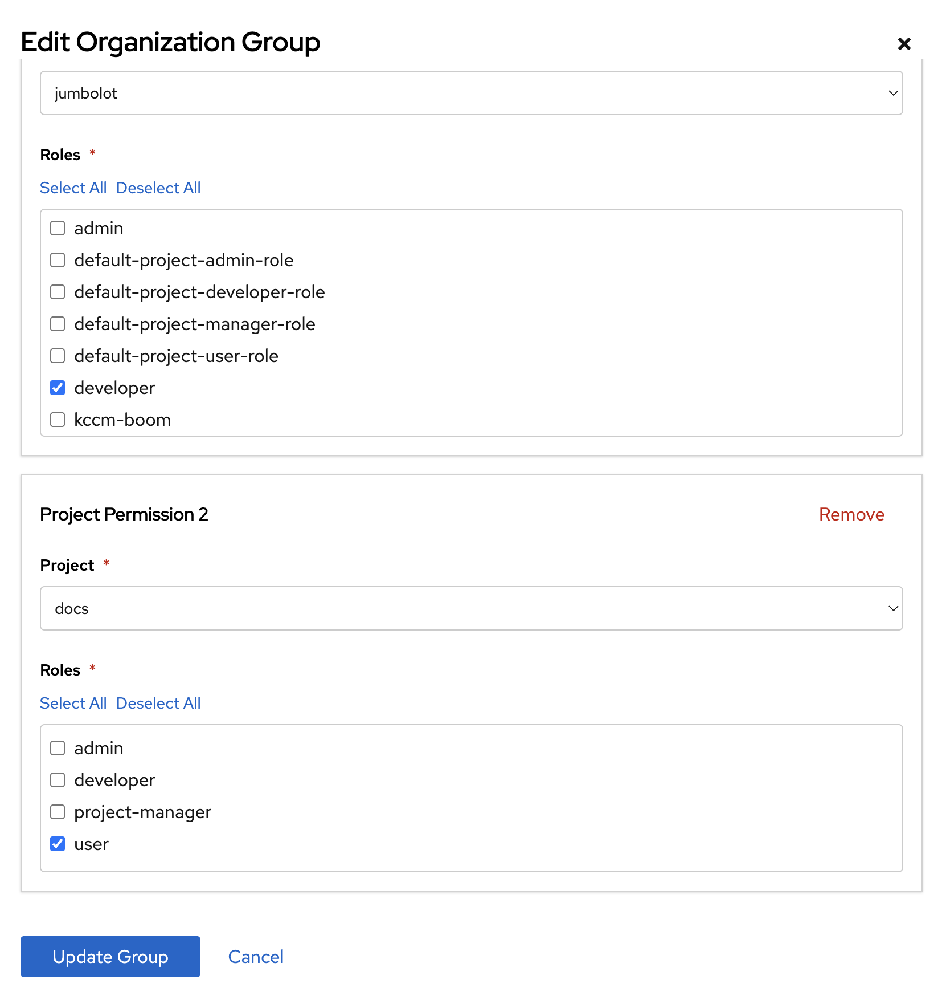
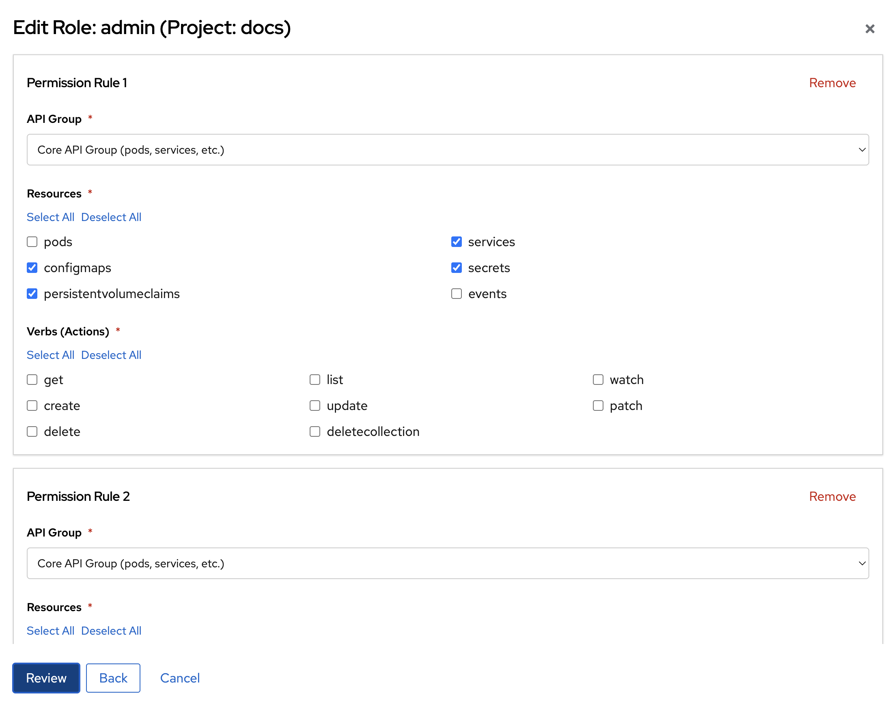

# User and Group Management

Kube-DC provides a comprehensive multi-tenant access control system that lets organization administrators manage users, define group permissions across projects, and create fine-grained custom roles — all from the console UI.

## Security Model

Each organization in Kube-DC operates within a **completely isolated identity domain**:

- **Dedicated Keycloak Realm** — Every organization gets its own Keycloak realm, acting as an independent OIDC provider. Users from different organizations cannot share credentials or sessions.
- **Isolated JWT Tokens** — Authentication tokens are scoped to a single organization realm. A token issued for `acme` cannot be used to access `example` organization resources.
- **Separate Token Authentication** — Each realm has its own signing keys, token policies, and session management. Compromising one organization's credentials has no impact on any other.
- **Kubernetes RBAC Integration** — JWT group claims are mapped to Kubernetes RoleBindings automatically. Access is enforced at the API server level, independent of the UI layer.

```
User authenticates  →  Organization Realm (OIDC)  →  JWT with org groups
                                                           ↓
                                            Kubernetes API validates JWT
                                                           ↓
                                          RoleBindings grant namespace access
```

This architecture ensures complete tenant isolation: each organization's users, groups, roles, and resources are cryptographically and administratively separated.

## Standard Roles

When an organization and its projects are created, Kube-DC automatically provisions a set of standard roles. These cover the most common access scenarios without any manual configuration.

### Organization-Level Roles

| Role | Group | Permissions |
|------|-------|-------------|
| `{org}-admin` | `org-admin` | Full CRUD on organizations, projects, organization groups |
| `{org}-user` | `user` | Read-only access to organization and project list |

### Project-Level Roles

Every project receives these four roles automatically:

| Role | Description | Key Permissions |
|------|-------------|-----------------|
| `admin` | Full project control | All resources and verbs, RBAC management |
| `developer` | Workload management | VMs, pods, services, secrets: full CRUD; no RBAC |
| `project-manager` | View and monitor | All resources: get, list, watch; VM console/VNC access |
| `user` | Read-only access | All resources: get, list; no console, no secrets |

### Automatic Role Bindings

When a project is created, these bindings are configured automatically:

| Subject | Role | Effect |
|---------|------|--------|
| `{org}:org-admin` | `admin` | Organization admins have full access to every project |
| `{org}:user` | `user` | All organization members get read-only access to every project |

Elevated roles (`developer`, `project-manager`) are assigned per-project through **Organization Groups**.

## Managing Users

The **Users** section in the console is available to organization administrators under the **Manage Organization** menu.

### User List



The users page shows all members of the organization with their assigned roles, status, and join date. Organization admins can:

- **Create User** — Add a new user directly to the organization
- **Assign Groups** — Grant elevated per-project access via organization groups
- **Delete** — Remove a user from the organization
- **Pending Requests** tab — Review and approve self-service join requests

:::info Permission Required
Only users with the `org-admin` role can create, delete, or modify other users. Regular users can view the list but cannot perform management actions.
:::

### Creating a User

Organization administrators can create users directly from the UI without any external tooling.

**Steps:**

1. Navigate to **Manage Organization → Users**
2. Click **Create User** in the top-right corner
3. Fill in the required fields:



| Field | Description |
|-------|-------------|
| **Username** | Unique login name (letters, numbers, `.`, `_`, `-`; minimum 3 characters) |
| **Email** | User's email address |
| **First Name** | Given name |
| **Last Name** | Family name |
| **Password** | Initial password (minimum 8 characters) |
| **Roles** | Initial organization role: `User` (read-only) or `Organization Admin` (full access) |
| **Enable user account** | When checked, the user can log in immediately after creation |

4. Click **Create User**

The user is created in the organization's Keycloak realm and can log in to the Kube-DC console immediately. They receive automatic read-only access (`user` role) to all projects unless assigned to an organization group for elevated access.

:::tip Default Role
New users are created with the `User` role by default, which grants read-only access to all projects. To grant elevated project access, use **Organization Groups** after creation.
:::

### Assigning Groups to a User

After creating a user, you can assign them to organization groups to grant elevated access to specific projects.

**Steps:**

1. In the **Users** list, find the user and click **Assign Groups**
2. Select the **action**: Assign groups or Remove groups
3. Choose from the available groups:
   - **Realm Groups** (`org-admin`, `user`) — Organization-wide roles
   - **Organization Groups** — Project-specific elevated access groups you have created
4. Click **Assign Groups** to apply

The group membership takes effect immediately. The user's next login will reflect the updated permissions.

### Handling Join Requests

Users who discover Kube-DC independently can request to join an organization via the **Join Request** flow on the login page. Organization administrators are notified and can approve or deny these requests from the **Pending Requests** tab.

**Steps:**

1. Navigate to **Manage Organization → Users → Pending Requests**
2. Review pending requests (name, email, requested date)
3. Click **Approve** to add the user to the organization with the default `user` role, or **Deny** to reject the request

Approved users are automatically added to the `user` group and receive read-only access to all projects.

### Deleting a User

1. In the **Users** list, click **Delete** next to the user
2. Confirm the deletion in the dialog

The user is removed from the Keycloak realm and loses all access immediately.

## Organization Groups

Organization Groups define elevated, per-project access. They are a Kube-DC abstraction that simultaneously creates a Keycloak group and the corresponding Kubernetes RoleBindings in each specified project namespace.

**Use Organization Groups when you need to:**
- Grant `developer` or `project-manager` access to specific projects
- Manage teams — one group can span multiple projects with different roles per project

### Creating an Organization Group via UI

1. Navigate to **Manage Organization → Organization Groups**
2. Click **Create Group** and provide a group name
3. Configure project permissions:



For each project permission entry:
- **Project** — Select the target project from the dropdown
- **Roles** — Select one or more roles to grant in that project (`admin`, `developer`, `project-manager`, `user`)

You can add multiple project permissions to a single group. Click **Update Group** to save.

4. Assign users to this group via **Users → Assign Groups**

### Creating an Organization Group via kubectl

For infrastructure-as-code workflows, Organization Groups can be managed as Kubernetes CRDs:

```yaml
apiVersion: kube-dc.com/v1
kind: OrganizationGroup
metadata:
  name: backend-team        # Group name (also becomes the Keycloak group name)
  namespace: myorg          # Organization namespace
spec:
  permissions:
  - project: production
    roles:
    - developer             # Full CRUD on VMs and workloads in 'production'
  - project: staging
    roles:
    - admin                 # Full admin access in 'staging'
  - project: monitoring
    roles:
    - project-manager       # Read-only + console/VNC in 'monitoring'
```

Apply the group:

```bash
kubectl apply -f organization-group.yaml
```

When this resource is created, Kube-DC automatically:
1. Creates a Keycloak group `backend-team` in the organization's realm
2. Creates RoleBindings in each specified project namespace

:::important
- `OrganizationGroup` must be created in the **organization namespace**, not a project namespace
- The group name must be unique within the organization
- Standard groups (`org-admin`, `user`) are managed automatically and cannot be overridden via OrganizationGroup
:::

### Controller Lifecycle

```
OrganizationGroup created
    ├── Keycloak group created in organization realm
    ├── For each project in spec.permissions:
    │   └── RoleBinding created: {org}:{group-name} → {role} in project namespace
    └── Users added to this group via UI inherit the bindings immediately

OrganizationGroup updated
    └── RoleBindings reconciled across all project namespaces

OrganizationGroup deleted
    ├── Keycloak group removed
    └── All associated RoleBindings removed
```

## Custom Project Roles

The four standard project roles cover most scenarios. For specialized needs, administrators can create custom Kubernetes Roles with fine-grained permissions.

### Editing Roles via UI

Navigate to **Manage Organization → Project Roles** to view and edit roles per project:



The role editor allows you to define permission rules by:
- **API Group** — Select `Core API Group` (pods, services, etc.), `apps`, `kubevirt.io`, or other groups
- **Resources** — Select specific resource types (configmaps, secrets, services, etc.)
- **Verbs (Actions)** — Select allowed operations: `get`, `list`, `watch`, `create`, `update`, `patch`, `delete`

Multiple permission rules can be added to a single role. Click **Review** to preview before saving.

### Creating a Custom Role via kubectl

```yaml
apiVersion: rbac.authorization.k8s.io/v1
kind: Role
metadata:
  name: ci-deployer
  namespace: myorg-production    # Project namespace: {org}-{project}
rules:
  - apiGroups: ["apps"]
    resources: ["deployments", "replicasets"]
    verbs: ["get", "list", "create", "update", "patch"]
  - apiGroups: [""]
    resources: ["pods", "services", "configmaps"]
    verbs: ["get", "list", "watch"]
```

:::warning Role Scope
Roles are namespace-scoped. To apply the same role across multiple projects, create it in each project namespace individually, or reference it via an OrganizationGroup.
:::

Once the role exists in a project namespace, you can reference it from an OrganizationGroup:

```yaml
spec:
  permissions:
  - project: production
    roles:
    - ci-deployer   # Custom role name
```

## Permission Reference

### Organization Namespace

| Resource | `org-admin` | `user` |
|----------|-------------|--------|
| `organizations` | get, list, patch, update, watch | get |
| `projects` | full CRUD | get, list |
| `organizationgroups` | full CRUD | — |

### Project Namespace

| Resource | `admin` | `developer` | `project-manager` | `user` |
|----------|---------|-------------|-------------------|--------|
| `virtualmachines` | full CRUD | full CRUD | get, list, watch | get, list |
| `pods` | full CRUD | full CRUD | get, list, watch | get, list |
| `pods/log` | get | get | get | get |
| VM console/VNC | ✅ | ✅ | ✅ | ❌ |
| `services` | full CRUD | full CRUD | get, list, watch | get, list |
| `deployments` | full CRUD | full CRUD | get, list, watch | get, list |
| `secrets` | full CRUD | full CRUD | get, list | ❌ |
| `configmaps` | full CRUD | full CRUD | get, list | get, list |
| `persistentvolumeclaims` | full CRUD | full CRUD | get, list, watch | get, list |
| RBAC (roles, bindings) | full CRUD | ❌ | ❌ | ❌ |

## Troubleshooting

**User cannot log in after creation**
- Verify the account is enabled (check the user's status in the Users list)
- Ensure the correct organization URL is being used for login

**User can log in but sees no projects**
- The user may only have the `user` role, which provides read-only access
- Verify they are assigned to the correct organization group for elevated project access
- Check that the target project exists and was created after the user was added to the `user` group

**Organization Group not granting access**
- Confirm the `OrganizationGroup` is created in the organization namespace (not a project namespace)
- Verify the project name in `spec.permissions` matches exactly (case-sensitive)
- Wait 30–60 seconds for the controller to reconcile — RoleBindings are created asynchronously

**Permission changes not taking effect**
- Permissions apply on the next user login after a new token is issued
- Ask the user to log out and log back in to receive an updated JWT token

**Custom role not appearing in Organization Group editor**
- The role must exist in the target project namespace before it can be referenced
- Create the role with `kubectl apply` first, then reference it from the OrganizationGroup


