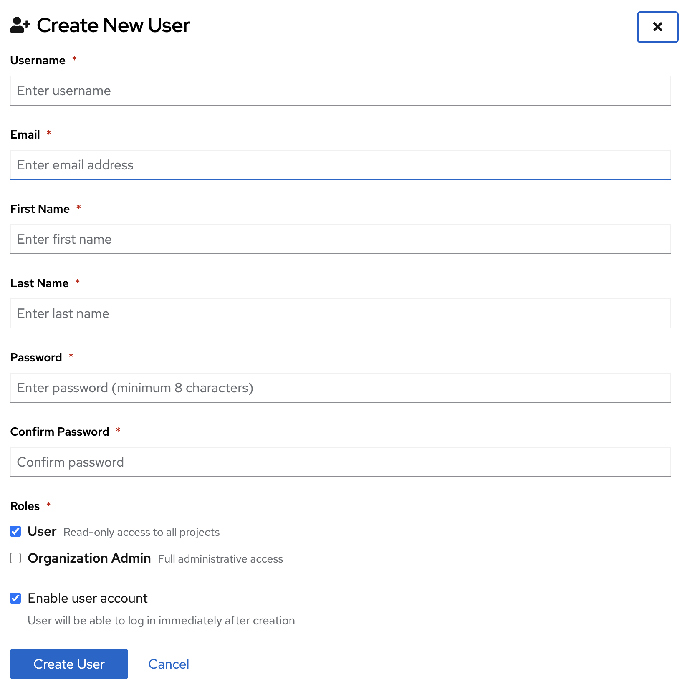
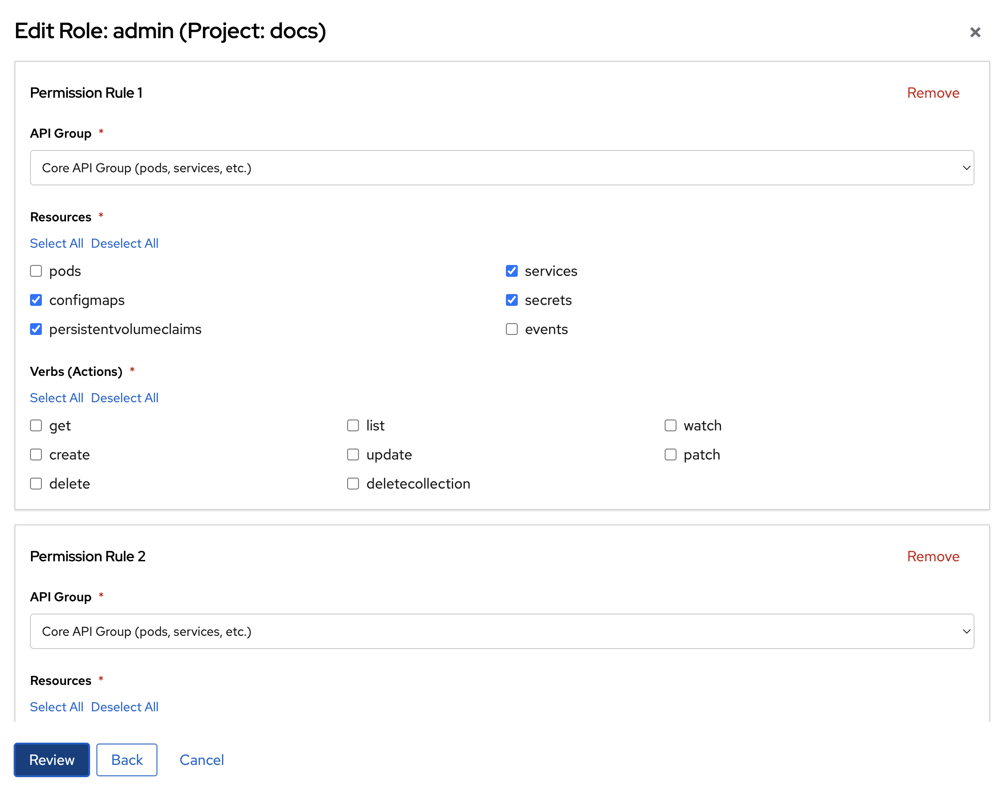

# User and Group Management

Kube-DC separates Organization administration from Project access. Organization Admins manage members and Organization Groups, while Project roles control what those groups can do in each Project. Custom roles cover narrower requirements.

## Security Model

Each Organization in Kube-DC has a **dedicated identity domain**:

- **Dedicated Keycloak Realm** — Every organization gets its own Keycloak realm, acting as an independent OIDC provider. Users from different organizations cannot share credentials or sessions.
- **Isolated JWT Tokens** — Authentication tokens are scoped to a single organization realm. A token issued for `acme` cannot be used to access `example` organization resources.
- **Separate Token Authentication** — Each realm has its own signing keys, token policies, and session management. Credentials and sessions are scoped to their issuing organization.
- **Kubernetes RBAC Integration** — JWT group claims are mapped to Kubernetes RoleBindings automatically. Access is enforced at the API server level, independent of the UI layer.

```
User authenticates  →  Organization Realm (OIDC)  →  JWT with Organization groups
                                                           ↓
                                            Kubernetes API validates JWT
                                                           ↓
                                          RoleBindings grant Project access
```

This model separates Organization identity and membership from Project workload access. Kubernetes RBAC is the authorization boundary; Project networking, quotas, and platform policy add workload isolation.

## Standard Roles

When an organization and its projects are created, Kube-DC automatically provisions a set of standard roles. These cover the most common access scenarios without any manual configuration.

### Organization-Level Roles

| Role | Group | Permissions |
|------|-------|-------------|
| `{org}-admin` | `org-admin` | Manage members, billing, shared quota, Projects, and Organization Groups within this Organization; receives `admin` in every Project |
| `{org}-user` | `user` | Read the Organization and Project list; receives `user` in every Project |

### Project-Level Roles

Every project receives these four roles automatically:

| Role | Description | Key Permissions |
|------|-------------|-----------------|
| `admin` | Project administration | Manage the supported namespaced resource set and namespaced RBAC; controller-owned quota objects remain read-only |
| `developer` | Workload management | Manage supported workloads, volumes, Services, and managed services; raw Kubernetes Secrets are read-only; no RBAC management |
| `project-manager` | Operations and oversight | Read and monitor Project resources, use the VM console, update selected managed security resources, and create or update KMS keys; no Project membership or quota management |
| `user` | Read-only access | Read Project resources and logs; no raw Secret access or VM console |

### Automatic Role Bindings

When a project is created, these bindings are configured automatically:

| Subject | Role | Effect |
|---------|------|--------|
| `{org}:org-admin` | `admin` | Organization admins receive the standard `admin` role in every Project |
| `{org}:user` | `user` | Organization members receive the standard `user` role in every Project |

Additional Project roles, including `admin`, `developer`, and
`project-manager`, can be assigned through **Organization Groups**.

## Managing Users

The **Users** section in the console is available to organization administrators under the **Manage Organization** menu.

### User List

The users page shows all members of the organization with their assigned roles, status, and join date. Organization admins can:

- **Create User** — Add a new user directly to the organization
- **Assign Groups** — Grant elevated per-project access via organization groups
- **Delete** — Remove a user from the organization
- **Pending Requests** tab — Review and approve self-service join requests

:::info Permission Required
Only users with the `org-admin` role can create, delete, or modify other users. Regular users can view the list but cannot perform management actions.
:::

### Creating a User

Organization administrators can create users directly from the UI without any external tooling.

**Steps:**

1. Navigate to **Manage Organization → Users**
2. Click **Create User** in the top-right corner
3. Fill in the required fields:



| Field | Description |
|-------|-------------|
| **Username** | Unique login name (letters, numbers, `.`, `_`, `-`; minimum 3 characters) |
| **Email** | User's email address |
| **First Name** | Given name |
| **Last Name** | Family name |
| **Password** | Initial password (minimum 8 characters) |
| **Roles** | Initial Organization role: `User` (read-only) or `Organization Admin` (Organization management and full Project access) |
| **Enable user account** | When checked, the user can log in immediately after creation |

4. Click **Create User**

The user is created in the organization's Keycloak realm and can log in to the Kube-DC console immediately. They receive automatic read-only access (`user` role) to all projects unless assigned to an organization group for elevated access.

:::tip Default Role
New users are created with the `User` role by default, which grants read-only access to all projects. To grant elevated project access, use **Organization Groups** after creation.
:::

### Assigning Groups to a User

After creating a user, you can assign them to organization groups to grant elevated access to specific projects.

**Steps:**

1. In the **Users** list, find the user and click **Assign Groups**
2. Select the **action**: Assign groups or Remove groups
3. Choose from the available groups:
   - **Realm Groups** (`org-admin`, `user`) — Organization-wide roles
   - **Organization Groups** — Project-specific elevated access groups you have created
4. Click **Assign Groups** to apply

Group assignments and removals affect newly issued tokens. An access token that was already issued keeps its existing group claims until it expires, which is 15 minutes by default. Sign out and sign in again to obtain updated claims immediately.

### Handling Join Requests

Users who discover Kube-DC independently can request to join an organization via the **Join Request** flow on the login page. Organization administrators are notified and can approve or deny these requests from the **Pending Requests** tab.

**Steps:**

1. Navigate to **Manage Organization → Users → Pending Requests**
2. Review pending requests (name, email, requested date)
3. Click **Approve** to add the user to the organization with the default `user` role, or **Deny** to reject the request

Approved users are automatically added to the `user` group and receive read-only access to all projects.

### Deleting a User

1. In the **Users** list, click **Delete** next to the user
2. Confirm the deletion in the dialog

The user is removed from the Organization's Keycloak realm, which blocks new logins and token refresh. An access token that was already issued can remain valid until its expiry, which is 15 minutes by default.

## Organization Groups

Organization Groups define elevated access per Project. Each group connects a Keycloak group claim to Kubernetes RoleBindings in the selected Projects' backing namespaces.

**Use Organization Groups when you need to:**
- Grant `admin`, `developer`, or `project-manager` access to specific Projects
- Manage teams: one group can span multiple Projects with a different role in each

### Creating an Organization Group via UI

1. Navigate to **Manage Organization → Organization Groups**
2. Click **Create Group** and provide a group name
3. Configure project permissions:

For each project permission entry:
- **Project** — Select the target project from the dropdown
- **Roles** — Select one or more roles to grant in that project (`admin`, `developer`, `project-manager`, `user`)

You can add multiple project permissions to a single group. Click **Update Group** to save.

4. Assign users to this group via **Users → Assign Groups**

### Creating an Organization Group via kubectl

For infrastructure-as-code workflows, Organization Groups can be managed as Kubernetes CRDs:

```yaml
apiVersion: kube-dc.com/v1
kind: OrganizationGroup
metadata:
  name: backend-team        # Group name (also becomes the Keycloak group name)
  namespace: acme           # Organization namespace
spec:
  permissions:
  - project: production
    roles:
    - developer             # Manage supported workloads in 'production'
  - project: staging
    roles:
    - admin                 # Full admin access in 'staging'
  - project: monitoring
    roles:
    - project-manager       # Monitor resources and use approved management actions
```

Apply the group:

```bash
kubectl apply -f organization-group.yaml
```

When this resource is created, Kube-DC automatically:
1. Creates a Keycloak group `backend-team` in the organization's realm
2. Creates RoleBindings in each specified Project's backing namespace

:::important
- `OrganizationGroup` must be created in the **Organization API namespace**, not a Project backing namespace
- The group name must be unique within the organization
- Standard groups (`org-admin`, `user`) are managed automatically and cannot be overridden via OrganizationGroup
:::

### Controller Lifecycle

```
OrganizationGroup created
    ├── Keycloak group created in organization realm
    ├── For each project in spec.permissions:
    │   └── RoleBinding created: {org}:{group-name} -> {role} in Project backing namespace
    └── New user tokens carrying the group claim receive that Project access

OrganizationGroup updated
    └── RoleBindings reconciled across all affected Project backing namespaces

OrganizationGroup deleted
    ├── Keycloak group removed
    └── All associated RoleBindings removed
```

## Custom Project Roles

The four standard Project roles cover most scenarios. A holder of the Project `admin` role can create a custom Kubernetes Role when a narrower permission set is required.

### Editing Roles via UI

Navigate to **Manage Organization → Project Roles** to view and edit roles per project:



The role editor allows you to define permission rules by:
- **API Group** — Select `Core API Group` (pods, services, etc.), `apps`, `kubevirt.io`, or other groups
- **Resources** — Select specific resource types (configmaps, secrets, services, etc.)
- **Verbs (Actions)** — Select allowed operations: `get`, `list`, `watch`, `create`, `update`, `patch`, `delete`

Multiple permission rules can be added to a single role. Click **Review** to preview before saving.

### Creating a Custom Role via kubectl

```yaml
apiVersion: rbac.authorization.k8s.io/v1
kind: Role
metadata:
  name: ci-deployer
  namespace: acme-production     # Backing namespace: {org}-{project}
rules:
  - apiGroups: ["apps"]
    resources: ["deployments", "replicasets"]
    verbs: ["get", "list", "create", "update", "patch"]
  - apiGroups: [""]
    resources: ["pods", "services", "configmaps"]
    verbs: ["get", "list", "watch"]
```

:::warning Role Scope
Kubernetes Roles are namespace-scoped. To use the same custom role across multiple Projects, create it in every target Project's backing namespace before referencing it from an OrganizationGroup.
:::

Once the role exists in the Project's backing namespace, reference it from an OrganizationGroup:

```yaml
spec:
  permissions:
  - project: production
    roles:
    - ci-deployer   # Custom role name
```

## Permission Reference

### Organization API Scope

| Resource | `org-admin` | `user` |
|----------|-------------|--------|
| `organizations` | get, list, patch, update, watch | get |
| `projects` | full CRUD | get, list |
| `organizationgroups` | full CRUD | — |

### Project API Scope

| Resource | `admin` | `developer` | `project-manager` | `user` |
|----------|---------|-------------|-------------------|--------|
| `virtualmachines` | full CRUD | full CRUD | get, list, watch | get, list |
| `pods` | create, get, list, watch, delete | create, get, list, watch, delete | get, list, watch | get, list |
| `pods/log` | get | get | get | get |
| VM console/VNC | ✅ | ✅ | ✅ | ❌ |
| `services` | full CRUD | full CRUD | get, list, watch | get, list |
| `deployments` | full CRUD | full CRUD | get, list, watch | get, list |
| `secrets` | full CRUD | get, list | get, list | ❌ |
| `configmaps` | full CRUD | full CRUD | get, list | get, list |
| `persistentvolumeclaims` | full CRUD | full CRUD | get, list, watch | get, list |
| RBAC (roles, bindings) | full CRUD | ❌ | ❌ | ❌ |
| Pod exec, attach, or port-forward | ❌ | ❌ | ❌ | ❌ |
| VM/VMI port-forward | ❌ | ❌ | ❌ | ❌ |
| `networkpolicies` | ❌ | ❌ | ❌ | ❌ |

## Troubleshooting

**User cannot log in after creation**
- Verify the account is enabled (check the user's status in the Users list)
- Ensure the correct organization URL is being used for login

**User can log in but sees no projects**
- The user may only have the `user` role, which provides read-only access
- Verify they are assigned to the correct organization group for elevated project access
- Verify the user belongs to the expected identity group and inspect the
  RoleBinding in the target Project's backing namespace

**Organization Group not granting access**
- Confirm the `OrganizationGroup` is created in the Organization API namespace, not a Project backing namespace
- Verify the project name in `spec.permissions` matches exactly (case-sensitive)
- Inspect the `OrganizationGroup` status and the RoleBindings in the target
  Project's backing namespace; reconciliation is asynchronous

**Permission changes not taking effect**
- Group membership is carried in the user's access token
- Sign out and sign in again to obtain updated claims immediately; otherwise, an existing token can retain old access until its default 15-minute expiry

**Custom role not appearing in Organization Group editor**
- The role must exist in the target Project's backing namespace before it can be referenced
- Create the role with `kubectl apply` first, then reference it from the OrganizationGroup


