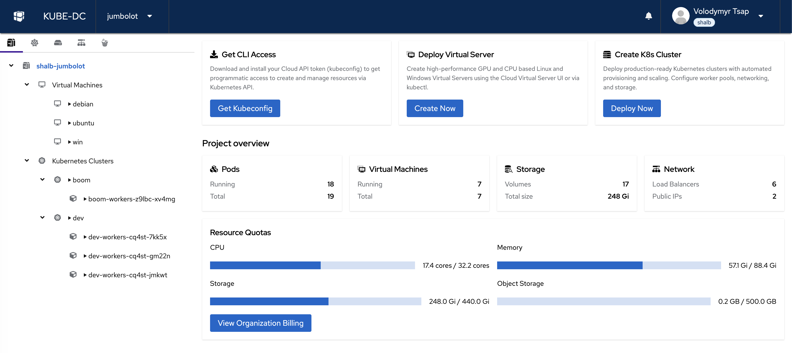
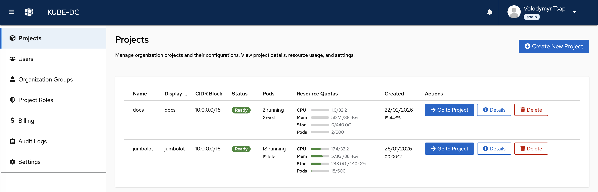

# What is Kube-DC?

Kube-DC Cloud is a fully managed cloud platform built on [Kube-DC](https://kube-dc.com), an open-source Kubernetes-native data center solution.

## Overview

Kube-DC Cloud lets you deploy and manage:

- **Virtual Machines** — Linux and Windows VMs with cloud-init support
- **Kubernetes Clusters** — Managed nested clusters for your applications
- **Containers** — Run containerized workloads alongside VMs
- **Networking** — Public IPs, floating IPs, private networks, and NAT
- **Storage** — Block storage, S3-compatible object storage, and backups

## How It Works

Kube-DC Cloud provides a web UI and Kubernetes API access to manage your infrastructure. Every resource is a Kubernetes object, so you can use `kubectl`, Helm, Terraform, or GitOps workflows to manage your environment.

## Key Concepts

- **Organization** — Your top-level account, with its own SSO realm and billing
- **Project** — An isolated namespace within your organization for deploying resources
- **Billing Plan** — Defines resource quotas (CPU, RAM, storage, IPs) for your projects

## Next Steps

- [Core Concepts](core-concepts.md) — Understand the platform architecture
- [Creating Your First Project](first-project.md) — Get started in minutes
