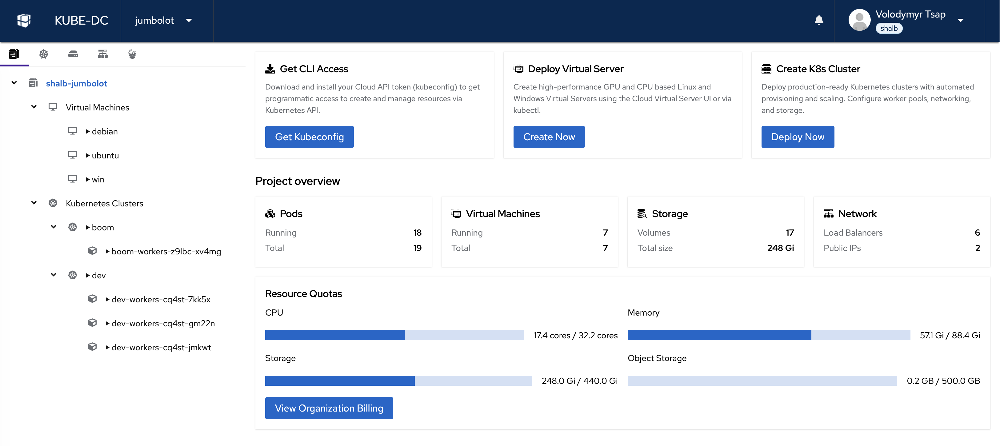
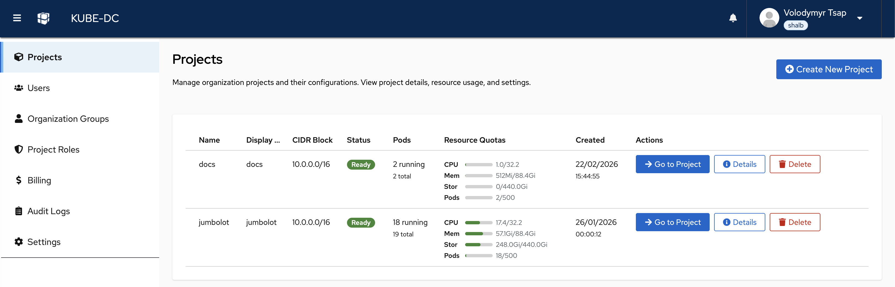

# What is Kube-DC?

**Kube-DC** is an open-source, Kubernetes-native cloud platform that delivers multi-tenant compute, networking, storage and data services on shared infrastructure. It gives organizations one consistent API and web console for governed **Kubernetes Projects**, virtual machines, managed Kubernetes clusters, databases and the cloud resources around them.

**Kube-DC Cloud** is the hosted offering built with Kube-DC: the service provider operates the platform underneath; you manage your Organization, Projects, access, workloads and services.



## What you can run

- **Kubernetes Projects** — the default way to deploy. Take your Project's kubeconfig and run applications, jobs, services, VMs and compatible Helm charts directly — no cluster to provision first. → [Kubernetes Projects](kubernetes-projects.md)
- **Virtual Machines** — Linux and Windows guests with cloud-init, persistent storage, browser console and SSH, on the same network as your containers
- **Managed Kubernetes Clusters** — a tenant-controlled cluster of your own, provisioned in minutes, for software that needs operators, CRDs or other cluster-scoped control
- **Managed Databases** — PostgreSQL and MariaDB with scheduled credential rotation
- **Networking** — a private network (VPC) per Project, public and floating IPs, load balancers, HTTPS ingress with automatic certificates
- **Storage & data** — block volumes for pods and VMs, S3-compatible object buckets, backups
- **Security services** — managed secrets, certificates, database credentials and encryption keys

## The mental model

Kube-DC organizes everything in two levels:

```text
Organization                 ← identity, members, billing
└── Project                  ← namespace + RBAC + VPC + quota + kubeconfig
    ├── Project workloads    ← apps, VMs, databases, storage, IPs
    └── Managed Cluster      ← your own Kubernetes, when you need cluster scope
        └── Cluster workloads
```

An **Organization** is the account boundary: it owns an organization-scoped identity realm (SSO), membership and billing.

A **Project** is the working boundary for a team or environment. It combines a Kubernetes namespace, Project RBAC, a private network, an optional quota, and a kubeconfig for direct API access — ready the moment it exists.

Within a Project you choose the execution boundary per workload:

- Deploy **directly in the Project** for supported namespaced resources and unprivileged workloads — the fast, default path.
- Create a **Managed Cluster** when the software needs control of Kubernetes at cluster scope (operators, CRDs, multiple namespaces, privileged access).

These are separate deployment targets with separate API endpoints — a choice you make upfront, not a migration you perform later.



## Kubernetes-native management

Kube-DC exposes its cloud services through Kubernetes APIs installed and operated by the platform. Everything you can click in the console is a Kubernetes resource in your Project, so the same state is available to:

- The Kube-DC web console
- `kubectl` and the Kubernetes API
- **Compatible Helm charts** — charts whose rendered resources use the Project's supported namespaced APIs
- Terraform, through the Kubernetes provider
- An externally managed GitOps controller (Argo CD, Flux) targeting your Project kubeconfig
- AI coding assistants, via [agent skills](ai-ide-integration.md)

A Project does not permit tenants to install cluster-level extensions — see [Kubernetes Projects](kubernetes-projects.md) for the exact capability boundary.

## Next steps

- [Core Concepts](core-concepts.md) — the Organization/Project model, isolation and deployment modes
- [Kubernetes Projects](kubernetes-projects.md) — deploy without provisioning a cluster
- [Creating Your First Project](first-project.md) — get started in minutes
