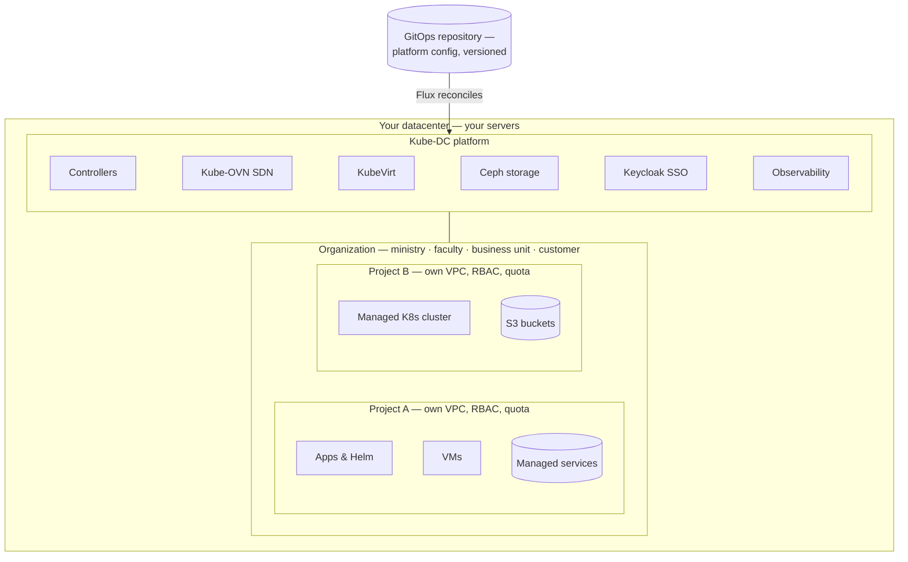
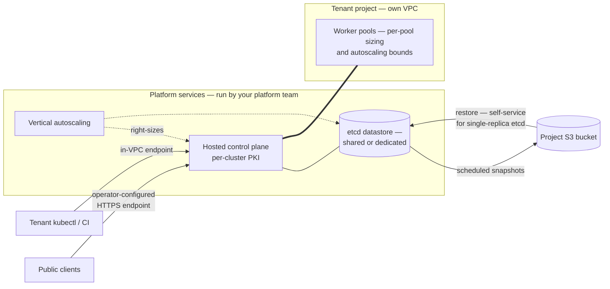
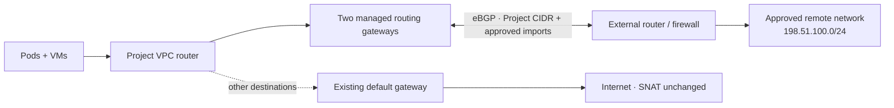
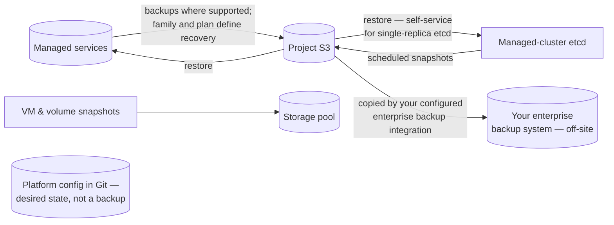

import DatasheetFigure from '@site/src/components/DatasheetFigure';
import ArchitecturalLayersDiagram from '@site/src/components/Diagram/ArchitecturalLayersDiagram';
import ProductModelDiagram from '@site/src/components/Diagram/ProductModelDiagram';
import {ManagedClusterTopologyDiagram} from '@site/src/components/Diagram/CloudTopologyDiagrams';
import {DataProtectionDiagram} from '@site/src/components/Diagram/DatasheetDiagrams';
import RoutedNetworkDiagram from '@site/src/components/Diagram/RoutedNetworkDiagram';

# Kube-DC

**Run virtual machines, Kubernetes, managed services, and storage on infrastructure
you control.**

<strong>Printable version:</strong>{' '}<a download href={require('./kube-dc-platform-datasheet-a4.pdf').default}>Download the A4 PDF</a>.

Kube-DC turns your servers into a self-service private cloud. Departments and
teams work in isolated projects with their own networks, virtual machines,
Kubernetes clusters, managed services, and storage. Your platform team sets capacity,
security, and cost controls for the whole environment, while your data stays in
your datacenter.

## Who it's for

Kube-DC is designed for organizations that operate shared infrastructure for
several teams or customers:

- **Public-sector organizations** keeping workloads and data on infrastructure
  they control, with clear separation between departments.
- **Enterprises and retailers** bringing existing virtual machines and modern
  container workloads onto one platform.
- **Universities and research institutions** giving faculties, labs, and
  student groups isolated environments with defined quotas.
- **Datacenter and hosting operators** providing cloud services under their
  own brand.

## At a glance

- **One platform for VMs and containers.** Virtual machines and Kubernetes
  workloads use the same network fabric, access model, quota, and billing.
- **Tenancy that reaches the network.** Every project gets its own VPC and
  subnet, not just a namespace label.
- **Self-service with central controls.** Teams provision VMs, clusters,
  managed services, storage, and public endpoints within the quotas you set. They can
  use the web console, `kubectl`, the CLI, or a supported coding assistant.
- **Runs on standard x86-64 servers.** A platform starts at three nodes;
  capacity grows by adding nodes. Production sizing is validated against
  your workload in an architecture review.
- **Built from named open-source components.** Kubernetes, KubeVirt, Kube-OVN,
  Ceph, Keycloak, CloudNativePG, and other components are integrated and
  operated as one product.

Diagram source for GitHub

<ProductModelDiagram />

## How it works

Kube-DC runs on a Kubernetes management cluster on your servers. Its
controllers turn product resources such as organizations, projects, machines,
clusters, managed services, and keys into the underlying networking, virtualization,
identity, storage, ingress, and observability resources.

The operating model has three levels:

1. **Your platform team** installs Kube-DC with the `kube-dc` CLI. The CLI
   bootstraps a GitOps repository, and platform configuration remains
   declarative and versioned from then on.
2. **Organizations** are your tenants: a ministry's directorates, a
   university's faculties, a retailer's business units, or an operator's
   customers. Each organization has its own identity realm, members, plan
   and billing scope.
3. **Projects** are where teams deploy. Each project has a namespace, RBAC,
   its own VPC, and optional quotas. Teams use the console or a standard
   kubeconfig to work with project resources.

<ArchitecturalLayersDiagram />

## Multi-tenancy: organizations and projects

| Layer | Scope | Mechanism |
|---|---|---|
| Identity | Organization | A dedicated identity realm per organization (Keycloak SSO — console, API, CLI) |
| Namespace & RBAC | Project | Hierarchical namespaces with project-scoped roles |
| Network | Project | A dedicated VPC and subnet per project |
| Quota | Project | Per-project quotas within the organization's plan |
| Billing & chargeback | Organization | Plans, usage and subscription billing per organization |

Organization quotas cover configured Kubernetes resources such as CPU,
memory, storage, pods, and load balancers. Optional project quotas divide that
capacity between teams. Object storage and physical capacity use their own
controls and capacity plans.

Project roles cover the work needed to deploy and operate workloads.
Cluster-scoped administration stays with the platform team. Supported project
roles do not include interactive pod `exec` or `attach`; an admission policy
enforces that boundary, and teams run one-off tasks as auditable Jobs instead.

<DatasheetFigure
  alt="Kube-DC organization Projects list showing Ready state, VPC CIDRs, workload counts and resource quota use"
  caption="Organization administrators see Project readiness, network allocation, running workloads and quota consumption in one view."
  src={require('./img/S-01.png').default}
/>

## Self-service projects: deploy applications directly

A project comes with a kubeconfig, so teams can deploy applications, Helm
charts, Jobs, and services without first requesting a separate cluster. Plain
Kubernetes manifests can describe a complete stateful stack: application pods,
a managed database, an S3 bucket, shared volumes, an HTTPS endpoint, and
autoscaling. The platform supplies the ingress, certificates, database engine,
and storage.

When a team needs cluster-scoped control — operators, CRDs, custom
controllers — it provisions a managed Kubernetes cluster instead (below).

## Virtual machines

- Linux and Windows guests from a prepared-image catalog — new VMs clone a
  prepared image snapshot, with no per-VM image download; bring your own
  images, with guest compatibility validated on import.
- Cloud-init configuration, SSH-key injection, interactive console in the
  web UI.
- Snapshots of running VMs; disk, CPU and memory sizing per VM.
- **Live migration**: VMs on the Migratable profile (shared block storage)
  are eligible to move between CPU-compatible hosts with sufficient
  capacity — the mechanism behind draining a host for maintenance.
- VMs attach to the project's VPC like any other workload: same networks,
  same floating IPs, same load balancers as containers.

## Managed Kubernetes clusters

Full tenant-administered Kubernetes clusters, provisioned from a project
with one manifest:

- **Hosted control planes** run as managed pods on the platform — tenants
  get a tenant-administered Kubernetes API with per-cluster PKI, without
  operating masters.
- **Worker pools** sized per pool (CPU, memory, disk, image), with
  autoscaling bounds per pool.
- **Control-plane and etcd vertical autoscaling** on by default — API
  server and etcd resources are right-sized within configured bounds as
  cluster load grows.
- **Staged, tenant-controlled upgrades** — control plane and worker pools
  move separately, in steps.
- **Scheduled etcd snapshots** (with optional envelope encryption) and
  restore — self-service for single-replica etcd datastores, assisted for
  multi-replica; private in-VPC endpoints by default, public HTTPS
  endpoints via the platform's gateway and certificate issuer on request.
- Admin and break-glass kubeconfigs retrievable by the tenant.

Diagram source for GitHub

<ManagedClusterTopologyDiagram />

## Managed services

Teams select services from an extensible catalog through the console or Kubernetes API.
The provider publishes classes and plans for databases, caches, message brokers, analytics systems, and applications.
Each plan defines capacity, topology, operations, recovery, and support responsibilities.

The hub checks requests and signs instructions. Runners execute them through service-specific integrations and report the result.
Bindings deliver application credentials as Kubernetes Secrets.
Revision pins, approval rules, and maintenance windows control changes to running services.

The shared API gives teams consistent provisioning, access, and operation records as the catalog grows.
Backup, restore, scaling, upgrades, and hibernation depend on the selected family and plan.
See the [managed services datasheet](function-managed-databases.md) for the design, advantages, and operation model.

## GPU services

- **Shared GPU for containers**: several workloads on one physical card,
  each holding a catalogued fixed slice of a specific GPU model —
  inference, notebooks, small training runs. The memory slice is
  enforced; the compute share is cooperative, so it is a density
  mechanism rather than a performance or security guarantee.
- **Dedicated GPU VMs**: one whole device attached to one guest, for
  workloads needing a stronger boundary (not live-migratable).
- **GPU as a governed product**: per-model entitlements enforced as
  quota, operator-held capacity reservations for organizations that can't
  queue, holder-safe node-mode transitions, an upgrade gate that
  qualifies device/kernel/driver/operator as one tuple, and a published
  threat and supply-chain model.
- GPU capabilities are enabled per cluster once your hardware, drivers and
  component set are qualified — GPU nodes couple those versions together,
  so enablement follows qualification.

## Storage

- **Block storage** for VMs and workloads (Ceph RBD), including a shared
  read-write-many tier for multi-pod volumes and live-migratable VMs.
- **S3-compatible object storage** with per-project buckets, provisioned
  through a standard `ObjectBucketClaim`.
- **Volume snapshots** and instant clones from golden images.
- Storage classes, replication factors and capacity are yours to define —
  the platform runs on the disks and topology you give it.

## Networking

- **A VPC per project** with private subnets; no private cross-project
  route exists by default — reachability exists only where a service is
  deliberately exposed.
- **External and floating IPs**: shared egress per project, dedicated
  addresses per load balancer, floating IPs that map to individual VMs —
  allocated from address pools your platform team defines.
- **LoadBalancer services and HTTPS ingress**: one annotation on a Service
  publishes it at a hostname with TLS, using the platform's gateway and
  certificate issuer on your address pools and DNS.
- **Physical VLAN attachment**: where the datacenter fabric trunks
  delegated VLANs to the platform nodes, a project's network bridges onto
  an existing VLAN at layer 2 — lab equipment, legacy systems, dedicated
  links — allocated from per-organization VLAN pools.
- **Routed networks with BGP**: operator-managed gateway replicas connect
  selected project VPCs to existing routers or firewalls, advertise project
  CIDRs, accept only approved prefixes, and fail closed when no healthy route
  remains. Availability is qualified against each deployment's network.
- Egress control and allowlists, operated by the platform team.

Diagram source for GitHub

<RoutedNetworkDiagram />

## Security and identity

- **Single sign-on** across console, API and CLI, with an identity realm
  per organization (Keycloak; OIDC).
- **Role-based access** per project from a curated, supported role set;
  custom roles under platform-team control.
- **Key management service**: per-project, purpose-scoped encryption keys
  backed by non-exportable keys in the platform's secrets backend
  (OpenBao).
- **Secrets manager** for application credentials, with sync into
  Kubernetes Secrets — keep secrets out of Git.
- **Managed certificates**: public trust via ACME or your organization's
  private CA.
- Admission policies enforce tenant boundaries at the API — including the
  platform-wide block on interactive pod access.

## Observability

- **Configured automatically per organization.** When an organization is
  created, the platform's controllers provision its observability — a
  Grafana organization of its own, pre-built dashboards, a metrics tenant
  and log routing on the bundled multi-tenant Grafana/Mimir/Loki stack.
  Teams open Grafana and see their workloads; nothing to install.
- Metrics and logs are separated per tenant at the data layer — each
  organization sees only its own, including the control-plane telemetry
  of its managed Kubernetes clusters. Coverage and retention are
  operator-defined.
- Platform-level monitoring for the operator: cluster health, storage,
  networking and capacity, with alerting.

## Billing and chargeback

Organizations subscribe to plans that define their capacity; usage is
enforced as quota and visible per organization — the basis for internal
chargeback between departments or for invoicing external customers.
Subscription billing integrates with payment providers for operators
selling the platform as a service.

## Automation and integration

- Tenant-facing services are Kubernetes-native or custom resources — the
  documented console and CLI workflows drive the same APIs, so `kubectl`
  and GitOps pipelines can too.
- The `kube-dc` CLI handles login, context switching and platform
  bootstrap.
- **Published agent skills** let AI coding assistants (Claude Code, Cursor
  and others) create projects, deploy applications, provision VMs and
  databases through guarded, documented workflows.

## Data protection

Protection depends on the resource and its plan.
Backup-enabled managed services use their family's backup and recovery mechanism.
Managed Cluster snapshots protect etcd state. VM and volume snapshots remain in their storage pool.

A KMS key alone does not prove that a backup file is encrypted.
Verify the complete encryption and recovery path for the selected deployment.
Git stores desired configuration, not service or workload data.
For site recovery, arrange and test copies outside the platform's storage failure domain.

Diagram source for GitHub

<DataProtectionDiagram />

## Operating the platform

Your platform team runs Kube-DC through three surfaces that cover the
whole lifecycle:

- **Administration console** — a dedicated web panel for platform
  administrators: organizations and their plans, billing and
  subscriptions, capacity and storage health.
- **GitOps** — platform configuration is declaratively reconciled from a
  Git repository (Flux): component versions, platform settings and day-2
  changes land as version-controlled commits.
- **`kube-dc` CLI** — carries the platform from installation through
  day-2: bootstrap of the GitOps repository, status and configuration
  commands, adoption of existing clusters, and login/context management
  for daily `kubectl` work.

Operator-side monitoring and alerting come from the same bundled
observability stack the tenants use (see Observability).

<DatasheetFigure
  alt="Kube-DC administration dashboard summarizing Organizations, Projects, Managed Clusters, users, reconciliation failures and active elevations"
  caption="The administration dashboard gives platform operators a consolidated health and activity view across the tenant estate."
  src={require('./img/S-11.png').default}
/>

## Deployment and requirements

Reference baseline — subject to architecture validation. Production sizing
and supported hardware depend on workload, storage topology, failure
domains and validated NIC/firmware compatibility.

| | Evaluation | Production |
|---|---|---|
| Server nodes | 3 | 3+ (scale by adding nodes) |
| CPU per node | 8 cores | 16+ cores |
| RAM per node | 32 GB | 64+ GB |
| Storage per node | 500 GB SSD | Per your capacity plan; dedicated disks for Ceph |
| Operating system | Ubuntu 24.04 LTS | Ubuntu 24.04 LTS |
| Network | VLAN-capable NIC; management, cloud and provider networks | Redundant NICs |

Installation is CLI-driven: `kube-dc bootstrap init` scaffolds the GitOps
repository and hands the platform to Flux for reconciliation. Day-2
operations — upgrades, configuration changes, component versions — are Git
commits.

## Platform components

Kube-DC integrates named upstream open-source components: Kubernetes,
KubeVirt (virtualization), Kube-OVN (SDN), Rook-Ceph (storage), Keycloak
(identity), Kamaji + Cluster API (hosted control planes), CloudNativePG
and other family operators (managed services), OpenBao (keys and secrets), Envoy
Gateway and cert-manager (ingress and TLS), Prometheus/Mimir/Loki/Grafana
(observability), Flux (GitOps). Component versions are pinned per Kube-DC
release. Workloads built on standard Kubernetes objects and standard VM
guest formats carry no platform-specific dependencies unless they use the
platform's own resources — which are enumerated, not hidden.

## Next steps

- **Evaluate:** install on three servers, or start in a hosted evaluation
  environment.
- **Talk to us:** architecture review against your hardware, network and
  tenancy requirements.

## Function datasheets in this guide

This document is the overview; each major function has its own datasheet
with full technical depth:

| Function | Datasheet |
|---|---|
| Managed Kubernetes clusters | [function-managed-kubernetes.md](function-managed-kubernetes.md) |
| Virtual machines | [function-virtual-machines.md](function-virtual-machines.md) |
| Managed services | [function-managed-databases.md](function-managed-databases.md) |
| Networking, VLAN attachment & BGP | [function-networking.md](function-networking.md) |
| Storage & object storage | [function-storage.md](function-storage.md) |
| Security, identity & keys | [function-security.md](function-security.md) |
| Observability | [function-observability.md](function-observability.md) |
| GPU services | [function-gpu.md](function-gpu.md) |

---
