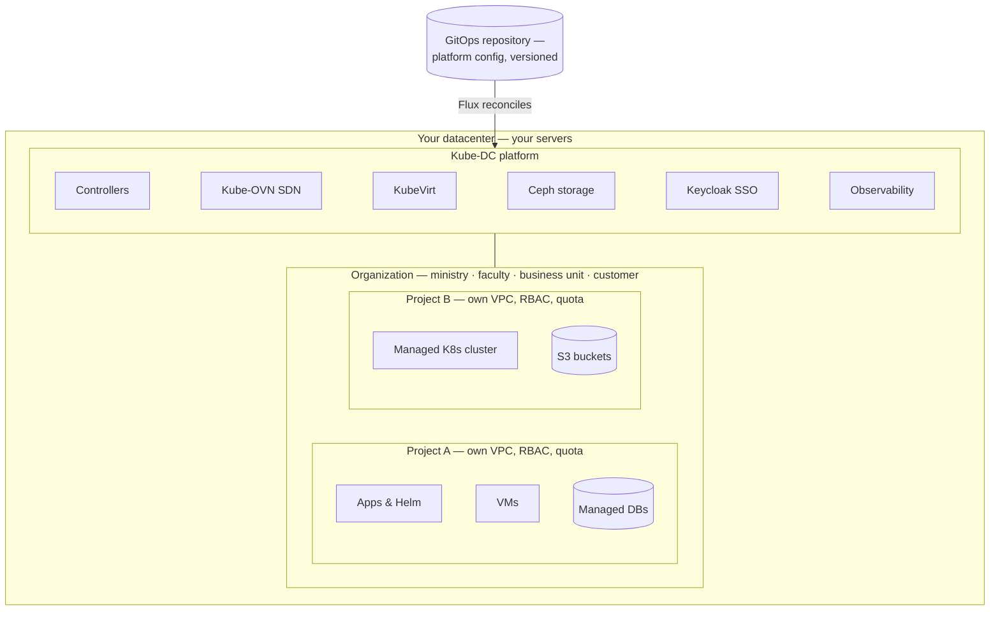
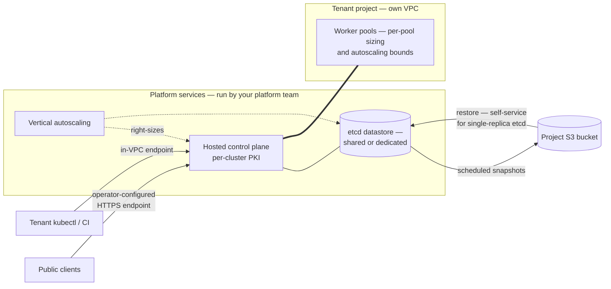
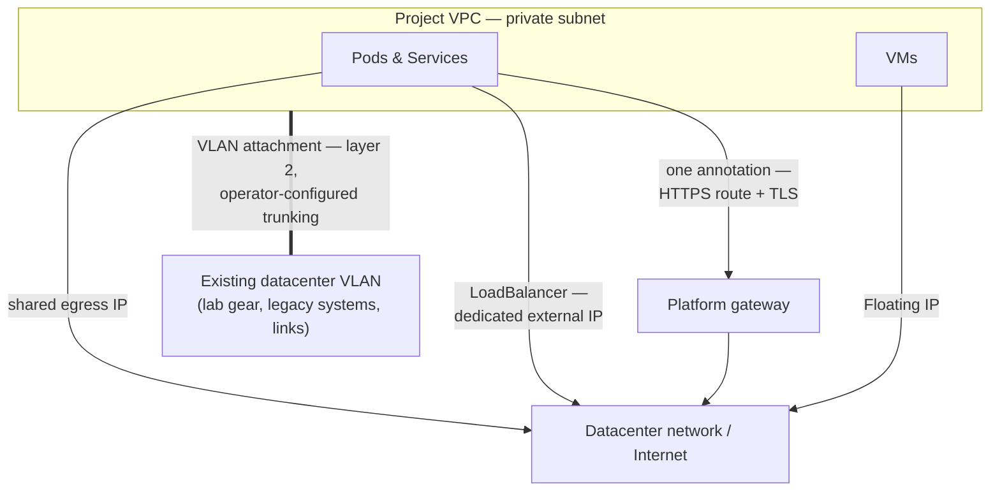
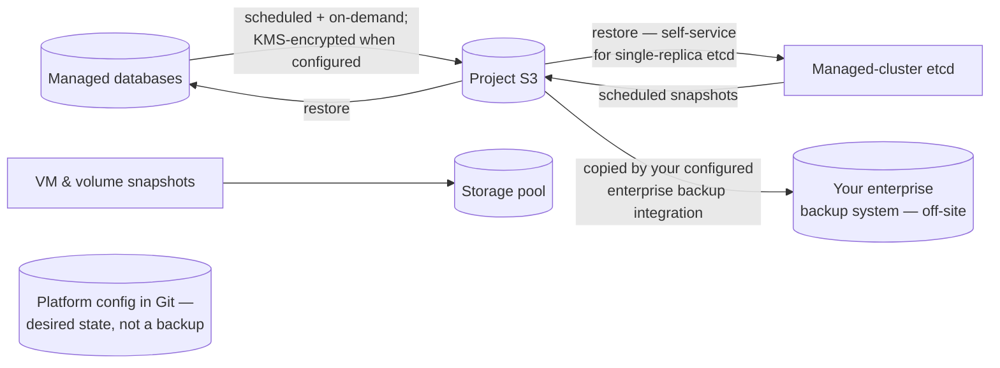

import DatasheetFigure from '@site/src/components/DatasheetFigure';
import ArchitecturalLayersDiagram from '@site/src/components/Diagram/ArchitecturalLayersDiagram';
import ProductModelDiagram from '@site/src/components/Diagram/ProductModelDiagram';
import {ManagedClusterTopologyDiagram} from '@site/src/components/Diagram/CloudTopologyDiagrams';
import {DataProtectionDiagram} from '@site/src/components/Diagram/DatasheetDiagrams';
import {OvnLogicalNetworkDiagram} from '@site/src/components/Diagram/NetworkingArchitectureDiagrams';

# DRAFT — Kube-DC Platform Datasheet

> 🚧 **Working draft — not for distribution.** Repositioned 2026-08-07 per
> owner direction: the datasheet's buyer is an **organization installing and
> operating Kube-DC on its own infrastructure** (public-sector bodies, large
> retail, universities, datacenter operators). Product-led voice; every claim
> is backed by a row in [claim-ledger-a-cloud.md](claim-ledger-a-cloud.md)
> or the published product docs — evidence stays in the ledger, not in this
> prose. Publication gates: [datasheet-plan.md](datasheet-plan.md).
> Screenshot placeholders `📷 S-xx` — capture list at the end.

---

# Kube-DC

**A multi-tenant private cloud platform for infrastructure you own.**

<a
  className="button button--primary"
  download
  href={require('./kube-dc-platform-datasheet-a4.pdf').default}>
  Download the A4 PDF
</a>

Kube-DC turns your servers into a private cloud your whole organization
consumes as a service: departments and teams get self-service projects with
their own networks, virtual machines, Kubernetes clusters, databases and
storage — while your platform team keeps central control of capacity,
security and cost. Your hardware, your datacenter, your data.

## Who it's for

- **Public-sector organizations** that must keep workloads and data on
  infrastructure they control, with strict separation between departments.
- **Large enterprises and retailers** consolidating VMware-era virtual
  machines and modern containerized services onto one platform.
- **Universities and research institutions** giving faculties, labs and
  student groups isolated, quota-controlled environments on shared hardware.
- **Datacenter and hosting operators** selling cloud services to their own
  customers under their own brand.

## At a glance

- **One platform for VMs and containers.** Virtual machines and Kubernetes
  workloads run side by side — same network fabric, same access model, same
  quota and billing.
- **Tenancy that reaches the network.** Every project gets its own VPC and
  subnet, not just a namespace label.
- **Self-service without losing control.** Teams provision VMs, clusters,
  databases, storage and public endpoints against quotas you set — through
  a web console, `kubectl`, a CLI, or an AI coding assistant.
- **Runs on standard x86-64 servers.** A platform starts at three nodes;
  capacity grows by adding nodes. Production sizing is validated against
  your workload in an architecture review.
- **Assembled from named open-source components.** Kubernetes, KubeVirt,
  Kube-OVN, Ceph, Keycloak, CloudNativePG and more — integrated and
  operated as one product.

Diagram source for GitHub

<ProductModelDiagram />

## How it works

Kube-DC installs on a Kubernetes cluster running on your servers. Platform
controllers reconcile a small set of resources — organizations, projects,
machines, clusters, databases, keys — into the systems that do the work:
software-defined networking, virtualization, identity, storage, ingress and
observability. The result behaves like a public cloud, scoped to your
hardware:

1. **Your platform team** installs Kube-DC with the `kube-dc` CLI, which
   bootstraps a GitOps repository — from then on, the platform's
   configuration is declarative and versioned.
2. **Organizations** are your tenants: a ministry's directorates, a
   university's faculties, a retailer's business units, or an operator's
   customers. Each organization has its own identity realm, members, plan
   and billing scope.
3. **Projects** are where teams deploy: each is an isolated environment
   with a namespace, RBAC, its own VPC and optional quotas — reachable
   through the console or a standard kubeconfig.

<ArchitecturalLayersDiagram />

## Multi-tenancy: organizations and projects

| Layer | Scope | Mechanism |
|---|---|---|
| Identity | Organization | A dedicated identity realm per organization (Keycloak SSO — console, API, CLI) |
| Namespace & RBAC | Project | Hierarchical namespaces with project-scoped roles |
| Network | Project | A dedicated VPC and subnet per project |
| Quota | Project | Per-project quotas within the organization's plan |
| Billing & chargeback | Organization | Plans, usage and subscription billing per organization |

Organization quotas constrain the configured Kubernetes resource
dimensions — CPU, memory, storage, pods, load balancers — and optional
project quotas subdivide them; object-storage and physical capacity have
their own controls and capacity planning. Project access is a curated role
set for deploying and operating workloads; cluster-scoped administration
stays with the platform team, and the supported project roles omit
interactive pod `exec`/`attach`, enforced by admission policy (one-off
tasks run as auditable Jobs instead).

<DatasheetFigure
  alt="Kube-DC organization Projects list showing Ready state, VPC CIDRs, workload counts and resource quota use"
  caption="Organization administrators see Project readiness, network allocation, running workloads and quota consumption in one view."
  src={require('./img/S-01.png').default}
/>

## Self-service projects: deploy applications directly

A project comes with a kubeconfig. Teams deploy applications, Helm charts,
Jobs and services straight into it — there is no cluster to request first
and no ticket queue. A complete stateful stack — application pods, a
managed database, S3 bucket, shared volumes, HTTPS endpoint, autoscaling —
deploys from plain Kubernetes manifests, with the platform providing the
ingress, certificates, database engine and storage underneath.

When a team needs cluster-scoped control — operators, CRDs, custom
controllers — it provisions a managed Kubernetes cluster instead (below).

## Virtual machines

- Linux and Windows guests from a prepared-image catalog — new VMs clone a
  prepared image snapshot, with no per-VM image download; bring your own
  images, with guest compatibility validated on import.
- Cloud-init configuration, SSH-key injection, interactive console in the
  web UI.
- Snapshots of running VMs; disk, CPU and memory sizing per VM.
- **Live migration**: VMs on the Migratable profile (shared block storage)
  are eligible to move between CPU-compatible hosts with sufficient
  capacity — the mechanism behind draining a host for maintenance.
- VMs attach to the project's VPC like any other workload: same networks,
  same floating IPs, same load balancers as containers.

## Managed Kubernetes clusters

Full tenant-administered Kubernetes clusters, provisioned from a project
with one manifest:

- **Hosted control planes** run as managed pods on the platform — tenants
  get a tenant-administered Kubernetes API with per-cluster PKI, without
  operating masters.
- **Worker pools** sized per pool (CPU, memory, disk, image), with
  autoscaling bounds per pool.
- **Control-plane and etcd vertical autoscaling** on by default — API
  server and etcd resources are right-sized within configured bounds as
  cluster load grows.
- **Staged, tenant-controlled upgrades** — control plane and worker pools
  move separately, in steps.
- **Scheduled etcd snapshots** (with optional envelope encryption) and
  restore — self-service for single-replica etcd datastores, assisted for
  multi-replica; private in-VPC endpoints by default, public HTTPS
  endpoints via the platform's gateway and certificate issuer on request.
- Admin and break-glass kubeconfigs retrievable by the tenant.

Diagram source for GitHub

<ManagedClusterTopologyDiagram />

## Managed databases

- PostgreSQL and MariaDB, provisioned by manifest or console.
- Multi-replica engine replication; after an eligible primary failure an
  available replica is promoted automatically — behavior depends on your
  deployment's topology and capacity.
- Scheduled and on-demand backups to the project's S3 bucket,
  envelope-encrypted when a KMS key is configured; restore into a new
  database or in place.
- Auto-generated credentials delivered as Kubernetes Secrets; optional
  credential-rotation policies.

## GPU services

- **Shared GPU for containers**: several workloads on one physical card,
  each holding a catalogued fixed slice of a specific GPU model —
  inference, notebooks, small training runs. The memory slice is
  enforced; the compute share is cooperative, so it is a density
  mechanism rather than a performance or security guarantee.
- **Dedicated GPU VMs**: one whole device attached to one guest, for
  workloads needing a stronger boundary (not live-migratable).
- **GPU as a governed product**: per-model entitlements enforced as
  quota, operator-held capacity reservations for organizations that can't
  queue, holder-safe node-mode transitions, an upgrade gate that
  qualifies device/kernel/driver/operator as one tuple, and a published
  threat and supply-chain model.
- GPU capabilities are enabled per cluster once your hardware, drivers and
  component set are qualified — GPU nodes couple those versions together,
  so enablement follows qualification.

## Storage

- **Block storage** for VMs and workloads (Ceph RBD), including a shared
  read-write-many tier for multi-pod volumes and live-migratable VMs.
- **S3-compatible object storage** with per-project buckets, provisioned
  through a standard `ObjectBucketClaim`.
- **Volume snapshots** and instant clones from golden images.
- Storage classes, replication factors and capacity are yours to define —
  the platform runs on the disks and topology you give it.

## Networking

- **A VPC per project** with private subnets; no private cross-project
  route exists by default — reachability exists only where a service is
  deliberately exposed.
- **External and floating IPs**: shared egress per project, dedicated
  addresses per load balancer, floating IPs that map to individual VMs —
  allocated from address pools your platform team defines.
- **LoadBalancer services and HTTPS ingress**: one annotation on a Service
  publishes it at a hostname with TLS, using the platform's gateway and
  certificate issuer on your address pools and DNS.
- **Physical VLAN attachment**: where the datacenter fabric trunks
  delegated VLANs to the platform nodes, a project's network bridges onto
  an existing VLAN at layer 2 — lab equipment, legacy systems, dedicated
  links — allocated from per-organization VLAN pools.
- Egress control and allowlists, operated by the platform team.

Diagram source for GitHub

<OvnLogicalNetworkDiagram />

## Security and identity

- **Single sign-on** across console, API and CLI, with an identity realm
  per organization (Keycloak; OIDC).
- **Role-based access** per project from a curated, supported role set;
  custom roles under platform-team control.
- **Key management service**: per-project, purpose-scoped encryption keys
  backed by non-exportable keys in the platform's secrets backend
  (OpenBao).
- **Secrets manager** for application credentials, with sync into
  Kubernetes Secrets — keep secrets out of Git.
- **Managed certificates**: public trust via ACME or your organization's
  private CA.
- Admission policies enforce tenant boundaries at the API — including the
  platform-wide block on interactive pod access.

## Observability

- **Configured automatically per organization.** When an organization is
  created, the platform's controllers provision its observability — a
  Grafana organization of its own, pre-built dashboards, a metrics tenant
  and log routing on the bundled multi-tenant Grafana/Mimir/Loki stack.
  Teams open Grafana and see their workloads; nothing to install.
- Metrics and logs are separated per tenant at the data layer — each
  organization sees only its own, including the control-plane telemetry
  of its managed Kubernetes clusters. Coverage and retention are
  operator-defined.
- Platform-level monitoring for the operator: cluster health, storage,
  networking and capacity, with alerting.

## Billing and chargeback

Organizations subscribe to plans that define their capacity; usage is
enforced as quota and visible per organization — the basis for internal
chargeback between departments or for invoicing external customers.
Subscription billing integrates with payment providers for operators
selling the platform as a service.

## Automation and integration

- Tenant-facing services are Kubernetes-native or custom resources — the
  documented console and CLI workflows drive the same APIs, so `kubectl`
  and GitOps pipelines can too.
- The `kube-dc` CLI handles login, context switching and platform
  bootstrap.
- **Published agent skills** let AI coding assistants (Claude Code, Cursor
  and others) create projects, deploy applications, provision VMs and
  databases through guarded, documented workflows.

## Data protection

Each managed service carries its own protection: database backups to
project S3 (envelope-encrypted when a KMS key is configured);
managed-cluster etcd snapshots and restore; VM and volume snapshots on
demand. Platform configuration lives in Git as desired state — it is not a
backup of service or workload data. For copies that must survive site or
storage loss, integrate the platform's S3 endpoints and snapshot APIs with
your enterprise backup system — Kube-DC does not replace it.

Diagram source for GitHub

<DataProtectionDiagram />

## Operating the platform

Your platform team runs Kube-DC through three surfaces that cover the
whole lifecycle:

- **Administration console** — a dedicated web panel for platform
  administrators: organizations and their plans, billing and
  subscriptions, capacity and storage health.
- **GitOps** — platform configuration is declaratively reconciled from a
  Git repository (Flux): component versions, platform settings and day-2
  changes land as version-controlled commits.
- **`kube-dc` CLI** — carries the platform from installation through
  day-2: bootstrap of the GitOps repository, status and configuration
  commands, adoption of existing clusters, and login/context management
  for daily `kubectl` work.

Operator-side monitoring and alerting come from the same bundled
observability stack the tenants use (see Observability).

<DatasheetFigure
  alt="Kube-DC administration dashboard summarizing Organizations, Projects, Managed Clusters, users, reconciliation failures and active elevations"
  caption="The administration dashboard gives platform operators a consolidated health and activity view across the tenant estate."
  src={require('./img/S-11.png').default}
/>

## Deployment and requirements

Reference baseline — subject to architecture validation. Production sizing
and supported hardware depend on workload, storage topology, failure
domains and validated NIC/firmware compatibility.

| | Evaluation | Production |
|---|---|---|
| Server nodes | 3 | 3+ (scale by adding nodes) |
| CPU per node | 8 cores | 16+ cores |
| RAM per node | 32 GB | 64+ GB |
| Storage per node | 500 GB SSD | Per your capacity plan; dedicated disks for Ceph |
| Operating system | Ubuntu 24.04 LTS | Ubuntu 24.04 LTS |
| Network | VLAN-capable NIC; management, cloud and provider networks | Redundant NICs |

Installation is CLI-driven: `kube-dc bootstrap init` scaffolds the GitOps
repository and hands the platform to Flux for reconciliation. Day-2
operations — upgrades, configuration changes, component versions — are Git
commits.

## Platform components

Kube-DC integrates named upstream open-source components: Kubernetes,
KubeVirt (virtualization), Kube-OVN (SDN), Rook-Ceph (storage), Keycloak
(identity), Kamaji + Cluster API (hosted control planes), CloudNativePG
and the MariaDB operator (databases), OpenBao (keys and secrets), Envoy
Gateway and cert-manager (ingress and TLS), Prometheus/Mimir/Loki/Grafana
(observability), Flux (GitOps). Component versions are pinned per Kube-DC
release. Workloads built on standard Kubernetes objects and standard VM
guest formats carry no platform-specific dependencies unless they use the
platform's own resources — which are enumerated, not hidden.

## Next steps

- **Evaluate:** install on three servers, or start in a hosted evaluation
  environment.
- **Talk to us:** architecture review against your hardware, network and
  tenancy requirements.

## Function datasheets in this guide

This document is the overview; each major function has its own datasheet
with full technical depth:

| Function | Datasheet |
|---|---|
| Managed Kubernetes clusters | [function-managed-kubernetes.md](function-managed-kubernetes.md) |
| Virtual machines | [function-virtual-machines.md](function-virtual-machines.md) |
| Managed databases | [function-managed-databases.md](function-managed-databases.md) |
| Networking & VLAN attachment | [function-networking.md](function-networking.md) |
| Storage & object storage | [function-storage.md](function-storage.md) |
| Security, identity & keys | [function-security.md](function-security.md) |
| Observability | [function-observability.md](function-observability.md) |
| GPU services | [function-gpu.md](function-gpu.md) |

---

## Draft apparatus (stripped at publication)

**Claim discipline.** No uptime figures, no TCO claims, no exclusivity
wording, no "complete isolation", no editions. Live-migration is stated
conditionally (shared block profile). Windows guests per prepared-image
path. Managed-cluster restore currently supports single-replica etcd — the
datasheet omits restore-topology detail; the technical specification
(Artifact B) carries it. Backing evidence:
[claim-ledger-a-cloud.md](claim-ledger-a-cloud.md) + published docs.

**Publication gates** (unchanged, [datasheet-plan.md](datasheet-plan.md)):
G-19 licence position before any "open-source platform" claim beyond the
component enumeration; G-20b before leading with VM data-protection against
vSphere; G-27/G-22 release manifest behind "pinned per release"; final
adversarial review (G-40) before distribution.

**📷 Capture list (owner).** Each capture embeds exactly once, in the
document listed. PNG at natural size, per the docs image conventions.

| ID | Document · section | Suggested filename | View | Must show |
|---|---|---|---|---|
| S-01 | Umbrella · Multi-tenancy | `platform-org-projects.png` | Console: organization with several projects | Org context, project list, quotas |
| S-02 | *(covered)* | — | Product-model and architectural-layers React SVG explainers | Organization → Projects → governed services; management and infrastructure layers |
| S-03 | Managed K8s fn · §4 | `S-03.png` | Cluster summary | readiness, API endpoint, kubeconfig, replicas, workers, encryption status |
| S-04 | Managed K8s fn · §4 | `S-04.png` | Worker Pool Configuration | per-pool replicas, autoscaling bounds and idle-node behavior |
| S-05 | VMs fn · §4 | reused `docs/cloud/images/connecting-vm.png` | VM Guest OS panel | console preview and console/SSH launch actions |
| S-06 | Observability fn · §1 | **missing** | Organization Grafana | tenant-scoped workload dashboard and managed-cluster control-plane telemetry |
| S-07 | VMs fn · §2 | `platform-vm-create.png` | Console: create VM | Image catalog, Standard/Migratable profile choice, sizing |
| S-08 | Databases fn · §4 | `platform-db-backups.png` | Console: database detail → Backups tab | Backup list, take-snapshot action, schedule/retention |
| S-09 | Networking fn · §4 | reused `docs/platform/images/vlan-admin-2-allocations.png` | Console: VLAN allocation | Organization delegation and Project assignment *(recapture fictional values before publication)* |
| S-10 | Security fn · §1 | reused `docs/cloud/images/edit-org-group-view.png` | Console: Organization Group | directory role → Project role mapping |
| S-11 | Umbrella · Operating the platform | `platform-admin-console.png` | Administration console | Organizations/plans or storage-health view |
