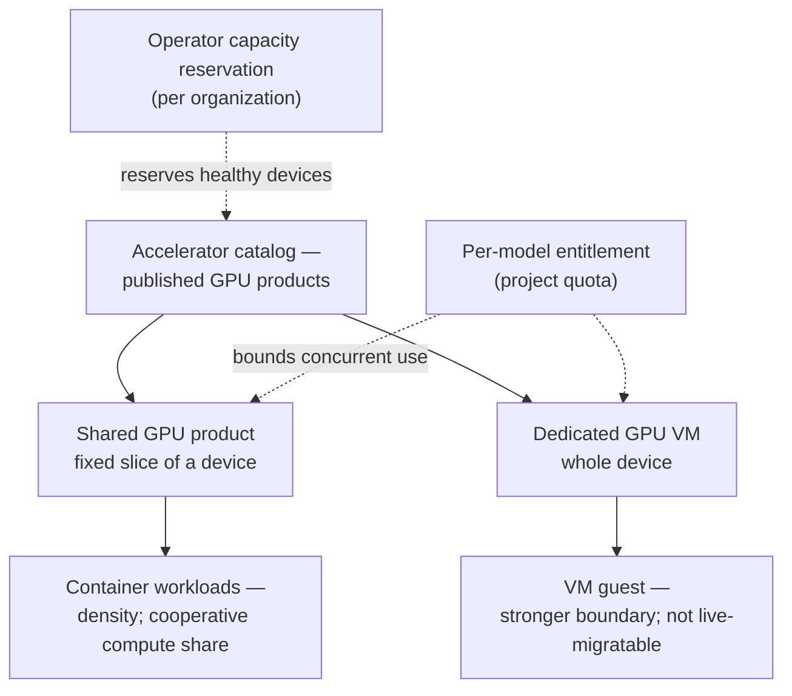

import {GpuServiceModelDiagram} from '@site/src/components/Diagram/DatasheetDiagrams';

# GPU services

**Offer fixed GPU shares to containers or attach a complete GPU to a virtual
machine.**

Kube-DC presents GPUs as catalogued products with per-model entitlements and
capacity reservations. It also documents the security and supply-chain
controls required by the privileged components that run on GPU nodes.

Before enabling GPU services, the platform team qualifies the hardware,
kernel, driver, and operator versions together. Shared GPUs and dedicated GPU
VMs have separate controls, so an installation can offer either or both.

## Shared GPU for containers

Several container workloads run on one physical GPU at the same time, each
holding a fixed fraction of the device — the right fit for inference,
notebooks, small training runs and batch scoring, where a whole card is
waste.

- **Fixed-product profiles.** A shared product is a defined fraction of a
  specific GPU model (for example, an 8 GiB slice of an NVIDIA V100)
  published in the platform's accelerator catalog. Tenants request a
  product; they do not freely tune memory and compute.
- **The memory slice is enforced.** Inside the container, the GPU reports
  the slice size, not the physical card.
- **The compute share is cooperative.** Workloads are steered toward their
  share in steady state; startup and some library paths can briefly exceed
  it. Stated plainly: this is a density mechanism, **not a performance
  guarantee and not a security boundary** — for a hard boundary, use a
  dedicated GPU VM.
- **Standard Kubernetes consumption.** Workloads request GPU products
  through Kubernetes' Dynamic Resource Allocation — a manifest applied
  with `kubectl`, like any other workload. Shared GPU runs tenant
  workloads in production on the reference deployment today.

## Dedicated GPU VMs

One whole physical GPU attached to one virtual machine, for workloads that
need a stronger boundary than software sharing: an isolated guest with the
full device.

- Whole-device passthrough to a Linux or Windows guest, from the
  deployment's qualified image and driver matrix.
- **Not live-migratable** — planned maintenance means shutdown and
  restart, and a later start can wait for capacity or receive a different
  physical device.
- Guest images and driver packages are qualified per deployment: the
  platform team publishes an approved package version and checksum before
  enabling GPU VM creation. The published matrix names the qualified
  guests; anything outside it is qualified separately.

Diagram source for GitHub

<GpuServiceModelDiagram />

## Entitlements, quota and reservations

Two different things, deliberately distinguished:

- **Entitlement (quota)** — each GPU model is metered independently in
  organization and project quota, so a team's V100 allowance never
  consumes another model's headroom. An entitlement bounds concurrent
  use; it does **not** reserve a physical device, so a valid workload can
  legitimately queue when all matching GPUs are busy.
- **Capacity reservation** — an operator-held amount of healthy physical
  capacity set aside for one organization, tracked in a separate capacity
  ledger. This is what a department buys when queuing is unacceptable.
  Reservations are fungible: the guarantee is the number of healthy
  devices, not a specific card.

Assigning a GPU add-on does not by itself create a reservation — the
distinction is enforced in the product, not just in the documentation.

## Node modes and day-2 operations

A GPU node runs in one mode at a time — shared-container or dedicated-VM
passthrough — because the two require different host configuration.

- **Holder-safe mode transitions**: the `kube-dc` CLI performs the
  day-2 switch between modes with an explicit safety contract — creation
  gates closed, GPU holders inventoried, node cordoned, fleet state and
  live state in agreement before anything moves.
- **Upgrade gating**: GPU nodes couple the PCI device, host kernel,
  Kubernetes distribution, driver, GPU operator and monitoring exporter
  into **one tuple** that must be validated together — upstream support
  for each component separately is not sufficient. The CLI provides a
  read-only pre-upgrade gate; the documented sequence qualifies a canary
  node and proves rollback before a fleet-wide plan.

## Security and supply chain

GPU drivers, device plugins, schedulers and monitoring agents run
privileged enough to compromise a node, so version selection and image
provenance are part of the security boundary — not routine application
upgrades.

- **A published threat model** covers shared containers, dedicated VMs,
  catalog and discovery, quota, billing, installation, node-mode
  transitions, monitoring and the user interfaces — including the
  invariants the design preserves (a tenant cannot mint GPU entitlement
  by editing ordinary resources).
- **A qualified installer tuple**: an enabled installation accepts one
  indivisible, version-pinned component set, with runtime audit and a
  promotion gate — not "latest".
- Admission policies force tenant GPU requests into the exact catalog
  product, and per-model quota bounds the count, so entitlement cannot be
  exceeded by hand-written manifests.

## Responsibilities

| Concern | Your platform team | Tenant |
|---|---|---|
| Hardware, drivers, GPU operator, qualification of the component tuple | ✅ | — |
| Enabling GPU capabilities per cluster and per project | ✅ (gated, after qualification) | — |
| Catalog products (which slices and models exist) | ✅ defines | ✅ requests |
| Entitlements and reservations | ✅ grants | ✅ consumes within quota |
| Node-mode transitions and GPU node upgrades | ✅ | — |
| Workload design, drivers inside VM guests, performance tuning | — | ✅ |

---
