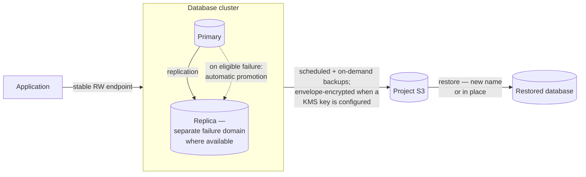

import DatasheetFigure from '@site/src/components/DatasheetFigure';
import {ManagedDatabaseProtectionDiagram} from '@site/src/components/Diagram/DatasheetDiagrams';

# DRAFT — Kube-DC Function Datasheet: Managed databases

> 🚧 **Working draft — not for distribution.** Companion to the
> [platform datasheet](draft-artifact-a-datasheet.md). Claims trace to the
> [claim ledger](claim-ledger-a-cloud.md) and published product docs;
> publication gates per [datasheet-plan.md](datasheet-plan.md).

---

# Managed databases

**Teams provision PostgreSQL and MariaDB without operating the database
engine themselves.**

A tenant creates a database from a short manifest or a console form. Platform
controllers manage the engine, replication, and backups. The tenant receives a
stable endpoint and a Kubernetes Secret containing the credentials.

## Engines and provisioning

PostgreSQL and MariaDB, in the versions published by the platform's
catalog. A database is one resource:

```yaml
apiVersion: db.kube-dc.com/v1alpha1
kind: KdcDatabase
metadata:
  name: orders
  namespace: acme-shop
spec:
  engine: postgresql
  version: "16"
  databaseName: orders
  username: app
  cpu: "1"
  memory: 2Gi
  storage: 20Gi
  replicas: 2
  backup:
    enabled: true
    schedule: "0 2 * * *"
    retentionDays: 7
```

The platform provisions the engine, storage and credentials from the
manifest, exposing a stable in-project endpoint (`orders-rw.<project>.svc`
for PostgreSQL; a primary-routing endpoint for MariaDB) and an
auto-generated credentials Secret.

## Topology and failover

- **1 replica** — standalone instance.
- **2+ replicas** — engine-level replication: PostgreSQL streaming
  replication; MariaDB primary–replica replication. With sufficient
  independent failure domains and capacity, instances schedule across
  separate hosts, and after an eligible primary failure the operator
  promotes an available replica automatically — recovery behavior depends
  on engine state and deployment topology, and the read-write endpoint
  follows the current primary.

<details data-github-only>
<summary>Diagram source for GitHub</summary>



</details>

<ManagedDatabaseProtectionDiagram />

A practical note for multi-replica databases: the resource reports `Ready`
when the service is available; check instance readiness before assuming
full redundancy after creation or maintenance.

## Credentials

- Connection details and passwords are generated by the platform and
  delivered as Kubernetes Secrets — applications consume them as
  environment variables or mounted files; nothing is typed or emailed.
- **Credential-rotation policies** rotate static passwords on a schedule
  and project the current credential into a stable Secret your workloads
  reference.

## Backups

- **Scheduled backups** per database — cron schedule and retention days in
  the manifest — written to the project's S3-compatible bucket.
- **On-demand snapshots** any time, from the console or by creating a
  backup resource.
- **Per-database encryption**: reference a project KMS key and backups are
  envelope-encrypted with a key that never leaves the platform's secrets
  backend.
- For PostgreSQL, point-in-time recovery is available within the backup
  window where continuous archiving is enabled.

<DatasheetFigure
  alt="Managed PostgreSQL Backups tab showing a daily schedule, seven-day retention, S3 destination, manual backup action and completed backup history"
  caption="Database protection is visible and operable from the service itself: schedule, retention, destination, on-demand backup and completion history share one view."
  src={require('./img/S-08.png').default}
/>

## Restore

Two documented paths:

- **Restore into a new database** (recommended): create a new
  `KdcDatabase` with `spec.restoreFrom` naming the backup — verify the
  recovered data, then switch applications over. The source database keeps
  running.
- **In-place restore** (destructive): trigger by annotation on the
  existing database; the platform re-bootstraps it from the chosen backup.
  Plan a maintenance window — current data is replaced.

## Configuration and lifecycle

- Resources (CPU, memory) and engine parameters adjustable per database;
  some changes restart instances or trigger failover — applications should
  reconnect and retry.
- Storage grows online (increase only).
- Version changes are maintenance operations: verify a current backup
  first, then move.

## Responsibilities

| Concern | Your platform team | Tenant |
|---|---|---|
| Engine operation, replication, failover | ✅ (controllers) | — |
| Backup execution and storage | Controllers execute scheduled backups | ✅ schedule/retention choice, on-demand runs |
| Restore | Mechanism provided | ✅ initiates, verifies recovered data |
| Credentials delivery and rotation | ✅ | ✅ application usage hygiene |
| Schema, queries, application-level integrity | — | ✅ |
| Off-platform backup copies | S3 endpoints provided | ✅ via enterprise backup |

---

## Draft apparatus (stripped at publication)

Evidence: cross-host replication and automatic failover verified live for
both engines (ledger row 18); backup + restore-to-new-name verified
including the generated credentials Secret (row 19, re-verified
2026-08-07); KMS backup encryption verified (row 20); readiness semantics
row 21; in-place restore and PITR per published docs and engine mechanisms
(CNPG recovery); credential-rotation policies per the published
DatabaseCredentialPolicy documentation and CLI. Not claimed: failover
timings as commitments, durability figures (deployment-dependent), HA
beyond engine replication, failover as an unconditional outcome.
