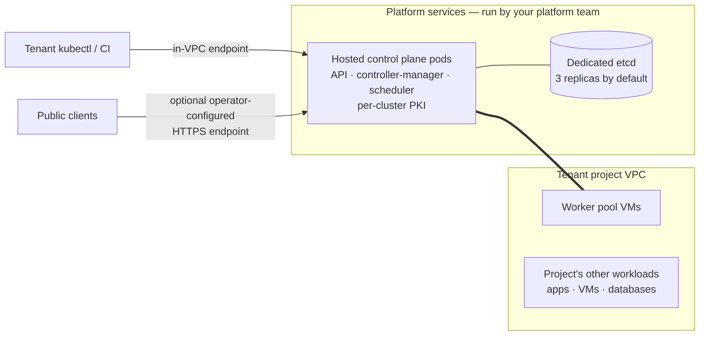
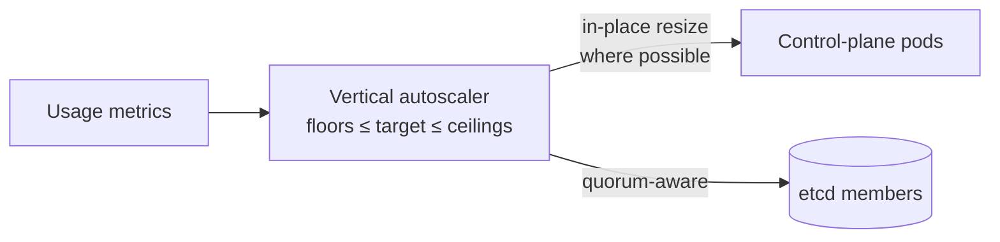
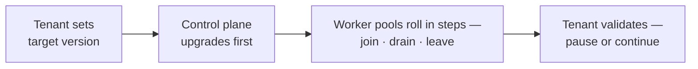

import DatasheetFigure from '@site/src/components/DatasheetFigure';
import {ManagedClusterTopologyDiagram} from '@site/src/components/Diagram/CloudTopologyDiagrams';
import {ManagedKubernetesSizingDiagram, ManagedKubernetesUpgradeDiagram} from '@site/src/components/Diagram/DatasheetDiagrams';

# DRAFT — Kube-DC Function Datasheet: Managed Kubernetes clusters

> 🚧 **Working draft — not for distribution.** Companion to the
> [platform datasheet](draft-artifact-a-datasheet.md); modeled on the
> finished CloudSigma managed-Kubernetes datasheet
> (`kubernetes-cluster/docs/managed-kubernetes-datasheet.md`) with all
> provider-specific content removed. Claims trace to the
> [claim ledger](claim-ledger-a-cloud.md) and operator source; publication
> gates per [datasheet-plan.md](datasheet-plan.md).

---

# Managed Kubernetes clusters

**Each team gets its own Kubernetes API. Your platform team operates the
control planes.**

Departments, faculties, or customers can provision tenant-administered
Kubernetes clusters from their projects. Kube-DC runs the control planes.
Tenant administrators manage their clusters' workloads, upgrades, and access.

## Architecture

A managed cluster has two parts:

- **The hosted control plane** runs as managed pods on the platform cluster.
  It includes the API server, controller manager, and scheduler, with a
  dedicated PKI for each cluster. Control planes use a platform-internal
  network that has no route from tenant networks. Tenants reach only the API
  endpoints published for their clusters.
- **Worker pools** run as virtual machines in the tenant project's VPC, beside
  the project's other workloads. Workers join the control plane when the
  cluster is created and when a pool scales up.

Clusters can share the platform datastore or use a **dedicated etcd
datastore**. A dedicated datastore uses three replicas by default and keeps the
cluster state on its own instance. The platform manages certificate rotation.

<details data-github-only>
<summary>Diagram source for GitHub</summary>



</details>

<ManagedClusterTopologyDiagram />

## Provisioning

A cluster is one manifest (or a console form):

```yaml
apiVersion: k8s.kube-dc.com/v1alpha1
kind: KdcCluster
metadata:
  name: analytics
  namespace: acme-data-platform
spec:
  version: v1.36.1
  controlPlane:
    replicas: 1            # 2+ = multi-replica topology; availability depends on deployment
  dataStore:
    dedicated: true        # own etcd instance for this cluster
  network:
    serviceCIDR: 10.96.0.0/16
    podCIDR: 10.244.0.0/16
  workers:
    - name: general
      replicas: 3
      cpuCores: 4
      memory: 8Gi
      diskSize: 30Gi
```

From this resource, the platform provisions the control plane, datastore,
worker VMs, cluster PKI, and kubeconfigs, then joins the workers. Deleting the
`KdcCluster` removes the cluster. Backup objects follow the configured bucket
and retention policy.

## Endpoints and access

- **Private by default.** The cluster API is reachable from the owning
  project's VPC.
- **Public HTTPS when requested.** An annotation publishes the API at a
  stable hostname through the platform gateway, DNS, and certificate issuer.
  The API server certificate is reissued with the public name.
- **Kubeconfigs stored as Kubernetes Secrets.** The owning project receives an
  admin kubeconfig for the in-VPC endpoint and, when enabled, an external
  kubeconfig for the public endpoint. Tenants and CI systems can retrieve them
  through the console, CLI, or `kubectl`.
- **Independent break-glass credentials.** The admin kubeconfig does not rely
  on platform SSO. Access still requires an available endpoint, network path,
  and control plane.

## Worker pools

- Configure CPU, memory, disk, OS image, and replica count for each pool. A
  cluster can have several pools for different workloads.
- Prepared, versioned worker images are matched to the Kubernetes version.
- **Per-pool autoscaling** uses `minReplicas` and `maxReplicas` bounds, plus a
  maximum change per scaling event.
- Rolling operations honor PodDisruptionBudgets during drains, up to the
  configured drain timeout.

<DatasheetFigure
  alt="Managed Kubernetes cluster summary showing Ready status, API endpoint, kubeconfig download, control-plane replicas, worker count and encryption-at-rest status"
  caption="The cluster summary brings endpoint access, control-plane readiness, worker capacity and security status into one tenant-facing view."
  src={require('./img/S-03.png').default}
/>

<DatasheetFigure
  alt="Two Managed Kubernetes worker pools with replica controls and autoscaling enabled between one and four nodes"
  caption="Worker-pool autoscaling is configured independently per pool, including minimum and maximum replicas and whether idle nodes may be removed."
  src={require('./img/S-04.png').default}
/>

## Control-plane and etcd right-sizing

Kube-DC adjusts tenant control-plane resources within configured bounds and
available platform capacity. VerticalPodAutoscalers are enabled by default for
control-plane pods and etcd members:

- Resource targets follow observed load between configured floors and
  ceilings. Small clusters stay small, while growing clusters receive more API
  server and etcd capacity.
- Scaling is quorum-aware by design: recommendations are applied in-place
  where possible, and etcd resizing respects member quorum.
  Single-replica datastores use a conservative initial-assignment mode.

<details data-github-only>
<summary>Diagram source for GitHub</summary>



</details>

<ManagedKubernetesSizingDiagram />

## Upgrades

Upgrades are staged and tenant-controlled:

1. The tenant (or platform team, by arrangement) sets the target version.
2. The **control plane upgrades first**, without replacing worker nodes.
3. **Worker pools roll in steps** — new nodes join, old nodes drain and
   leave, pool by pool, with PodDisruptionBudgets honored during drains.

The control plane and workers move separately. Tenants can pause after a
stage, validate the cluster, and continue. Supported version skew follows
upstream Kubernetes policy.

<details data-github-only>
<summary>Diagram source for GitHub</summary>



</details>

<ManagedKubernetesUpgradeDiagram />

## Snapshots and restore

- **Scheduled etcd snapshots** are enabled automatically when the
  project's backup bucket exists (daily by default; schedule and
  retention configurable per cluster), written to the project's
  S3-compatible storage.
- **On-demand snapshots** at any time — from the console or by triggering
  the snapshot job.
- **Optional envelope encryption** of snapshots with a tenant-scoped key
  reference; without it, snapshots are stored unencrypted.
- **Self-service restore**: pick a snapshot, trigger the restore, and the
  control plane returns with the cluster's API state rolled back to the
  snapshot. The tenant API is unavailable during restore.

Scope and current limits, stated plainly:

- Etcd snapshots protect **Kubernetes API state**; they do not protect
  PersistentVolume contents — protect application data through its owning
  service (database backups, volume snapshots, object storage).
- Restore currently supports **single-replica etcd datastores**;
  multi-replica restore is on the roadmap. For clusters using the default
  three-replica dedicated datastore, restore is an assisted operation
  until then.

## Isolation and security

- Control planes run on a platform-internal network with no route from
  tenant networks; workers and workloads live in the tenant project's VPC.
- Each cluster has its own PKI — certificates are per-cluster, rotated by
  the platform.
- Inside their cluster, tenants hold full cluster-admin: their own RBAC,
  CRDs, operators and admission configuration, independent of the
  platform's project roles.
- The cluster inherits the project's network boundary: reaching a
  cluster's workloads from outside happens only through the exposure the
  tenant configures (LoadBalancer services, HTTPS routes).

## Observability

When the observability stack is enabled, managed-cluster control-plane logs and
events appear in the owning organization's Grafana. Tenants can inspect their
API servers and controllers, while the platform team monitors all control
planes centrally. The operator defines coverage and retention.

## Responsibilities

| Concern | Your platform team (via Kube-DC) | Tenant |
|---|---|---|
| Control-plane operation, PKI, datastore | ✅ | — |
| Control-plane/etcd sizing | ✅ automatic, within configured bounds | — |
| Worker pool sizing and autoscaling bounds | — | ✅ |
| Kubernetes version and upgrade timing | Controllers execute the staged rollout | ✅ selects target and timing from supported versions |
| Etcd snapshots | Controllers execute scheduled snapshots | ✅ policy, on-demand runs, restore initiation |
| Workloads, in-cluster RBAC, CRDs, operators | — | ✅ |
| Application data protection | — | ✅ via managed services |
| Network exposure of cluster workloads | Platform provides EIPs/routes | ✅ configures |

---

## Draft apparatus (stripped at publication)

Evidence: hosted-CP provisioning, endpoints, kubeconfigs, VPA-on-by-default,
snapshot + restore verified live on the production deployment (ledger rows
8–14, 27–28); VPA semantics and upgrade staging verified in operator
source; per-pool autoscaling fields verified in the API (scaling behavior
verified on the CloudSigma-provider deployment — generic claim kept to the
feature, not to timings). Not claimed: etcd encryption at rest (backup
encryption only), cross-site DR, restore of multi-replica datastores,
provisioning timings as commitments.

📷 Captures: cluster summary = S-03; worker-pool autoscaling = S-04.
The Grafana control-plane-log view remains a separate observability capture
gap and must not be represented by S-04.
