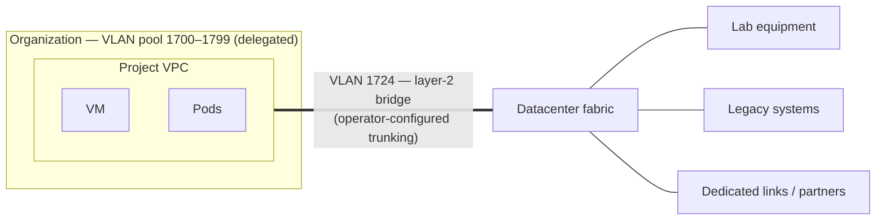

import DatasheetFigure from '@site/src/components/DatasheetFigure';
import {VlanAllocationDiagram} from '@site/src/components/Diagram/CloudFlowDiagrams';

# DRAFT — Kube-DC Function Datasheet: Networking & VLAN Attachment

> 🚧 **Working draft — not for distribution.** Companion to the
> [platform datasheet](draft-artifact-a-datasheet.md). Claims trace to the
> [claim ledger](claim-ledger-a-cloud.md) and published product docs;
> publication gates per [datasheet-plan.md](datasheet-plan.md).

---

# Networking & VLAN Attachment

**Cloud networking semantics on your own fabric — VPCs, public endpoints
and layer-2 reach into the datacenter you already run.**

Kube-DC's network layer gives every project the isolation model of a
public-cloud VPC, while staying connected to the physical reality of your
datacenter: your uplinks, your address space, your existing VLANs.

## 1. Per-project VPCs

Every project receives its own VPC and private subnet at creation. No
private cross-project route is configured by default — the boundary is
enforced in the software-defined network, not by policy convention, and
reachability between projects exists only where a service is deliberately
exposed or the operator configures routing. Pods, VMs and managed-cluster
workers in the same project share the project network and reach each other
directly.

## 2. Address model

| Object | What it does |
|---|---|
| **Shared egress IP** | Every project gets outbound connectivity through a shared external address |
| **External IP (EIp)** | A dedicated external address, allocated automatically per LoadBalancer service or explicitly for a purpose |
| **Floating IP (FIp)** | Maps an external address to an individual VM — inbound and outbound — without a load balancer |

Address pools are defined by the platform team from your ranges; tenants
consume them within quota.

## 3. Exposing services

Two documented paths, chosen per service:

- **HTTPS route (recommended for web/API/gRPC):** one annotation on a
  `LoadBalancer` Service publishes it at a hostname with a TLS
  certificate issued by the platform's configured issuer — no ingress
  controller for tenants to run, no certificate handling. Uses the
  platform's gateway, your routable address pools and DNS.
- **Direct LoadBalancer (any TCP/UDP):** the Service receives a dedicated
  external IP for protocols and ports beyond HTTP.

Managed-cluster API endpoints follow the same model: private in-VPC by
default, public HTTPS through the platform gateway on request.

## 4. VLAN attachment: layer-2 into your datacenter

Where the datacenter fabric trunks delegated VLANs to the platform nodes
and the operator configures the bridge and VLAN pools, a project's network
can be bridged onto an existing datacenter VLAN.

- **Per-organization VLAN pools**: the platform team delegates ranges of
  VLAN IDs to organizations; tenants allocate segments from their pool
  self-service, without tickets and without being able to touch another
  organization's VLANs.
- Workloads — VMs and pods — gain a leg on the physical segment: lab
  instruments, storage networks, legacy systems, partner links, anything
  that expects layer-2 adjacency.
- Addressing on the attached segment is yours: static, your DHCP, or
  platform-managed.

<DatasheetFigure
  alt="Kube-DC VLAN allocation table showing physical segments delegated to an Organization and assigned to Projects"
  caption="Platform operators delegate physical segments to an Organization; its administrators can then assign or reassign those allocations to Projects without changing the underlying fabric."
  src={require('../platform/images/vlan-admin-2-allocations.png').default}
/>

Diagram source for GitHub

<VlanAllocationDiagram />

## 5. Traffic control

- Egress restrictions and allowlists are operator-configured platform
  controls — tenants request exceptions; the platform team owns the
  policy.
- Network boundaries are a property of the VPC layer: they are not
  tenant-configurable objects inside a project.
- North-south exposure happens through the objects above — an address or
  route a tenant deliberately created.

## 6. Responsibilities — networking

| Concern | Your platform team | Tenant |
|---|---|---|
| Fabric, uplinks, address ranges, VLAN delegation | ✅ | — |
| VPC creation and isolation | ✅ automatic | — |
| Egress policy and allowlists | ✅ | requests exceptions |
| Service exposure (LBs, routes, FIPs) | Mechanisms provided | ✅ configures per service |
| VLAN segment allocation from the org pool | Pool delegation | ✅ self-service within pool |
| DNS for published hostnames | Platform zone provided | ✅ own domains via CNAME |

---

## Draft apparatus (stripped at publication)

Evidence: per-project VPC, per-LB EIPs, FIp→VM mapping observed live
(ledger rows 3, 22); HTTPS route + automatic certificate verified in the
application-stack E2E (row 7); VLAN attachment and per-org pools proven on
a customer deployment with published documentation (row 23 — keep the
"by arrangement/deployment-dependent" nature in the platform context: it
requires trunked fabric). Not claimed: tenant-authored NetworkPolicies,
universal TLS, cross-project routing options.
