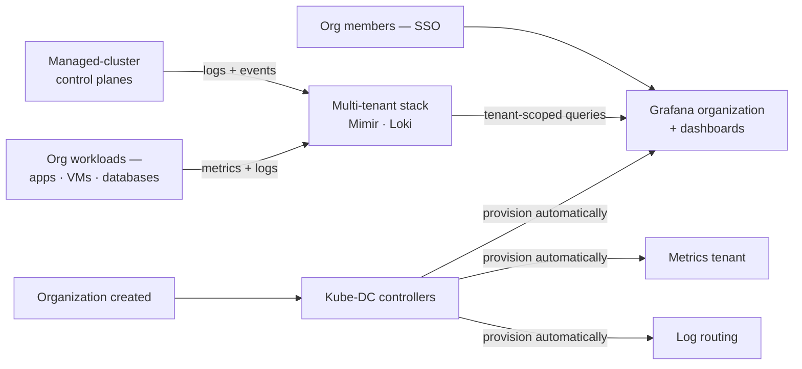

import {ObservabilityPipelineDiagram} from '@site/src/components/Diagram/DatasheetDiagrams';

# DRAFT — Kube-DC Function Datasheet: Observability

> 🚧 **Working draft — not for distribution.** Companion to the
> [platform datasheet](draft-artifact-a-datasheet.md). Claims trace to the
> [claim ledger](claim-ledger-a-cloud.md), operator source and published
> product docs; publication gates per [datasheet-plan.md](datasheet-plan.md).

---

# Observability

**Each organization receives its own view of metrics, logs, and dashboards.**

Kube-DC includes a multi-tenant observability stack based on Grafana, Mimir,
and Loki. When an organization is created, platform controllers provision a
Grafana organization, dashboards, a metrics tenant, and log routing. Teams can
open Grafana and inspect their workloads without installing a separate
monitoring stack.

## What every organization gets

- **A Grafana organization of its own** — members sign in with the same
  SSO they use everywhere else and land in their organization's view.
- **Pre-provisioned dashboards** for the organization's projects and
  workloads — created and maintained by the platform's controllers, not
  hand-built per team.
- **Metrics** collected from the organization's workloads and served from
  the multi-tenant metrics store, scoped per tenant.
- **Logs** from the organization's workloads, routed per tenant and
  queryable from the same Grafana.
- **Managed-cluster control-plane telemetry**: the logs and events of an
  organization's managed Kubernetes clusters surface in its Grafana — API
  servers and controllers are watchable without filing a ticket.

📷 S-06 — an organization's Grafana dashboard.

Diagram source for GitHub

<ObservabilityPipelineDiagram />

## Tenant separation

The stack is shared; the data is not. Metrics and logs are separated per
tenant at the data layer — queries from one organization's Grafana reach
only that organization's data. The platform operates one observability
system for all tenants instead of one stack per team, which is what makes
day-one monitoring economically automatic.

## The operator's view

The platform team monitors the platform itself from the same tooling:

- Cluster health, capacity, networking and component status, with
  alerting for platform operators.
- **Storage health**: Ceph dashboards and alerts for the storage layer,
  surfaced in the operator's monitoring and the administration console.
- Coverage and retention are operator-defined — the bundled defaults are
  a starting point, tuned to your capacity in the architecture review.

## Responsibilities

| Concern | Your platform team | Tenant |
|---|---|---|
| Observability stack operation and capacity | ✅ | — |
| Per-organization provisioning (Grafana org, dashboards, tenants, routing) | ✅ automatic, by controllers | — |
| Retention and coverage configuration | ✅ | — |
| Watching workload dashboards, acting on application signals | — | ✅ |
| Custom dashboards within the organization's Grafana | — | ✅ |
| Platform alerting and response | ✅ | reports suspected platform issues |

---

## Draft apparatus (stripped at publication)

Evidence: automatic per-organization provisioning (Grafana organizations,
dashboards, metrics tenants) is controller behavior in operator source
(organization reconciler maintains Grafana orgs/dashboards and metrics
tenants); the metrics store runs with multi-tenancy enabled (verified
live, ledger row 31); managed-cluster CP telemetry pending on-service
re-capture (row 32 / capture S-06). Not claimed: retention values as
commitments (operator-defined), tenant-authored alerting unless
configured, coverage guarantees. 📷 Capture S-06 must show an Organization
Grafana view and managed-cluster control-plane telemetry; no Grafana capture
is currently present.
