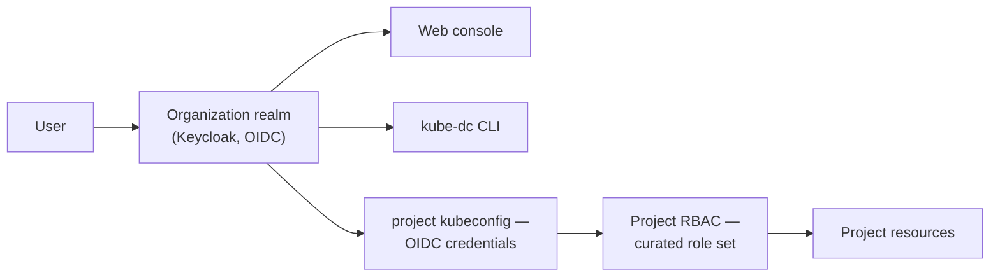

import DatasheetFigure from '@site/src/components/DatasheetFigure';
import {IdentityTenancyDiagram} from '@site/src/components/Diagram/ResourceModelDiagrams';

# DRAFT — Kube-DC Function Datasheet: Security, identity, and keys

> 🚧 **Working draft — not for distribution.** Companion to the
> [platform datasheet](draft-artifact-a-datasheet.md). Claims trace to the
> [claim ledger](claim-ledger-a-cloud.md) and published product docs;
> publication gates per [datasheet-plan.md](datasheet-plan.md).

---

# Security, identity, and keys

**Separate tenant identity, permissions, networks, keys, and secrets at the
boundaries where they are used.**

Kube-DC combines organization identity, project RBAC, VPC boundaries, and
project-scoped keys and secrets. A different subsystem enforces each boundary,
so tenant separation does not depend on a single control.

## Identity and single sign-on

- **An identity realm per organization** (Keycloak): each tenant
  organization manages its own users, groups and login policies —
  isolated from every other organization's.
- **Single sign-on across every surface**: console, Kubernetes API and
  CLI authenticate against the same realm via OIDC. Platform-project
  kubeconfigs use organization OIDC credentials; managed-cluster
  admin/break-glass kubeconfigs use separate per-cluster credentials.
- **Group-based access**: organization groups map to project roles
  declaratively, so joiners/leavers are handled in the directory, not in
  per-project role edits.

<DatasheetFigure
  alt="Edit Organization Group form mapping directory roles to a specific Project role"
  caption="Organization Groups map identity roles to Project-specific permissions, keeping access assignments explicit at each governed workload boundary."
  src={require('../cloud/images/edit-org-group-view.png').default}
/>

Diagram source for GitHub

<IdentityTenancyDiagram />

## Project authorization

- **A curated, supported role set** per project — scoped to deploying and
  operating workloads. Cluster-scoped resources, CRDs and admission
  configuration are excluded by construction.
- **Interactive `exec`/`attach` into pods is excluded from the supported
  project roles** and denied by an admission policy at the API. One-off
  tasks run as auditable Jobs instead. Scope stated plainly: users
  permitted to create or modify workloads can still run code through
  those workloads, and the restriction does not apply inside
  tenant-administered managed clusters.
- Custom roles remain under platform-team control; the default roles are
  a baseline, not a ceiling.

## Key management (KMS)

- **Per-project, purpose-scoped keys** (`application`, `backup`, …)
  backed by non-exportable keys in the platform's secrets backend
  (OpenBao Transit): encrypt/decrypt happens as an API operation — key
  material never leaves the backend.
- Used by the platform itself where it matters: managed-database backups
  and managed-cluster snapshot encryption reference tenant KMS keys.
- Envelope encryption is the documented pattern for large payloads.

## Secrets management

- **A managed secret service per project**: store API tokens, credentials
  and configuration secrets outside Git, with lifecycle managed through
  the CLI and console.
- **Sync into Kubernetes Secrets**: selected values project into standard
  Secrets that workloads consume — applications stay platform-agnostic
  while the source of truth stays managed.

## Certificates

- **Managed certificates** as a project resource: public trust via ACME
  or issuance from your organization's private CA — the resulting TLS
  Secrets are consumed by workloads directly.
- HTTPS routes get their certificates automatically (see the Networking
  datasheet); managed-cluster public endpoints likewise.

## Platform-level enforcement

- Admission policies enforce tenant boundaries at the Kubernetes API —
  including the pod-access block and resource-placement rules.
- Network isolation is a property of the SDN (per-project VPCs), not of
  tenant-managed policy.
- Egress control and allowlists are operated centrally by the platform
  team.
- Platform configuration can be declaratively reconciled from Git.

## Responsibilities

| Concern | Your platform team | Tenant |
|---|---|---|
| Identity realms, SSO, login policy defaults | ✅ provisions | ✅ manages own users/groups |
| Project roles and admission policies | ✅ | assigns members to roles |
| KMS backend and key custody | ✅ | ✅ creates/uses keys |
| Secrets service | ✅ operates | ✅ owns contents |
| Certificates | Issuance machinery | ✅ requests/consumes |
| Workload and guest-OS security | — | ✅ |

---

## Draft apparatus (stripped at publication)

Evidence: realm-per-organization is the platform's identity architecture
(controller-managed); exec/attach block verified live at the admission
policy (ledger row 5); KMS keys and their use in backup encryption
verified live (rows 20, 24–25); secrets/certificates per published
product docs. Deliberately not claimed: audit-log retention/coverage,
compliance certifications, encryption-at-rest beyond the §9 table of the
platform datasheet (G-23 matrix pending), "complete isolation" wording
anywhere.
