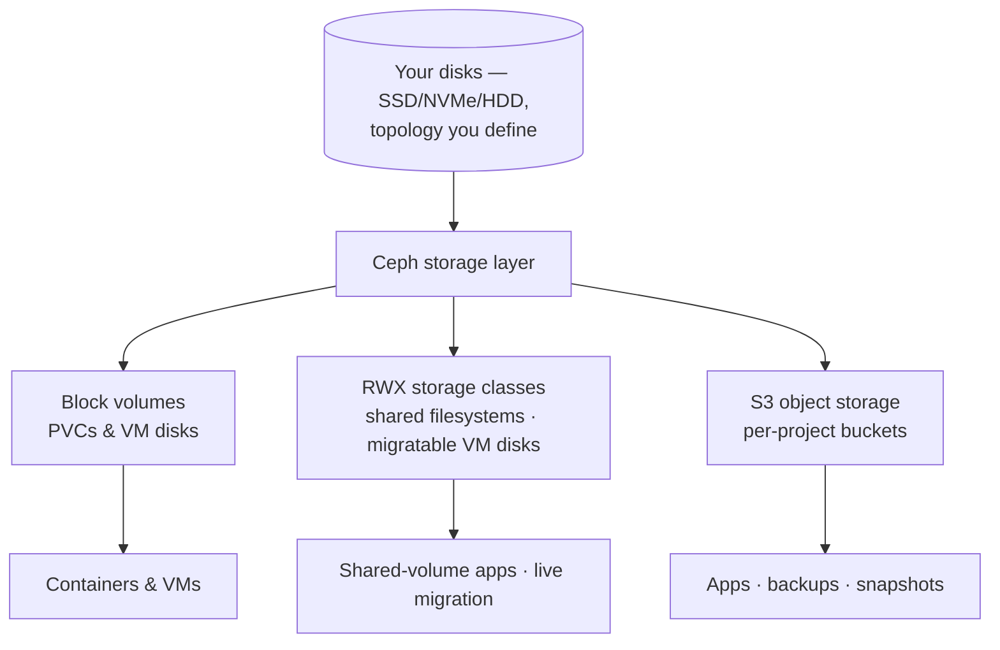

import {StorageServiceDiagram} from '@site/src/components/Diagram/DatasheetDiagrams';

# DRAFT — Kube-DC Function Datasheet: Storage & Object Storage

> 🚧 **Working draft — not for distribution.** Companion to the
> [platform datasheet](draft-artifact-a-datasheet.md). Claims trace to the
> [claim ledger](claim-ledger-a-cloud.md) and published product docs;
> publication gates per [datasheet-plan.md](datasheet-plan.md).

---

# Storage & Object Storage

**Three storage services from the disks you rack — block, shared and S3 —
consumed through standard Kubernetes APIs.**

Kube-DC's storage layer is built on Ceph running on your hardware. The
platform team defines the classes, topology and replication; tenants
consume storage the Kubernetes-native way, within quota.

## 1. Block storage

- PersistentVolumes for containers and disks for VMs from a replicated
  Ceph RBD pool.
- Online volume expansion.
- Storage classes are operator-defined: you decide which tiers exist
  (replicated, node-local, performance) and what backs them — the
  platform runs on the disks and failure domains you give it.

## 2. Shared (read-write-many) storage

Operator-defined RWX storage classes serve the cases single-writer volumes
can't — each with the access mode and backend appropriate to its
semantics:

- **Multi-pod shared filesystems** — several pods writing the same volume
  (content stores, shared uploads, legacy apps that expect a shared disk).
- **Migration-eligible VM disks** — a VM whose disk is on the shared block
  class is eligible for live migration between hosts (see the Virtual
  Machines datasheet).

## 3. S3-compatible object storage

- **Per-project buckets** provisioned through a standard
  `ObjectBucketClaim` — credentials arrive as a Secret and ConfigMap the
  workload mounts; no manual account management.
- The platform's own services use the same storage: database backups and
  managed-cluster snapshots land in per-project buckets.
- Typical tenant uses: application assets, exports, log archives, backup
  targets.

Diagram source for GitHub

<StorageServiceDiagram />

## 4. Snapshots, clones and images

- **Volume snapshots** through the standard Kubernetes snapshot API —
  point-in-time copies of workload and VM volumes.
- **Instant clones**: new volumes from snapshots without duplicating
  data — the mechanism behind the prepared-OS-image catalog and VM
  provisioning without image downloads.
- Prepared images are published per project as snapshots.

## 5. Capacity and quota

Storage consumption counts against organization plans and project quotas
like CPU and memory. Object-storage capacity is governed per organization
and requires its own capacity planning. How many disks, which tiers, what
replication — these are platform-team decisions made against your
hardware; capacity and durability are properties of the topology your
team designs, validated in the architecture review.

## 6. Data protection posture

Storage replication protects against component failure within the
platform; it is not a backup. The protection stack is layered:

| Layer | Mechanism | Owner |
|---|---|---|
| Component failure | Ceph replication per your topology | Platform team |
| Point-in-time copies | Scheduled jobs run by platform controllers; on-demand snapshots and restores initiated by tenants | Shared |
| Site/storage loss | Copied by your configured enterprise backup integration via S3 endpoints | Your backup team |

## 7. Responsibilities — storage

| Concern | Your platform team | Tenant |
|---|---|---|
| Disks, tiers, replication, failure domains | ✅ | — |
| Storage classes and quotas | ✅ defines | consumes within quota |
| Volume/bucket provisioning | Automatic via API | ✅ requests |
| Snapshots and clones | APIs provided | ✅ initiates |
| Backup of application data | S3 + snapshot APIs provided | ✅ owns |

---

## Draft apparatus (stripped at publication)

Evidence: RWX shared volumes and OBC bucket contract verified in the
application-stack E2E (ledger row 7); instant clones and golden-image
catalog verified live (row 15); platform backups landing in project S3
verified (rows 19, 27). Deliberately not claimed: durability figures,
replication factors, aggregate capacity guarantees — all
deployment-defined on the buyer's hardware (the per-org object-storage
quota model does not bound aggregate capacity; sizing guidance belongs to
the architecture review, not the datasheet).
