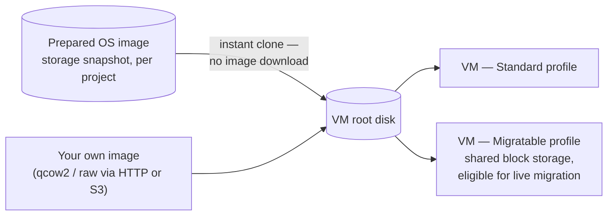

import DatasheetFigure from '@site/src/components/DatasheetFigure';
import {VirtualizationResourceDiagram} from '@site/src/components/Diagram/ResourceModelDiagrams';

# DRAFT — Kube-DC Function Datasheet: Virtual Machines

> 🚧 **Working draft — not for distribution.** Companion to the
> [platform datasheet](draft-artifact-a-datasheet.md). Claims trace to the
> [claim ledger](claim-ledger-a-cloud.md) and published product docs;
> publication gates per [datasheet-plan.md](datasheet-plan.md).

---

# Virtual Machines

**Run the workloads you already have — beside the ones you're building
next.**

Kube-DC treats virtual machines as first-class workloads: they live in the
same projects, attach to the same networks, obey the same quotas and appear
on the same dashboards as containers. Legacy line-of-business systems,
databases that ship as appliances, Windows servers — compatible workloads
consolidate onto the platform without a separate virtualization stack to
operate.

## 1. Guest support

- **Linux**: the prepared-image catalog identifies the validated
  distributions and versions (Ubuntu, Debian and other cloud-image
  distributions).
- **Windows**: provisioned from prepared images containing the required
  VirtIO drivers and QEMU guest agent, via the platform's Windows image
  pipeline — see the published Windows documentation.
- **Bring your own image**: import qcow2/raw disk images from HTTP or S3
  sources into a project; guest and driver compatibility validation is
  yours.

## 2. Provisioning: prepared images and instant clones

Each project carries a catalog of prepared OS images published as storage
snapshots. Creating a VM clones the snapshot — the root disk is created
without a per-VM image download or data copy; completion depends on your
hardware, storage and current load. VMs are declared as manifests (or
created in the console):

- CPU cores, memory and disk size per VM; resizable as the workload grows
  (disk grows only).
- **Cloud-init** for first-boot configuration: packages, users, scripts.
- **SSH-key injection** from the project's managed keypair — no password
  distribution.
- **Interactive console** in the web UI for installation, rescue and
  break-glass access.

<DatasheetFigure
  alt="Create VM form showing Project subnet, root disk size, local and shared RBD storage profiles, prepared-image provisioning and live-migration eligibility"
  caption="VM creation makes storage durability and mobility trade-offs explicit before provisioning, including prepared-image cloning and the shared-storage requirement for live migration."
  src={require('./img/S-07.png').default}
/>

Diagram source for GitHub

<VirtualizationResourceDiagram />

## 3. VM profiles: standard and migratable

Two documented profiles, selected at creation:

| | Standard profile | Migratable profile |
|---|---|---|
| Root disk | Node-local or replicated block | Shared block storage (read-write-many) |
| Host maintenance | VM restarts on another host | **Eligible for live migration** during host drains |
| Typical use | Stateless or restart-tolerant workloads | Long-lived servers, stateful systems in VMs |

The Migratable profile pins a common CPU model across the migration pool.
A VM is eligible for live migration when its disks use the configured
shared block tier and a CPU-compatible destination host has sufficient
capacity; failed or ineligible migrations may require a restart.

## 4. Lifecycle and operations

- Start, stop, restart and delete from the console, `kubectl` or the CLI.
- **Snapshots of running VMs** — online snapshots via the standard
  Kubernetes snapshot API; install the QEMU guest agent for
  filesystem-consistent captures.
- Eviction behavior per VM: live-migrate or restart on drain.
- VM manifests are declarative Kubernetes resources — keep them in Git
  like the rest of your infrastructure.

<DatasheetFigure
  alt="Kube-DC virtual machine Guest OS panel with a Linux console preview and actions to launch the remote console or an SSH terminal"
  caption="The VM detail view provides browser-based console and SSH entry points for installation, rescue and break-glass access."
  narrow
  src={require('../cloud/images/connecting-vm.png').default}
/>

## 5. Networking

VMs attach to the project's VPC like any pod:

- Private addresses in the project subnet; reachable from the project's
  other workloads.
- **Floating IPs** give a VM its own external address — inbound and
  outbound — without a load balancer.
- LoadBalancer services and HTTPS routes can front VM-hosted services
  exactly as they front pods.
- With **VLAN attachment**, VMs talk layer-2 to existing datacenter
  equipment — the consolidation path for systems that expect to sit on a
  specific network segment.

## 6. Storage

- Root and data disks as block volumes; disk expansion online.
- Additional volumes attach and detach as Kubernetes resources.
- Volume snapshots and clones for copies, templates and test
  environments.

## 7. GPU guests

A VM can be given a whole physical GPU (dedicated passthrough) where the
platform team has enabled and qualified GPU support — a stronger boundary
than software GPU sharing, at the cost of live migration. See the
[GPU services datasheet](function-gpu.md) for products, entitlements and
the qualification model.

## 8. Responsibilities — virtual machines

| Concern | Your platform team | Tenant |
|---|---|---|
| Virtualization layer, hosts, live-migration machinery | ✅ | — |
| Prepared image catalog | ✅ publishes | ✅ may bring own images |
| VM sizing, lifecycle, in-guest configuration | — | ✅ |
| Guest OS patching and hardening | — | ✅ |
| VM data protection | Snapshot APIs provided | ✅ snapshots + in-guest/enterprise backup |
| Network exposure | IPs and routes provided | ✅ configures |

## 8. What to know before migrating

Disk import from other virtualization platforms is supported (qcow2/raw);
migration itself is a planned operation — inventory, guest preparation
(VirtIO drivers for Windows), disk conversion, cutover — not an automatic
"lift". VMs do **not** need to be refactored into containers: the point of
this function is that they run as VMs, on the same platform your
containerized services use.

---

## Draft apparatus (stripped at publication)

Evidence: instant-clone provisioning, migration-eligibility conditions and
online snapshot verified live (ledger rows 15–17); profiles and manifests
per published product docs (`creating-vm.md`); Windows per prepared-image
pipeline (ledger row 35 — owner-asserted, no live drill yet); GPU stated
in its own chapter. Not claimed: "runs unchanged" migration, universal live
migration, VM backup as a service, provisioning timings as commitments.
Clone size must be ≥ the prepared image size (docs correction pending).
