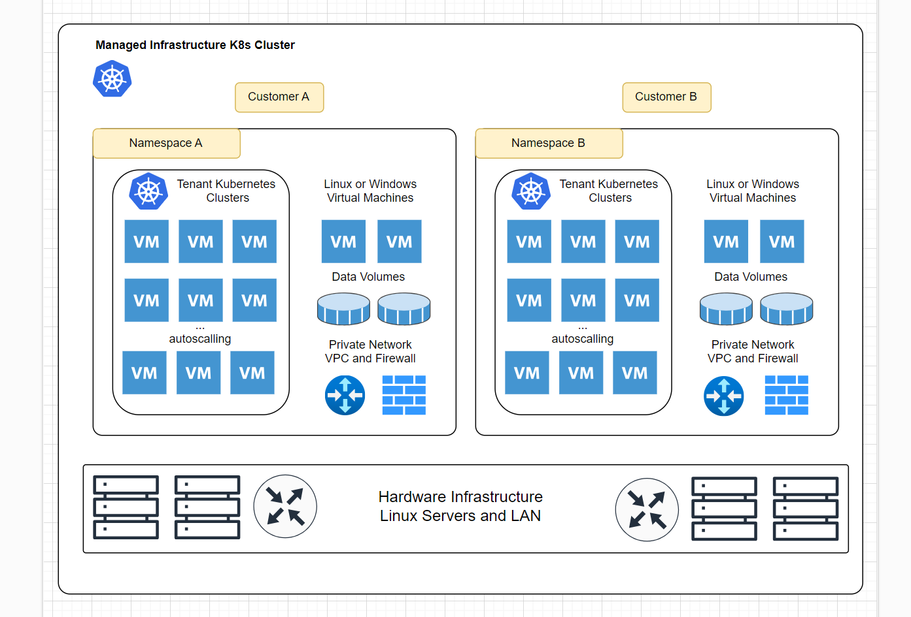

# What Is Kube-DC?

Kube-DC is an advanced, enterprise-grade platform that transforms Kubernetes into a comprehensive Data Center solution supporting both virtual machines and containerized workloads. It provides organizations with a unified management interface for all their infrastructure needs, from multi-tenancy and virtualization to networking and billing.

## Overview

Kube-DC bridges the gap between traditional virtualization and modern container orchestration, allowing teams to run both legacy workloads and cloud-native applications on the same platform. By leveraging Kubernetes as the foundation, Kube-DC inherits its robust ecosystem while extending functionality to support enterprise requirements.

## Key Features at a Glance

Kube-DC offers a comprehensive set of features designed for modern data center operations:

- **Multi-Tenancy** - Host multiple organizations with isolated environments and custom SSO integration
- **Unified Workload Management** - Run both VMs and containers on the same platform
- **Advanced Networking** - VPC per project, VLAN support, and software-defined networking
- **Enterprise Virtualization** - KubeVirt integration with GPU passthrough and live migration
- **Infrastructure as Code** - Kubernetes-native APIs with support for Terraform, Ansible, and more
- **Integrated Billing** - Track and allocate costs for all resources
- **Managed Services Platform** - Deploy databases, storage, and AI/ML infrastructure

For detailed information about each feature, including capabilities and use cases, visit the [Core Features](core-features.md) page.

## Why Choose Kube-DC?

### For Enterprise IT

- Run legacy VMs alongside modern containers
- Implement chargeback models for departmental resource usage
- Provide self-service infrastructure while maintaining governance
- Reduce operational costs by consolidating virtualization and container platforms

### For Service Providers

- Offer multi-tenant infrastructure with complete isolation
- Provide value-added services beyond basic IaaS
- Implement flexible billing based on actual resource usage
- Support diverse customer workloads on a single platform

### For DevOps Teams

- Unify VM and container management workflows
- Implement infrastructure as code for all resources
- Integrate with existing CI/CD pipelines
- Enable developer self-service while maintaining control

## Getting Started

Ready to explore Kube-DC? Check out our [Quick Start guides](quickstart-overview.md) to begin your journey.

For a deeper understanding of the underlying architecture and concepts, visit the [Architecture & Concepts](architecture-overview.md) section.

## Community and Support

Kube-DC is built with a focus on community collaboration. Visit our [Community & Support](community-support.md) page to learn how to get involved, report issues, or seek assistance.
