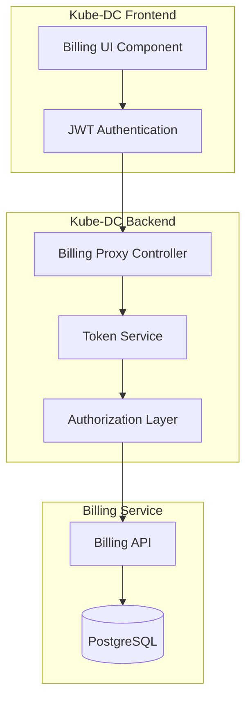
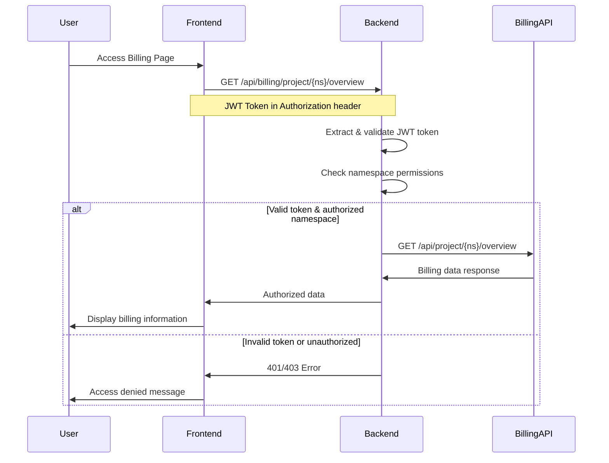

# Internal Billing Integration Documentation

## Overview
This document describes the internal architecture and implementation details of the billing API integration within the Kube-DC platform. This integration provides organization-level billing management and project-specific cost analysis through the Kube-DC UI.

## Architecture Overview

### System Components



### Authentication & Authorization Flow



## Implementation Details

### Backend Integration

#### File Structure
```
ui/backend/
├── controllers/billing/
│   └── billingController.js     # Main billing proxy controller
├── routes/
│   └── billing.js              # Billing API routes
├── utils/
│   └── logger.js               # Logging utility
└── app.js                      # Main app with billing routes
```

#### Key Components

**Billing Controller** (`controllers/billing/billingController.js`)
- Proxies requests to internal billing service
- Implements JWT token validation
- Enforces namespace-based authorization
- Handles error responses and logging

**Authentication Flow**
```javascript
// Token extraction
const token = tokenService.getToken(req);

// JWT decoding and validation
const decodedToken = decodeJWT(token);
const userNamespaces = decodedToken.namespaces || [];

// Authorization check
if (!userNamespaces.includes(namespace)) {
  return sendErrorResponse(res, 403, 'Access denied to namespace');
}
```

**Service Communication**
- Internal service URL: `billing-dashboard-svc.billing.svc.cluster.local:5000`
- Uses Kubernetes service discovery
- No external network access required

### Frontend Integration

#### File Structure
```
ui/frontend/src/app/ManageOrganization/
├── Billing/
│   └── Billing.tsx             # Main billing component
├── OrganizationRoutes.tsx      # Route definitions
├── OrganizationSidebar.tsx     # Navigation sidebar
└── OrganizationLayout.tsx      # Layout logic
```

#### Key Features

**Billing Component** (`Billing/Billing.tsx`)
- Uses PatternFly design system
- Displays project billing summaries in table format
- Implements loading states and error handling
- Follows existing Kube-DC UI patterns

**Security Implementation**
```typescript
// Namespace extraction from JWT
const getUserNamespaces = React.useMemo(() => {
  if (!token) return [];
  try {
    const decodedToken = decodeJWT(token);
    return decodedToken.namespaces || [];
  } catch (error) {
    return [];
  }
}, [token]);

// API calls with authentication
const response = await fetch(`/api/billing/project/${namespace}/overview`, {
  headers: {
    'Authorization': `Bearer ${token}`,
    'Content-Type': 'application/json'
  },
  credentials: 'include'
});
```

## API Endpoints

### Available Endpoints

| Method | Endpoint | Description | Authentication |
|--------|----------|-------------|----------------|
| GET | `/api/billing/health` | Service health check | Required |
| GET | `/api/billing/projects` | List accessible projects | Required |
| GET | `/api/billing/project/:namespace/overview` | Project billing details | Required + Namespace access |

### Response Format

**Project Overview Response**
```json
{
  "success": true,
  "data": {
    "namespace": "project-name",
    "billing_summary": {
      "current_month_total": 1672.31,
      "last_day_spend": 109.16,
      "billing_period": "2025-09",
      "total_cost_per_hour": 2.32
    },
    "compute_instances": {
      "running_pods": 10,
      "running_vms": 1,
      "cpu_cores": 2.4,
      "memory_gib": 8.8,
      "cost_per_hour": 0.15
    },
    "cost_breakdown": {
      "cpu_cost": 89.45,
      "memory_cost": 45.23,
      "storage_cost": 12.67,
      "network_cost": 0.00,
      "public_ip_cost": 0.00
    }
  },
  "timestamp": "2025-10-01T15:25:00.000Z"
}
```

## Security Model

### JWT Token Structure
```json
{
  "org": "organization-name",
  "namespaces": ["project-1", "project-2"],
  "groups": ["org-admin", "user"],
  "exp": 1696176000,
  "iat": 1696089600
}
```

### Authorization Levels

| Role | Access Level | Permissions |
|------|-------------|-------------|
| `org-admin` | Organization-wide | All projects in organization |
| `project-user` | Project-specific | Only assigned namespaces |
| `guest` | No access | No billing data access |

### Security Layers

1. **OIDC Authentication** - External identity provider
2. **JWT Token Validation** - Backend token verification
3. **Namespace Authorization** - Per-project access control
4. **Network Security** - Internal service communication only

## Configuration

### Environment Variables

**Backend Configuration**
```bash
# Billing service endpoint (internal)
BILLING_API_URL=http://billing-dashboard-svc.billing.svc.cluster.local:5000

# Logging level
LOG_LEVEL=info
```

**Frontend Configuration**
Uses existing Kube-DC ConfigMap pattern:
```yaml
apiVersion: v1
kind: ConfigMap
metadata:
  name: kube-dc-frontend-config
data:
  env.js: |
    window.backendURL = 'https://backend.stage.kube-dc.com';
    window.frontendURL = 'https://console.stage.kube-dc.com';
    window.keycloakURL = 'https://login.stage.kube-dc.com';
```

### Network Policies

```yaml
# Internal service communication
apiVersion: networking.k8s.io/v1
kind: NetworkPolicy
metadata:
  name: kube-dc-billing-access
spec:
  podSelector:
    matchLabels:
      app: kube-dc-backend
  policyTypes:
  - Egress
  egress:
  - to:
    - namespaceSelector:
        matchLabels:
          name: billing
    ports:
    - protocol: TCP
      port: 5000
```

## Error Handling

### HTTP Status Codes

| Code | Description | Cause |
|------|-------------|-------|
| 200 | Success | Request completed successfully |
| 401 | Unauthorized | Missing or invalid JWT token |
| 403 | Forbidden | Valid token, insufficient permissions |
| 503 | Service Unavailable | Billing service unreachable |
| 500 | Internal Server Error | Unexpected server error |

### Error Response Format
```json
{
  "success": false,
  "error": "Access denied to namespace",
  "details": {
    "namespace": "requested-project",
    "availableNamespaces": ["project-1", "project-2"]
  },
  "timestamp": "2025-10-01T15:25:00.000Z"
}
```

## Monitoring & Logging

### Log Levels
- **INFO**: Normal operations, API calls
- **WARN**: Authentication failures, permission denials  
- **ERROR**: Service errors, network issues
- **DEBUG**: Detailed request/response data (development only)

### Key Metrics to Monitor
- API response times
- Authentication failure rates
- Service availability
- Error rates by endpoint
- Namespace access patterns

## Development Guidelines

### Code Standards
- Follow existing Kube-DC patterns
- Use PatternFly components for UI consistency
- Implement proper error handling
- Add comprehensive logging
- Write JSDoc comments for public methods

### Testing Approach
- Unit tests for controller logic
- Integration tests for API endpoints
- Frontend component tests
- End-to-end authentication flows

### Deployment Process
1. Backend changes deployed via Helm chart
2. Frontend changes built into container image
3. Configuration updates via ConfigMaps
4. Rolling deployment with health checks

## Troubleshooting

### Common Issues

**"Authentication token required"**
- Check JWT token presence in request headers
- Verify token format (Bearer scheme)
- Confirm OIDC authentication is working

**"Access denied to namespace"**
- Verify user has access to requested project
- Check JWT token namespace claims
- Confirm RBAC configuration

**"Billing service unreachable"**
- Check billing service pod status
- Verify network connectivity
- Confirm service DNS resolution

### Debug Commands
```bash
# Check service status
kubectl get pods -n kube-dc
kubectl get pods -n billing

# Check service connectivity
kubectl exec -n kube-dc deployment/kube-dc-backend -- \
  curl -v http://billing-dashboard-svc.billing.svc.cluster.local:5000/api/health

# Check logs
kubectl logs -n kube-dc deployment/kube-dc-backend
kubectl logs -n billing deployment/billing-dashboard
```

## Future Enhancements

### Planned Features
- Cost trend analysis and forecasting
- Budget alerts and notifications
- Resource optimization recommendations
- Detailed cost attribution reports
- Integration with cloud provider billing APIs

### Technical Improvements
- Response caching for performance
- Real-time cost updates via WebSocket
- Advanced filtering and search capabilities
- Export functionality for billing reports
- Integration with monitoring systems

---

*This document is maintained by the Kube-DC development team. For questions or updates, please contact the platform team.*
