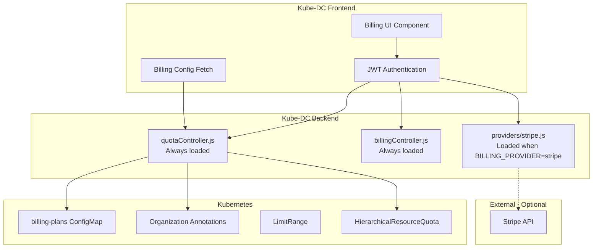
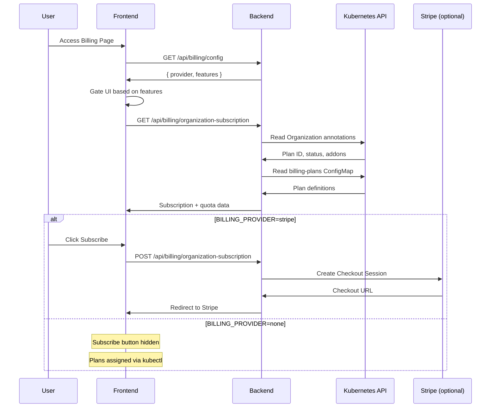

# Internal Billing Integration Documentation

## Overview
This document describes the internal architecture and implementation details of the billing and quota system within the Kube-DC platform. The system is designed with a **decoupled architecture**: resource quotas work independently, and payment providers (Stripe, WHMCS, etc.) are optional plug-ins controlled by a feature flag.

## Architecture Overview

### Design Principles

1. **Quotas are a core feature** — HRQ, LimitRange, and EIP enforcement work without any payment provider
2. **Payment providers are optional** — Controlled by `BILLING_PROVIDER` environment variable (`none` | `stripe` | `whmcs`)
3. **Plans from ConfigMap** — All plan definitions live in a single `billing-plans` ConfigMap in the `kube-dc` namespace
4. **Frontend adapts dynamically** — UI fetches `/api/billing/config` and hides payment buttons when no provider is active

### System Components



### Authentication & Authorization Flow



## Implementation Details

### Backend Architecture

#### File Structure
```
ui/backend/
├── controllers/billing/
│   ├── quotaController.js       # Provider-agnostic: plans, addons, HRQ usage, quota endpoints
│   ├── billingController.js     # Health check, project billing proxy, pricing
│   └── providers/
│       └── stripe.js            # Stripe-specific: checkout, webhooks, portal, subscription CRUD
├── routes/
│   └── billing.js               # Route mounting (conditional provider loading)
└── app.js                       # Express app (conditional raw body skip for webhooks)
```

#### Key Components

**Quota Controller** (`controllers/billing/quotaController.js`) — *Always loaded*
- Reads plans and addons from `billing-plans` ConfigMap via Kubernetes API
- Caches plan data with TTL-based invalidation
- Reads Organization annotations for subscription state
- Provides HRQ and EIP usage data
- Exposes `/api/billing/config` with active provider and feature flags
- Exports shared functions used by provider modules:
  - `getServiceAccountToken`, `isOrgAdmin`, `getSubscriptionPlans`
  - `getTurboAddons`, `getHRQUsage`, `getPublicEIPUsage`
  - `getOrganizationSubscriptionData`, `updateOrganizationSubscription`

**Billing Controller** (`controllers/billing/billingController.js`) — *Always loaded*
- Health check endpoint
- Project-level billing data proxy
- Pricing information

**Stripe Provider** (`controllers/billing/providers/stripe.js`) — *Loaded only when `BILLING_PROVIDER=stripe`*
- Stripe SDK initialization and customer management
- Checkout session creation with plan-to-price ID mapping
- Webhook handling for subscription lifecycle events
- Customer portal session creation
- Subscription update and cancellation

#### Feature Flag: `BILLING_PROVIDER`

| Value | Routes Mounted | Behavior |
|-------|---------------|----------|
| `none` (default) | quotaController + billingController | Quota-only mode. Plans via ConfigMap, enforcement via HRQ. |
| `stripe` | + providers/stripe.js | Full Stripe: checkout, webhooks, portal. |
| `whmcs` | *(future)* | WHMCS webhook integration. |

**Route Mounting** (`routes/billing.js`):
```javascript
const BILLING_PROVIDER = process.env.BILLING_PROVIDER || 'none';

// Always mount provider-agnostic quota routes
router.use('/', quotaRouter);

// Conditionally mount payment provider routes
if (BILLING_PROVIDER === 'stripe') {
    const stripeRouter = require('../controllers/billing/providers/stripe');
    router.use('/', stripeRouter);
}
```

**Conditional Webhook Body Parsing** (`app.js`):
```javascript
// Only skip JSON parsing for webhook when a provider is active
if (BILLING_PROVIDER !== 'none' && req.originalUrl === '/api/billing/webhook') {
    next(); // Raw body for signature verification
} else {
    bodyParser.json()(req, res, next);
}
```

### Frontend Architecture

#### File Structure
```
ui/frontend/src/app/ManageOrganization/
├── Billing/
│   ├── Billing.tsx              # Main billing page
│   ├── SubscribePlanModal.tsx   # Plan selection and checkout
│   ├── api.ts                   # Billing API client (includes getBillingConfig)
│   └── types.ts                 # Provider-agnostic type definitions
├── OrganizationRoutes.tsx       # Route definitions
├── OrganizationSidebar.tsx      # Navigation sidebar
└── OrganizationLayout.tsx       # Layout logic
```

#### Key Features

**Provider-Agnostic UI** (`Billing/Billing.tsx`)
- Fetches `BillingConfig` on mount via `GET /api/billing/config`
- Gates all payment buttons behind `billingConfig.features.*` flags:
  - `checkout` → Subscribe, Change Plan, Re-subscribe, Cancel buttons
  - `portal` → Manage Payment, Update Payment Method buttons
  - `addons` → Add Resources button
- Uses PatternFly design system
- Displays quota usage with progress bars and alerts

**Type Definitions** (`Billing/types.ts`)
```typescript
export interface BillingConfig {
    provider: 'none' | 'stripe' | 'whmcs';
    features: {
        quotas: boolean;
        plans: boolean;
        checkout: boolean;
        portal: boolean;
        webhooks: boolean;
        addons: boolean;
    };
}

export interface OrganizationSubscription {
    providerSubscriptionId?: string | null;  // was stripeSubscriptionId
    providerCustomerId?: string | null;      // was stripeCustomerId
    // ... other fields
}
```

## API Endpoints

### Always Available (any `BILLING_PROVIDER` value)

| Method | Endpoint | Description | Authentication |
|--------|----------|-------------|----------------|
| GET | `/api/billing/config` | Active provider and feature flags | Required |
| GET | `/api/billing/health` | Service health check | Required |
| GET | `/api/billing/plans` | List available subscription plans | Required |
| GET | `/api/billing/addons` | List available resource add-ons | Required |
| GET | `/api/billing/organization-subscription` | Current org subscription and quota data | Required (org-admin) |
| GET | `/api/billing/quota-usage` | HRQ usage across all projects | Required (org-admin) |
| GET | `/api/billing/quota-status` | Quota enforcement status | Required (org-admin) |
| GET | `/api/billing/projects` | List accessible projects with billing data | Required |
| GET | `/api/billing/project/:namespace/overview` | Project billing details | Required + Namespace access |

### Stripe Provider Only (`BILLING_PROVIDER=stripe`)

| Method | Endpoint | Description | Authentication |
|--------|----------|-------------|----------------|
| POST | `/api/billing/organization-subscription` | Create subscription (Stripe Checkout) | Required (org-admin) |
| PUT | `/api/billing/organization-subscription` | Update subscription (plan change) | Required (org-admin) |
| DELETE | `/api/billing/organization-subscription` | Cancel subscription | Required (org-admin) |
| GET | `/api/billing/verify-checkout` | Verify Stripe checkout session | Required |
| POST | `/api/billing/customer-portal` | Open Stripe customer portal | Required (org-admin) |
| POST | `/api/billing/webhook` | Stripe webhook handler | Stripe signature |

### Response Format

**Billing Config Response** (`GET /api/billing/config`)
```json
{
  "success": true,
  "config": {
    "provider": "none",
    "features": {
      "quotas": true,
      "plans": true,
      "checkout": false,
      "portal": false,
      "webhooks": false,
      "addons": false
    }
  }
}
```

**Organization Subscription Response**
```json
{
  "success": true,
  "data": {
    "organization": "my-org",
    "planId": "pro-pool",
    "planName": "Pro Pool",
    "status": "active",
    "providerSubscriptionId": "sub_xxx",
    "providerCustomerId": "cus_xxx",
    "addons": [{"addonId": "turbo-x1", "quantity": 1}],
    "resources": { "cpu": 10, "memory": 28, "storage": 180 },
    "usage": {
      "cpu": { "used": 4.2, "limit": 10 },
      "memory": { "used": 12.5, "limit": 28 },
      "storage": { "used": 45, "limit": 180 },
      "pods": { "used": 23, "limit": 200 }
    }
  }
}
```

## Security Model

### JWT Token Structure
```json
{
  "org": "organization-name",
  "namespaces": ["project-1", "project-2"],
  "groups": ["org-admin", "user"],
  "exp": 1696176000,
  "iat": 1696089600
}
```

### Authorization Levels

| Role | Access Level | Permissions |
|------|-------------|-------------|
| `org-admin` | Organization-wide | All projects in organization |
| `project-user` | Project-specific | Only assigned namespaces |
| `guest` | No access | No billing data access |

### Security Layers

1. **OIDC Authentication** - External identity provider
2. **JWT Token Validation** - Backend token verification
3. **Namespace Authorization** - Per-project access control
4. **Network Security** - Internal service communication only

## Configuration

### Environment Variables

**Backend Configuration**
```bash
# Billing provider feature flag (required)
BILLING_PROVIDER=none              # none | stripe | whmcs

# Stripe-specific (only when BILLING_PROVIDER=stripe)
STRIPE_SECRET_KEY=sk_xxx           # Stripe API secret key
STRIPE_WEBHOOK_SECRET=whsec_xxx    # Stripe webhook signing secret
STRIPE_PRICE_DEV_POOL=price_xxx    # Stripe Price ID for Dev Pool plan
STRIPE_PRICE_PRO_POOL=price_xxx    # Stripe Price ID for Pro Pool plan
STRIPE_PRICE_SCALE_POOL=price_xxx  # Stripe Price ID for Scale Pool plan
STRIPE_PRICE_TURBO_X1=price_xxx    # Stripe Price ID for Turbo x1 addon
STRIPE_PRICE_TURBO_X2=price_xxx    # Stripe Price ID for Turbo x2 addon

# General
LOG_LEVEL=info
```

**Frontend Configuration**
Uses existing Kube-DC ConfigMap pattern. No billing-specific frontend config needed — the frontend dynamically fetches `/api/billing/config` at runtime.
```yaml
apiVersion: v1
kind: ConfigMap
metadata:
  name: kube-dc-frontend-config
data:
  env.js: |
    window.backendURL = 'https://backend.stage.kube-dc.com';
    window.frontendURL = 'https://console.stage.kube-dc.com';
    window.keycloakURL = 'https://login.stage.kube-dc.com';
```

### Kubernetes Resources

The billing system reads from and writes to:

| Resource | Namespace | Purpose |
|----------|-----------|--------|
| ConfigMap `billing-plans` | `kube-dc` | Plan definitions, addons, quotas |
| Organization annotations | org namespace | Subscription state, plan assignment |
| HierarchicalResourceQuota `plan-quota` | org namespace | Aggregate resource limits |
| LimitRange `default-resource-limits` | org namespace | Default container resources |

## Error Handling

### HTTP Status Codes

| Code | Description | Cause |
|------|-------------|-------|
| 200 | Success | Request completed successfully |
| 401 | Unauthorized | Missing or invalid JWT token |
| 403 | Forbidden | Valid token, insufficient permissions |
| 503 | Service Unavailable | Billing service unreachable |
| 500 | Internal Server Error | Unexpected server error |

### Error Response Format
```json
{
  "success": false,
  "error": "Access denied to namespace",
  "details": {
    "namespace": "requested-project",
    "availableNamespaces": ["project-1", "project-2"]
  },
  "timestamp": "2025-10-01T15:25:00.000Z"
}
```

## Monitoring & Logging

### Log Levels
- **INFO**: Normal operations, API calls
- **WARN**: Authentication failures, permission denials  
- **ERROR**: Service errors, network issues
- **DEBUG**: Detailed request/response data (development only)

### Key Metrics to Monitor
- API response times
- Authentication failure rates
- Service availability
- Error rates by endpoint
- Namespace access patterns

## Development Guidelines

### Code Standards
- Follow existing Kube-DC patterns
- Use PatternFly components for UI consistency
- Implement proper error handling
- Add comprehensive logging
- Write JSDoc comments for public methods

### Testing Approach
- Unit tests for controller logic
- Integration tests for API endpoints
- Frontend component tests
- End-to-end authentication flows

### Deployment Process
1. Backend changes deployed via Helm chart
2. Frontend changes built into container image
3. Configuration updates via ConfigMaps
4. Rolling deployment with health checks

## Troubleshooting

### Common Issues

**"Authentication token required"**
- Check JWT token presence in request headers
- Verify token format (Bearer scheme)
- Confirm OIDC authentication is working

**"Access denied to namespace"**
- Verify user has access to requested project
- Check JWT token namespace claims
- Confirm RBAC configuration

**"Billing service unreachable"**
- Check billing service pod status
- Verify network connectivity
- Confirm service DNS resolution

### Debug Commands
```bash
# Check service status
kubectl get pods -n kube-dc
kubectl get pods -n billing

# Check service connectivity
kubectl exec -n kube-dc deployment/kube-dc-backend -- \
  curl -v http://billing-dashboard-svc.billing.svc.cluster.local:5000/api/health

# Check logs
kubectl logs -n kube-dc deployment/kube-dc-backend
kubectl logs -n billing deployment/billing-dashboard
```

## Testing

### E2E Tests

Organization quota reconciliation tests are in `tests/e2e/organization_quota_test.go`:

```bash
# Run all quota tests
go test -v ./tests/e2e -ginkgo.focus="Organization Quota Reconciliation" -timeout=15m
```

| Test | What it verifies |
|------|------------------|
| Org with active plan → HRQ + LimitRange | Controller creates quota resources with correct values |
| Plan change → HRQ update | Changing plan annotation triggers resource update |
| Suspended org → reduced HRQ | Suspended orgs get minimal quota |
| Org deletion → cleanup | HRQ and LimitRange removed on deletion |
| Addons → HRQ includes addon resources | Addon CPU/memory/storage added to base plan |
| No plan → no HRQ | Orgs without billing annotations get no quota |

### Manual Testing (quota-only mode)

```bash
# 1. Apply billing-plans ConfigMap
kubectl apply -f examples/organization/04-billing-plans-configmap.yaml

# 2. Assign a plan to an organization
kubectl annotate organization/shalb -n shalb \
  billing.kube-dc.com/plan-id=dev-pool \
  billing.kube-dc.com/subscription=active --overwrite

# 3. Verify HRQ was created
kubectl get hrq -n shalb

# 4. Verify LimitRange was created
kubectl get limitrange -n shalb

# 5. Check quota usage
kubectl describe hrq plan-quota -n shalb
```

## Future Enhancements

### Planned Features
- WHMCS billing provider integration
- Cost trend analysis and forecasting
- Budget alerts and notifications
- Per-project quota management UI
- Resource optimization recommendations

### Technical Improvements
- Plan data caching with ConfigMap watch (replace polling)
- Real-time quota updates via WebSocket
- Automated trial-to-paid conversion
- Multi-currency support

---

*Last updated: February 2026*
*This document is maintained by the Kube-DC development team.*
