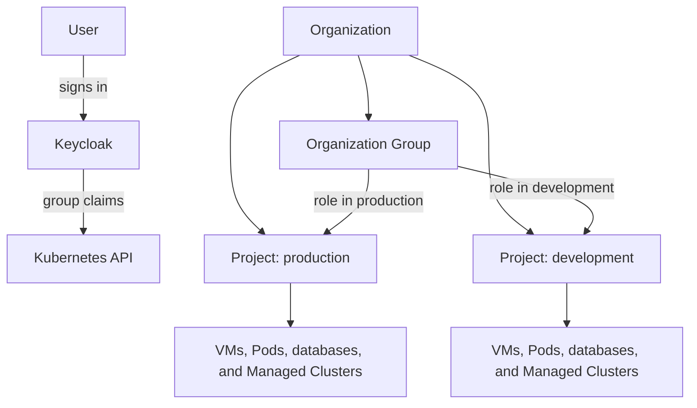

import {IdentityTenancyDiagram} from '@site/src/components/Diagram/ResourceModelDiagrams';

# Multi-Tenancy and Access Control

Kube-DC presents three product concepts to users: **Organizations**, **Projects**,
and **Organization Groups**. Kubernetes namespaces, RBAC objects, and Keycloak
resources implement those concepts; they are not separate products that users
must assemble themselves.

## Product model

<details data-github-only>
<summary>Diagram source for GitHub</summary>



</details>

<IdentityTenancyDiagram />

| Product concept | Purpose | Kubernetes implementation |
|---|---|---|
| Organization | Tenant boundary for identity, membership, billing, shared quota, and policy | An `Organization` resource and an Organization namespace with the same name |
| Project | Governed workload boundary inside an Organization | A `Project` resource in the Organization namespace and a generated backing namespace named `{organization}-{project}` |
| Organization Group | Assigns people one or more roles in selected Projects | An `OrganizationGroup`, a Keycloak group, and RoleBindings in the selected Project backing namespaces |
| Managed Cluster | Separate Kubernetes API, control plane, and workers | A `KdcCluster` and related resources inside a Project |

Use the product names in user-facing instructions. Use **backing namespace**
only when an operator needs the underlying Kubernetes name, for example when
running `kubectl -n acme-production`.

## Organization

An Organization commonly represents a company, department, or internal
business unit. It owns Projects, identity groups, quota, and billing state.

```yaml
apiVersion: kube-dc.com/v1
kind: Organization
metadata:
  name: acme
  namespace: acme
spec:
  description: "Acme engineering"
  email: "platform@example.com"
```

The controller creates and reconciles the corresponding identity and platform
resources. The Organization is the tenant boundary; its namespace is an
implementation and quota-aggregation boundary.

## Project

A Project is the normal place for users to create workloads. Every Project has
its own Kube-OVN VPC, subnet, default egress path, backing namespace, and RBAC.

```yaml
apiVersion: kube-dc.com/v1
kind: Project
metadata:
  name: production
  namespace: acme
spec:
  cidrBlock: 10.40.0.0/20
  egressNetworkType: cloud
```

Both fields are required:

- `cidrBlock` is the Project workload subnet. Choose a range that does not
  overlap other networks the workloads must reach.
- `egressNetworkType` is immutable and is either `cloud` or `public`.
  `cloud` uses the private external provider network. `public` requires the
  platform operator to enable public Projects and configure the public external
  network.

The generated backing namespace for this example is `acme-production`. A
namespace alone is not a Project: creating one manually does not provision the
VPC, identity, quota, DNS, or platform services.

## Organization Groups

An Organization Group assigns roles to a set of users on a Project-by-Project
basis. One group can have different roles in different Projects. RoleBindings
materialize those assignments in each Project's backing namespace.

```yaml
apiVersion: kube-dc.com/v1
kind: OrganizationGroup
metadata:
  name: application-team
  namespace: acme
spec:
  permissions:
    - project: production
      roles:
        - developer
    - project: development
      roles:
        - project-manager
```

Kube-DC ships four Kubernetes Roles in every Project backing namespace:

| Role | Intended use |
|---|---|
| `admin` | Broad lifecycle access to supported Project resources plus namespaced Roles and RoleBindings; quota is read-only |
| `project-manager` | Read and monitor Project resources and use the VM console; update or patch existing managed secrets, certificates, and database credential policies; create, update, or patch KMS keys; no Project, membership, or quota administration |
| `developer` | Manage supported workloads, Services, VMs, and managed services; raw Kubernetes Secrets are get/list only |
| `user` | Read-only Project visibility without raw Secret or VM-console access |

These are standard `rbac.authorization.k8s.io/v1` Roles, populated from the
platform's default role templates. There is no Kube-DC `Role` custom resource.
Operators can inspect the effective rules with:

```bash
kubectl -n <backing-namespace> get role admin developer project-manager user
```

## Authentication and authorization flow

1. The user signs in through the Organization's Keycloak realm.
2. Keycloak issues an OIDC token containing the user's group claims.
3. The Kubernetes API server authenticates the token.
4. RoleBindings in each Project backing namespace map those groups to Kube-DC's
   standard Roles.
5. Kubernetes RBAC authorizes each API request.

Authentication answers **who the user is**. Organization Groups and Kubernetes
RBAC answer **what the user can do in each Project**.

## Isolation boundaries

Project isolation is layered:

- The backing namespace scopes namespaced resources and RBAC.
- HNC connects Project backing namespaces to their Organization for
  hierarchical quota and selected policy propagation.
- A dedicated Kube-OVN VPC and subnet provide the primary network boundary.
- Ingress and egress logical-router policies restrict traffic on shared
  external networks when those controls are enabled.
- Kubernetes NetworkPolicy is an optional workload-level control. It is not the
  mechanism that creates the Project VPC boundary, and the default Project Roles
  do not grant NetworkPolicy authoring.

Platform administrators remain privileged across Organizations. Workloads that
need their own Kubernetes administrative boundary should run in a **Managed
Cluster**, rather than treating a Project as a separate physical cluster.

## Related documentation

- [Architecture overview](architecture-overview.md)
- [Project resources](project-resources.md)
- [Networking architecture](architecture-networking.md)
- [Security model](security-model.md)
