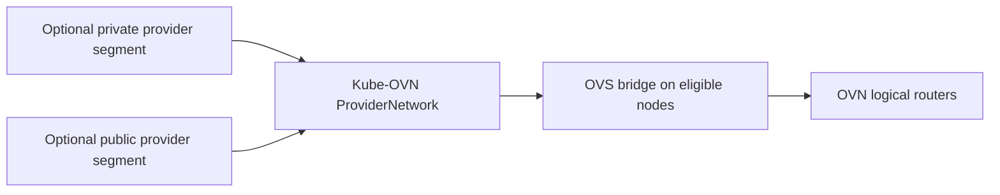
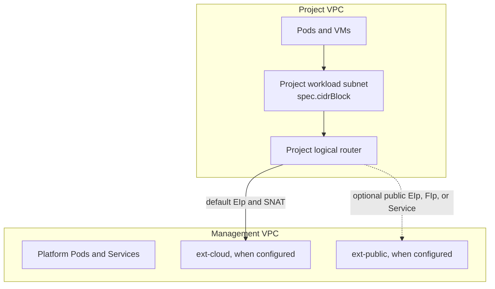
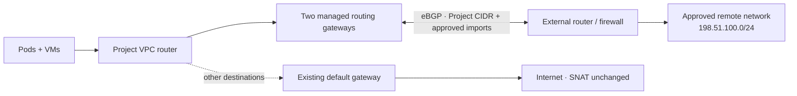

import {
  EnvoyGatewayDiagram,
  OvnLogicalNetworkDiagram,
  PhysicalNetworkDiagram,
} from '@site/src/components/Diagram/NetworkingArchitectureDiagrams';
import RoutedNetworkDiagram from '@site/src/components/Diagram/RoutedNetworkDiagram';

# Networking Architecture

Kube-DC uses Kube-OVN for Project VPCs and external-address routing, Multus for additional interfaces, and Envoy Gateway for HTTP, HTTPS, and gRPC exposure.

## Quick Navigation

| Section | Description |
|---------|-------------|
| [Network Types](#external-network-types) | Cloud vs Public networks |
| [Physical Layer](#physical-network-layer) | VLANs and provider bridges |
| [OVN Architecture](#ovn-logical-network) | VPCs, subnets, routers |
| [Service Exposure](#service-exposure) | LoadBalancers, Gateway Routes |
| [Datacenter VLAN attachment](#attaching-a-project-to-a-datacenter-vlan) | Putting a project on a datacenter VLAN |
| [Envoy Gateway](#envoy-gateway) | HTTP/HTTPS/gRPC routing |

---

## External network types

Kube-DC supports two external network types. Their CIDRs, VLANs, gateways, and
provider interfaces are installation-specific.

| Type | Default logical name | Address reachability | Typical use |
|---|---|---|---|
| **Cloud** | `ext-cloud` | Private datacenter or cloud fabric; normally not internet-routable from outside | Project gateways, private EIPs, private LoadBalancer Services |
| **Public** | `ext-public` | Internet-routable when the datacenter routes the pool | Public EIPs, FIPs, and LoadBalancer Services |

A Cloud address can still provide outbound internet access through the
datacenter gateway and Project SNAT. A Public address is not automatically safe
or exposed: routing, firewall policy, quota, and the workload listener still
apply.

:::note Example addresses
Examples in this guide use documentation ranges such as `198.51.100.0/24` and
sample private space. Replace them with the ranges configured in your Fleet
overlay. They are not Kube-DC defaults.
:::

## Physical network layer

Provider networks attach Kube-OVN to datacenter Layer 2 or routed segments.
Depending on the installation, a provider network can use a VLAN on a shared
trunk, a dedicated interface, or an existing OVS bridge.

<details data-github-only>
<summary>Diagram source for GitHub</summary>



</details>

<PhysicalNetworkDiagram />

The operator must ensure that every eligible node receives the expected VLANs
or routed segments. Kube-OVN and OVS own the logical attachment; do not assume a
Linux VLAN subinterface with a particular name will exist.

## OVN logical network

The management VPC hosts platform networking. Each Project receives a separate
VPC and workload subnet.

<details data-github-only>
<summary>Diagram source for GitHub</summary>



</details>

<OvnLogicalNetworkDiagram />

The Project's `spec.cidrBlock` is required input supplied by the creator or UI;
the controller does not allocate it from an external-network CIDR. The Project's
immutable `spec.egressNetworkType` selects the external network used by its
default gateway.

### Policy routing for secondary external networks

When a workload uses an EIP from a different external network than its
Project's default, Kube-DC programs source-based OVN logical-router policies so
reply traffic returns through the matching gateway. This is required for FIPs
and LoadBalancer Services on secondary provider networks.

The policy priorities are an implementation detail. Inspect the Project VPC and
the owning EIP or Service status when troubleshooting; do not reproduce these
routes manually.

## Service exposure

Choose an exposure method by protocol and reachability:

| Method | Protocols | Address behavior | Use when |
|---|---|---|---|
| Gateway route | HTTP, HTTPS, gRPC, and supported TLS routes | Shares the configured Envoy Gateway listener and hostname | The application has a hostname-based protocol and should use Gateway API routing or managed TLS |
| LoadBalancer Service | TCP or UDP | Uses the Project default EIP or a named EIP and an OVN load balancer | The application needs a direct port or non-HTTP protocol |
| FIP | IP protocols supported by the OVN NAT path | Maps one EIP to a VM interface or explicit internal IP | A single workload needs a stable 1:1 NAT address |

A Cloud address is reachable only through the configured private provider
network. A Public address is internet-routable only when the datacenter routes
the pool and applicable firewalls allow the traffic. The diagrams and resource
status cannot establish external reachability on their own.

### EIP resources

An `EIp` reserves an address from either the `cloud` or `public` external
network:

```yaml
apiVersion: kube-dc.com/v1
kind: EIp
metadata:
  name: application-address
  namespace: acme-production
spec:
  externalNetworkType: cloud
```

Omitting `externalNetworkType` uses the platform's configured EIP default. Set
it explicitly in operator examples when the network choice matters.

### FIP resources

A `FIp` creates 1:1 NAT from an EIP to either an explicit internal address or a
selected VM interface. The target retains its internal IP.

```yaml
apiVersion: kube-dc.com/v1
kind: FIp
metadata:
  name: application-fip
  namespace: acme-production
spec:
  ipAddress: 10.40.0.20
  eip: application-address
```

Use `vmTarget` instead of `ipAddress` when the controller should resolve a
KubeVirt VM interface.

### LoadBalancer Services

Kube-DC's Service controller binds a `type: LoadBalancer` Service to an EIP and
Kube-OVN programs the OVN load balancer. Select the address with one of these
annotations:

- `service.nlb.kube-dc.com/bind-on-default-gw-eip: "true"` uses the Project
  gateway EIP;
- `service.nlb.kube-dc.com/bind-on-eip: "<name>"` uses a named EIP.

The controller also maintains a companion `<service>-ext` headless Service and
Endpoints object for a stable cluster DNS name. That DNS record tracks the
external IP; it does **not** create cross-Project routing or authorize traffic.
The source Project still needs a reachable provider-network path and applicable
router-policy allow rules.

## Project network provisioning

When a Project is created:

1. the creator supplies `spec.cidrBlock` and `spec.egressNetworkType`;
2. the controller creates a VPC, workload subnet, and default
   NetworkAttachmentDefinition;
3. the controller allocates the default gateway EIP and programs outbound SNAT;
4. VPC DNS and enabled ingress/egress router policies reconcile.

Project VPC CIDRs may overlap because the VPCs are separate. Choose
non-overlapping ranges when Projects may later be routed together, attached to
a shared underlay, or connected to the same external network.

```yaml
apiVersion: kube-dc.com/v1
kind: Project
metadata:
  name: production
  namespace: acme
spec:
  cidrBlock: 10.40.0.0/20
  egressNetworkType: cloud
```

A `public` Project additionally requires `allow_public_projects` and a
configured public external network. Creating an arbitrary namespace does not
run this workflow.

## Overlay and underlay networks

The default Project network is a Kube-OVN overlay VPC. It is independent of the
physical VLAN layout and supplies the Project's primary interface and default
route.

An underlay attachment connects an additional workload interface to a physical
broadcast domain. The physical network, address plan, and node cabling become
part of the isolation boundary. The Project's VPC policies do not isolate
traffic carried on that secondary underlay interface.

### Attaching a Project to a datacenter VLAN

An operator declares a physical `FabricSegment` and allocates it to an
Organization. An Organization administrator can then bind the allocation to a
Project. Kube-DC publishes a generated NetworkAttachmentDefinition after the
segment and eligible nodes are ready.

- **Operators:** [Datacenter VLAN attachment](tenant-vlan-attachment.md)
- **Users:** [Datacenter VLANs](/cloud/datacenter-vlans)

### Attaching a Project VPC to a routed network

A Routed Network gives the whole Project VPC destination-specific reachability
to approved external prefixes. Kube-DC operates redundant routing gateways and
BGP; the Project's normal Internet path remains separate.

<details data-github-only>
<summary>Diagram source for GitHub</summary>



</details>

<RoutedNetworkDiagram />

- **Operators:** [Routed Networks](routed-networks.md)
- **Users:** [Routed Networks](/cloud/routed-networks)

## Network security

- A dedicated Kube-OVN VPC and workload subnet provide the primary Project
  network boundary.
- Optional ingress and egress logical-router policies restrict traffic on
  shared cloud and public external networks.
- Kubernetes NetworkPolicy can provide additional application-level Pod
  controls, but no standard Project Role grants NetworkPolicy authoring.
- Datacenter VLAN attachments inherit the isolation and visibility of the
  physical segment.

See the [Security model](security-model.md) for router-policy behavior,
allowlists, admission controls, and residual risk.

## Envoy Gateway

Envoy Gateway provides hostname-based HTTP, HTTPS, gRPC, and supported TLS
routing for Services. Fleet and the chart own the Gateway, listener addresses,
routes for platform services, and certificate configuration.

<details data-github-only>
<summary>Diagram source for GitHub</summary>


</details>

<EnvoyGatewayDiagram />

A Service can request a generated route through Kube-DC's supported annotations,
including `service.nlb.kube-dc.com/expose-route` and an optional custom route
hostname. The route controller publishes status on the Service. Verify DNS,
certificate readiness, Gateway route status, backend health, and external
routing separately.

### How the listener is reached

Envoy runs as a Deployment on the **host network**, one replica per node labelled
`kube-dc.com/ingress` (required anti-affinity, so two replicas cannot share a node), and
binds those nodes' `:80` and `:443` directly. Because the packet arrives at the node rather
than being forwarded through the Service, Envoy sees the **real client address** — which is
what per-client rate limits, source allowlists and honest audit logs depend on.

Binding privileged ports means the `envoy` container runs as UID 0. It keeps the rest of
the generated hardening (`drop: [ALL]` plus `NET_BIND_SERVICE`, no privilege escalation,
seccomp `RuntimeDefault`), and the shutdown-manager sidecar stays non-root without the
capability. A capability alone is not sufficient here: a non-root process under
`NoNewPrivs` never gets an added capability into its effective set, and Kubernetes exposes
no way to set ambient capabilities, so a non-root Envoy starts, reports `Ready`, and fails
to bind every listener.

:::caution Host-bind changes what a NetworkPolicy sees
Because Envoy is on the host network, everything it proxies to an upstream arrives with a
**node IP** as its source — not a pod IP in `envoy-gateway-system`. A NetworkPolicy that
admits Envoy with

```yaml
- namespaceSelector:
    matchLabels:
      kubernetes.io/metadata.name: envoy-gateway-system
```

therefore **can never match**, because the CNI cannot map a node IP back to a pod namespace.
The policy fails closed, and the only symptom is a 503 from whatever sits behind it.

This is not theoretical. It took a production front door's OpenBao offline for 44 hours: a
managed cluster's KMS plugin could not log in, the apiserver's `kms-providers` readiness
check failed (`livez` 200, `readyz` 500), and the tenant control plane sat NotReady while its
worker VMs were Running the whole time.

Such a policy needs an **address peer** for the ingress nodes, which is what
`INGRESS_HOST_CIDR` supplies:

```yaml
- ipBlock:
    cidr: "${INGRESS_HOST_CIDR}"    # subnet carrying the ingress nodes' upstream source
```

There is no tidier option on this platform. `NetworkPolicyPeer` cannot reference nodes, and
the pinned Kube-OVN version skips hostNetwork pods when building selected ports, so a
`podSelector` on Envoy cannot work either. The alternatives are giving up hostNetwork, adding
a non-hostNetwork proxy hop, or SNATing Envoy's upstreams into a controlled range.

**Do not derive that CIDR from the node's LAN prefix.** On at least one cluster in this fleet
the recorded node CIDR is a *public* /26 while the management addresses are private — a
derived value there would have admitted a prefix containing none of the real sources. Set it
from the addresses the ingress nodes actually egress with, and let
`scripts/frontdoor-check.sh preflight` confirm containment.

`INGRESS_HOST_CIDR` has **no default**, deliberately: it previously defaulted to
`127.0.0.1/32`, which is syntactically valid, passes every render and validation gate, and
admits nothing.
:::

**Which address** reaches those nodes is a separate, per-cluster choice —
`INGRESS_ADDRESS_LAYER`:

| Layer | Address | Service shape |
|---|---|---|
| `metallb-l2` / `metallb-bgp` (recommended) | a MetalLB VIP, announced only from a node holding a **ready** Envoy | `LoadBalancer`, `loadBalancerClass: metallb`, `externalTrafficPolicy: Local`, `externalIPs` cleared |
| `none` | the ingress nodes' own addresses via wildcard DNS | `ClusterIP` retaining `externalIPs` |

Health-gated announcement is the practical difference: on a MetalLB layer the address moves
to another already-serving node during a node loss or a rolling update, so the front door
stays up. On `none` the address belongs to one node and cannot move.

Both shapes come from two shared components (`gateway-config/components/host-bind` and,
for a VIP, `gateway-config/components/address-metallb`) rather than per-cluster
`EnvoyProxy` edits. Envoy Gateway itself does not make a private Cloud address reachable
from the internet.

## Related Documentation

- [Service Exposure Guide](/cloud/service-exposure) - How to expose services
- [Virtual Machines](/cloud/creating-vm) - VM networking
- [User & Group Management](/cloud/team-management) - RBAC for network resources
