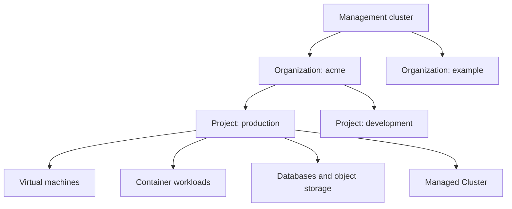
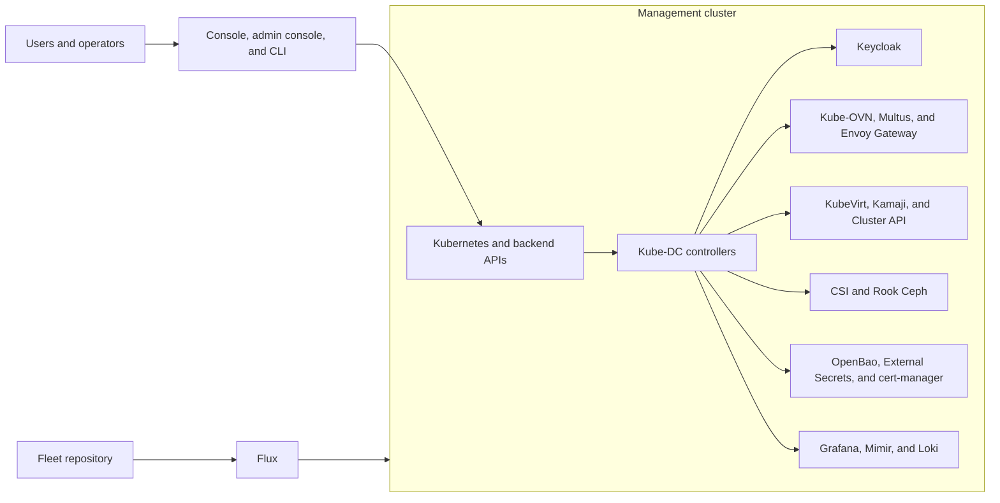
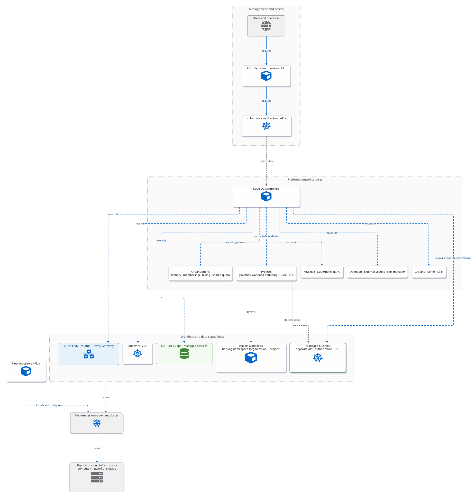

# Architecture Overview

Kube-DC turns one Kubernetes management cluster into a multi-tenant platform
for virtual machines, containers, managed databases, object storage, and
Managed Clusters. Users work with **Organizations** and **Projects**;
controllers translate those product objects into Kubernetes, identity,
networking, storage, and observability resources.

## Start with the product model

- An **Organization** is the tenant boundary for identity, membership, billing,
  shared quota, and policy.
- A **Project** is the governed workload boundary inside an Organization. Its
  Kubernetes implementation is a backing namespace named
  `{organization}-{project}` plus a dedicated Kube-OVN VPC.
- A **Managed Cluster** is a separate Kubernetes API and control plane
  provisioned from a Project. Do not use *cluster* when the underlying object is
  only a Project or backing namespace.

## Management plane

Flux continuously reconciles installation configuration from the Fleet
repository. Kube-DC controllers continuously reconcile product resources such
as Organizations, Projects, External IP (`EIp`) resources, and Managed
Clusters. These are different control loops: Flux installs and configures the
platform, while the controllers operate Organization and Project resources.

View the architectural layers diagram

This layered view connects the access surface, Organization and Project
governance, workload capabilities, management-cluster foundation, and
underlying infrastructure. Managed Clusters retain their own API,
authorization, and CNI boundaries.

<figure className="diagram-comparison" data-diagram="architectural-layers" tabIndex="0" aria-label="Scrollable architectural layers diagram">

  <figcaption>Architectural layers and the boundaries between platform governance, Project workloads, and Managed Clusters.</figcaption>
</figure>

[Open the full-size SVG for zooming or printing.](images/architectural-layers.svg)

## Main subsystems

| Area | Responsibility | Principal components |
|---|---|---|
| Identity and access | Login, Organization membership, Project permissions | Keycloak, OIDC, Kubernetes RBAC |
| Tenancy and quota | Organization and Project lifecycle, plan limits, usage status | Kube-DC controllers, HNC, ResourceQuota |
| Networking | Project VPCs, egress, external addresses, Services, ingress | Kube-OVN, Multus, MetalLB, Envoy Gateway |
| Virtualization | VM lifecycle, images, console access, live-migration-capable storage paths | KubeVirt, CDI, CSI |
| Managed Clusters | Control-plane and worker lifecycle | Kamaji, Cluster API, provider controllers |
| Data services | Managed databases, block volumes, and S3-compatible buckets | CloudNativePG, MariaDB operator, CSI, Rook Ceph |
| Security services | Managed secrets, certificates, and encryption keys | OpenBao, External Secrets, cert-manager |
| Observability | Organization- and Project-scoped metrics, logs, alerts, and dashboards | Grafana, Mimir, Loki, Prometheus Operator |

Not every subsystem is required on every installation. Storage, external
networking, public certificate, GPU, and bare-metal capabilities depend on the
cluster topology and enabled Fleet components.

## Management cluster and Managed Clusters

The management cluster runs the Kube-DC platform and stores its custom
resources. A Managed Cluster has its own Kubernetes API and authorization
boundary, even when its control-plane pods or workers run on infrastructure
owned by the management cluster.

Use the management-cluster kubeconfig for platform operations. Use a Managed
Cluster kubeconfig for workloads and cluster-scoped operations inside that
Managed Cluster. A Project role does not grant cluster-admin access inside a
Managed Cluster.

## Isolation model

Kube-DC combines several controls rather than relying on a single boundary:

- namespace-scoped RBAC for Project resources;
- Organization-level hierarchical quota across Project backing namespaces;
- one Kube-OVN VPC and workload subnet per Project;
- ingress and egress router policies for shared external networks;
- admission policies for protected platform resources;
- per-Organization identity, observability, and security-service mappings.

Platform administrators and management-cluster components remain inside the
trusted platform boundary. See the security documentation for assumptions and
residual risks.

## Read next

- [Multi-tenancy and access control](architecture-multi-tenancy.md)
- [Networking architecture](architecture-networking.md)
- [Virtualization architecture](architecture-virtualization.md)
- [Controller map](controller-diagram.md)
- [Security model](security-model.md)
