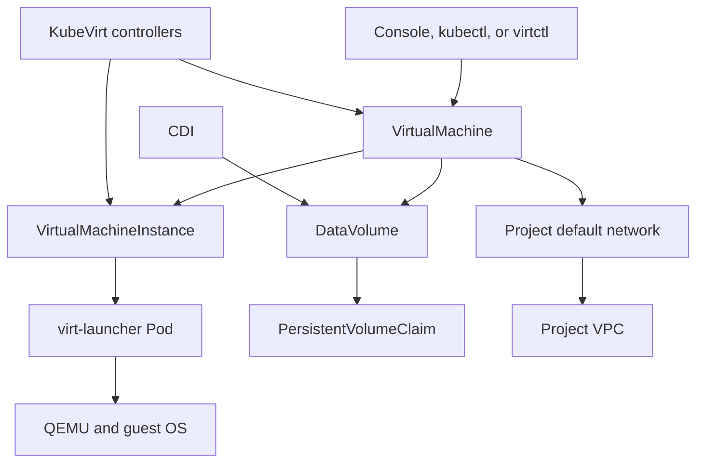

# Virtualization Architecture

Kube-DC runs virtual machines on the same Kubernetes platform as container workloads. KubeVirt provides the VM lifecycle, CDI manages disk images and DataVolumes, and Kube-OVN connects each VM to its Project network.

## Resource Model

The important boundaries are:

- **Organization** owns identity, membership, and billing.
- **Project** is the workload boundary. Kube-DC creates a backing namespace named `{organization}-{project}`.
- **VirtualMachine** is the desired configuration and lifecycle object in that Project's backing namespace.
- **VirtualMachineInstance** represents a running instance of the VM.
- **virt-launcher Pod** hosts the QEMU process on a Kubernetes node.
- **DataVolume and PVC** hold persistent VM disks.
- **Project VPC** provides private addressing and platform-managed isolation.

Project users work with the VM resources. Platform operators manage the cluster-scoped KubeVirt, CDI, storage, and network components underneath them.

## VM Lifecycle

A VirtualMachine can be started, stopped, restarted, paused, or deleted through the console, `virtctl`, or KubeVirt subresources. A `Running` VMI means the virtualization process is active; it does not prove that the guest OS or application is ready.

Install and enable `qemu-guest-agent` in supported guests when you need:

- reliable guest IP discovery;
- guest-agent readiness checks;
- coordinated shutdown;
- SSH key injection and other guest integration.

A restart reboots the guest and does not preserve memory state. Pause and unpause preserve memory while the VM continues to consume its assigned capacity.

## Storage and Migration

Kube-DC supports two broad root-disk patterns:

| Storage | Characteristics | Live migration |
|---|---|---|
| Node-local storage | Lower latency and tied to one node | No |
| Shared RBD storage | Accessible from compatible nodes; supports shared storage workflows | Available when the VM and node pool meet migration requirements |

CDI imports or clones the selected operating-system image into a DataVolume. The catalog and prepared golden images are platform configuration, so the current console catalog is the source of truth for available operating systems and versions.

Live migration can move an eligible running VM between compatible nodes without a planned guest shutdown. It is not an application availability guarantee: storage health, network health, CPU compatibility, capacity, guest behavior, and migration progress all matter. Dedicated GPU devices cannot be live-migrated.

See [VM storage tiers and live migration](vm-storage-tiers.md) for requirements and operator configuration.

## Networking

A VM normally attaches to the `default` NetworkAttachmentDefinition in its Project's backing namespace. Kube-OVN assigns a private address from the Project CIDR and connects the interface to the Project VPC.

Inbound access is explicit:

- use a Floating IP for one-to-one NAT to a VM;
- use a LoadBalancer Service to publish selected TCP or UDP ports;
- use a Gateway Route for hostname-based application traffic.

A Floating IP does not replace the address inside the guest. The guest keeps its private address while OVN translates traffic at the platform edge.

Project isolation is enforced primarily by the Project VPC and platform-managed OVN routing policy. Do not describe user-authored Kubernetes NetworkPolicy as the Project boundary.

## Images and Guest Configuration

The console creates VM manifests from the platform image catalog. Operators manage that catalog and its import or mirror lifecycle; users select an available image and provide sizing, storage, networking, and cloud-init settings.

Use cloud-init for initial users, SSH keys, packages, and guest-agent setup. Keep credentials in Secrets or the platform secret service rather than embedding passwords in VM manifests.

Operator guides:

- [Managing operating-system images](managing-os-images.md)
- [Operating image imports and mirrors](os-image-operations.md)
- [Windows VM setup](windows-vm-setup.md)

User guides:

- [Create a virtual machine](/cloud/creating-vm)
- [Connect to a virtual machine](/cloud/connecting-vm)
- [Manage VM lifecycle](/cloud/vm-lifecycle)

## Security and Capacity

Project RBAC controls who can create VMs, open consoles, or read related Secrets. Quota accounts for VM CPU, memory, and storage alongside other Project workloads.

Platform operators should also plan for:

- node CPU and hardware compatibility;
- storage capacity and failure domains;
- migration headroom;
- image provenance and refresh;
- GPU device ownership and node mode;
- monitoring of KubeVirt, CDI, and guest-agent conditions.

For dedicated GPU operations, begin with [GPU capacity reservations](gpu-capacity-reservations.md) and the [GPU threat model](gpu-threat-model.md).
