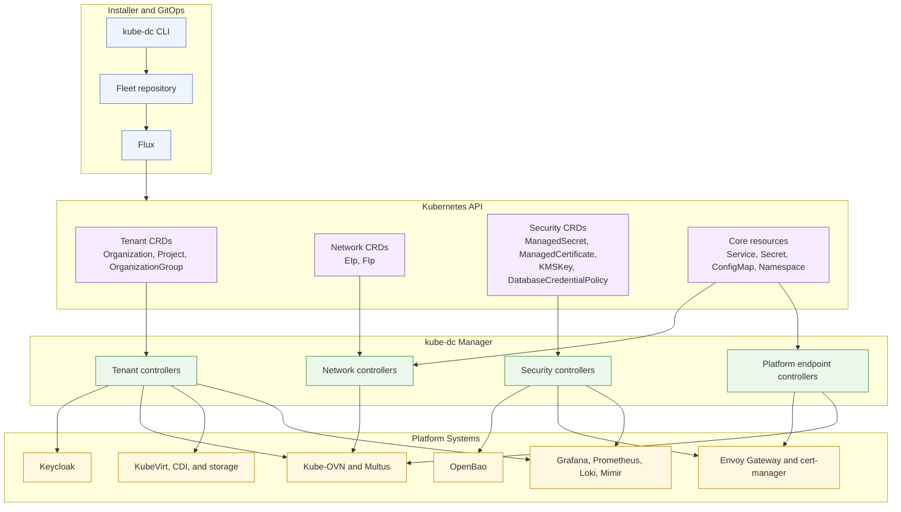
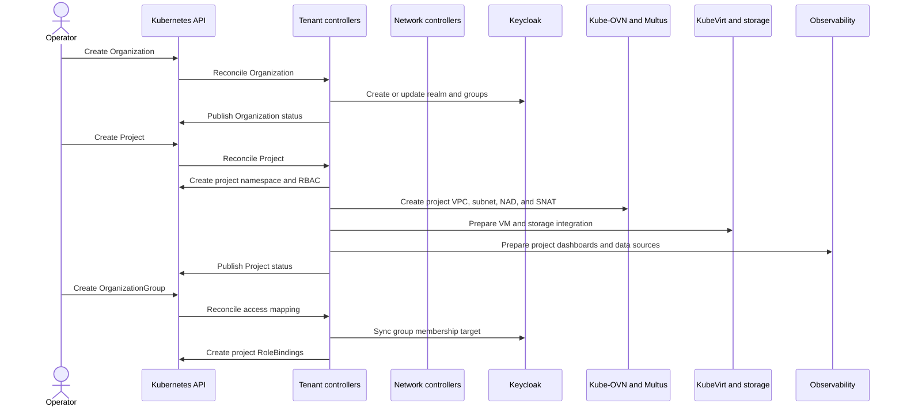
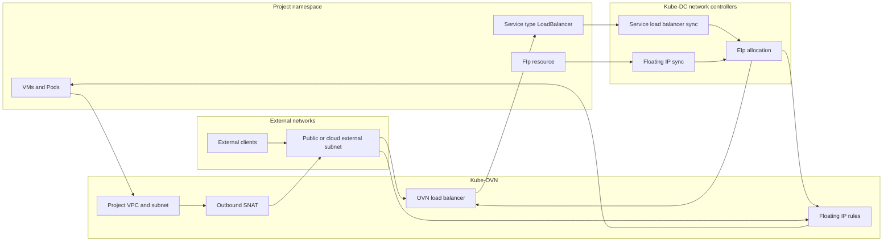
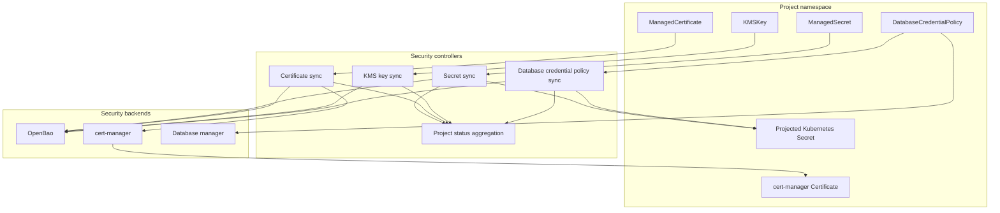
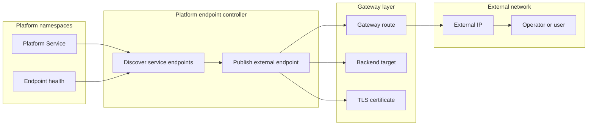

# Controller Architecture

This page shows how Kube-DC controllers turn platform custom resources into
Kubernetes, network, identity, storage, and security state. It is an operator
view: resource names and component responsibilities are shown, but source-code
paths and implementation details are intentionally omitted.

## High-Level Topology

## Controller Groups

| Controller group | Watches | Main responsibility |
| --- | --- | --- |
| Tenant controllers | Organizations, Projects, OrganizationGroups | Create tenant namespaces, identity mappings, RBAC, default project networking, quotas, and project lifecycle state. |
| Network controllers | EIps, FIps, LoadBalancer Services | Allocate and bind external addresses, program Kube-OVN objects, and keep service load balancers attached to the right routers and switches. |
| Platform endpoint controllers | Annotated platform Services and endpoint health | Publish platform APIs through the configured external network path and keep endpoint health discoverable. |
| Security controllers | ManagedSecrets, ManagedCertificates, KMSKeys, DatabaseCredentialPolicies | Bridge project security resources to OpenBao, cert-manager, projected Kubernetes Secrets, and status rollups. |
| Status aggregation | Project security and platform state | Roll child-resource readiness into higher-level Project and Organization status so operators and UI users see one clear state. |

## Project Lifecycle

## Network Flow

Kube-DC has two address concepts:

- **EIp** is the allocated external address object. It can back a project
  gateway, a service load balancer, or another higher-level resource.
- **FIp** attaches an external address to a specific VM interface. It is the
  tenant-facing floating-IP workflow.

The controller keeps ownership and status on the Kube-DC resources while
Kube-OVN owns the low-level routing, NAT, and load-balancer programming.

## Security Flow

Security controllers make project-scoped security resources safe for tenants to
request while keeping privileged operations centralized in the platform. The
Ready conditions on the child resources are aggregated so the Project status can
show whether its security dependencies are usable.

## Platform Endpoint Flow

Platform endpoints are used for management-plane services such as login, admin
interfaces, and break-glass access paths. The controller publishes only the
services that are explicitly marked for platform exposure and keeps health
visible so operators can distinguish routing issues from backend readiness.

## Reading The Diagram

- The **CLI and Fleet repository** define desired state.
- **Flux** applies that state to the management cluster.
- **Kube-DC controllers** reconcile custom resources and selected Kubernetes
  resources into real platform state.
- **External platform systems** such as Keycloak, OpenBao, Kube-OVN, KubeVirt,
  cert-manager, Envoy Gateway, and observability components do the specialized
  work.
- Status flows back to Kube-DC resources so the UI, CLI, and operators can read
  the platform state from Kubernetes.
