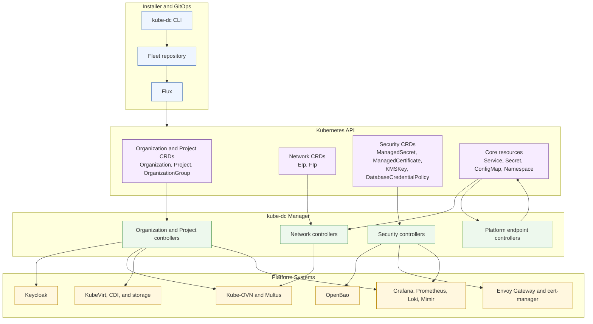
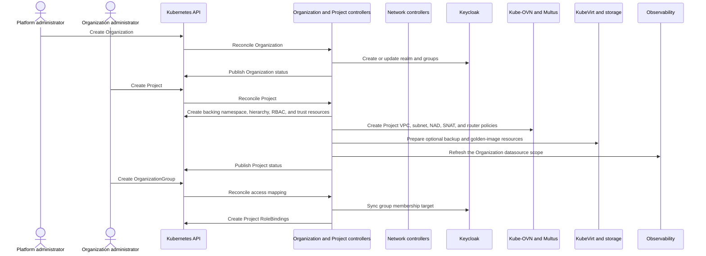
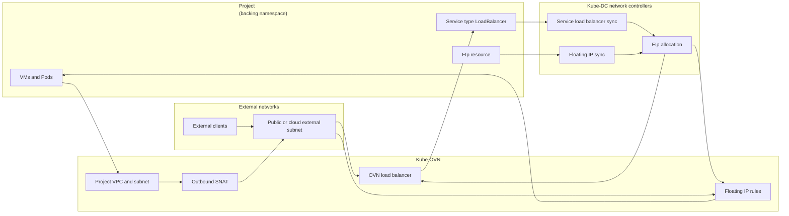
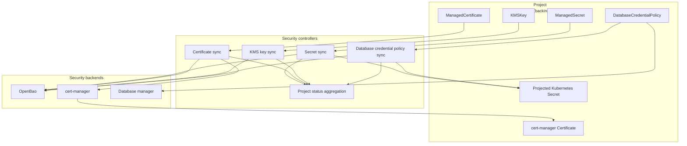
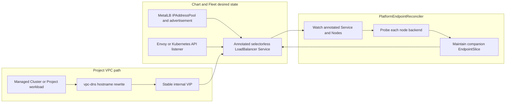

# Controller Architecture

This page shows how Kube-DC controllers turn platform custom resources into
Kubernetes, network, identity, storage, and security state. It is an operator
view: resource names and component responsibilities are shown, but source-code
paths and implementation details are intentionally omitted.

## High-Level Topology

```mermaid
flowchart TB
  accTitle: Kube-DC controller topology
  accDescr: The CLI and Fleet supply desired state to platform controllers, which reconcile Projects and shared platform resources through Kubernetes APIs.
  subgraph GitOps["Installer and GitOps"]
    CLI["kube-dc CLI"]
    Fleet["Fleet repository"]
    Flux["Flux"]
  end

  subgraph API["Kubernetes API"]
    ProductCRDs["Organization and Project CRDs<br/>Organization, Project, OrganizationGroup"]
    NetworkCRDs["Network CRDs<br/>EIp, FIp"]
    SecurityCRDs["Security CRDs<br/>ManagedSecret, ManagedCertificate,<br/>KMSKey, DatabaseCredentialPolicy"]
    CoreResources["Core resources<br/>Service, Secret, ConfigMap, Namespace"]
  end

  subgraph Manager["kube-dc Manager"]
    ProductControllers["Organization and Project controllers"]
    NetworkControllers["Network controllers"]
    SecurityControllers["Security controllers"]
    EndpointControllers["Platform endpoint controllers"]
  end

  subgraph Platform["Platform Systems"]
    Keycloak["Keycloak"]
    OpenBao["OpenBao"]
    KubeOVN["Kube-OVN and Multus"]
    KubeVirt["KubeVirt, CDI, and storage"]
    Gateway["Envoy Gateway and cert-manager"]
    Observability["Grafana, Prometheus, Loki, Mimir"]
  end

  CLI --> Fleet --> Flux --> API
  ProductCRDs --> ProductControllers
  NetworkCRDs --> NetworkControllers
  SecurityCRDs --> SecurityControllers
  CoreResources --> NetworkControllers
  CoreResources --> EndpointControllers

  ProductControllers --> Keycloak
  ProductControllers --> KubeOVN
  ProductControllers --> KubeVirt
  ProductControllers --> Observability

  NetworkControllers --> KubeOVN
  EndpointControllers --> CoreResources

  SecurityControllers --> OpenBao
  SecurityControllers --> Gateway
  SecurityControllers --> Observability

  classDef input fill:#eef5ff,stroke:#4b77be,stroke-width:1px;
  classDef manager fill:#edf8ed,stroke:#3b8c3b,stroke-width:1px;
  classDef platform fill:#fff7df,stroke:#b98500,stroke-width:1px;
  classDef api fill:#f7ecff,stroke:#7d4fa3,stroke-width:1px;

  class CLI,Fleet,Flux input;
  class ProductCRDs,NetworkCRDs,SecurityCRDs,CoreResources api;
  class ProductControllers,NetworkControllers,SecurityControllers,EndpointControllers manager;
  class Keycloak,OpenBao,KubeOVN,KubeVirt,Gateway,Observability platform;
```

## Controller Groups

| Controller group | Watches | Main responsibility |
| --- | --- | --- |
| Organization and Project controllers | Organizations, Projects, OrganizationGroups | Create backing namespaces, identity mappings, RBAC, default Project networking, quotas, and Project lifecycle state. |
| Network controllers | EIp and FIp resources, LoadBalancer Services | Allocate and bind external addresses, program Kube-OVN objects, and keep service load balancers attached to the right routers and switches. |
| Platform endpoint controllers | Annotated selectorless platform Services and Nodes | Probe eligible node backends and maintain companion EndpointSlices; charts and Fleet own the VIP, Gateway, routes, and certificates. |
| Security controllers | ManagedSecrets, ManagedCertificates, KMSKeys, DatabaseCredentialPolicies | Bridge project security resources to OpenBao, cert-manager, projected Kubernetes Secrets, and status rollups. |
| Status aggregation | Project security and platform state | Roll child-resource readiness into higher-level Project and Organization status so operators and UI users see one clear state. |

## Project Lifecycle

```mermaid
sequenceDiagram
  accTitle: Project lifecycle reconciliation
  accDescr: A platform administrator creates an Organization, an Organization administrator creates a Project, and controllers reconcile its identity, backing namespace, networking, quotas, and readiness.
  actor PlatformAdmin as Platform administrator
  actor OrgAdmin as Organization administrator
  participant API as Kubernetes API
  participant Product as Organization and Project controllers
  participant Network as Network controllers
  participant Identity as Keycloak
  participant OVN as Kube-OVN and Multus
  participant Virt as KubeVirt and storage
  participant Obs as Observability

  PlatformAdmin->>API: Create Organization
  API->>Product: Reconcile Organization
  Product->>Identity: Create or update realm and groups
  Product->>API: Publish Organization status

  OrgAdmin->>API: Create Project
  API->>Product: Reconcile Project
  Product->>API: Create backing namespace, hierarchy, RBAC, and trust resources
  Product->>OVN: Create Project VPC, subnet, NAD, SNAT, and router policies
  Product->>Virt: Prepare optional backup and golden-image resources
  Product->>Obs: Refresh the Organization datasource scope
  Product->>API: Publish Project status

  OrgAdmin->>API: Create OrganizationGroup
  API->>Product: Reconcile access mapping
  Product->>Identity: Sync group membership target
  Product->>API: Create Project RoleBindings
```

## Network Flow

```mermaid
flowchart LR
  accTitle: Project workload network flow
  accDescr: Project workloads use their isolated subnet, with controlled egress through the Project router and optional external IP mappings for ingress or dedicated egress.
  subgraph Project["Project<br/>(backing namespace)"]
    Workload["VMs and Pods"]
    Service["Service type LoadBalancer"]
    FIp["FIp resource"]
  end

  subgraph Network["Kube-DC network controllers"]
    EIp["EIp allocation"]
    SLB["Service load balancer sync"]
    FIPSync["Floating IP sync"]
  end

  subgraph OVN["Kube-OVN"]
    VPC["Project VPC and subnet"]
    SNAT["Outbound SNAT"]
    LB["OVN load balancer"]
    DNAT["Floating IP rules"]
  end

  subgraph External["External networks"]
    Public["Public or cloud external subnet"]
    Clients["External clients"]
  end

  Workload --> VPC
  VPC --> SNAT --> Public

  Service --> SLB --> EIp --> LB
  FIp --> FIPSync --> EIp --> DNAT

  Clients --> Public
  Public --> LB --> Service
  Public --> DNAT --> Workload
```

Kube-DC has two address concepts:

- **EIp** is the allocated external address object. It can back a Project
  gateway, a service load balancer, or another higher-level resource.
- **FIp** creates a 1:1 NAT mapping from an EIp to either a selected VM
  interface (`vmTarget`) or an explicit internal workload address
  (`ipAddress`). The guest or Pod keeps its internal address.

The controller keeps ownership and status on the Kube-DC resources while
Kube-OVN owns the low-level routing, NAT, and load-balancer programming.

## Security Flow

```mermaid
flowchart TB
  accTitle: Project secret and certificate flow
  accDescr: Project-scoped managed resources are validated and reconciled to Kubernetes secrets and certificates without exposing platform credentials to Project users.
  subgraph ProjectNS["Project<br/>(backing namespace)"]
    MS["ManagedSecret"]
    MC["ManagedCertificate"]
    KMS["KMSKey"]
    DCP["DatabaseCredentialPolicy"]
    AppSecret["Projected Kubernetes Secret"]
    Certificate["cert-manager Certificate"]
  end

  subgraph Security["Security controllers"]
    SecretCtl["Secret sync"]
    CertCtl["Certificate sync"]
    KMSCtl["KMS key sync"]
    DBPolicyCtl["Database credential policy sync"]
    StatusCtl["Project status aggregation"]
  end

  subgraph Backends["Security backends"]
    Bao["OpenBao"]
    CM["cert-manager"]
    DB["Database manager"]
  end

  MS --> SecretCtl --> Bao
  SecretCtl --> AppSecret

  MC --> CertCtl --> Bao
  CertCtl --> CM --> Certificate

  KMS --> KMSCtl --> Bao
  DCP --> DBPolicyCtl --> Bao
  DCP --> DB
  DBPolicyCtl --> AppSecret

  SecretCtl --> StatusCtl
  CertCtl --> StatusCtl
  KMSCtl --> StatusCtl
  DBPolicyCtl --> StatusCtl
```

Security controllers validate and reconcile Project-scoped requests while
keeping backend credentials and privileged operations in platform service
accounts. Ready conditions on child resources are aggregated so the Project
status can show whether its security dependencies are usable.

## Platform Endpoint Flow

```mermaid
flowchart LR
  accTitle: Platform endpoint reconciliation
  accDescr: Fleet owns endpoint resources, while the endpoint controller probes eligible nodes and maintains the selectorless Service EndpointSlice used by the Gateway.
  subgraph Desired["Chart and Fleet desired state"]
    Pool["MetalLB IPAddressPool and advertisement"]
    Service["Annotated selectorless LoadBalancer Service"]
    Gateway["Envoy or Kubernetes API listener"]
  end

  subgraph EndpointCtl["PlatformEndpointReconciler"]
    Watch["Watch annotated Service and Nodes"]
    Probe["Probe each node backend"]
    Slice["Maintain companion EndpointSlice"]
  end

  subgraph ProjectPath["Project VPC path"]
    DNS["vpc-dns hostname rewrite"]
    VIP["Stable internal VIP"]
    Client["Managed Cluster or Project workload"]
  end

  Pool --> Service
  Gateway --> Service
  Service --> Watch
  Watch --> Probe --> Slice
  Slice --> Service
  Client --> DNS --> VIP --> Service
```

The chart and Fleet configuration own the MetalLB pool, advertisement,
LoadBalancer Service, Gateway resources, routes, and certificates. The
`PlatformEndpointReconciler` does not create those objects. It watches an
explicitly annotated selectorless Service, health-probes the eligible node
backends, and maintains the Service's companion EndpointSlice.

For topologies that cannot hairpin through the public address, `vpc-dns`
rewrites platform hostnames to the internal VIP. This keeps the hostname and TLS
identity unchanged while selecting a reachable path. See
[Internal platform endpoints](internal-platform-endpoints.md).

## Reading The Diagram

- The **CLI and Fleet repository** define desired state.
- **Flux** applies that state to the management cluster.
- **Kube-DC controllers** reconcile custom resources and selected Kubernetes
  resources into real platform state.
- **External platform systems** such as Keycloak, OpenBao, Kube-OVN, KubeVirt,
  cert-manager, Envoy Gateway, and observability components do the specialized
  work.
- Status flows back to Kube-DC resources so the UI, CLI, and operators can read
  the platform state from Kubernetes.
