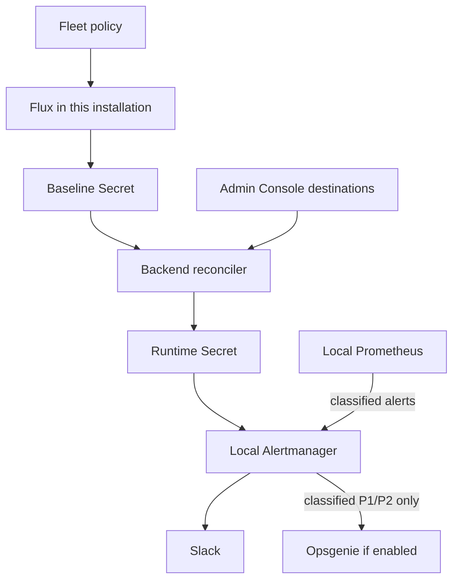
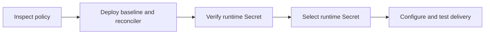

# Set up Slack and Opsgenie alerts with Fleet

As a platform operator, use this guide to connect an installation's monitoring
alerts to Slack and, optionally, an existing Opsgenie integration. You configure
the alert policy in your Fleet repository, activate console management, and
verify delivery from the management cluster.

These are platform operator notifications. For Organization alert rules and
the tenant observability stack, see [Observability](observability.md).

import {AlertNotificationArchitecture, AlertNotificationAdoption} from '@site/src/components/Diagram/AlertNotificationDiagrams';

## How notifications reach your team

Each management cluster runs its own Prometheus and Alertmanager. Prometheus
evaluates rules and classifies alerts. Alertmanager groups related alerts,
suppresses redundant symptoms, and sends notifications to enabled destinations.

Fleet manages the rules, priorities, grouping, and inhibition. The Admin Console
manages destination credentials and enablement for the installation you are
signed into. Changing one installation's settings does not change another's.

<details data-github-only>
<summary>Notification architecture diagram</summary>



</details>

<AlertNotificationArchitecture />

The two Secrets have different owners:

| Secret in `monitoring` | Owner | Purpose |
|---|---|---|
| `alertmanager-config-custom` | Fleet | Baseline policy and templates; an established installation can also keep its encrypted Slack default here. |
| `alertmanager-config-console` | Backend reconciler | Effective configuration and console destination settings. This Secret contains credentials. |

The backend checks for baseline changes every 30 seconds. It validates the
combined configuration before updating the runtime Secret. Invalid updates
leave the last published runtime configuration in place. Keep the runtime
Secret out of Flux resources and include it in your encrypted cluster backups.

## Before you begin

You need the following:

- A working Kube-DC management cluster, its Fleet repository, and Flux.
- Management-cluster access with permission to inspect monitoring resources
  and deploy your reviewed Fleet changes.
- A platform superadmin account for **Alerts > Notification settings**.
  Grafana access alone does not grant permission to edit these settings.
- Compatible backend, Admin Console, and chart releases with notification
  settings support. See [Upgrade the management cluster](upgrading-management-cluster.md)
  when updating release pins.
- The portable `incident-alerting`, `incident-notifications`, and
  `alerting-console` components in your Fleet starter. If any is missing,
  update your starter through your normal release process first.
- A Slack incoming webhook for the destination channel. Follow Slack's
  [incoming webhook setup](https://docs.slack.dev/messaging/sending-messages-using-incoming-webhooks/).
- Optional: an Opsgenie integration API key, its US or EU API region, and an
  on-call team with schedules and escalation configured.
- Outbound HTTPS and DNS from Alertmanager to Slack and, when enabled, the
  selected Opsgenie API. Keep certificate verification enabled.

Opsgenie is available here for existing integrations. Atlassian ended new sales
on June 4, 2025 and schedules the end of support for April 5, 2027. Check the
[Opsgenie lifecycle notice](https://www.atlassian.com/software/opsgenie/pricing)
before planning a new paging integration. This guide does not imply support
for a replacement product's API.

Run Fleet commands from the root of your own repository. Select the intended
management cluster and installation directory:

```bash
export KUBECONFIG=/PATH/TO/MANAGEMENT_KUBECONFIG
INSTALLATION=region-a
kubectl config current-context
```

Replace `/PATH/TO/MANAGEMENT_KUBECONFIG` with your kubeconfig path and `region-a`
with your directory under `clusters/`. All installation names in this guide
are fictional examples. Commands assume the standard `flux-system` source,
`platform` Kustomization, and `prom-operator-alertmanager` resource names.
Adjust them if your installation uses different names.

## Choose your starting point

Use the path that matches your installation:

| Starting point | Next step |
|---|---|
| A bootstrap-generated installation already selects all three components and the runtime Secret | [Verify activation](#verify-activation), then configure destinations. |
| Notification settings shows **Fleet-managed configuration** | [Enable console management on an existing installation](#enable-console-management-on-an-existing-installation). |
| The form shows **Console destination management is not active** | Verify the runtime Secret and complete [the switch](#switch-alertmanager-to-the-runtime-secret). |
| Your installation has a custom notification policy | Check its compatibility in the existing-installation preflight before changing it. |

For a bootstrap-generated installation, `clusters/INSTALLATION/platform.yaml`
selects these components when its `spec.path` is `./platform`:

```yaml
spec:
  components:
    - ./monitoring/prom-operator/components/incident-alerting
    - ./monitoring/prom-operator/components/incident-notifications
    - ./kube-dc/components/alerting-console
```

This is a fragment: keep the file's other fields and components. The generated
baseline has no working credentials. Both destinations start disabled, so
alerts remain visible without sending messages until you configure delivery.

## Enable console management on an existing installation

Use two separate Fleet reconciliations: first create and validate the runtime
Secret, then select it in Alertmanager. Do not combine the phases in one push.
The parent `incident-notifications` component selects the runtime Secret
immediately and is intended for installations without an existing notification
configuration to preserve.

<details data-github-only>
<summary>Existing-installation rollout diagram</summary>



</details>

<AlertNotificationAdoption />

### Inspect the existing configuration

1. Read the active configuration selector without printing credentials:

   ```bash
   kubectl -n monitoring get alertmanager prom-operator-alertmanager \
     -o jsonpath='{.spec.configSecret}{"\n"}'
   kubectl -n monitoring get secret \
     alertmanager-config-custom alertmanager-config-console \
     --ignore-not-found -o name
   ```

   A blank selector means Alertmanager uses the operator's default Secret
   naming behavior. It does not prove that the generated configuration has no
   destinations. Record the current Fleet settings and review the active policy
   through your secure configuration workflow. Do not paste Secret contents
   into tickets or terminal recordings.

2. Check whether an existing baseline is compatible with console management.
   It must have Slack receivers named `slack-page`, `slack-warning`, and
   `slack-unclassified`. Every route to `slack-page` must match
   `notification="page"` and exactly `priority="P1"` or `priority="P2"`.
   The baseline must not contain `opsgenie_configs`.

   If your baseline meets these requirements, keep its SOPS-managed Secret,
   templates, credentials, and existing delivery behavior. Skip baseline
   creation in the next section. If it does not, retain Fleet management until
   you have prepared and reviewed a compatible policy migration. Do not
   replace working custom routing with the empty starter baseline.

3. Check `clusters/INSTALLATION/platform.yaml` for its `spec.path` and existing
   backend environment patches. Component paths are relative to `spec.path`.
   The examples below assume `./platform`; an overlay under
   `./clusters/INSTALLATION/platform` needs paths relative to that directory.
   Merge existing `backend.extraEnv` entries with the alerting component's
   entries so the adoption does not remove other backend settings.

### Deploy the baseline and reconciler

1. In `clusters/INSTALLATION/cluster-config.env`, set a unique site identity:

   ```dotenv
   MONITORING_SITE=region-a
   ```

   Use a stable identifier for this management cluster. Keep your existing
   `DOMAIN` value; notification links use `https://grafana.DOMAIN`. The `site`
   label identifies the installation, while `tenant_cluster` identifies an
   affected Managed Cluster.

2. **Only if you have no existing baseline to preserve**, create a component
   that loads the portable baseline without selecting it in Alertmanager:

   ```bash
   mkdir -p platform/monitoring/prom-operator/components/incident-notifications/seed
   ```

   Create `platform/monitoring/prom-operator/components/incident-notifications/seed/kustomization.yaml`
   with this content, unless an equivalent seed component already exists:

   ```yaml
   apiVersion: kustomize.config.k8s.io/v1alpha1
   kind: Component
   resources:
     - ../baseline.yaml
   ```

   This references the starter's credential-free policy. Its
   `alerting.kube-dc.io/default-slack-enabled: "false"` annotation tells the
   backend to seed a runtime configuration with delivery disabled. Do not point
   Alertmanager directly at this placeholder baseline.

3. Add the following entries to `spec.components` in
   `clusters/INSTALLATION/platform.yaml`:

   ```yaml
   - ./monitoring/prom-operator/components/incident-alerting
   - ./monitoring/prom-operator/components/incident-notifications/seed
   - ./kube-dc/components/alerting-console
   ```

   Omit the `seed` entry if Fleet already supplies your compatible baseline.
   Keep Alertmanager's configuration selector unchanged in this phase. The
   console component enables `ALERTING_SETTINGS_ENABLED=true` and connects the
   backend to the baseline and runtime Secret names.

4. Validate the proposed platform render using the starter's renderer:

   ```bash
   bash scripts/render_as_flux.sh "$INSTALLATION" > /tmp/platform-render.yaml
   python3 scripts/test-incident-alerting.py
   ```

   The tests require `promtool`, `amtool`, Python with PyYAML, and `kubectl` or
   `kustomize`. They validate rules and templates without sending notifications.
   Inspect the render locally: the backend must have the alerting environment
   entries and Alertmanager's selector must still match the preflight value.
   Treat the rendered file as potentially sensitive and remove it after review.

5. Commit the reviewed changes and merge them into the branch watched by your
   installation's Flux source. After that deployment decision, reconcile the
   root first so the cluster ConfigMap updates, then the platform:

   ```bash
   flux reconcile kustomization flux-system --with-source
   flux reconcile kustomization platform
   ```

6. Verify that the backend created the runtime Secret with the expected owner:

   ```bash
   kubectl -n monitoring get secret alertmanager-config-console \
     -o jsonpath='{.metadata.labels.app\.kubernetes\.io/managed-by}{"\n"}'
   ```

   Expected output:

   ```text
   kube-dc-alerting-console
   ```

   In Grafana, query the platform Prometheus datasource for
   `max(kube_dc_alerting_config_sync_success)`. The value must be `1`.
   The settings form must report a synchronized configuration. It can still
   report that console destination management is inactive at this point.
   For an existing baseline, also verify that its configuration and templates
   were preserved before continuing.

### Switch Alertmanager to the runtime Secret

1. After the runtime Secret passes those checks, add this item to
   `spec.patches` in `clusters/INSTALLATION/platform.yaml`:

   ```yaml
   - target:
       group: helm.toolkit.fluxcd.io
       version: v2
       kind: HelmRelease
       name: prom-operator
       namespace: monitoring
     patch: |
       apiVersion: helm.toolkit.fluxcd.io/v2
       kind: HelmRelease
       metadata:
         name: prom-operator
         namespace: monitoring
       spec:
         values:
           alertmanager:
             alertmanagerSpec:
               configSecret: alertmanager-config-console
   ```

   Keep the baseline and reconciler components from phase one. This explicit
   patch works with the portable components; adding an
   `ALERTMANAGER_CONFIG_SECRET` variable to an environment file alone does not
   wire it into this configuration.

2. Render and review this second change, then commit and merge it separately.
   Reconcile the root and platform again using the commands from phase one.

3. Complete [Verify activation](#verify-activation) before enabling destinations.

## Verify activation

1. Confirm the Flux Kustomization and monitoring HelmRelease are ready:

   ```bash
   flux get kustomizations
   flux get helmreleases -n monitoring
   ```

   The `platform` Kustomization and `prom-operator` HelmRelease must report
   `Ready=True`. Investigate failed dependencies rather than bypassing them.

2. Confirm the selected Secret:

   ```bash
   kubectl -n monitoring get alertmanager prom-operator-alertmanager \
     -o jsonpath='{.spec.configSecret}{"\n"}'
   ```

   Expected output:

   ```text
   alertmanager-config-console
   ```

3. In the platform Prometheus datasource, confirm that
   `alertmanager_config_last_reload_successful` is `1` for the installation's
   Alertmanager and `max(kube_dc_alerting_config_sync_success)` is `1`.

4. Open **Alerts > Notification settings** in the Admin Console. The form must
   be editable, with no inactive-management or synchronization warning.
   Configuration health confirms readiness to send; it does not prove that an
   external service received a message.

## Configure Slack

1. Open **Alerts > Notification settings** as a superadmin.
2. Enter the channel's webhook in **Incoming webhook URL**.
3. Select **Enable Slack notifications**.
4. Select **Save settings**.

The webhook determines the channel. The portable policy uses one Slack
destination for paging, warnings, and unclassified critical alerts. The
receiver names are routing groups, not separate channels. Sending different
priorities to different channels requires a reviewed Fleet policy change
beyond the console's single-webhook setting.

Saving validates the configuration and updates the runtime Secret. It sends
no test message, but enabled destinations can receive existing firing alerts
after Alertmanager reloads. A blank credential field preserves its stored
value; the API does not return the credential to the browser.

## Configure Opsgenie

1. In the same form, enter the integration key in **Integration API key**.
2. Select the integration's **API region**: **US** or **EU**.
3. Enter the exact team name in **On-call team**.
4. To store credentials before activating paging, leave **Enable Opsgenie for
   classified P1/P2 incidents** cleared and select **Save settings**.
5. Review the team's schedules and escalation rules, then select **Enable
   Opsgenie for classified P1/P2 incidents** and the readiness confirmation
   checkbox.
6. Select **Save settings**.

Use an integration API key, not a webhook URL. Opsgenie receives only alerts
that reach `slack-page` with `notification="page"` and priority P1 or P2.
Opsgenie can be enabled independently of Slack. Changes to an enabled
integration, region, or team require a new readiness confirmation.

## Choose which incidents page

The portable policy applies these delivery defaults after Prometheus classifies
alerts. Waits begin when an alert reaches Alertmanager; the rule's own `for`
duration and scrape/evaluation delay come first:

| Alert group | Destination when enabled | Initial wait | Unchanged reminder |
|---|---|---|---|
| Classified P1 | Slack and Opsgenie | 1 minute | 4 hours |
| Classified P2 | Slack and Opsgenie | 2 minutes | 8 hours |
| P3 warning | Slack | 10 minutes | 24 hours |
| Unclassified critical | Slack only | 2 minutes | 8 hours |
| Informational or `notification="none"` | No notification | Not applicable | Not applicable |

Warning and classified paging receivers send recovery notifications.
Inhibition can suppress lower-priority symptoms of the same incident. A P3
label of `notification="ticket"` selects warning delivery; it does not create
a ticket in an external system or restrict delivery to business hours.

Managed Cluster incidents generally remain P3 unless you explicitly approve
their Project/cluster pair for paging. For example, set this in the
installation's `cluster-config.env` to opt in one fictional pair:

```dotenv
PAGING_TENANT_PAIR_REGEX=example-production@payments
```

Replace `example-production` with the Project's backing namespace and
`payments` with the Managed Cluster name. Use exact pairs; do not use a broad
wildcard. The allowlist promotes matching critical tenant incidents to P2.
Explicit network-isolation and integrity exceptions can page independently
of tenant membership. Review the full classification in
`platform/monitoring/prom-operator/components/incident-alerting/values.yaml`
before changing paging scope. Keep business policy in Fleet.

## Test delivery and recovery

Run this procedure during an agreed test window. It sends real notifications
to the destinations you enabled. Agree on the paging test with the on-call
team first. Saving settings alone does not test delivery.

1. Create `/tmp/notification-delivery-test.yaml` with this temporary rule:

   ```yaml
   apiVersion: monitoring.coreos.com/v1
   kind: PrometheusRule
   metadata:
     name: notification-delivery-test
     namespace: monitoring
     labels:
       release: prom-operator
   spec:
     groups:
       - name: notification-delivery-test
         rules:
           - alert: KubeDCNotificationWarningTest
             expr: vector(1)
             for: 1m
             labels:
               severity: warning
             annotations:
               summary: Planned notification delivery test
   ```

2. Apply the test rule to the selected management cluster:

   ```bash
   kubectl apply -f /tmp/notification-delivery-test.yaml
   ```

   Confirm the alert becomes firing and reaches Alertmanager with the expected
   `site`, `priority="P3"`, and `notification="ticket"` labels. Allow for the
   rule duration and the default 10-minute warning grouping wait. Confirm a
   message appears in the intended Slack channel and no Opsgenie alert is
   created for this P3 test.

3. If Opsgenie is enabled, edit the same file: change the alert name to
   `KubeDCNotificationPagingTest` and severity to `critical`. Apply it again:

   ```bash
   kubectl apply -f /tmp/notification-delivery-test.yaml
   ```

   Confirm the paging test reaches Alertmanager with `priority="P2"` and
   `notification="page"`. After the default 2-minute grouping wait, verify
   receipt in Slack when enabled and in the expected Opsgenie team. Verify
   on-call notification separately from the creation of an Opsgenie alert.

4. Remove the temporary rule after checking delivery, including if a test fails:

   ```bash
   kubectl -n monitoring delete prometheusrule notification-delivery-test
   rm /tmp/notification-delivery-test.yaml
   ```

   Confirm the test alerts resolve, Slack receives the recovery, and Opsgenie
   closes its test alert. Group update intervals can delay recovery messages.
   Remove any temporary silences used for the test. Do not leave the test rule
   in your permanent Fleet configuration.

## Troubleshoot notification setup

Use the symptom to choose the next check:

| Symptom | Check |
|---|---|
| **Fleet-managed configuration** | The backend has not enabled console settings. Check component selection, the deployed backend version, and `ALERTING_SETTINGS_ENABLED=true`. |
| **Console destination management is not active** | Check that the runtime Secret exists and Alertmanager selects it. The backend also treats `spec.alertmanagerConfiguration` as incompatible with this Secret-based flow. |
| Synchronization warning or `KubeDCAlertNotificationConfigSyncFailed` | Check backend health, access to the two Secrets, Alertmanager read permissions, baseline compatibility, and validation errors. A sync failure alert fires after 15 minutes. |
| **Save settings** fails with a conflict | Close and reopen the form to read the latest revision, then retry. |
| Alerts are firing but no notification arrives | Check enabled destinations, receiver selection, silences, inhibition, grouping waits, reload health, egress, and notification failures. The Alerts page does not prove delivery. |
| Slack uses the wrong channel | Replace the incoming webhook with one installed for the intended channel. |
| Opsgenie receives no alert | Check API key, region, team, and post-classification P1/P2 labels. Warning and unclassified receivers never page. |
| Tenant critical alerts arrive only in Slack | Review the exact `PAGING_TENANT_PAIR_REGEX` pair and the resulting priority. |
| Grafana links fail | Check the installation's `DOMAIN`, public Grafana route, identity bootstrap, and the operator's separate Grafana permissions. |

Inspect redacted diagnostics and status fields. Do not print decrypted baseline
or runtime Secret data to troubleshoot delivery.

## Roll back console management

1. Restore the Alertmanager configuration selection recorded during preflight
   through Fleet. For a compatible encrypted baseline, this usually selects
   `alertmanager-config-custom`. For a previous chart-default configuration,
   remove the runtime selection patch. Do not select the credential-free
   placeholder baseline as a rollback destination.
2. Reconcile Fleet and confirm Alertmanager reloads the previous configuration
   successfully before removing the backend console component or downgrading
   its image.
3. Preserve an encrypted backup of the runtime Secret if you intend to recover
   console settings later. A rollback to a configuration without destinations
   stops external notifications; it does not stop Prometheus alert evaluation.

## Next steps

Keep rule changes and destination management separate in your operating
process. Use [Observability](observability.md#4-alert-rules) to add platform
rules, repeat the delivery test after destination changes, and back up the
runtime Secret alongside the management cluster's other credentials.
