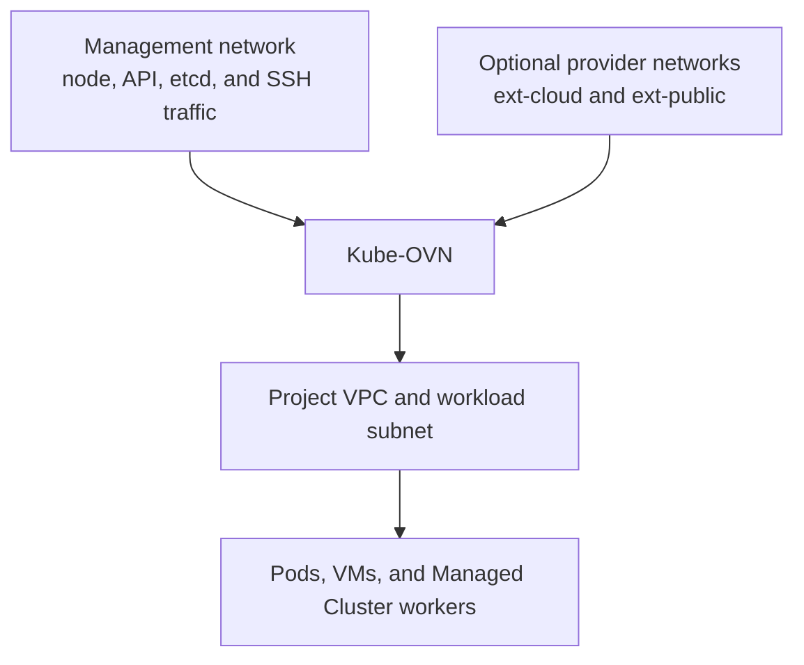
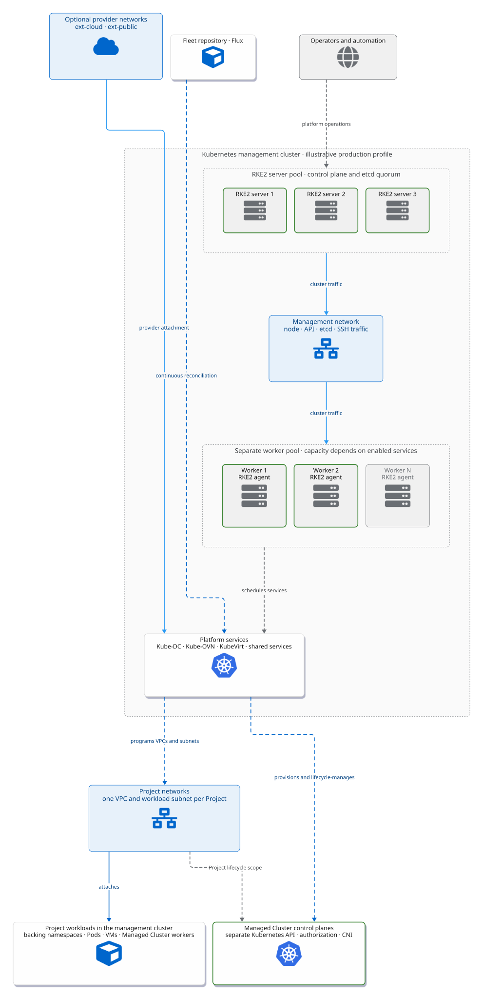

# Installation Overview

This page helps platform operators choose a supported topology and understand
what the installer changes. Use the [Installation Guide](installation-guide.md)
for commands and verification.

## Before you begin

A Kube-DC installation has two stages:

1. build or adopt the Kubernetes **management cluster**;
2. bootstrap Flux and let the Fleet repository reconcile Kube-DC.

The management cluster runs the platform controllers and shared services.
**Managed Clusters** are created later from Projects; they are not the same
cluster.

## Choose a topology

The CLI exposes topology presets so network requirements are explicit:

| Preset | External networks | Typical use |
|---|---|---|
| `internal-only` | No dedicated external VLAN | Evaluation or a private environment with an existing reachable ingress path |
| `cloud-vlan` | Private cloud provider network | Private external addresses and outbound SNAT |
| `cloud+public-vlan` | Private cloud and public provider networks | Separate private and internet-routable address pools |
| `custom` | Operator-defined | Existing clusters or datacenter-specific routing |

These presets describe networking, not cluster size. A private environment can
still be highly available, and a public-network lab can still be single-node.

A common production profile uses three RKE2 server nodes for control-plane and
etcd quorum plus separate worker nodes for capacity. Smaller evaluation and
larger dedicated-worker layouts are also possible. Size nodes from the
components and workloads you enable; GPU, Ceph, observability, and virtualization
change the requirements substantially.

## Network model

- The **management network** connects nodes and carries Kubernetes control-plane
  traffic. Use stable node addresses and working routing.
- `ext-cloud` is an optional private external provider network. It supplies
  addresses for Project gateways, private EIPs, and LoadBalancer Services.
- `ext-public` is an optional internet-routable provider network. Enable it
  only when the datacenter routes the address pool and the platform permits
  public Projects.
- Every Project receives its own overlay VPC and creator-supplied workload
  CIDR. Project workload subnets are not carved from the external VLAN CIDRs.

Provider networks may use VLANs on a shared physical trunk, dedicated
interfaces, or topology-specific existing bridges. Kube-OVN and OVS program the
attachment; do not assume Linux `bond0.<vlan>` interfaces are created.

View the reference architecture diagram

This broader topology illustrates a common three-server RKE2 control-plane
profile with separate workers. It is an example architecture, not a validated
capacity plan or a universal deployment requirement.

<figure className="diagram-comparison" data-diagram="reference-architecture" tabIndex="0" aria-label="Scrollable reference architecture diagram">

  <figcaption>Illustrative production topology; actual node count and capacity depend on enabled services and workloads.</figcaption>
</figure>

[Open the full-size SVG for zooming or printing.](images/reference-architecture.svg)

For NAT or routed environments where Project workloads cannot hairpin through
the platform's public address, enable
[internal platform endpoints](internal-platform-endpoints.md).

## What the Fleet installs

The exact versions are pinned in
`clusters/<cluster>/cluster-config.env`. Depending on the selected
configuration, Flux reconciles:

- Kube-DC controllers, backend, console, and admin console;
- Kube-OVN and Multus networking;
- KubeVirt and CDI virtualization;
- Keycloak identity and OIDC integration;
- Envoy Gateway and cert-manager;
- Kamaji, Cluster API, and supported worker providers;
- HNC and admission policy;
- Grafana, Mimir, Loki, and collection agents;
- optional OpenBao, Rook Ceph, GPU, Metal3, and billing integrations.

Consult the Fleet pin rather than a copied version table when planning an
upgrade.

## Installation journey

### 1. Qualify the environment

- choose the topology preset;
- plan Pod, Service, Project, and external-network ranges; Project VPCs may
  overlap, but overlapping ranges prevent straightforward future routing between
  them;
- reserve DNS names and any LoadBalancer or internal endpoint VIPs;
- verify node time, DNS, kernel, storage, and interface requirements;
- decide how SOPS/age recovery keys and OpenBao unseal material are held.

### 2. Build the management cluster

Use `kube-dc bootstrap install` for RKE2 nodes, or adopt a compatible existing
cluster through the documented adoption checks. Three server nodes are the
reference HA control-plane profile, not a universal installer requirement.

### 3. Bootstrap Kube-DC

Install a pinned, checksummed CLI release and run
`kube-dc bootstrap doctor --no-tty`. Then use `kube-dc bootstrap init` to
create the per-cluster Fleet overlay, commit it, bootstrap Flux, and converge
the platform.

The generated configuration includes the chosen provider-network and ingress
model. Review the plan before applying it; do not maintain a second, manual copy
of those resources.

### 4. Complete identity and security setup

Run the version-matched post-install workflows for Keycloak OIDC and, when
enabled, OpenBao. Commit generated encrypted configuration through the Fleet
workflow. Configure DNS and certificate issuance for the hostnames users will
open.

### 5. Verify before onboarding Organizations

Confirm:

- all management-cluster nodes are Ready;
- Flux sources, Kustomizations, and HelmReleases are healthy;
- platform hostnames respond with the expected TLS identity;
- Keycloak login and platform-admin authorization work;
- a test Organization and Project reach Ready;
- the test Project has working DNS and the expected egress path;
- enabled storage, backup, observability, and public exposure paths pass their
  own checks.

Do not infer health from every Pod being `Running`: completed Jobs and
component-specific readiness conditions are valid states.

## Optional capabilities

Enable these only after their prerequisites and recovery paths are understood:

- [Rook Ceph object storage](deploy-rook-ceph-object-storage.md)
- [Google SSO](sso-google-auth.md)
- [Metal3 bare-metal workers](deploy-metal3-bare-metal-workers.md)
- public external networking and delegated datacenter VLANs
- GPU workload profiles
- Stripe or WHMCS billing integration

Continue with the [Installation Guide](installation-guide.md).
