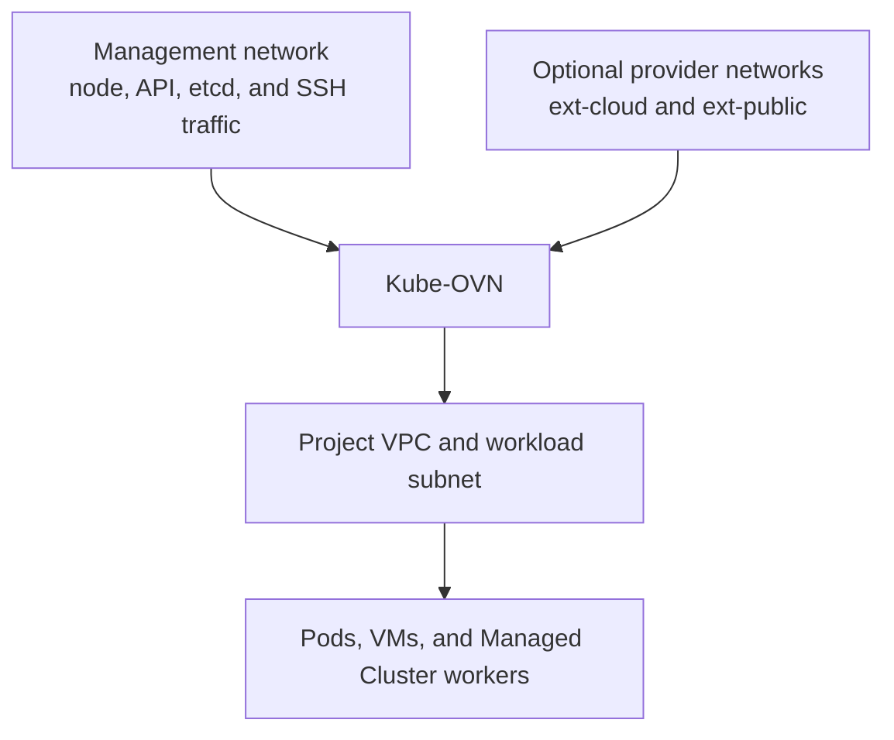
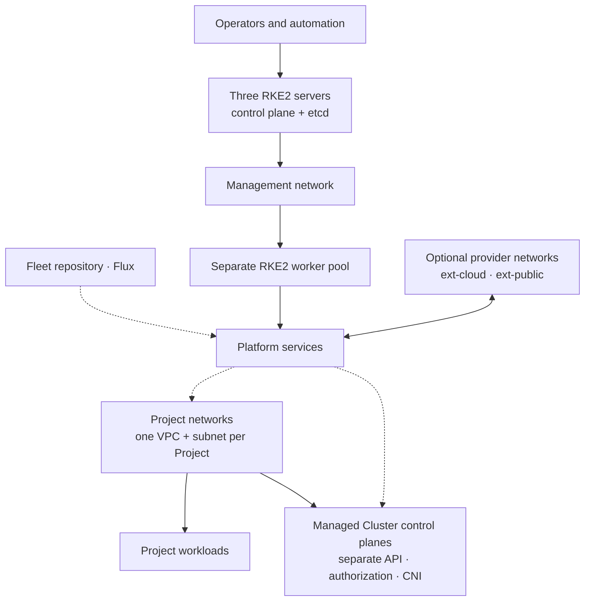

import ReferenceArchitectureDiagram from '@site/src/components/Diagram/ReferenceArchitectureDiagram';
import {InstallationNetworkDiagram} from '@site/src/components/Diagram/ResourceModelDiagrams';

# Installation Overview

This page helps platform operators choose a supported topology and understand
what the installer changes. It names commands but contains **no copy-paste
sequences** — once you have chosen,
go to the [Quickstart](quickstart.md) to install, or the
[Installation Guide](installation-guide.md) for the full option reference.

:::info Which installation page do I need?
Three pages, three jobs — read them in this order only if you need all three.

| Page | Answers | Read it when |
|---|---|---|
| **[Quickstart](quickstart.md)** | *What do I type?* | You are installing for the first time. One linear path, one topology, one config file, a checkpoint per phase. |
| **[Installation Overview](installation-overview.md)** | *What am I choosing, and what will it change?* | Before the quickstart, to pick a topology and understand the network model and what Flux installs. Concepts, not copy-paste. |
| **[Installation Guide](installation-guide.md)** | *What are all the options, and what if it goes wrong?* | For alternative topologies, the manual RKE2 fallback, per-flag reference, day-2 migrations, and recovery. |

All three describe the **same installer**. Where they overlap, the Quickstart is
the tested happy path — it is verified against the real command tree on every
build, so its commands and config keys cannot drift.
:::

## Before you begin

A Kube-DC installation has two stages:

1. build or adopt the Kubernetes **management cluster**;
2. bootstrap Flux and let the Fleet repository reconcile Kube-DC.

The management cluster runs the platform controllers and shared services.
**Managed Clusters** are created later from Projects; they are not the same
cluster.

## Choose a topology

The CLI exposes topology presets so network requirements are explicit:

| Preset | External networks | Typical use |
|---|---|---|
| `internal-only` | No dedicated external VLAN | Evaluation or a private environment with an existing reachable ingress path |
| `cloud-vlan` | Private cloud provider network | Private external addresses and outbound SNAT |
| `cloud+public-vlan` | Private cloud and public provider networks | Separate private and internet-routable address pools |
| `custom` | Operator-defined | Existing clusters or datacenter-specific routing |

These presets describe networking, not cluster size. A private environment can
still be highly available, and a public-network lab can still be single-node.

A common production profile uses three RKE2 server nodes for control-plane and
etcd quorum plus separate worker nodes for capacity. Smaller evaluation and
larger dedicated-worker layouts are also possible. Size nodes from the
components and workloads you enable; GPU, Ceph, observability, and virtualization
change the requirements substantially.

## Network model

Diagram source for GitHub

<InstallationNetworkDiagram />

- The **management network** connects nodes and carries Kubernetes control-plane
  traffic. Use stable node addresses and working routing.
- `ext-cloud` is an optional private external provider network. It supplies
  addresses for Project gateways, private EIPs, and LoadBalancer Services.
- `ext-public` is an optional internet-routable provider network. Enable it
  only when the datacenter routes the address pool and the platform permits
  public Projects.
- Every Project receives its own overlay VPC and creator-supplied workload
  CIDR. Project workload subnets are not carved from the external VLAN CIDRs.

Provider networks may use VLANs on a shared physical trunk, dedicated
interfaces, or topology-specific existing bridges. Kube-OVN and OVS program the
attachment; do not assume Linux `bond0.<vlan>` interfaces are created.

This broader topology illustrates a common three-server RKE2 control-plane
profile with separate workers. It is an example architecture, not a validated
capacity plan or a universal deployment requirement.

Diagram source for GitHub

<ReferenceArchitectureDiagram />

For NAT or routed environments where Project workloads cannot hairpin through
the platform's public address, enable
[internal platform endpoints](internal-platform-endpoints.md).

## What the Fleet installs

The exact versions are pinned in
`clusters/<cluster>/cluster-config.env`. Depending on the selected
configuration, Flux reconciles:

- Kube-DC controllers, backend, console, and admin console;
- Kube-OVN and Multus networking;
- KubeVirt and CDI virtualization;
- Keycloak identity and OIDC integration;
- Envoy Gateway and cert-manager;
- Kamaji, Cluster API, and supported worker providers;
- HNC and admission policy;
- Grafana, Mimir, Loki, and collection agents;
- optional OpenBao, Rook Ceph, GPU, Metal3, and billing integrations.

Consult the Fleet pin rather than a copied version table when planning an
upgrade.

## Installation journey

### 1. Qualify the environment

- choose the topology preset;
- plan Pod, Service, Project, and external-network ranges; Project VPCs may
  overlap, but overlapping ranges prevent straightforward future routing between
  them;
- reserve DNS names and any LoadBalancer or internal endpoint VIPs;
- verify node time, DNS, kernel, storage, and interface requirements;
- decide how SOPS/age recovery keys and OpenBao unseal material are held.

### 2. Build the management cluster

Use `kube-dc bootstrap install` for RKE2 nodes, or adopt a compatible existing
cluster through the documented adoption checks. Three server nodes are the
reference HA control-plane profile, not a universal installer requirement.

### 3. Bootstrap Kube-DC

Install a pinned, checksummed CLI release and run
`kube-dc bootstrap doctor --no-tty`. Then use `kube-dc bootstrap init` to
create the per-cluster Fleet overlay, commit it, bootstrap Flux, and converge
the platform.

The generated configuration includes the chosen provider-network and ingress
model. Review the plan before applying it; do not maintain a second, manual copy
of those resources.

### 4. Complete identity and security setup

**Point the API servers at the OIDC webhook.** This is not optional and nothing
reports that it was skipped. RKE2 starts with certificate-only authentication,
because the authenticator does not exist until Flux brings it up — so until this
runs, every Keycloak token is rejected and the cluster is unusable while looking
completely healthy. One command wires every control-plane node
(`kube-dc bootstrap oidc-cutover`); see
[Installation Guide §3.5.1](installation-guide.md) for what it checks and why it
refuses a partial run.

Then run the version-matched post-install workflows for Keycloak OIDC and, when
enabled, OpenBao. Commit generated encrypted configuration through the Fleet
workflow. Configure DNS and certificate issuance for the hostnames users will
open, and record the age key and OpenBao recovery shares somewhere independent of
this cluster and its Git repository.

### 5. Verify before onboarding Organizations

`kube-dc bootstrap accept <cluster>` checks the machine-checkable part of this and
distinguishes three states that are easy to confuse: **reconciling** (Flux has not settled), **converged**
(components are up but something a user would hit is broken), and **usable**.
Only the last is a candidate for finished — `usable` proves the WIRING (Flux
settled, every apiserver calling the OIDC webhook, the console answering over a
trusted certificate, tenancy installed). It does not authenticate a real token or
check storage, so the human confirmations below still matter.

The distinction matters because *converged* is what every other signal reports.
Do not infer health from every Pod being `Running` — completed Jobs and
component-specific readiness conditions are valid states, and a cluster where
nobody can log in has Running pods and a green Flux.

Beyond what `accept` automates, confirm by hand the things only a human can:

- a test Organization **and Project** reach Ready — an Organization alone gives a
  tenant token no namespaces, so their login succeeds and creates no context;
- the test Project has working DNS and the expected egress path;
- enabled storage, backup, observability, and public exposure paths pass their
  own checks;
- the front door answers from the network your **users** are on, not only from
  the workstation that installed it. Two scripted checks in the fleet repo cover the
  failure modes that every other signal reports as healthy —
  `scripts/frontdoor-check.sh preflight <cluster> <kubeconfig>` before letting Flux
  reconcile a front-door change, and `... smoke ...` afterwards. They assert that the
  node ports are genuinely bound and that the hostnames answer, because Envoy can be
  `Ready` on every node with nothing listening.

## Optional capabilities

Enable these only after their prerequisites and recovery paths are understood:

- [Rook Ceph object storage](deploy-rook-ceph-object-storage.md)
- [Google SSO](sso-google-auth.md)
- [Metal3 bare-metal workers](deploy-metal3-bare-metal-workers.md)
- public external networking and delegated datacenter VLANs
- GPU workload profiles
- Stripe or WHMCS billing integration

Continue with the [Installation Guide](installation-guide.md).
